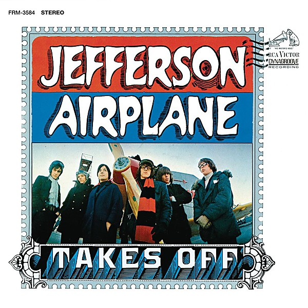

# Jefferson Airplane Takes Off

By **Jefferson Airplane**

## Album Data

- **Catalog:** Beets
- **Format:** Digital, Album
- **Album:** Jefferson Airplane Takes Off
- **Artist:** Jefferson Airplane
- **Albumartist:** Jefferson Airplane
- **Genre:** Acid Rock
- **MusicBrainz Album Artist ID:** [39c2a93d-9afa-4a22-9bba-c087ab056e1c](https://musicbrainz.org/artist/39c2a93d-9afa-4a22-9bba-c087ab056e1c)
- **MusicBrainz Album ID:** [46df0c4d-8d24-4611-9dc9-403d91dc4179](https://musicbrainz.org/release/46df0c4d-8d24-4611-9dc9-403d91dc4179)
- **MusicBrainz Release Group ID:** [7580fcad-3459-3f5c-a300-d7d0df98e14e](https://musicbrainz.org/release-group/7580fcad-3459-3f5c-a300-d7d0df98e14e)
- **Year:** 2013
- **Catalog #:** 
- **Label:** 
- **Total Tracks:** 00

## Album Tracks

### Track 01 - 3-5 Of a Mile in 10 Seconds

- **Artist:** Jefferson Airplane
- **Format:** MP3
- **Genre:** Acid Rock
- **Length:** 5:40
- **MusicBrainz Track ID:** 
- **Title:** 3-5 Of a Mile in 10 Seconds
- **Track:** 01
- **Year:** 1966

### Track 02 - Other Side of This Life

- **Artist:** Jefferson Airplane
- **Format:** MP3
- **Genre:** Psychedelic Rock
- **Length:** 9:12
- **MusicBrainz Track ID:** 
- **Title:** Other Side of This Life
- **Track:** 02
- **Year:** 1966

### Track 03 - Tobacco Road

- **Artist:** Jefferson Airplane
- **Format:** MP3
- **Genre:** Acid Rock
- **Length:** 4:46
- **MusicBrainz Track ID:** 
- **Title:** Tobacco Road
- **Track:** 03
- **Year:** 1966

### Track 04 - JPP McStep B. Blues

- **Artist:** Jefferson Airplane
- **Format:** MP3
- **Genre:** Psychedelic Rock
- **Length:** 4:47
- **MusicBrainz Track ID:** 
- **Title:** JPP McStep B. Blues
- **Track:** 04
- **Year:** 1966

### Track 05 - She Has Funny Cars

- **Artist:** Jefferson Airplane
- **Format:** MP3
- **Genre:** Acid Rock
- **Length:** 3:54
- **MusicBrainz Track ID:** 
- **Title:** She Has Funny Cars
- **Track:** 05
- **Year:** 1966

### Track 06 - Fat Angel

- **Artist:** Jefferson Airplane
- **Format:** MP3
- **Genre:** Raga Rock
- **Length:** 7:54
- **MusicBrainz Track ID:** 
- **Title:** Fat Angel
- **Track:** 06
- **Year:** 1966

### Track 07 - Plastic Fantastic Lover

- **Artist:** Jefferson Airplane
- **Format:** MP3
- **Genre:** Psychedelic Rock
- **Length:** 3:32
- **MusicBrainz Track ID:** 
- **Title:** Plastic Fantastic Lover
- **Track:** 07
- **Year:** 1966

### Track 08 - In The Morning

- **Artist:** Jefferson Airplane
- **Format:** MP3
- **Genre:** Psychedelic Rock
- **Length:** 6:44
- **MusicBrainz Track ID:** 
- **Title:** In The Morning
- **Track:** 08
- **Year:** 1966

### Track 09 - Somebody To Love

- **Artist:** Jefferson Airplane
- **Format:** MP3
- **Genre:** Psychedelic Rock
- **Length:** 4:01
- **MusicBrainz Track ID:** 
- **Title:** Somebody To Love
- **Track:** 09
- **Year:** 1966

### Track 10 - Other Side of This Life 11-26-66

- **Artist:** Jefferson Airplane
- **Format:** MP3
- **Genre:** Psychedelic Rock
- **Length:** 6:48
- **MusicBrainz Track ID:** 
- **Title:** Other Side of This Life 11-26-66
- **Track:** 10
- **Year:** 1966

### Track 11 - Bringing Me Down

- **Artist:** Jefferson Airplane
- **Format:** MP3
- **Genre:** Acid Rock
- **Length:** 3:13
- **MusicBrainz Track ID:** 
- **Title:** Bringing Me Down
- **Track:** 11
- **Year:** 1966

### Track 12 - This Is My Life and I Like It

- **Artist:** Jefferson Airplane
- **Format:** MP3
- **Genre:** Psychedelic Rock
- **Length:** 6:22
- **MusicBrainz Track ID:** 
- **Title:** This Is My Life and I Like It
- **Track:** 12
- **Year:** 1966

### Track 13 - Go To Her

- **Artist:** Jefferson Airplane
- **Format:** MP3
- **Genre:** Acid Rock
- **Length:** 5:20
- **MusicBrainz Track ID:** 
- **Title:** Go To Her
- **Track:** 13
- **Year:** 1966

### Track 14 - Fat Angel 11-26-66

- **Artist:** Jefferson Airplane
- **Format:** MP3
- **Genre:** Psychedelic Rock
- **Length:** 7:24
- **MusicBrainz Track ID:** 
- **Title:** Fat Angel 11-26-66
- **Track:** 14
- **Year:** 1966

### Track 15 - 3-5 Of a Mile in 10 Seconds 11-27-66

- **Artist:** Jefferson Airplane
- **Format:** MP3
- **Genre:** Psychedelic Rock
- **Length:** 5:14
- **MusicBrainz Track ID:** 
- **Title:** 3-5 Of a Mile in 10 Seconds 11-27-66
- **Track:** 15
- **Year:** 1966

## See also

- [After Bathing at Baxter's](After_Bathing_at_Baxters.md)
- [After Bathing At Baxter's](After_Bathing_At_Baxters.md)
- [Bark](Bark.md)
- [Bless Its Pointed Little Head](Bless_Its_Pointed_Little_Head.md)
- [Crown of Creation](Crown_of_Creation.md)
- [Early Flight](Early_Flight.md)
- [Jefferson Airplane](Jefferson_Airplane.md)
- [Live at Fillmore West 11-25 thru 11-27 1966](Live_at_Fillmore_West_11-25_thru_11-27_1966.md)
- [Long John Silver](Long_John_Silver.md)
- [Return To The Matrix](Return_To_The_Matrix.md)
- [Surrealistic Pillow](Surrealistic_Pillow.md)
- [Sweeping Up the Spotlight](Sweeping_Up_the_Spotlight.md)
- [The Essential Jefferson Airplane - Amazon Prime](The_Essential_Jefferson_Airplane_-_Amazon_Prime.md)
- [Thirty Seconds Over Winterland](Thirty_Seconds_Over_Winterland.md)
- [Volunteers](Volunteers.md)
- [CD: After Bathing At Baxter's](../../CD/Jefferson_Airplane/After_Bathing_At_Baxters.md)
- [CD: Bark](../../CD/Jefferson_Airplane/Bark.md)
- [CD: Early Flight Thirty Seconds Over Winterland](../../CD/Jefferson_Airplane/Early_Flight_Thirty_Seconds_Over_Winterland.md)
- [CD: ](../../CD/Jefferson_Airplane/Jefferson_Airplane.md)
- [CD: Long John Silver](../../CD/Jefferson_Airplane/Long_John_Silver.md)
- [CD: Original Album Classics (Disc 1)](../../CD/Jefferson_Airplane/Original_Album_Classics_Disc_1.md)
- [Roon: After Bathing At Baxters](../../Roon/Jefferson_Airplane/After_Bathing_At_Baxters.md)
- [Roon: Bark (Bonus Tracks)](../../Roon/Jefferson_Airplane/Bark_Bonus_Tracks.md)
- [Roon: Bless Its Pointed Little Head](../../Roon/Jefferson_Airplane/Bless_Its_Pointed_Little_Head.md)
- [Roon: Crown Of Creation](../../Roon/Jefferson_Airplane/Crown_Of_Creation.md)
- [Roon: Long John Silver](../../Roon/Jefferson_Airplane/Long_John_Silver.md)
- [Roon: Surrealistic Pillow](../../Roon/Jefferson_Airplane/Surrealistic_Pillow.md)
- [Roon: Thirty Seconds Over Winterland [Live] (Expanded Edition)](../../Roon/Jefferson_Airplane/Thirty_Seconds_Over_Winterland_[Live]_Expanded_Edition.md)
- [Roon: Volunteers](../../Roon/Jefferson_Airplane/Volunteers.md)
- [Vinyl: After Bathing At Baxter's](../../Vinyl/Jefferson_Airplane/After_Bathing_At_Baxters.md)
- [Vinyl: Crown Of Creation](../../Vinyl/Jefferson_Airplane/Crown_Of_Creation.md)
- [Vinyl: ](../../Vinyl/Jefferson_Airplane/Jefferson_Airplane.md)
- [Vinyl: Mexico](../../Vinyl/Jefferson_Airplane/Mexico.md)
- [Vinyl: Surrealistic Pillow](../../Vinyl/Jefferson_Airplane/Surrealistic_Pillow.md)
