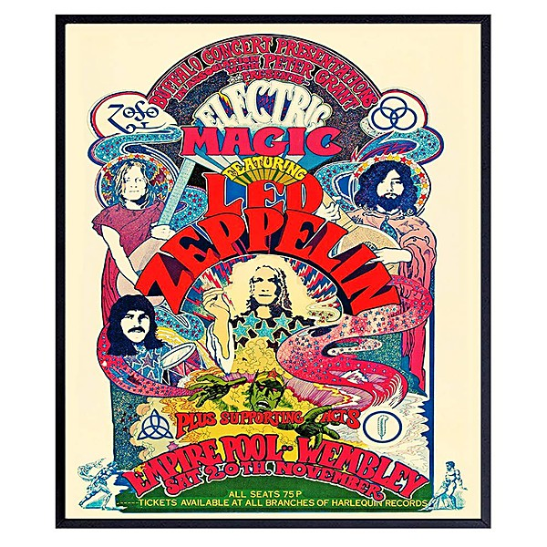

# Live at Fillmore West 11-25 thru 11-27 1966

By **Jefferson Airplane**

## Album Data

- **Catalog:** Beets
- **Format:** Digital, Album
- **Album:** Live at Fillmore West 11-25 thru 11-27 1966
- **Artist:** Jefferson Airplane
- **Albumartist:** Jefferson Airplane
- **Genre:** Psychedelic Rock
- **MusicBrainz Album Artist ID:** 
- **MusicBrainz Album ID:** 
- **MusicBrainz Release Group ID:** 
- **Year:** 1966
- **Catalog #:** 819514010272
- **Label:** Culture Factory
- **Total Tracks:** 09

## Album Tracks

### Track 01 - Long John Silver

- **Artist:** Jefferson Airplane
- **Format:** ALAC
- **Genre:** Acid Rock
- **Length:** 4:22
- **MusicBrainz Track ID:** [820d0cf3-2635-4077-b14e-dcded85a62a5](https://musicbrainz.org/recording/820d0cf3-2635-4077-b14e-dcded85a62a5)
- **Title:** Long John Silver
- **Track:** 01
- **Year:** 2013

### Track 02 - Aerie (Gang of Eagles)

- **Artist:** Jefferson Airplane
- **Format:** ALAC
- **Genre:** Acid Rock
- **Length:** 3:52
- **MusicBrainz Track ID:** [f55bfea6-0aa7-4dac-8675-7eb4cecd56dc](https://musicbrainz.org/recording/f55bfea6-0aa7-4dac-8675-7eb4cecd56dc)
- **Title:** Aerie (Gang of Eagles)
- **Track:** 02
- **Year:** 2013

### Track 03 - Twilight Double Leader

- **Artist:** Jefferson Airplane
- **Format:** ALAC
- **Genre:** Acid Rock
- **Length:** 4:41
- **MusicBrainz Track ID:** [f08854aa-00c0-4c35-b3a8-1fd8abfed3a0](https://musicbrainz.org/recording/f08854aa-00c0-4c35-b3a8-1fd8abfed3a0)
- **Title:** Twilight Double Leader
- **Track:** 03
- **Year:** 2013

### Track 04 - Milk Train

- **Artist:** Jefferson Airplane
- **Format:** ALAC
- **Genre:** Acid Rock
- **Length:** 3:17
- **MusicBrainz Track ID:** [b1a2cfcf-7c99-4089-8b60-6033de6edd84](https://musicbrainz.org/recording/b1a2cfcf-7c99-4089-8b60-6033de6edd84)
- **Title:** Milk Train
- **Track:** 04
- **Year:** 2013

### Track 05 - The Son of Jesus

- **Artist:** Jefferson Airplane
- **Format:** ALAC
- **Genre:** Psychedelic Rock
- **Length:** 5:26
- **MusicBrainz Track ID:** [270af865-b55b-4f56-ba3d-e868ee93d8de](https://musicbrainz.org/recording/270af865-b55b-4f56-ba3d-e868ee93d8de)
- **Title:** The Son of Jesus
- **Track:** 05
- **Year:** 2013

### Track 06 - Easter?

- **Artist:** Jefferson Airplane
- **Format:** ALAC
- **Genre:** Acid Rock
- **Length:** 4:00
- **MusicBrainz Track ID:** [24142d27-9d69-45e7-b046-83fb11001cf3](https://musicbrainz.org/recording/24142d27-9d69-45e7-b046-83fb11001cf3)
- **Title:** Easter?
- **Track:** 06
- **Year:** 2013

### Track 07 - Trial bBy Fire

- **Artist:** Jefferson Airplane
- **Format:** ALAC
- **Genre:** Acid Rock
- **Length:** 4:30
- **MusicBrainz Track ID:** [3737de5b-e616-4516-aa52-0f153aa9f01b](https://musicbrainz.org/recording/3737de5b-e616-4516-aa52-0f153aa9f01b)
- **Title:** Trial bBy Fire
- **Track:** 07
- **Year:** 2013

### Track 08 - Alexander the Medium

- **Artist:** Jefferson Airplane
- **Format:** ALAC
- **Genre:** Acid Rock
- **Length:** 6:37
- **MusicBrainz Track ID:** [6245a9fd-5c16-40da-80d2-cb0e961c2629](https://musicbrainz.org/recording/6245a9fd-5c16-40da-80d2-cb0e961c2629)
- **Title:** Alexander the Medium
- **Track:** 08
- **Year:** 2013

### Track 09 - Eat Starch Mom

- **Artist:** Jefferson Airplane
- **Format:** ALAC
- **Genre:** Acid Rock
- **Length:** 4:33
- **MusicBrainz Track ID:** [6b7d10be-fcbc-4370-a905-596632b4b79f](https://musicbrainz.org/recording/6b7d10be-fcbc-4370-a905-596632b4b79f)
- **Title:** Eat Starch Mom
- **Track:** 09
- **Year:** 2013

