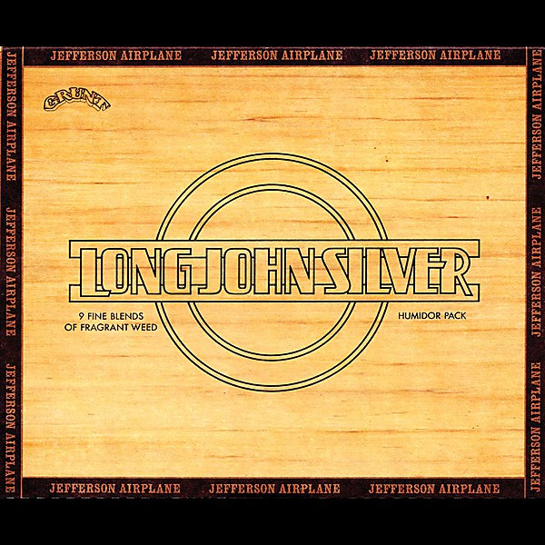

# Long John Silver

By **Jefferson Airplane**

## Album Data

- **Catalog:** Beets
- **Format:** Digital, Album
- **Album:** Long John Silver
- **Artist:** Jefferson Airplane
- **Albumartist:** Jefferson Airplane
- **Genre:** Acid Rock
- **MusicBrainz Album Artist ID:** [39c2a93d-9afa-4a22-9bba-c087ab056e1c](https://musicbrainz.org/artist/39c2a93d-9afa-4a22-9bba-c087ab056e1c)
- **MusicBrainz Album ID:** [410110ad-adf4-40c9-a7be-3c6164de7254](https://musicbrainz.org/release/410110ad-adf4-40c9-a7be-3c6164de7254)
- **MusicBrainz Release Group ID:** [6e01fe59-f48a-337c-95e6-d67e22900bba](https://musicbrainz.org/release-group/6e01fe59-f48a-337c-95e6-d67e22900bba)
- **Year:** 2013
- **Catalog #:** [none]
- **Label:** Legacy
- **Total Tracks:** 19

## Album Tracks

### Track 01 - Somebody to Love (live - 02.01.1968 Welcome to the Matrix)

- **Artist:** Jefferson Airplane
- **Format:** ALAC
- **Genre:** Psychedelic Rock
- **Length:** 4:49
- **MusicBrainz Track ID:** [8b0c57ea-8905-4f28-a0d9-e1b391660bfa](https://musicbrainz.org/recording/8b0c57ea-8905-4f28-a0d9-e1b391660bfa)
- **Title:** Somebody to Love (live - 02.01.1968 Welcome to the Matrix)
- **Track:** 01
- **Year:** 2011

### Track 02 - Young Girl Sunday Blues (live - 02.01.1968 Welcome to the Matrix)

- **Artist:** Jefferson Airplane
- **Format:** ALAC
- **Genre:** Psychedelic Rock
- **Length:** 4:56
- **MusicBrainz Track ID:** [15c15f36-7641-4a6f-817e-28728c508684](https://musicbrainz.org/recording/15c15f36-7641-4a6f-817e-28728c508684)
- **Title:** Young Girl Sunday Blues (live - 02.01.1968 Welcome to the Matrix)
- **Track:** 02
- **Year:** 2011

### Track 03 - She Has Funny Cars (live - 02.01.1968 Welcome to the Matrix)

- **Artist:** Jefferson Airplane
- **Format:** ALAC
- **Genre:** Psychedelic Rock
- **Length:** 4:16
- **MusicBrainz Track ID:** [5d24cad7-ad16-4110-94fa-be60f9ff5a78](https://musicbrainz.org/recording/5d24cad7-ad16-4110-94fa-be60f9ff5a78)
- **Title:** She Has Funny Cars (live - 02.01.1968 Welcome to the Matrix)
- **Track:** 03
- **Year:** 2011

### Track 04 - Two Heads (live - 02.01.1968 Welcome to the Matrix)

- **Artist:** Jefferson Airplane
- **Format:** ALAC
- **Genre:** Psychedelic Rock
- **Length:** 4:02
- **MusicBrainz Track ID:** [dffd8d11-47d9-4111-b616-4c44048dcf3a](https://musicbrainz.org/recording/dffd8d11-47d9-4111-b616-4c44048dcf3a)
- **Title:** Two Heads (live - 02.01.1968 Welcome to the Matrix)
- **Track:** 04
- **Year:** 2011

### Track 05 - Martha (live - 02.01.1968 Welcome to the Matrix)

- **Artist:** Jefferson Airplane
- **Format:** ALAC
- **Genre:** Folk Rock
- **Length:** 4:39
- **MusicBrainz Track ID:** [7899341b-0bcc-4f2f-9d04-50d9efbc24c9](https://musicbrainz.org/recording/7899341b-0bcc-4f2f-9d04-50d9efbc24c9)
- **Title:** Martha (live - 02.01.1968 Welcome to the Matrix)
- **Track:** 05
- **Year:** 2011

### Track 06 - Kansas City (live - 02.01.1968 Welcome to the Matrix)

- **Artist:** Jefferson Airplane
- **Format:** ALAC
- **Genre:** Blues
- **Length:** 6:54
- **MusicBrainz Track ID:** [e95a901e-ba96-4190-8889-ec1a39f1b7fc](https://musicbrainz.org/recording/e95a901e-ba96-4190-8889-ec1a39f1b7fc)
- **Title:** Kansas City (live - 02.01.1968 Welcome to the Matrix)
- **Track:** 06
- **Year:** 2011

### Track 07 - The Other Side of This Life (live - 02.01.1968 Welcome to the Matrix)

- **Artist:** Jefferson Airplane
- **Format:** ALAC
- **Genre:** Psychedelic Rock
- **Length:** 7:47
- **MusicBrainz Track ID:** [a2c6ccf4-7657-477c-a9c5-30bea5f1e2cf](https://musicbrainz.org/recording/a2c6ccf4-7657-477c-a9c5-30bea5f1e2cf)
- **Title:** The Other Side of This Life (live - 02.01.1968 Welcome to the Matrix)
- **Track:** 07
- **Year:** 2011

### Track 08 - Today (live - 02.01.1968 Welcome to the Matrix)

- **Artist:** Jefferson Airplane
- **Format:** ALAC
- **Genre:** Psychedelic Rock
- **Length:** 3:22
- **MusicBrainz Track ID:** [81f9681f-166f-4aad-93b5-202f9714fcea](https://musicbrainz.org/recording/81f9681f-166f-4aad-93b5-202f9714fcea)
- **Title:** Today (live - 02.01.1968 Welcome to the Matrix)
- **Track:** 08
- **Year:** 2011

### Track 09 - Won't You Try/Saturday Afternoon (live - 02.01.1968 Welcome to the Matrix)

- **Artist:** Jefferson Airplane
- **Format:** ALAC
- **Genre:** Psychedelic Rock
- **Length:** 5:56
- **MusicBrainz Track ID:** [f3d94c04-7893-4a79-b3d6-fd64a46abbc1](https://musicbrainz.org/recording/f3d94c04-7893-4a79-b3d6-fd64a46abbc1)
- **Title:** Won't You Try/Saturday Afternoon (live - 02.01.1968 Welcome to the Matrix)
- **Track:** 09
- **Year:** 2011

### Track 10 - It's No Secret (live - 02.01.1968 Welcome to the Matrix)

- **Artist:** Jefferson Airplane
- **Format:** ALAC
- **Genre:** Psychedelic Rock
- **Length:** 3:57
- **MusicBrainz Track ID:** [693768bb-582a-4c14-9001-4ec0b6c9c253](https://musicbrainz.org/recording/693768bb-582a-4c14-9001-4ec0b6c9c253)
- **Title:** It's No Secret (live - 02.01.1968 Welcome to the Matrix)
- **Track:** 10
- **Year:** 2011

### Track 11 - Blues from an Airplane (live - 02.01.1968 Welcome to the Matrix)

- **Artist:** Jefferson Airplane
- **Format:** ALAC
- **Genre:** Psychedelic Rock
- **Length:** 2:12
- **MusicBrainz Track ID:** [1564e6f9-2f9c-460f-9296-19857b17e0d4](https://musicbrainz.org/recording/1564e6f9-2f9c-460f-9296-19857b17e0d4)
- **Title:** Blues from an Airplane (live - 02.01.1968 Welcome to the Matrix)
- **Track:** 11
- **Year:** 2011

### Track 12 - Watch Her Ride (live - 02.01.1968 Welcome to the Matrix)

- **Artist:** Jefferson Airplane
- **Format:** ALAC
- **Genre:** Psychedelic Rock
- **Length:** 3:48
- **MusicBrainz Track ID:** [2d571508-a79d-46bc-898c-16cc99d58e86](https://musicbrainz.org/recording/2d571508-a79d-46bc-898c-16cc99d58e86)
- **Title:** Watch Her Ride (live - 02.01.1968 Welcome to the Matrix)
- **Track:** 12
- **Year:** 2011

### Track 13 - Plastic Fantastic Lover (live - 02.01.1968 Welcome to the Matrix)

- **Artist:** Jefferson Airplane
- **Format:** ALAC
- **Genre:** Psychedelic Rock
- **Length:** 4:00
- **MusicBrainz Track ID:** [ea7c1e5b-ecf3-4eeb-87ec-f25b93312d15](https://musicbrainz.org/recording/ea7c1e5b-ecf3-4eeb-87ec-f25b93312d15)
- **Title:** Plastic Fantastic Lover (live - 02.01.1968 Welcome to the Matrix)
- **Track:** 13
- **Year:** 2011

### Track 14 - White Rabbit (live - 02.01.1968 Welcome to the Matrix)

- **Artist:** Jefferson Airplane
- **Format:** ALAC
- **Genre:** Psychedelic Rock
- **Length:** 2:26
- **MusicBrainz Track ID:** [be5eebf9-f61b-440f-95a3-87667192fea0](https://musicbrainz.org/recording/be5eebf9-f61b-440f-95a3-87667192fea0)
- **Title:** White Rabbit (live - 02.01.1968 Welcome to the Matrix)
- **Track:** 14
- **Year:** 2011

### Track 15 - 3/5 of a Mile In 10 Seconds (live - 02.01.1968 Welcome to the Matrix)

- **Artist:** Jefferson Airplane
- **Format:** ALAC
- **Genre:** Psychedelic Rock
- **Length:** 5:41
- **MusicBrainz Track ID:** [c3255e71-903e-47e9-8c54-3d09e569e08f](https://musicbrainz.org/recording/c3255e71-903e-47e9-8c54-3d09e569e08f)
- **Title:** 3/5 of a Mile In 10 Seconds (live - 02.01.1968 Welcome to the Matrix)
- **Track:** 15
- **Year:** 2011

### Track 16 - Share a Little Joke (live - 02.01.1968 Welcome to the Matrix)

- **Artist:** Jefferson Airplane
- **Format:** ALAC
- **Genre:** Psychedelic Rock
- **Length:** 4:34
- **MusicBrainz Track ID:** [e8371da1-3bc0-45dc-b9c1-7c4812975165](https://musicbrainz.org/recording/e8371da1-3bc0-45dc-b9c1-7c4812975165)
- **Title:** Share a Little Joke (live - 02.01.1968 Welcome to the Matrix)
- **Track:** 16
- **Year:** 2011

### Track 17 - Ice Cream Phoenix (live - 02.01.1968 Welcome to the Matrix)

- **Artist:** Jefferson Airplane
- **Format:** ALAC
- **Genre:** Psychedelic Rock
- **Length:** 10:45
- **MusicBrainz Track ID:** [3aec2c19-b6b0-4a6b-b3c7-fd9a1e67f190](https://musicbrainz.org/recording/3aec2c19-b6b0-4a6b-b3c7-fd9a1e67f190)
- **Title:** Ice Cream Phoenix (live - 02.01.1968 Welcome to the Matrix)
- **Track:** 17
- **Year:** 2011

### Track 18 - Fat Angel (live - 02.01.1968 Welcome to the Matrix)

- **Artist:** Jefferson Airplane
- **Format:** ALAC
- **Genre:** Psychedelic Rock
- **Length:** 8:45
- **MusicBrainz Track ID:** [8c415b09-96a5-4f4a-bcab-5cf1a86d2704](https://musicbrainz.org/recording/8c415b09-96a5-4f4a-bcab-5cf1a86d2704)
- **Title:** Fat Angel (live - 02.01.1968 Welcome to the Matrix)
- **Track:** 18
- **Year:** 2011

### Track 19 - The Ballad of You and Me and Pooneil (live - 02.01.1968 Welcome to the Matrix)

- **Artist:** Jefferson Airplane
- **Format:** ALAC
- **Genre:** Psychedelic Rock
- **Length:** 10:20
- **MusicBrainz Track ID:** [0106dbda-b8dd-4995-9b54-d80ca5d051e2](https://musicbrainz.org/recording/0106dbda-b8dd-4995-9b54-d80ca5d051e2)
- **Title:** The Ballad of You and Me and Pooneil (live - 02.01.1968 Welcome to the Matrix)
- **Track:** 19
- **Year:** 2011

## See also

- [After Bathing at Baxter's](After_Bathing_at_Baxters.md)
- [After Bathing At Baxter's](After_Bathing_At_Baxters.md)
- [Bark](Bark.md)
- [Bless Its Pointed Little Head](Bless_Its_Pointed_Little_Head.md)
- [Crown of Creation](Crown_of_Creation.md)
- [Early Flight](Early_Flight.md)
- [Jefferson Airplane](Jefferson_Airplane.md)
- [Jefferson Airplane Takes Off](Jefferson_Airplane_Takes_Off.md)
- [Live at Fillmore West 11-25 thru 11-27 1966](Live_at_Fillmore_West_11-25_thru_11-27_1966.md)
- [Return To The Matrix](Return_To_The_Matrix.md)
- [Surrealistic Pillow](Surrealistic_Pillow.md)
- [Sweeping Up the Spotlight](Sweeping_Up_the_Spotlight.md)
- [The Essential Jefferson Airplane - Amazon Prime](The_Essential_Jefferson_Airplane_-_Amazon_Prime.md)
- [Thirty Seconds Over Winterland](Thirty_Seconds_Over_Winterland.md)
- [Volunteers](Volunteers.md)
- [CD: After Bathing At Baxter's](../../CD/Jefferson_Airplane/After_Bathing_At_Baxters.md)
- [CD: Bark](../../CD/Jefferson_Airplane/Bark.md)
- [CD: Early Flight Thirty Seconds Over Winterland](../../CD/Jefferson_Airplane/Early_Flight_Thirty_Seconds_Over_Winterland.md)
- [CD: ](../../CD/Jefferson_Airplane/Jefferson_Airplane.md)
- [CD: Long John Silver](../../CD/Jefferson_Airplane/Long_John_Silver.md)
- [CD: Original Album Classics (Disc 1)](../../CD/Jefferson_Airplane/Original_Album_Classics_Disc_1.md)
- [Roon: After Bathing At Baxters](../../Roon/Jefferson_Airplane/After_Bathing_At_Baxters.md)
- [Roon: Bark (Bonus Tracks)](../../Roon/Jefferson_Airplane/Bark_Bonus_Tracks.md)
- [Roon: Bless Its Pointed Little Head](../../Roon/Jefferson_Airplane/Bless_Its_Pointed_Little_Head.md)
- [Roon: Crown Of Creation](../../Roon/Jefferson_Airplane/Crown_Of_Creation.md)
- [Roon: Long John Silver](../../Roon/Jefferson_Airplane/Long_John_Silver.md)
- [Roon: Surrealistic Pillow](../../Roon/Jefferson_Airplane/Surrealistic_Pillow.md)
- [Roon: Thirty Seconds Over Winterland [Live] (Expanded Edition)](../../Roon/Jefferson_Airplane/Thirty_Seconds_Over_Winterland_[Live]_Expanded_Edition.md)
- [Roon: Volunteers](../../Roon/Jefferson_Airplane/Volunteers.md)
- [Vinyl: After Bathing At Baxter's](../../Vinyl/Jefferson_Airplane/After_Bathing_At_Baxters.md)
- [Vinyl: Crown Of Creation](../../Vinyl/Jefferson_Airplane/Crown_Of_Creation.md)
- [Vinyl: ](../../Vinyl/Jefferson_Airplane/Jefferson_Airplane.md)
- [Vinyl: Mexico](../../Vinyl/Jefferson_Airplane/Mexico.md)
- [Vinyl: Surrealistic Pillow](../../Vinyl/Jefferson_Airplane/Surrealistic_Pillow.md)
