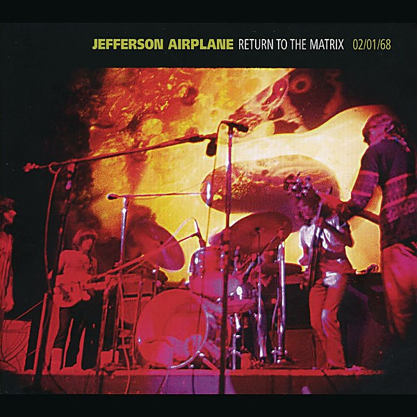

# Return To The Matrix

By **Jefferson Airplane**

## Album Data

- **Catalog:** Beets
- **Format:** Digital, Album
- **Album:** Return To The Matrix
- **Artist:** Jefferson Airplane
- **Albumartist:** Jefferson Airplane
- **Genre:** Psychedelic Rock
- **MusicBrainz Album Artist ID:** [39c2a93d-9afa-4a22-9bba-c087ab056e1c](https://musicbrainz.org/artist/39c2a93d-9afa-4a22-9bba-c087ab056e1c)
- **MusicBrainz Album ID:** [4e04ff9c-f911-4e7d-a5f4-7e06bfc43b71](https://musicbrainz.org/release/4e04ff9c-f911-4e7d-a5f4-7e06bfc43b71)
- **MusicBrainz Release Group ID:** [b4775564-0700-42d7-98cc-83eaa1856060](https://musicbrainz.org/release-group/b4775564-0700-42d7-98cc-83eaa1856060)
- **Year:** 2011
- **Catalog #:** LPM-3766
- **Label:** RCA Victor
- **Total Tracks:** 11

## Album Tracks

### Track 01 - She Has Funny Cars

- **Artist:** Jefferson Airplane
- **Format:** ALAC
- **Genre:** Acid Rock
- **Length:** 3:14
- **MusicBrainz Track ID:** [f8919268-9258-424a-9d0d-6c516b33a23a](https://musicbrainz.org/recording/f8919268-9258-424a-9d0d-6c516b33a23a)
- **Title:** She Has Funny Cars
- **Track:** 01
- **Year:** 1967

### Track 02 - Somebody to Love

- **Artist:** Jefferson Airplane
- **Format:** ALAC
- **Genre:** Psychedelic Rock
- **Length:** 3:01
- **MusicBrainz Track ID:** [7c38f8e0-044f-4360-915a-c3f1a97b3597](https://musicbrainz.org/recording/7c38f8e0-044f-4360-915a-c3f1a97b3597)
- **Title:** Somebody to Love
- **Track:** 02
- **Year:** 1967

### Track 03 - My Best Friend

- **Artist:** Jefferson Airplane
- **Format:** ALAC
- **Genre:** Psychedelic Rock
- **Length:** 3:04
- **MusicBrainz Track ID:** [fa84e23f-c820-4646-a4a8-1d71d75b1f41](https://musicbrainz.org/recording/fa84e23f-c820-4646-a4a8-1d71d75b1f41)
- **Title:** My Best Friend
- **Track:** 03
- **Year:** 1967

### Track 04 - Today

- **Artist:** Jefferson Airplane
- **Format:** ALAC
- **Genre:** Psychedelic Rock
- **Length:** 3:02
- **MusicBrainz Track ID:** [95ed81e2-c807-4075-8eb8-3318c1beded9](https://musicbrainz.org/recording/95ed81e2-c807-4075-8eb8-3318c1beded9)
- **Title:** Today
- **Track:** 04
- **Year:** 1967

### Track 05 - Comin’ Back to Me

- **Artist:** Jefferson Airplane
- **Format:** ALAC
- **Genre:** Psychedelic Rock
- **Length:** 5:24
- **MusicBrainz Track ID:** [f3028143-1e92-465f-8b3f-25d7c1fe51a1](https://musicbrainz.org/recording/f3028143-1e92-465f-8b3f-25d7c1fe51a1)
- **Title:** Comin’ Back to Me
- **Track:** 05
- **Year:** 1967

### Track 06 - 3⁄5 of a Mile in 10 Seconds

- **Artist:** Jefferson Airplane
- **Format:** ALAC
- **Genre:** Psychedelic Rock
- **Length:** 3:45
- **MusicBrainz Track ID:** [414104d5-1955-4a65-892a-fbaa33504e9e](https://musicbrainz.org/recording/414104d5-1955-4a65-892a-fbaa33504e9e)
- **Title:** 3⁄5 of a Mile in 10 Seconds
- **Track:** 06
- **Year:** 1967

### Track 07 - D.C.B.A.‐25

- **Artist:** Jefferson Airplane
- **Format:** ALAC
- **Genre:** Psychedelic Rock
- **Length:** 2:39
- **MusicBrainz Track ID:** [7ddb18f5-6d4d-4e6c-9b0f-c88966855e49](https://musicbrainz.org/recording/7ddb18f5-6d4d-4e6c-9b0f-c88966855e49)
- **Title:** D.C.B.A.‐25
- **Track:** 07
- **Year:** 1967

### Track 08 - How Do You Feel

- **Artist:** Jefferson Airplane
- **Format:** ALAC
- **Genre:** Psychedelic Rock
- **Length:** 3:34
- **MusicBrainz Track ID:** [cd9414f8-3abe-4d45-95fd-339e50e647a9](https://musicbrainz.org/recording/cd9414f8-3abe-4d45-95fd-339e50e647a9)
- **Title:** How Do You Feel
- **Track:** 08
- **Year:** 1967

### Track 09 - Embryonic Journey

- **Artist:** Jefferson Airplane
- **Format:** ALAC
- **Genre:** Psychedelic Rock
- **Length:** 1:55
- **MusicBrainz Track ID:** [7d56f66f-90ad-46cd-85b2-f4ae516283c7](https://musicbrainz.org/recording/7d56f66f-90ad-46cd-85b2-f4ae516283c7)
- **Title:** Embryonic Journey
- **Track:** 09
- **Year:** 1967

### Track 10 - White Rabbit

- **Artist:** Jefferson Airplane
- **Format:** ALAC
- **Genre:** Psychedelic Rock
- **Length:** 2:33
- **MusicBrainz Track ID:** [64ca8364-fadd-46b4-9b3b-b3d789063422](https://musicbrainz.org/recording/64ca8364-fadd-46b4-9b3b-b3d789063422)
- **Title:** White Rabbit
- **Track:** 10
- **Year:** 1967

### Track 11 - Plastic Fantastic Lover

- **Artist:** Jefferson Airplane
- **Format:** ALAC
- **Genre:** Psychedelic Rock
- **Length:** 2:37
- **MusicBrainz Track ID:** [4650c203-184b-4d98-a921-cb42d577d865](https://musicbrainz.org/recording/4650c203-184b-4d98-a921-cb42d577d865)
- **Title:** Plastic Fantastic Lover
- **Track:** 11
- **Year:** 1967

## See also

- [After Bathing at Baxter's](After_Bathing_at_Baxters.md)
- [After Bathing At Baxter's](After_Bathing_At_Baxters.md)
- [Bark](Bark.md)
- [Bless Its Pointed Little Head](Bless_Its_Pointed_Little_Head.md)
- [Crown of Creation](Crown_of_Creation.md)
- [Early Flight](Early_Flight.md)
- [Jefferson Airplane](Jefferson_Airplane.md)
- [Jefferson Airplane Takes Off](Jefferson_Airplane_Takes_Off.md)
- [Live at Fillmore West 11-25 thru 11-27 1966](Live_at_Fillmore_West_11-25_thru_11-27_1966.md)
- [Long John Silver](Long_John_Silver.md)
- [Surrealistic Pillow](Surrealistic_Pillow.md)
- [Sweeping Up the Spotlight](Sweeping_Up_the_Spotlight.md)
- [The Essential Jefferson Airplane - Amazon Prime](The_Essential_Jefferson_Airplane_-_Amazon_Prime.md)
- [Thirty Seconds Over Winterland](Thirty_Seconds_Over_Winterland.md)
- [Volunteers](Volunteers.md)
- [CD: After Bathing At Baxter's](../../CD/Jefferson_Airplane/After_Bathing_At_Baxters.md)
- [CD: Bark](../../CD/Jefferson_Airplane/Bark.md)
- [CD: Early Flight Thirty Seconds Over Winterland](../../CD/Jefferson_Airplane/Early_Flight_Thirty_Seconds_Over_Winterland.md)
- [CD: ](../../CD/Jefferson_Airplane/Jefferson_Airplane.md)
- [CD: Long John Silver](../../CD/Jefferson_Airplane/Long_John_Silver.md)
- [CD: Original Album Classics (Disc 1)](../../CD/Jefferson_Airplane/Original_Album_Classics_Disc_1.md)
- [Roon: After Bathing At Baxters](../../Roon/Jefferson_Airplane/After_Bathing_At_Baxters.md)
- [Roon: Bark (Bonus Tracks)](../../Roon/Jefferson_Airplane/Bark_Bonus_Tracks.md)
- [Roon: Bless Its Pointed Little Head](../../Roon/Jefferson_Airplane/Bless_Its_Pointed_Little_Head.md)
- [Roon: Crown Of Creation](../../Roon/Jefferson_Airplane/Crown_Of_Creation.md)
- [Roon: Long John Silver](../../Roon/Jefferson_Airplane/Long_John_Silver.md)
- [Roon: Surrealistic Pillow](../../Roon/Jefferson_Airplane/Surrealistic_Pillow.md)
- [Roon: Thirty Seconds Over Winterland [Live] (Expanded Edition)](../../Roon/Jefferson_Airplane/Thirty_Seconds_Over_Winterland_[Live]_Expanded_Edition.md)
- [Roon: Volunteers](../../Roon/Jefferson_Airplane/Volunteers.md)
- [Vinyl: After Bathing At Baxter's](../../Vinyl/Jefferson_Airplane/After_Bathing_At_Baxters.md)
- [Vinyl: Crown Of Creation](../../Vinyl/Jefferson_Airplane/Crown_Of_Creation.md)
- [Vinyl: ](../../Vinyl/Jefferson_Airplane/Jefferson_Airplane.md)
- [Vinyl: Mexico](../../Vinyl/Jefferson_Airplane/Mexico.md)
- [Vinyl: Surrealistic Pillow](../../Vinyl/Jefferson_Airplane/Surrealistic_Pillow.md)
