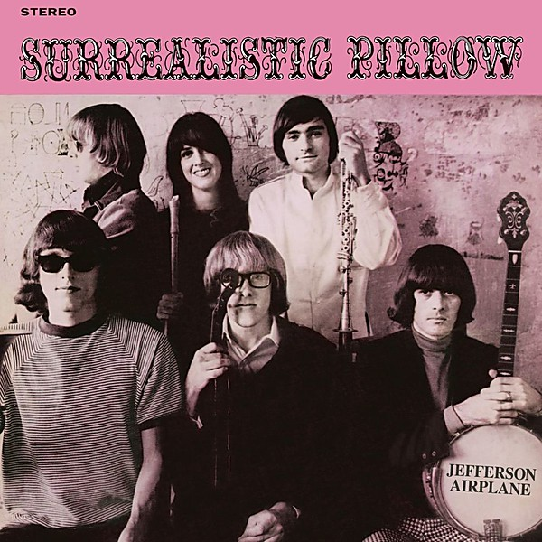

# Surrealistic Pillow

By **Jefferson Airplane**

## Album Data

- **Catalog:** Beets
- **Format:** Digital, Album
- **Album:** Surrealistic Pillow
- **Artist:** Jefferson Airplane
- **Albumartist:** Jefferson Airplane
- **Genre:** Psychedelic Rock
- **MusicBrainz Album Artist ID:** [39c2a93d-9afa-4a22-9bba-c087ab056e1c](https://musicbrainz.org/artist/39c2a93d-9afa-4a22-9bba-c087ab056e1c)
- **MusicBrainz Album ID:** [551c7e9c-c83c-3d6b-bd55-f645cf9f7740](https://musicbrainz.org/release/551c7e9c-c83c-3d6b-bd55-f645cf9f7740)
- **MusicBrainz Release Group ID:** [e6440cd2-5e8e-367d-bc49-cc042b5ef524](https://musicbrainz.org/release-group/e6440cd2-5e8e-367d-bc49-cc042b5ef524)
- **Year:** 1967
- **Catalog #:** 82876 81558 2
- **Label:** Legacy
- **Total Tracks:** 12

## Album Tracks

### Track 01 - Volunteers

- **Artist:** Jefferson Airplane
- **Format:** ALAC
- **Genre:** Psychedelic Rock
- **Length:** 3:34
- **MusicBrainz Track ID:** [de69b30a-6e50-4dbf-a1ee-1109ad08f1d7](https://musicbrainz.org/recording/de69b30a-6e50-4dbf-a1ee-1109ad08f1d7)
- **Title:** Volunteers
- **Track:** 01
- **Year:** 2007

### Track 02 - Good Shepherd

- **Artist:** Jefferson Airplane
- **Format:** ALAC
- **Genre:** Psychedelic Rock
- **Length:** 7:16
- **MusicBrainz Track ID:** [e682fac8-1ce1-4807-9f3e-c4166e208fc1](https://musicbrainz.org/recording/e682fac8-1ce1-4807-9f3e-c4166e208fc1)
- **Title:** Good Shepherd
- **Track:** 02
- **Year:** 2007

### Track 03 - Plastic Fantastic Lover

- **Artist:** Jefferson Airplane
- **Format:** ALAC
- **Genre:** Psychedelic Rock
- **Length:** 3:16
- **MusicBrainz Track ID:** [dea11d77-53e9-44d3-aa67-996a065ea37b](https://musicbrainz.org/recording/dea11d77-53e9-44d3-aa67-996a065ea37b)
- **Title:** Plastic Fantastic Lover
- **Track:** 03
- **Year:** 2007

### Track 04 - Uncle Sam Blues

- **Artist:** Jefferson Airplane
- **Format:** ALAC
- **Genre:** Psychedelic Rock
- **Length:** 5:07
- **MusicBrainz Track ID:** [47fa9ded-deba-4db9-8c96-ea462b97143f](https://musicbrainz.org/recording/47fa9ded-deba-4db9-8c96-ea462b97143f)
- **Title:** Uncle Sam Blues
- **Track:** 04
- **Year:** 2007

### Track 05 - 3/5 of a Mile in 10 Seconds

- **Artist:** Jefferson Airplane
- **Format:** ALAC
- **Genre:** Acid Rock
- **Length:** 5:48
- **MusicBrainz Track ID:** [ab52a672-4db1-4ba3-91d7-8f0a55034019](https://musicbrainz.org/recording/ab52a672-4db1-4ba3-91d7-8f0a55034019)
- **Title:** 3/5 of a Mile in 10 Seconds
- **Track:** 05
- **Year:** 2007

### Track 06 - You Wear Your Dresses Too Short

- **Artist:** Jefferson Airplane
- **Format:** ALAC
- **Genre:** Psychedelic Rock
- **Length:** 9:16
- **MusicBrainz Track ID:** [0344ab63-b8ff-4c11-bf18-3f045206e34a](https://musicbrainz.org/recording/0344ab63-b8ff-4c11-bf18-3f045206e34a)
- **Title:** You Wear Your Dresses Too Short
- **Track:** 06
- **Year:** 2007

### Track 07 - Come Back Baby

- **Artist:** Jefferson Airplane
- **Format:** ALAC
- **Genre:** Psychedelic Rock
- **Length:** 6:47
- **MusicBrainz Track ID:** [beeae26e-7ffd-4bee-8825-3fe5a66aea42](https://musicbrainz.org/recording/beeae26e-7ffd-4bee-8825-3fe5a66aea42)
- **Title:** Come Back Baby
- **Track:** 07
- **Year:** 2007

### Track 08 - Won't You Try / Saturday Afternoon

- **Artist:** Jefferson Airplane
- **Format:** ALAC
- **Genre:** Psychedelic Rock
- **Length:** 5:14
- **MusicBrainz Track ID:** [674def64-96c0-4865-a6d1-0b109c21f092](https://musicbrainz.org/recording/674def64-96c0-4865-a6d1-0b109c21f092)
- **Title:** Won't You Try / Saturday Afternoon
- **Track:** 08
- **Year:** 2007

### Track 09 - The Ballad of You & Me & Pooneil

- **Artist:** Jefferson Airplane
- **Format:** ALAC
- **Genre:** Psychedelic Rock
- **Length:** 10:26
- **MusicBrainz Track ID:** [51e8a7af-7eec-4305-808e-a967f0ccdcee](https://musicbrainz.org/recording/51e8a7af-7eec-4305-808e-a967f0ccdcee)
- **Title:** The Ballad of You & Me & Pooneil
- **Track:** 09
- **Year:** 2007

### Track 10 - White Rabbit

- **Artist:** Jefferson Airplane
- **Format:** ALAC
- **Genre:** Psychedelic Rock
- **Length:** 3:03
- **MusicBrainz Track ID:** [5a49e3bb-8bd3-4f12-978d-13e05ad5cadf](https://musicbrainz.org/recording/5a49e3bb-8bd3-4f12-978d-13e05ad5cadf)
- **Title:** White Rabbit
- **Track:** 10
- **Year:** 2007

### Track 11 - Crown of Creation

- **Artist:** Jefferson Airplane
- **Format:** ALAC
- **Genre:** Acid Rock
- **Length:** 3:25
- **MusicBrainz Track ID:** [cd64fe3a-c2fa-4511-9e2e-1767764fb17b](https://musicbrainz.org/recording/cd64fe3a-c2fa-4511-9e2e-1767764fb17b)
- **Title:** Crown of Creation
- **Track:** 11
- **Year:** 2007

### Track 12 - The Other Side of This Life

- **Artist:** Jefferson Airplane
- **Format:** ALAC
- **Genre:** Acid Rock
- **Length:** 10:02
- **MusicBrainz Track ID:** [e15da638-d905-43d0-b50b-f4be217b7ac6](https://musicbrainz.org/recording/e15da638-d905-43d0-b50b-f4be217b7ac6)
- **Title:** The Other Side of This Life
- **Track:** 12
- **Year:** 2007

## See also

- [After Bathing at Baxter's](After_Bathing_at_Baxters.md)
- [After Bathing At Baxter's](After_Bathing_At_Baxters.md)
- [Bark](Bark.md)
- [Bless Its Pointed Little Head](Bless_Its_Pointed_Little_Head.md)
- [Crown of Creation](Crown_of_Creation.md)
- [Early Flight](Early_Flight.md)
- [Jefferson Airplane](Jefferson_Airplane.md)
- [Jefferson Airplane Takes Off](Jefferson_Airplane_Takes_Off.md)
- [Live at Fillmore West 11-25 thru 11-27 1966](Live_at_Fillmore_West_11-25_thru_11-27_1966.md)
- [Long John Silver](Long_John_Silver.md)
- [Return To The Matrix](Return_To_The_Matrix.md)
- [Sweeping Up the Spotlight](Sweeping_Up_the_Spotlight.md)
- [The Essential Jefferson Airplane - Amazon Prime](The_Essential_Jefferson_Airplane_-_Amazon_Prime.md)
- [Thirty Seconds Over Winterland](Thirty_Seconds_Over_Winterland.md)
- [Volunteers](Volunteers.md)
- [CD: After Bathing At Baxter's](../../CD/Jefferson_Airplane/After_Bathing_At_Baxters.md)
- [CD: Bark](../../CD/Jefferson_Airplane/Bark.md)
- [CD: Early Flight Thirty Seconds Over Winterland](../../CD/Jefferson_Airplane/Early_Flight_Thirty_Seconds_Over_Winterland.md)
- [CD: ](../../CD/Jefferson_Airplane/Jefferson_Airplane.md)
- [CD: Long John Silver](../../CD/Jefferson_Airplane/Long_John_Silver.md)
- [CD: Original Album Classics (Disc 1)](../../CD/Jefferson_Airplane/Original_Album_Classics_Disc_1.md)
- [Roon: After Bathing At Baxters](../../Roon/Jefferson_Airplane/After_Bathing_At_Baxters.md)
- [Roon: Bark (Bonus Tracks)](../../Roon/Jefferson_Airplane/Bark_Bonus_Tracks.md)
- [Roon: Bless Its Pointed Little Head](../../Roon/Jefferson_Airplane/Bless_Its_Pointed_Little_Head.md)
- [Roon: Crown Of Creation](../../Roon/Jefferson_Airplane/Crown_Of_Creation.md)
- [Roon: Long John Silver](../../Roon/Jefferson_Airplane/Long_John_Silver.md)
- [Roon: Surrealistic Pillow](../../Roon/Jefferson_Airplane/Surrealistic_Pillow.md)
- [Roon: Thirty Seconds Over Winterland [Live] (Expanded Edition)](../../Roon/Jefferson_Airplane/Thirty_Seconds_Over_Winterland_[Live]_Expanded_Edition.md)
- [Roon: Volunteers](../../Roon/Jefferson_Airplane/Volunteers.md)
- [Vinyl: After Bathing At Baxter's](../../Vinyl/Jefferson_Airplane/After_Bathing_At_Baxters.md)
- [Vinyl: Crown Of Creation](../../Vinyl/Jefferson_Airplane/Crown_Of_Creation.md)
- [Vinyl: ](../../Vinyl/Jefferson_Airplane/Jefferson_Airplane.md)
- [Vinyl: Mexico](../../Vinyl/Jefferson_Airplane/Mexico.md)
- [Vinyl: Surrealistic Pillow](../../Vinyl/Jefferson_Airplane/Surrealistic_Pillow.md)
