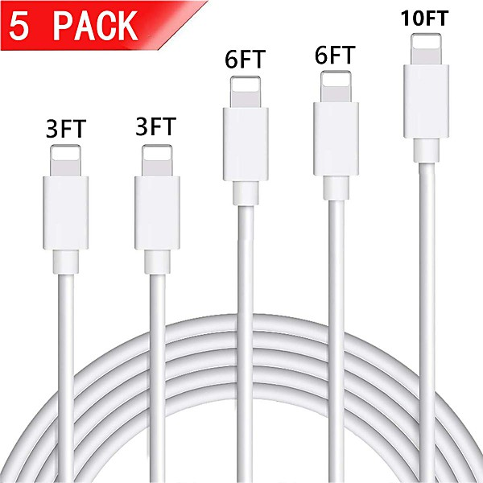

# The Essential Jefferson Airplane - Amazon Prime

By **Jefferson Airplane**

## Album Data

- **Catalog:** Beets
- **Format:** Digital, Album
- **Album:** The Essential Jefferson Airplane - Amazon Prime
- **Artist:** Jefferson Airplane
- **Albumartist:** Jefferson Airplane
- **Genre:** Psychedelic Rock
- **MusicBrainz Album Artist ID:** 
- **MusicBrainz Album ID:** 
- **MusicBrainz Release Group ID:** 
- **Year:** 2012
- **Catalog #:** 0147-2-G
- **Label:** Grunt
- **Total Tracks:** 07

## Album Tracks

### Track 01 - Have You Seen the Saucers

- **Artist:** Jefferson Airplane
- **Format:** ALAC
- **Genre:** Psychedelic Rock
- **Length:** 4:19
- **MusicBrainz Track ID:** [1ca6c198-d373-4769-8460-a3d1a9c66515](https://musicbrainz.org/recording/1ca6c198-d373-4769-8460-a3d1a9c66515)
- **Title:** Have You Seen the Saucers
- **Track:** 01
- **Year:** 1989

### Track 02 - Feel So Good

- **Artist:** Jefferson Airplane
- **Format:** ALAC
- **Genre:** Psychedelic Rock
- **Length:** 11:29
- **MusicBrainz Track ID:** [55a05949-71ac-4377-84ca-c818130ceed4](https://musicbrainz.org/recording/55a05949-71ac-4377-84ca-c818130ceed4)
- **Title:** Feel So Good
- **Track:** 02
- **Year:** 1989

### Track 03 - Crown of Creation

- **Artist:** Jefferson Airplane
- **Format:** ALAC
- **Genre:** Acid Rock
- **Length:** 3:24
- **MusicBrainz Track ID:** [fcef19de-f6a1-4a8a-ac9c-a7c5c479294f](https://musicbrainz.org/recording/fcef19de-f6a1-4a8a-ac9c-a7c5c479294f)
- **Title:** Crown of Creation
- **Track:** 03
- **Year:** 1989

### Track 04 - When the Earth Moves Again

- **Artist:** Jefferson Airplane
- **Format:** ALAC
- **Genre:** Psychedelic Rock
- **Length:** 4:20
- **MusicBrainz Track ID:** [e3f786e9-563e-455d-b5d0-bbc99c1cbfba](https://musicbrainz.org/recording/e3f786e9-563e-455d-b5d0-bbc99c1cbfba)
- **Title:** When the Earth Moves Again
- **Track:** 04
- **Year:** 1989

### Track 05 - Milk Train

- **Artist:** Jefferson Airplane
- **Format:** ALAC
- **Genre:** Acid Rock
- **Length:** 4:01
- **MusicBrainz Track ID:** [232a1871-9efb-4400-81b1-06992abf7749](https://musicbrainz.org/recording/232a1871-9efb-4400-81b1-06992abf7749)
- **Title:** Milk Train
- **Track:** 05
- **Year:** 1989

### Track 06 - Trial by Fire

- **Artist:** Jefferson Airplane
- **Format:** ALAC
- **Genre:** Acid Rock
- **Length:** 5:05
- **MusicBrainz Track ID:** [ce29ab89-5bba-40fc-8cef-c3ec6918bccc](https://musicbrainz.org/recording/ce29ab89-5bba-40fc-8cef-c3ec6918bccc)
- **Title:** Trial by Fire
- **Track:** 06
- **Year:** 1989

### Track 07 - Twilight Double Leader

- **Artist:** Jefferson Airplane
- **Format:** ALAC
- **Genre:** Acid Rock
- **Length:** 5:30
- **MusicBrainz Track ID:** [5769a708-8d40-4f7c-817b-b06d0d67c1e2](https://musicbrainz.org/recording/5769a708-8d40-4f7c-817b-b06d0d67c1e2)
- **Title:** Twilight Double Leader
- **Track:** 07
- **Year:** 1989

## See also

- [After Bathing at Baxter's](After_Bathing_at_Baxters.md)
- [After Bathing At Baxter's](After_Bathing_At_Baxters.md)
- [Bark](Bark.md)
- [Bless Its Pointed Little Head](Bless_Its_Pointed_Little_Head.md)
- [Crown of Creation](Crown_of_Creation.md)
- [Early Flight](Early_Flight.md)
- [Jefferson Airplane](Jefferson_Airplane.md)
- [Jefferson Airplane Takes Off](Jefferson_Airplane_Takes_Off.md)
- [Live at Fillmore West 11-25 thru 11-27 1966](Live_at_Fillmore_West_11-25_thru_11-27_1966.md)
- [Long John Silver](Long_John_Silver.md)
- [Return To The Matrix](Return_To_The_Matrix.md)
- [Surrealistic Pillow](Surrealistic_Pillow.md)
- [Sweeping Up the Spotlight](Sweeping_Up_the_Spotlight.md)
- [Thirty Seconds Over Winterland](Thirty_Seconds_Over_Winterland.md)
- [Volunteers](Volunteers.md)
- [CD: After Bathing At Baxter's](../../CD/Jefferson_Airplane/After_Bathing_At_Baxters.md)
- [CD: Bark](../../CD/Jefferson_Airplane/Bark.md)
- [CD: Early Flight Thirty Seconds Over Winterland](../../CD/Jefferson_Airplane/Early_Flight_Thirty_Seconds_Over_Winterland.md)
- [CD: ](../../CD/Jefferson_Airplane/Jefferson_Airplane.md)
- [CD: Long John Silver](../../CD/Jefferson_Airplane/Long_John_Silver.md)
- [CD: Original Album Classics (Disc 1)](../../CD/Jefferson_Airplane/Original_Album_Classics_Disc_1.md)
- [Roon: After Bathing At Baxters](../../Roon/Jefferson_Airplane/After_Bathing_At_Baxters.md)
- [Roon: Bark (Bonus Tracks)](../../Roon/Jefferson_Airplane/Bark_Bonus_Tracks.md)
- [Roon: Bless Its Pointed Little Head](../../Roon/Jefferson_Airplane/Bless_Its_Pointed_Little_Head.md)
- [Roon: Crown Of Creation](../../Roon/Jefferson_Airplane/Crown_Of_Creation.md)
- [Roon: Long John Silver](../../Roon/Jefferson_Airplane/Long_John_Silver.md)
- [Roon: Surrealistic Pillow](../../Roon/Jefferson_Airplane/Surrealistic_Pillow.md)
- [Roon: Thirty Seconds Over Winterland [Live] (Expanded Edition)](../../Roon/Jefferson_Airplane/Thirty_Seconds_Over_Winterland_[Live]_Expanded_Edition.md)
- [Roon: Volunteers](../../Roon/Jefferson_Airplane/Volunteers.md)
- [Vinyl: After Bathing At Baxter's](../../Vinyl/Jefferson_Airplane/After_Bathing_At_Baxters.md)
- [Vinyl: Crown Of Creation](../../Vinyl/Jefferson_Airplane/Crown_Of_Creation.md)
- [Vinyl: ](../../Vinyl/Jefferson_Airplane/Jefferson_Airplane.md)
- [Vinyl: Mexico](../../Vinyl/Jefferson_Airplane/Mexico.md)
- [Vinyl: Surrealistic Pillow](../../Vinyl/Jefferson_Airplane/Surrealistic_Pillow.md)
