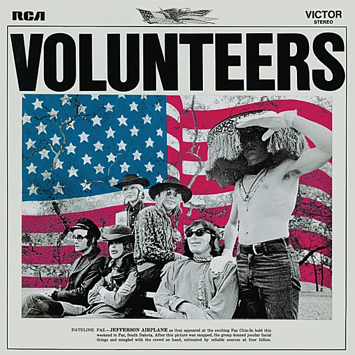

# Volunteers

By **Jefferson Airplane**

## Album Data

- **Catalog:** Beets
- **Format:** Digital, Album
- **Album:** Volunteers
- **Artist:** Jefferson Airplane
- **Albumartist:** Jefferson Airplane
- **Genre:** Acid Rock
- **MusicBrainz Album Artist ID:** [39c2a93d-9afa-4a22-9bba-c087ab056e1c](https://musicbrainz.org/artist/39c2a93d-9afa-4a22-9bba-c087ab056e1c)
- **MusicBrainz Album ID:** [e59b2b84-4ed7-4593-8205-59555f0f8ca4](https://musicbrainz.org/release/e59b2b84-4ed7-4593-8205-59555f0f8ca4)
- **MusicBrainz Release Group ID:** [20ce79fe-2987-3506-87fb-82fa8d0c6850](https://musicbrainz.org/release-group/20ce79fe-2987-3506-87fb-82fa8d0c6850)
- **Year:** 2004
- **Catalog #:** 82876 61642 2
- **Label:** BMG Heritage
- **Total Tracks:** 15

## Album Tracks

### Track 01 - We Can Be Together

- **Artist:** Jefferson Airplane
- **Format:** ALAC
- **Genre:** Acid Rock
- **Length:** 5:47
- **MusicBrainz Track ID:** [e97c03ce-0c62-4afe-9d89-0e4604493e0c](https://musicbrainz.org/recording/e97c03ce-0c62-4afe-9d89-0e4604493e0c)
- **Title:** We Can Be Together
- **Track:** 01
- **Year:** 2004

### Track 02 - Good Shepherd

- **Artist:** Jefferson Airplane
- **Format:** ALAC
- **Genre:** Psychedelic Rock
- **Length:** 4:22
- **MusicBrainz Track ID:** [9f88fd87-82ef-469a-ad35-78c761420c07](https://musicbrainz.org/recording/9f88fd87-82ef-469a-ad35-78c761420c07)
- **Title:** Good Shepherd
- **Track:** 02
- **Year:** 2004

### Track 03 - The Farm

- **Artist:** Jefferson Airplane
- **Format:** ALAC
- **Genre:** Acid Rock
- **Length:** 3:13
- **MusicBrainz Track ID:** [76a99dd6-cbf1-4546-9fdd-dbba2172b6b9](https://musicbrainz.org/recording/76a99dd6-cbf1-4546-9fdd-dbba2172b6b9)
- **Title:** The Farm
- **Track:** 03
- **Year:** 2004

### Track 04 - Hey Fredrick

- **Artist:** Jefferson Airplane
- **Format:** ALAC
- **Genre:** Acid Rock
- **Length:** 8:34
- **MusicBrainz Track ID:** [cb4f74d1-3461-474a-922b-aebda631c162](https://musicbrainz.org/recording/cb4f74d1-3461-474a-922b-aebda631c162)
- **Title:** Hey Fredrick
- **Track:** 04
- **Year:** 2004

### Track 05 - Turn My Life Down

- **Artist:** Jefferson Airplane
- **Format:** ALAC
- **Genre:** Acid Rock
- **Length:** 2:57
- **MusicBrainz Track ID:** [64fdc1a2-504d-48fc-a953-be20149b4045](https://musicbrainz.org/recording/64fdc1a2-504d-48fc-a953-be20149b4045)
- **Title:** Turn My Life Down
- **Track:** 05
- **Year:** 2004

### Track 06 - Wooden Ships

- **Artist:** Jefferson Airplane
- **Format:** ALAC
- **Genre:** Psychedelic Rock
- **Length:** 6:28
- **MusicBrainz Track ID:** [273916ea-71c6-4cc6-864a-4b05207aa321](https://musicbrainz.org/recording/273916ea-71c6-4cc6-864a-4b05207aa321)
- **Title:** Wooden Ships
- **Track:** 06
- **Year:** 2004

### Track 07 - Eskimo Blue Day

- **Artist:** Jefferson Airplane
- **Format:** ALAC
- **Genre:** Acid Rock
- **Length:** 6:36
- **MusicBrainz Track ID:** [1a751feb-2a23-4646-86e0-ad0aa0dfc9f4](https://musicbrainz.org/recording/1a751feb-2a23-4646-86e0-ad0aa0dfc9f4)
- **Title:** Eskimo Blue Day
- **Track:** 07
- **Year:** 2004

### Track 08 - A Song for All Seasons

- **Artist:** Jefferson Airplane
- **Format:** ALAC
- **Genre:** Britpop
- **Length:** 3:29
- **MusicBrainz Track ID:** [a0c84a96-d825-4d72-8a1f-6878086a9238](https://musicbrainz.org/recording/a0c84a96-d825-4d72-8a1f-6878086a9238)
- **Title:** A Song for All Seasons
- **Track:** 08
- **Year:** 2004

### Track 09 - Meadowlands

- **Artist:** Jefferson Airplane
- **Format:** ALAC
- **Genre:** Acid Rock
- **Length:** 1:04
- **MusicBrainz Track ID:** [0cc83889-6383-49b3-a69e-9c61af39e8f3](https://musicbrainz.org/recording/0cc83889-6383-49b3-a69e-9c61af39e8f3)
- **Title:** Meadowlands
- **Track:** 09
- **Year:** 2004

### Track 10 - Volunteers

- **Artist:** Jefferson Airplane
- **Format:** ALAC
- **Genre:** Psychedelic Rock
- **Length:** 2:08
- **MusicBrainz Track ID:** [3cef5267-a5eb-4f1f-8c6f-2eaa82c60025](https://musicbrainz.org/recording/3cef5267-a5eb-4f1f-8c6f-2eaa82c60025)
- **Title:** Volunteers
- **Track:** 10
- **Year:** 2004

### Track 11 - Good Shepherd (live, 1969-11

- **Artist:** Jefferson Airplane
- **Format:** ALAC
- **Genre:** Acid Rock
- **Length:** 7:20
- **MusicBrainz Track ID:** [0105ab5d-a3ab-4abb-89c8-3b32c40409dd](https://musicbrainz.org/recording/0105ab5d-a3ab-4abb-89c8-3b32c40409dd)
- **Title:** Good Shepherd (live, 1969-11
- **Track:** 11
- **Year:** 2004

### Track 12 - Somebody to Love (live, 1969-11

- **Artist:** Jefferson Airplane
- **Format:** ALAC
- **Genre:** Acid Rock
- **Length:** 4:10
- **MusicBrainz Track ID:** [5dcc3974-b987-44c6-bc66-1cbb9a37a22c](https://musicbrainz.org/recording/5dcc3974-b987-44c6-bc66-1cbb9a37a22c)
- **Title:** Somebody to Love (live, 1969-11
- **Track:** 12
- **Year:** 2004

### Track 13 - Plastic Fantastic Lover (live, 1969-11

- **Artist:** Jefferson Airplane
- **Format:** ALAC
- **Genre:** Acid Rock
- **Length:** 3:21
- **MusicBrainz Track ID:** [c7c4ec3c-0097-4ebc-a26a-49d9f294e90c](https://musicbrainz.org/recording/c7c4ec3c-0097-4ebc-a26a-49d9f294e90c)
- **Title:** Plastic Fantastic Lover (live, 1969-11
- **Track:** 13
- **Year:** 2004

### Track 14 - Wooden Ships (live, 1969-11

- **Artist:** Jefferson Airplane
- **Format:** ALAC
- **Genre:** Acid Rock
- **Length:** 7:00
- **MusicBrainz Track ID:** [1bfb51b1-f42b-4a28-b4ef-0ba805c1fb16](https://musicbrainz.org/recording/1bfb51b1-f42b-4a28-b4ef-0ba805c1fb16)
- **Title:** Wooden Ships (live, 1969-11
- **Track:** 14
- **Year:** 2004

### Track 15 - Volunteers (live, 1969-11

- **Artist:** Jefferson Airplane
- **Format:** ALAC
- **Genre:** Acid Rock
- **Length:** 3:26
- **MusicBrainz Track ID:** [b3691170-3389-4487-9339-a9bd67b0b807](https://musicbrainz.org/recording/b3691170-3389-4487-9339-a9bd67b0b807)
- **Title:** Volunteers (live, 1969-11
- **Track:** 15
- **Year:** 2004

## See also

- [After Bathing at Baxter's](After_Bathing_at_Baxters.md)
- [After Bathing At Baxter's](After_Bathing_At_Baxters.md)
- [Bark](Bark.md)
- [Bless Its Pointed Little Head](Bless_Its_Pointed_Little_Head.md)
- [Crown of Creation](Crown_of_Creation.md)
- [Early Flight](Early_Flight.md)
- [Jefferson Airplane](Jefferson_Airplane.md)
- [Jefferson Airplane Takes Off](Jefferson_Airplane_Takes_Off.md)
- [Live at Fillmore West 11-25 thru 11-27 1966](Live_at_Fillmore_West_11-25_thru_11-27_1966.md)
- [Long John Silver](Long_John_Silver.md)
- [Return To The Matrix](Return_To_The_Matrix.md)
- [Surrealistic Pillow](Surrealistic_Pillow.md)
- [Sweeping Up the Spotlight](Sweeping_Up_the_Spotlight.md)
- [The Essential Jefferson Airplane - Amazon Prime](The_Essential_Jefferson_Airplane_-_Amazon_Prime.md)
- [Thirty Seconds Over Winterland](Thirty_Seconds_Over_Winterland.md)
- [CD: After Bathing At Baxter's](../../CD/Jefferson_Airplane/After_Bathing_At_Baxters.md)
- [CD: Bark](../../CD/Jefferson_Airplane/Bark.md)
- [CD: Early Flight Thirty Seconds Over Winterland](../../CD/Jefferson_Airplane/Early_Flight_Thirty_Seconds_Over_Winterland.md)
- [CD: ](../../CD/Jefferson_Airplane/Jefferson_Airplane.md)
- [CD: Long John Silver](../../CD/Jefferson_Airplane/Long_John_Silver.md)
- [CD: Original Album Classics (Disc 1)](../../CD/Jefferson_Airplane/Original_Album_Classics_Disc_1.md)
- [Roon: After Bathing At Baxters](../../Roon/Jefferson_Airplane/After_Bathing_At_Baxters.md)
- [Roon: Bark (Bonus Tracks)](../../Roon/Jefferson_Airplane/Bark_Bonus_Tracks.md)
- [Roon: Bless Its Pointed Little Head](../../Roon/Jefferson_Airplane/Bless_Its_Pointed_Little_Head.md)
- [Roon: Crown Of Creation](../../Roon/Jefferson_Airplane/Crown_Of_Creation.md)
- [Roon: Long John Silver](../../Roon/Jefferson_Airplane/Long_John_Silver.md)
- [Roon: Surrealistic Pillow](../../Roon/Jefferson_Airplane/Surrealistic_Pillow.md)
- [Roon: Thirty Seconds Over Winterland [Live] (Expanded Edition)](../../Roon/Jefferson_Airplane/Thirty_Seconds_Over_Winterland_[Live]_Expanded_Edition.md)
- [Roon: Volunteers](../../Roon/Jefferson_Airplane/Volunteers.md)
- [Vinyl: After Bathing At Baxter's](../../Vinyl/Jefferson_Airplane/After_Bathing_At_Baxters.md)
- [Vinyl: Crown Of Creation](../../Vinyl/Jefferson_Airplane/Crown_Of_Creation.md)
- [Vinyl: ](../../Vinyl/Jefferson_Airplane/Jefferson_Airplane.md)
- [Vinyl: Mexico](../../Vinyl/Jefferson_Airplane/Mexico.md)
- [Vinyl: Surrealistic Pillow](../../Vinyl/Jefferson_Airplane/Surrealistic_Pillow.md)
