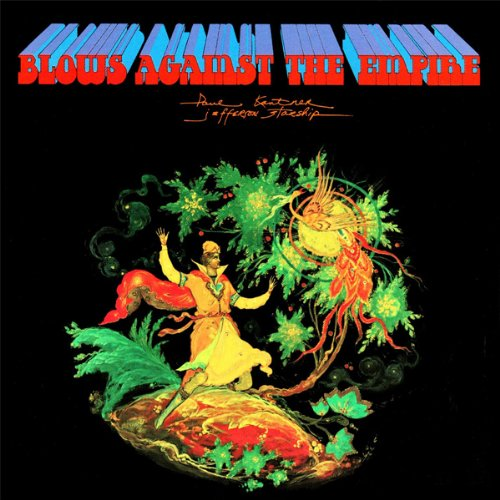

# Blows Against the Empire

By **Jefferson Starship**

## Album Data

- **Catalog:** Beets
- **Format:** Digital, Album
- **Album:** Blows Against the Empire
- **Artist:** Jefferson Starship
- **Albumartist:** Jefferson Starship
- **Genre:** Psychedelic Rock
- **MusicBrainz Album Artist ID:** [4854429b-66f7-41c0-a89c-030bb7ccf958](https://musicbrainz.org/artist/4854429b-66f7-41c0-a89c-030bb7ccf958)
- **MusicBrainz Album ID:** [1081d7a5-7f39-4c9a-9924-19e0f1f27ff2](https://musicbrainz.org/release/1081d7a5-7f39-4c9a-9924-19e0f1f27ff2)
- **MusicBrainz Release Group ID:** [24ed42e2-ddd7-3c43-b8e0-cdac1b190bc6](https://musicbrainz.org/release-group/24ed42e2-ddd7-3c43-b8e0-cdac1b190bc6)
- **Year:** 1987
- **Catalog #:** 
- **Label:** 
- **Total Tracks:** 08

## Album Tracks

### Track 01 - Ride The Tiger [1974] [Jefferson Starship]

- **Artist:** Jefferson Starship
- **Format:** ALAC
- **Genre:** Progressive Rock
- **Length:** 5:11
- **MusicBrainz Track ID:** 
- **Title:** Ride The Tiger [1974] [Jefferson Starship]
- **Track:** 01
- **Year:** 1974

### Track 01 - Ride The Tiger

- **Artist:** Jefferson Starship
- **Format:** AAC
- **Genre:** Southern Rock
- **Length:** 5:10
- **MusicBrainz Track ID:** 
- **Title:** Ride The Tiger
- **Track:** 01
- **Year:** 1996

### Track 02 - That's For Sure [1974] [Jefferson Starship]

- **Artist:** Jefferson Starship
- **Format:** ALAC
- **Genre:** Progressive Rock
- **Length:** 5:03
- **MusicBrainz Track ID:** 
- **Title:** That's For Sure [1974] [Jefferson Starship]
- **Track:** 02
- **Year:** 1974

### Track 02 - That's For Sure

- **Artist:** Jefferson Starship
- **Format:** AAC
- **Genre:** Southern Rock
- **Length:** 5:02
- **MusicBrainz Track ID:** 
- **Title:** That's For Sure
- **Track:** 02
- **Year:** 1996

### Track 03 - Be Young You [1974] [Jefferson Starship]

- **Artist:** Jefferson Starship
- **Format:** ALAC
- **Genre:** Progressive Rock
- **Length:** 3:50
- **MusicBrainz Track ID:** 
- **Title:** Be Young You [1974] [Jefferson Starship]
- **Track:** 03
- **Year:** 1974

### Track 03 - Be Young You

- **Artist:** Jefferson Starship
- **Format:** AAC
- **Genre:** Southern Rock
- **Length:** 3:48
- **MusicBrainz Track ID:** 
- **Title:** Be Young You
- **Track:** 03
- **Year:** 1996

### Track 04 - Caroline [1974] [Jefferson Starship]

- **Artist:** Jefferson Starship
- **Format:** ALAC
- **Genre:** Progressive Rock
- **Length:** 7:32
- **MusicBrainz Track ID:** 
- **Title:** Caroline [1974] [Jefferson Starship]
- **Track:** 04
- **Year:** 1974

### Track 04 - Caroline

- **Artist:** Jefferson Starship
- **Format:** AAC
- **Genre:** Southern Rock
- **Length:** 7:29
- **MusicBrainz Track ID:** 
- **Title:** Caroline
- **Track:** 04
- **Year:** 1996

### Track 05 - Devil's Den [1974] [Jefferson Starship]

- **Artist:** Jefferson Starship
- **Format:** ALAC
- **Genre:** Progressive Rock
- **Length:** 4:05
- **MusicBrainz Track ID:** 
- **Title:** Devil's Den [1974] [Jefferson Starship]
- **Track:** 05
- **Year:** 1974

### Track 05 - Devils Den

- **Artist:** Jefferson Starship
- **Format:** AAC
- **Genre:** Pop
- **Length:** 4:03
- **MusicBrainz Track ID:** 
- **Title:** Devils Den
- **Track:** 05
- **Year:** 1996

### Track 06 - Come To Life [1974] [Jefferson Starship]

- **Artist:** Jefferson Starship
- **Format:** ALAC
- **Genre:** Progressive Rock
- **Length:** 3:49
- **MusicBrainz Track ID:** 
- **Title:** Come To Life [1974] [Jefferson Starship]
- **Track:** 06
- **Year:** 1974

### Track 06 - Come To Life

- **Artist:** Jefferson Starship
- **Format:** AAC
- **Genre:** Southern Rock
- **Length:** 3:47
- **MusicBrainz Track ID:** 
- **Title:** Come To Life
- **Track:** 06
- **Year:** 1996

### Track 07 - All Fly Away [1974] [Jefferson Starship]

- **Artist:** Jefferson Starship
- **Format:** ALAC
- **Genre:** Progressive Rock
- **Length:** 5:28
- **MusicBrainz Track ID:** 
- **Title:** All Fly Away [1974] [Jefferson Starship]
- **Track:** 07
- **Year:** 1974

### Track 07 - All Fly Away

- **Artist:** Jefferson Starship
- **Format:** AAC
- **Genre:** Southern Rock
- **Length:** 5:27
- **MusicBrainz Track ID:** 
- **Title:** All Fly Away
- **Track:** 07
- **Year:** 1996

### Track 08 - Hyperdrive [1974] [Jefferson Starship]

- **Artist:** Jefferson Starship
- **Format:** ALAC
- **Genre:** Progressive Rock
- **Length:** 7:42
- **MusicBrainz Track ID:** 
- **Title:** Hyperdrive [1974] [Jefferson Starship]
- **Track:** 08
- **Year:** 1974

### Track 08 - Hyperdrive

- **Artist:** Jefferson Starship
- **Format:** AAC
- **Genre:** Southern Rock
- **Length:** 7:41
- **MusicBrainz Track ID:** 
- **Title:** Hyperdrive
- **Track:** 08
- **Year:** 1996

## See also

- [Dragonfly](Dragonfly.md)
- [Freedom At Point Zero](Freedom_At_Point_Zero.md)
- [Jefferson Starship Live at Boston Music Hall](Jefferson_Starship_Live_at_Boston_Music_Hall.md)
- [Jefferson Starship - The Box Set Series](Jefferson_Starship_-_The_Box_Set_Series_2_3.md)
- [Jefferson Starship - The Box Set Series](Jefferson_Starship_-_The_Box_Set_Series_2.md)
- [Jefferson Starship - The Box Set Series](Jefferson_Starship_-_The_Box_Set_Series.md)
- [Red Octopus](Red_Octopus.md)
- [SNACK Benefit, Kezar Stadium March 23, 1975](SNACK_Benefit__Kezar_Stadium_March_23__1975.md)
- [Spitfire](Spitfire.md)
- [Winds of Change](Winds_of_Change.md)
- [CD: Freedom At Point Zero](../../CD/Jefferson_Starship/Freedom_At_Point_Zero.md)
- [CD: ](../../CD/Jefferson_Starship/Jefferson_Starship.md)
- [CD: Spitfire](../../CD/Jefferson_Starship/Spitfire.md)
- [CD: Winds Of Change](../../CD/Jefferson_Starship/Winds_Of_Change.md)
- [Roon: Blows Against The Empire](../../Roon/Jefferson_Starship/Blows_Against_The_Empire.md)
- [Roon: Deeper Space, Extra Virgin Sky](../../Roon/Jefferson_Starship/Deeper_Space__Extra_Virgin_Sky.md)
- [Roon: Dragon Fly](../../Roon/Jefferson_Starship/Dragon_Fly.md)
- [Roon: Modern Times](../../Roon/Jefferson_Starship/Modern_Times.md)
- [Roon: Red Octopus](../../Roon/Jefferson_Starship/Red_Octopus.md)
- [Roon: Spitfire (Remastered)](../../Roon/Jefferson_Starship/Spitfire_Remastered.md)
- [Roon: The Box Set Series](../../Roon/Jefferson_Starship/The_Box_Set_Series.md)
- [Roon: Timeless Classics Live](../../Roon/Jefferson_Starship/Timeless_Classics_Live.md)
- [Roon: Winds Of Change](../../Roon/Jefferson_Starship/Winds_Of_Change.md)
- [Vinyl: Count On Me / Show Yourself](../../Vinyl/Jefferson_Starship/Count_On_Me_-_Show_Yourself.md)
- [Vinyl: Crazy Feelin'](../../Vinyl/Jefferson_Starship/Crazy_Feelin.md)
- [Vinyl: ](../../Vinyl/Jefferson_Starship/Jefferson_Starship.md)
- [Vinyl: Light The Sky On Fire](../../Vinyl/Jefferson_Starship/Light_The_Sky_On_Fire.md)
- [Vinyl: Red Octopus](../../Vinyl/Jefferson_Starship/Red_Octopus.md)
