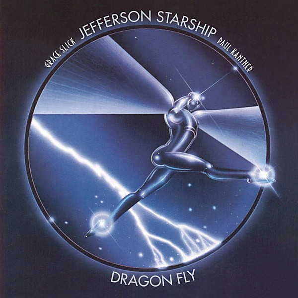

# Dragonfly

By **Jefferson Starship**

## Album Data

- **Catalog:** Beets
- **Format:** Digital, Album
- **Album:** Dragonfly
- **Artist:** Jefferson Starship
- **Albumartist:** Jefferson Starship
- **Genre:** Progressive Rock
- **MusicBrainz Album Artist ID:** 
- **MusicBrainz Album ID:** 
- **MusicBrainz Release Group ID:** 
- **Year:** 1974
- **Catalog #:** 
- **Label:** 
- **Total Tracks:** 10

## Album Tracks

### Track 01 - Jane

- **Artist:** Jefferson Starship
- **Format:** ALAC
- **Genre:** Rock
- **Length:** 4:13
- **MusicBrainz Track ID:** 
- **Title:** Jane
- **Track:** 01
- **Year:** 1979

### Track 02 - Lightning Rose (Carry The Fire)

- **Artist:** Jefferson Starship
- **Format:** ALAC
- **Genre:** Hard Rock
- **Length:** 4:38
- **MusicBrainz Track ID:** 
- **Title:** Lightning Rose (Carry The Fire)
- **Track:** 02
- **Year:** 1979

### Track 03 - Things To Come

- **Artist:** Jefferson Starship
- **Format:** ALAC
- **Genre:** Psychedelic Rock
- **Length:** 4:46
- **MusicBrainz Track ID:** 
- **Title:** Things To Come
- **Track:** 03
- **Year:** 1979

### Track 04 - Awakening

- **Artist:** Jefferson Starship
- **Format:** ALAC
- **Genre:** Progressive Rock
- **Length:** 8:05
- **MusicBrainz Track ID:** 
- **Title:** Awakening
- **Track:** 04
- **Year:** 1979

### Track 05 - Girl With The Hungry Eyes

- **Artist:** Jefferson Starship
- **Format:** ALAC
- **Genre:** Progressive Rock
- **Length:** 3:31
- **MusicBrainz Track ID:** 
- **Title:** Girl With The Hungry Eyes
- **Track:** 05
- **Year:** 1979

### Track 06 - Just The Same

- **Artist:** Jefferson Starship
- **Format:** ALAC
- **Genre:** Hard Rock
- **Length:** 5:20
- **MusicBrainz Track ID:** 
- **Title:** Just The Same
- **Track:** 06
- **Year:** 1979

### Track 07 - Rock Music

- **Artist:** Jefferson Starship
- **Format:** ALAC
- **Genre:** Hard Rock
- **Length:** 3:38
- **MusicBrainz Track ID:** 
- **Title:** Rock Music
- **Track:** 07
- **Year:** 1979

### Track 08 - Fading Lady Light

- **Artist:** Jefferson Starship
- **Format:** ALAC
- **Genre:** Hard Rock
- **Length:** 3:42
- **MusicBrainz Track ID:** 
- **Title:** Fading Lady Light
- **Track:** 08
- **Year:** 1979

### Track 09 - Freedom At Point Zero (Climbing Tiger Mountain Through The Sky)

- **Artist:** Jefferson Starship
- **Format:** ALAC
- **Genre:** Hard Rock
- **Length:** 4:31
- **MusicBrainz Track ID:** 
- **Title:** Freedom At Point Zero (Climbing Tiger Mountain Through The Sky)
- **Track:** 09
- **Year:** 1979

### Track 10 - Jane [Mono 45 Promo Edit]

- **Artist:** Jefferson Starship
- **Format:** ALAC
- **Genre:** Hard Rock
- **Length:** 3:43
- **MusicBrainz Track ID:** 
- **Title:** Jane [Mono 45 Promo Edit]
- **Track:** 10
- **Year:** 1979

## See also

- [Blows Against the Empire](Blows_Against_the_Empire.md)
- [Freedom At Point Zero](Freedom_At_Point_Zero.md)
- [Jefferson Starship Live at Boston Music Hall](Jefferson_Starship_Live_at_Boston_Music_Hall.md)
- [Jefferson Starship - The Box Set Series](Jefferson_Starship_-_The_Box_Set_Series_2_3.md)
- [Jefferson Starship - The Box Set Series](Jefferson_Starship_-_The_Box_Set_Series_2.md)
- [Jefferson Starship - The Box Set Series](Jefferson_Starship_-_The_Box_Set_Series.md)
- [Red Octopus](Red_Octopus.md)
- [SNACK Benefit, Kezar Stadium March 23, 1975](SNACK_Benefit__Kezar_Stadium_March_23__1975.md)
- [Spitfire](Spitfire.md)
- [Winds of Change](Winds_of_Change.md)
- [CD: Freedom At Point Zero](../../CD/Jefferson_Starship/Freedom_At_Point_Zero.md)
- [CD: ](../../CD/Jefferson_Starship/Jefferson_Starship.md)
- [CD: Spitfire](../../CD/Jefferson_Starship/Spitfire.md)
- [CD: Winds Of Change](../../CD/Jefferson_Starship/Winds_Of_Change.md)
- [Roon: Blows Against The Empire](../../Roon/Jefferson_Starship/Blows_Against_The_Empire.md)
- [Roon: Deeper Space, Extra Virgin Sky](../../Roon/Jefferson_Starship/Deeper_Space__Extra_Virgin_Sky.md)
- [Roon: Dragon Fly](../../Roon/Jefferson_Starship/Dragon_Fly.md)
- [Roon: Modern Times](../../Roon/Jefferson_Starship/Modern_Times.md)
- [Roon: Red Octopus](../../Roon/Jefferson_Starship/Red_Octopus.md)
- [Roon: Spitfire (Remastered)](../../Roon/Jefferson_Starship/Spitfire_Remastered.md)
- [Roon: The Box Set Series](../../Roon/Jefferson_Starship/The_Box_Set_Series.md)
- [Roon: Timeless Classics Live](../../Roon/Jefferson_Starship/Timeless_Classics_Live.md)
- [Roon: Winds Of Change](../../Roon/Jefferson_Starship/Winds_Of_Change.md)
- [Vinyl: Count On Me / Show Yourself](../../Vinyl/Jefferson_Starship/Count_On_Me_-_Show_Yourself.md)
- [Vinyl: Crazy Feelin'](../../Vinyl/Jefferson_Starship/Crazy_Feelin.md)
- [Vinyl: ](../../Vinyl/Jefferson_Starship/Jefferson_Starship.md)
- [Vinyl: Light The Sky On Fire](../../Vinyl/Jefferson_Starship/Light_The_Sky_On_Fire.md)
- [Vinyl: Red Octopus](../../Vinyl/Jefferson_Starship/Red_Octopus.md)
