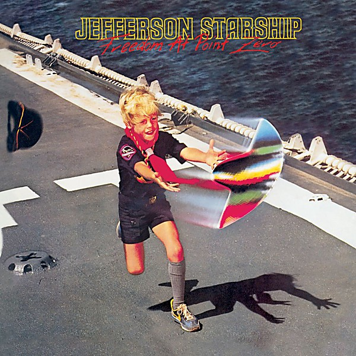

# Freedom At Point Zero

By **Jefferson Starship**

## Album Data

- **Catalog:** Beets
- **Format:** Digital, Album
- **Album:** Freedom At Point Zero
- **Artist:** Jefferson Starship
- **Albumartist:** Jefferson Starship
- **Genre:** Hard Rock
- **MusicBrainz Album Artist ID:** 
- **MusicBrainz Album ID:** 
- **MusicBrainz Release Group ID:** 
- **Year:** 1979
- **Catalog #:** 
- **Label:** 
- **Total Tracks:** 10

## Album Tracks

### Track 01 - Ride The Tiger

- **Artist:** Jefferson Starship
- **Format:** ALAC
- **Genre:** Southern Rock
- **Length:** 5:10
- **MusicBrainz Track ID:** 
- **Title:** Ride The Tiger
- **Track:** 01
- **Year:** 0000

### Track 02 - Caroline

- **Artist:** Jefferson Starship
- **Format:** ALAC
- **Genre:** Southern Rock
- **Length:** 7:30
- **MusicBrainz Track ID:** 
- **Title:** Caroline
- **Track:** 02
- **Year:** 0000

### Track 03 - Miracles

- **Artist:** Jefferson Starship
- **Format:** ALAC
- **Genre:** Soft Rock
- **Length:** 6:52
- **MusicBrainz Track ID:** 
- **Title:** Miracles
- **Track:** 03
- **Year:** 0000

### Track 04 - Play On Love

- **Artist:** Jefferson Starship
- **Format:** ALAC
- **Genre:** Soft Rock
- **Length:** 3:43
- **MusicBrainz Track ID:** 
- **Title:** Play On Love
- **Track:** 04
- **Year:** 0000

### Track 05 - Fast Buck Freddie

- **Artist:** Jefferson Starship
- **Format:** ALAC
- **Genre:** Psychedelic Rock
- **Length:** 3:30
- **MusicBrainz Track ID:** 
- **Title:** Fast Buck Freddie
- **Track:** 05
- **Year:** 0000

### Track 06 - With Your Love

- **Artist:** Jefferson Starship
- **Format:** ALAC
- **Genre:** Psychedelic Rock
- **Length:** 3:35
- **MusicBrainz Track ID:** 
- **Title:** With Your Love
- **Track:** 06
- **Year:** 0000

### Track 07 - St Charles

- **Artist:** Jefferson Starship
- **Format:** ALAC
- **Genre:** Psychedelic Rock
- **Length:** 6:41
- **MusicBrainz Track ID:** 
- **Title:** St Charles
- **Track:** 07
- **Year:** 0000

### Track 08 - Count On Me

- **Artist:** Jefferson Starship
- **Format:** ALAC
- **Genre:** Soft Rock
- **Length:** 3:15
- **MusicBrainz Track ID:** 
- **Title:** Count On Me
- **Track:** 08
- **Year:** 0000

### Track 09 - Runaway

- **Artist:** Jefferson Starship
- **Format:** ALAC
- **Genre:** Soft Rock
- **Length:** 5:22
- **MusicBrainz Track ID:** 
- **Title:** Runaway
- **Track:** 09
- **Year:** 0000

### Track 10 - Light The Sky On Fire

- **Artist:** Jefferson Starship
- **Format:** ALAC
- **Genre:** Soft Rock
- **Length:** 5:07
- **MusicBrainz Track ID:** 
- **Title:** Light The Sky On Fire
- **Track:** 10
- **Year:** 0000

## See also

- [Blows Against the Empire](Blows_Against_the_Empire.md)
- [Dragonfly](Dragonfly.md)
- [Jefferson Starship Live at Boston Music Hall](Jefferson_Starship_Live_at_Boston_Music_Hall.md)
- [Jefferson Starship - The Box Set Series](Jefferson_Starship_-_The_Box_Set_Series_2_3.md)
- [Jefferson Starship - The Box Set Series](Jefferson_Starship_-_The_Box_Set_Series_2.md)
- [Jefferson Starship - The Box Set Series](Jefferson_Starship_-_The_Box_Set_Series.md)
- [Red Octopus](Red_Octopus.md)
- [SNACK Benefit, Kezar Stadium March 23, 1975](SNACK_Benefit__Kezar_Stadium_March_23__1975.md)
- [Spitfire](Spitfire.md)
- [Winds of Change](Winds_of_Change.md)
- [CD: Freedom At Point Zero](../../CD/Jefferson_Starship/Freedom_At_Point_Zero.md)
- [CD: ](../../CD/Jefferson_Starship/Jefferson_Starship.md)
- [CD: Spitfire](../../CD/Jefferson_Starship/Spitfire.md)
- [CD: Winds Of Change](../../CD/Jefferson_Starship/Winds_Of_Change.md)
- [Roon: Blows Against The Empire](../../Roon/Jefferson_Starship/Blows_Against_The_Empire.md)
- [Roon: Deeper Space, Extra Virgin Sky](../../Roon/Jefferson_Starship/Deeper_Space__Extra_Virgin_Sky.md)
- [Roon: Dragon Fly](../../Roon/Jefferson_Starship/Dragon_Fly.md)
- [Roon: Modern Times](../../Roon/Jefferson_Starship/Modern_Times.md)
- [Roon: Red Octopus](../../Roon/Jefferson_Starship/Red_Octopus.md)
- [Roon: Spitfire (Remastered)](../../Roon/Jefferson_Starship/Spitfire_Remastered.md)
- [Roon: The Box Set Series](../../Roon/Jefferson_Starship/The_Box_Set_Series.md)
- [Roon: Timeless Classics Live](../../Roon/Jefferson_Starship/Timeless_Classics_Live.md)
- [Roon: Winds Of Change](../../Roon/Jefferson_Starship/Winds_Of_Change.md)
- [Vinyl: Count On Me / Show Yourself](../../Vinyl/Jefferson_Starship/Count_On_Me_-_Show_Yourself.md)
- [Vinyl: Crazy Feelin'](../../Vinyl/Jefferson_Starship/Crazy_Feelin.md)
- [Vinyl: ](../../Vinyl/Jefferson_Starship/Jefferson_Starship.md)
- [Vinyl: Light The Sky On Fire](../../Vinyl/Jefferson_Starship/Light_The_Sky_On_Fire.md)
- [Vinyl: Red Octopus](../../Vinyl/Jefferson_Starship/Red_Octopus.md)
