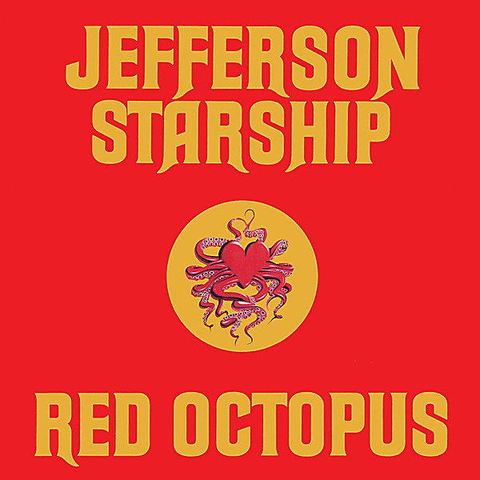

# Red Octopus

By **Jefferson Starship**

## Album Data

- **Catalog:** Beets
- **Format:** Digital, Album
- **Album:** Red Octopus
- **Artist:** Jefferson Starship
- **Albumartist:** Jefferson Starship
- **Genre:** Progressive Rock
- **MusicBrainz Album Artist ID:** [4854429b-66f7-41c0-a89c-030bb7ccf958](https://musicbrainz.org/artist/4854429b-66f7-41c0-a89c-030bb7ccf958)
- **MusicBrainz Album ID:** [a2078149-4cb0-34e3-a916-9f40eb597179](https://musicbrainz.org/release/a2078149-4cb0-34e3-a916-9f40eb597179)
- **MusicBrainz Release Group ID:** [aa34da12-16e6-390f-91f0-a33013699621](https://musicbrainz.org/release-group/aa34da12-16e6-390f-91f0-a33013699621)
- **Year:** 1975
- **Catalog #:** 
- **Label:** 
- **Total Tracks:** 16

## Album Tracks

### Track 01 - Ride The Tiger

- **Artist:** Jefferson Starship
- **Format:** ALAC
- **Genre:** Southern Rock
- **Length:** 5:29
- **MusicBrainz Track ID:** 
- **Title:** Ride The Tiger
- **Track:** 01
- **Year:** 1975

### Track 02 - Fast Buck Freddie

- **Artist:** Jefferson Starship
- **Format:** ALAC
- **Genre:** Psychedelic Rock
- **Length:** 3:49
- **MusicBrainz Track ID:** 
- **Title:** Fast Buck Freddie
- **Track:** 02
- **Year:** 1975

### Track 03 - Git Fiddler

- **Artist:** Jefferson Starship
- **Format:** ALAC
- **Genre:** Southern Rock
- **Length:** 3:47
- **MusicBrainz Track ID:** 
- **Title:** Git Fiddler
- **Track:** 03
- **Year:** 1975

### Track 04 - Play on Love

- **Artist:** Jefferson Starship
- **Format:** ALAC
- **Genre:** Soft Rock
- **Length:** 5:02
- **MusicBrainz Track ID:** 
- **Title:** Play on Love
- **Track:** 04
- **Year:** 1975

### Track 05 - I Want to See Another World

- **Artist:** Jefferson Starship
- **Format:** ALAC
- **Genre:** Psychedelic Rock
- **Length:** 5:46
- **MusicBrainz Track ID:** 
- **Title:** I Want to See Another World
- **Track:** 05
- **Year:** 1975

### Track 06 - Sweeter Than Honey

- **Artist:** Jefferson Starship
- **Format:** ALAC
- **Genre:** Psychedelic Rock
- **Length:** 4:54
- **MusicBrainz Track ID:** 
- **Title:** Sweeter Than Honey
- **Track:** 06
- **Year:** 1975

### Track 07 - Somebody to Love

- **Artist:** Jefferson Starship
- **Format:** ALAC
- **Genre:** Psychedelic Rock
- **Length:** 4:44
- **MusicBrainz Track ID:** 
- **Title:** Somebody to Love
- **Track:** 07
- **Year:** 1975

### Track 08 - Volunteers

- **Artist:** Jefferson Starship
- **Format:** ALAC
- **Genre:** Psychedelic Rock
- **Length:** 6:08
- **MusicBrainz Track ID:** 
- **Title:** Volunteers
- **Track:** 08
- **Year:** 1975

### Track 09 - Outro

- **Artist:** Jefferson Starship
- **Format:** ALAC
- **Genre:** Psychedelic Rock
- **Length:** 2:03
- **MusicBrainz Track ID:** 
- **Title:** Outro
- **Track:** 09
- **Year:** 1975

### Track 10 - Track 10

- **Artist:** Jefferson Starship
- **Format:** ALAC
- **Genre:** Psychedelic Rock
- **Length:** 6:12
- **MusicBrainz Track ID:** 
- **Title:** Track 10
- **Track:** 10
- **Year:** 1975

### Track 11 - Intro Poem

- **Artist:** Jefferson Starship
- **Format:** ALAC
- **Genre:** Psychedelic Rock
- **Length:** 3:21
- **MusicBrainz Track ID:** 
- **Title:** Intro Poem
- **Track:** 11
- **Year:** 1975

### Track 12 - Track 12

- **Artist:** Jefferson Starship
- **Format:** ALAC
- **Genre:** Psychedelic Rock
- **Length:** 4:49
- **MusicBrainz Track ID:** 
- **Title:** Track 12
- **Track:** 12
- **Year:** 1975

### Track 13 - Track 13

- **Artist:** Jefferson Starship
- **Format:** ALAC
- **Genre:** Psychedelic Rock
- **Length:** 4:46
- **MusicBrainz Track ID:** 
- **Title:** Track 13
- **Track:** 13
- **Year:** 1975

### Track 14 - Track 14

- **Artist:** Jefferson Starship
- **Format:** ALAC
- **Genre:** Psychedelic Rock
- **Length:** 4:56
- **MusicBrainz Track ID:** 
- **Title:** Track 14
- **Track:** 14
- **Year:** 1975

### Track 15 - Track 15

- **Artist:** Jefferson Starship
- **Format:** ALAC
- **Genre:** Psychedelic Rock
- **Length:** 3:34
- **MusicBrainz Track ID:** 
- **Title:** Track 15
- **Track:** 15
- **Year:** 1975

### Track 16 - Track 16

- **Artist:** Jefferson Starship
- **Format:** ALAC
- **Genre:** Psychedelic Rock
- **Length:** 1:48
- **MusicBrainz Track ID:** 
- **Title:** Track 16
- **Track:** 16
- **Year:** 1975

## See also

- [Blows Against the Empire](Blows_Against_the_Empire.md)
- [Dragonfly](Dragonfly.md)
- [Freedom At Point Zero](Freedom_At_Point_Zero.md)
- [Jefferson Starship Live at Boston Music Hall](Jefferson_Starship_Live_at_Boston_Music_Hall.md)
- [Jefferson Starship - The Box Set Series](Jefferson_Starship_-_The_Box_Set_Series_2_3.md)
- [Jefferson Starship - The Box Set Series](Jefferson_Starship_-_The_Box_Set_Series_2.md)
- [Jefferson Starship - The Box Set Series](Jefferson_Starship_-_The_Box_Set_Series.md)
- [SNACK Benefit, Kezar Stadium March 23, 1975](SNACK_Benefit__Kezar_Stadium_March_23__1975.md)
- [Spitfire](Spitfire.md)
- [Winds of Change](Winds_of_Change.md)
- [CD: Freedom At Point Zero](../../CD/Jefferson_Starship/Freedom_At_Point_Zero.md)
- [CD: ](../../CD/Jefferson_Starship/Jefferson_Starship.md)
- [CD: Spitfire](../../CD/Jefferson_Starship/Spitfire.md)
- [CD: Winds Of Change](../../CD/Jefferson_Starship/Winds_Of_Change.md)
- [Roon: Blows Against The Empire](../../Roon/Jefferson_Starship/Blows_Against_The_Empire.md)
- [Roon: Deeper Space, Extra Virgin Sky](../../Roon/Jefferson_Starship/Deeper_Space__Extra_Virgin_Sky.md)
- [Roon: Dragon Fly](../../Roon/Jefferson_Starship/Dragon_Fly.md)
- [Roon: Modern Times](../../Roon/Jefferson_Starship/Modern_Times.md)
- [Roon: Red Octopus](../../Roon/Jefferson_Starship/Red_Octopus.md)
- [Roon: Spitfire (Remastered)](../../Roon/Jefferson_Starship/Spitfire_Remastered.md)
- [Roon: The Box Set Series](../../Roon/Jefferson_Starship/The_Box_Set_Series.md)
- [Roon: Timeless Classics Live](../../Roon/Jefferson_Starship/Timeless_Classics_Live.md)
- [Roon: Winds Of Change](../../Roon/Jefferson_Starship/Winds_Of_Change.md)
- [Vinyl: Count On Me / Show Yourself](../../Vinyl/Jefferson_Starship/Count_On_Me_-_Show_Yourself.md)
- [Vinyl: Crazy Feelin'](../../Vinyl/Jefferson_Starship/Crazy_Feelin.md)
- [Vinyl: ](../../Vinyl/Jefferson_Starship/Jefferson_Starship.md)
- [Vinyl: Light The Sky On Fire](../../Vinyl/Jefferson_Starship/Light_The_Sky_On_Fire.md)
- [Vinyl: Red Octopus](../../Vinyl/Jefferson_Starship/Red_Octopus.md)
