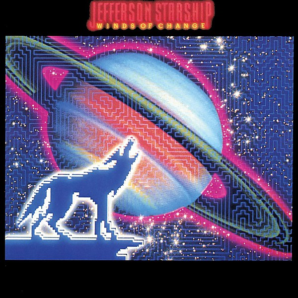

# Winds of Change

By **Jefferson Starship**

## Album Data

- **Catalog:** Beets
- **Format:** Digital, Album
- **Album:** Winds of Change
- **Artist:** Jefferson Starship
- **Albumartist:** Jefferson Starship
- **Genre:** Rock
- **MusicBrainz Album Artist ID:** [4854429b-66f7-41c0-a89c-030bb7ccf958](https://musicbrainz.org/artist/4854429b-66f7-41c0-a89c-030bb7ccf958)
- **MusicBrainz Album ID:** [764515ac-a08b-4cfa-8354-5ffcc3ff0f9c](https://musicbrainz.org/release/764515ac-a08b-4cfa-8354-5ffcc3ff0f9c)
- **MusicBrainz Release Group ID:** [5a9e9e1f-e2a2-3b56-8c33-000bb15f1182](https://musicbrainz.org/release-group/5a9e9e1f-e2a2-3b56-8c33-000bb15f1182)
- **Year:** 1982
- **Catalog #:** PCD1-4372
- **Label:** RCA
- **Total Tracks:** 09

## Album Tracks

### Track 01 - Winds of Change

- **Artist:** Jefferson Starship
- **Format:** ALAC
- **Genre:** Hard Rock
- **Length:** 3:53
- **MusicBrainz Track ID:** [3066e5fe-bafa-4bca-89ba-d25cf12eeca3](https://musicbrainz.org/recording/3066e5fe-bafa-4bca-89ba-d25cf12eeca3)
- **Title:** Winds of Change
- **Track:** 01
- **Year:** 1982

### Track 02 - Keep on Dreamin'

- **Artist:** Jefferson Starship
- **Format:** ALAC
- **Genre:** Rock
- **Length:** 5:03
- **MusicBrainz Track ID:** [1dcbe0b8-e878-4235-8cab-bc4f25fa5ce9](https://musicbrainz.org/recording/1dcbe0b8-e878-4235-8cab-bc4f25fa5ce9)
- **Title:** Keep on Dreamin'
- **Track:** 02
- **Year:** 1982

### Track 03 - Be My Lady

- **Artist:** Jefferson Starship
- **Format:** ALAC
- **Genre:** Rock
- **Length:** 3:53
- **MusicBrainz Track ID:** [46bc03a9-639e-4f0f-8d60-cf9668ee5b36](https://musicbrainz.org/recording/46bc03a9-639e-4f0f-8d60-cf9668ee5b36)
- **Title:** Be My Lady
- **Track:** 03
- **Year:** 1982

### Track 04 - I Will Stay

- **Artist:** Jefferson Starship
- **Format:** ALAC
- **Genre:** Rock
- **Length:** 4:00
- **MusicBrainz Track ID:** [4135416d-240b-4a2b-bf03-6a9d0b6e1306](https://musicbrainz.org/recording/4135416d-240b-4a2b-bf03-6a9d0b6e1306)
- **Title:** I Will Stay
- **Track:** 04
- **Year:** 1982

### Track 05 - Out of Control

- **Artist:** Jefferson Starship
- **Format:** ALAC
- **Genre:** Rock
- **Length:** 2:55
- **MusicBrainz Track ID:** [7a52c363-9e2a-4df4-8314-7bd2a1c36016](https://musicbrainz.org/recording/7a52c363-9e2a-4df4-8314-7bd2a1c36016)
- **Title:** Out of Control
- **Track:** 05
- **Year:** 1982

### Track 06 - Can't Find Love

- **Artist:** Jefferson Starship
- **Format:** ALAC
- **Genre:** Rock
- **Length:** 4:49
- **MusicBrainz Track ID:** [e231e4f9-89ab-451c-8ea9-4d50315a056f](https://musicbrainz.org/recording/e231e4f9-89ab-451c-8ea9-4d50315a056f)
- **Title:** Can't Find Love
- **Track:** 06
- **Year:** 1982

### Track 07 - Black Widow

- **Artist:** Jefferson Starship
- **Format:** ALAC
- **Genre:** Rock
- **Length:** 5:02
- **MusicBrainz Track ID:** [fc23118c-eef0-4eae-ac28-f23dd22a7a07](https://musicbrainz.org/recording/fc23118c-eef0-4eae-ac28-f23dd22a7a07)
- **Title:** Black Widow
- **Track:** 07
- **Year:** 1982

### Track 08 - I Came Back From the Jaws of the Dragon

- **Artist:** Jefferson Starship
- **Format:** ALAC
- **Genre:** Rock
- **Length:** 5:59
- **MusicBrainz Track ID:** [048adb5f-68e1-4a3c-9cd1-f115ca248052](https://musicbrainz.org/recording/048adb5f-68e1-4a3c-9cd1-f115ca248052)
- **Title:** I Came Back From the Jaws of the Dragon
- **Track:** 08
- **Year:** 1982

### Track 09 - Quit Wasting Time

- **Artist:** Jefferson Starship
- **Format:** ALAC
- **Genre:** Pop
- **Length:** 5:01
- **MusicBrainz Track ID:** [c196476c-d2bd-4c86-9d0f-181f4c17862b](https://musicbrainz.org/recording/c196476c-d2bd-4c86-9d0f-181f4c17862b)
- **Title:** Quit Wasting Time
- **Track:** 09
- **Year:** 1982

## See also

- [Blows Against the Empire](Blows_Against_the_Empire.md)
- [Dragonfly](Dragonfly.md)
- [Freedom At Point Zero](Freedom_At_Point_Zero.md)
- [Jefferson Starship Live at Boston Music Hall](Jefferson_Starship_Live_at_Boston_Music_Hall.md)
- [Jefferson Starship - The Box Set Series](Jefferson_Starship_-_The_Box_Set_Series_2_3.md)
- [Jefferson Starship - The Box Set Series](Jefferson_Starship_-_The_Box_Set_Series_2.md)
- [Jefferson Starship - The Box Set Series](Jefferson_Starship_-_The_Box_Set_Series.md)
- [Red Octopus](Red_Octopus.md)
- [SNACK Benefit, Kezar Stadium March 23, 1975](SNACK_Benefit__Kezar_Stadium_March_23__1975.md)
- [Spitfire](Spitfire.md)
- [CD: Freedom At Point Zero](../../CD/Jefferson_Starship/Freedom_At_Point_Zero.md)
- [CD: ](../../CD/Jefferson_Starship/Jefferson_Starship.md)
- [CD: Spitfire](../../CD/Jefferson_Starship/Spitfire.md)
- [CD: Winds Of Change](../../CD/Jefferson_Starship/Winds_Of_Change.md)
- [Roon: Blows Against The Empire](../../Roon/Jefferson_Starship/Blows_Against_The_Empire.md)
- [Roon: Deeper Space, Extra Virgin Sky](../../Roon/Jefferson_Starship/Deeper_Space__Extra_Virgin_Sky.md)
- [Roon: Dragon Fly](../../Roon/Jefferson_Starship/Dragon_Fly.md)
- [Roon: Modern Times](../../Roon/Jefferson_Starship/Modern_Times.md)
- [Roon: Red Octopus](../../Roon/Jefferson_Starship/Red_Octopus.md)
- [Roon: Spitfire (Remastered)](../../Roon/Jefferson_Starship/Spitfire_Remastered.md)
- [Roon: The Box Set Series](../../Roon/Jefferson_Starship/The_Box_Set_Series.md)
- [Roon: Timeless Classics Live](../../Roon/Jefferson_Starship/Timeless_Classics_Live.md)
- [Roon: Winds Of Change](../../Roon/Jefferson_Starship/Winds_Of_Change.md)
- [Vinyl: Count On Me / Show Yourself](../../Vinyl/Jefferson_Starship/Count_On_Me_-_Show_Yourself.md)
- [Vinyl: Crazy Feelin'](../../Vinyl/Jefferson_Starship/Crazy_Feelin.md)
- [Vinyl: ](../../Vinyl/Jefferson_Starship/Jefferson_Starship.md)
- [Vinyl: Light The Sky On Fire](../../Vinyl/Jefferson_Starship/Light_The_Sky_On_Fire.md)
- [Vinyl: Red Octopus](../../Vinyl/Jefferson_Starship/Red_Octopus.md)
