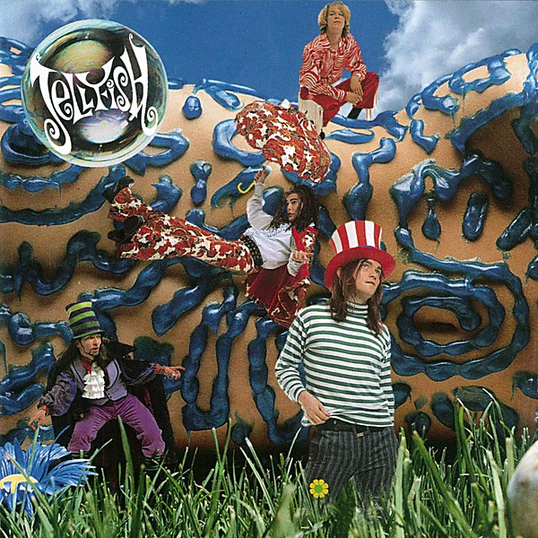

# Bellybutton

By **Jellyfish**

## Album Data

- **Catalog:** Beets
- **Format:** Digital, Album
- **Album:** Bellybutton
- **Artist:** Jellyfish
- **Albumartist:** Jellyfish
- **Genre:** Indie Pop
- **MusicBrainz Album Artist ID:** [e3087942-a74b-4623-9349-d22cde0a9ad5](https://musicbrainz.org/artist/e3087942-a74b-4623-9349-d22cde0a9ad5)
- **MusicBrainz Album ID:** [f659cee3-e3de-4646-95f2-0dfedf01c359](https://musicbrainz.org/release/f659cee3-e3de-4646-95f2-0dfedf01c359)
- **MusicBrainz Release Group ID:** [4bebb944-9eba-3763-9037-43b5f5fbd7f8](https://musicbrainz.org/release-group/4bebb944-9eba-3763-9037-43b5f5fbd7f8)
- **Year:** 1990
- **Catalog #:** 
- **Label:** 
- **Total Tracks:** 16

## Album Tracks

### Track 01 - The Man I Used To Be (Demo)

- **Artist:** Jellyfish
- **Format:** ALAC
- **Genre:** Indie Pop
- **Length:** 4:24
- **MusicBrainz Track ID:** 
- **Title:** The Man I Used To Be (Demo)
- **Track:** 01
- **Year:** 2015

### Track 02 - The King Is Half-Undressed (Demo)

- **Artist:** Jellyfish
- **Format:** ALAC
- **Genre:** Indie Pop
- **Length:** 3:42
- **MusicBrainz Track ID:** 
- **Title:** The King Is Half-Undressed (Demo)
- **Track:** 02
- **Year:** 2015

### Track 03 - I Wanna Stay Home (Demo)

- **Artist:** Jellyfish
- **Format:** ALAC
- **Genre:** Indie Pop
- **Length:** 4:10
- **MusicBrainz Track ID:** 
- **Title:** I Wanna Stay Home (Demo)
- **Track:** 03
- **Year:** 2015

### Track 04 - She Still Loves Him (Demo)

- **Artist:** Jellyfish
- **Format:** ALAC
- **Genre:** Indie Pop
- **Length:** 4:28
- **MusicBrainz Track ID:** 
- **Title:** She Still Loves Him (Demo)
- **Track:** 04
- **Year:** 2015

### Track 05 - All I Want Is Everything (Demo)

- **Artist:** Jellyfish
- **Format:** ALAC
- **Genre:** Indie Pop
- **Length:** 3:13
- **MusicBrainz Track ID:** 
- **Title:** All I Want Is Everything (Demo)
- **Track:** 05
- **Year:** 2015

### Track 06 - Now She Knows She's Wrong (Demo)

- **Artist:** Jellyfish
- **Format:** ALAC
- **Genre:** Indie Pop
- **Length:** 2:16
- **MusicBrainz Track ID:** 
- **Title:** Now She Knows She's Wrong (Demo)
- **Track:** 06
- **Year:** 2015

### Track 07 - Bedspring Kiss (Demo)

- **Artist:** Jellyfish
- **Format:** ALAC
- **Genre:** Indie Pop
- **Length:** 4:44
- **MusicBrainz Track ID:** 
- **Title:** Bedspring Kiss (Demo)
- **Track:** 07
- **Year:** 2015

### Track 08 - Baby's Coming Back (Demo)

- **Artist:** Jellyfish
- **Format:** ALAC
- **Genre:** Indie Pop
- **Length:** 2:56
- **MusicBrainz Track ID:** 
- **Title:** Baby's Coming Back (Demo)
- **Track:** 08
- **Year:** 2015

### Track 09 - Calling Sarah (Demo)

- **Artist:** Jellyfish
- **Format:** ALAC
- **Genre:** Indie Pop
- **Length:** 4:49
- **MusicBrainz Track ID:** 
- **Title:** Calling Sarah (Demo)
- **Track:** 09
- **Year:** 2015

### Track 10 - Deliver (Demo)

- **Artist:** Jellyfish
- **Format:** ALAC
- **Genre:** Indie Pop
- **Length:** 3:08
- **MusicBrainz Track ID:** 
- **Title:** Deliver (Demo)
- **Track:** 10
- **Year:** 2015

### Track 11 - Queen Of The U.S.A. (Demo)

- **Artist:** Jellyfish
- **Format:** ALAC
- **Genre:** Indie Pop
- **Length:** 5:13
- **MusicBrainz Track ID:** 
- **Title:** Queen Of The U.S.A. (Demo)
- **Track:** 11
- **Year:** 2015

### Track 12 - Always Be My Girl (Demo)

- **Artist:** Jellyfish
- **Format:** ALAC
- **Genre:** Indie Pop
- **Length:** 3:36
- **MusicBrainz Track ID:** 
- **Title:** Always Be My Girl (Demo)
- **Track:** 12
- **Year:** 2015

### Track 13 - Let This Dream Never End (Demo)

- **Artist:** Jellyfish
- **Format:** ALAC
- **Genre:** Indie Pop
- **Length:** 3:59
- **MusicBrainz Track ID:** 
- **Title:** Let This Dream Never End (Demo)
- **Track:** 13
- **Year:** 2015

### Track 14 - Season Of The Witch (Demo)

- **Artist:** Jellyfish
- **Format:** ALAC
- **Genre:** Indie Pop
- **Length:** 4:24
- **MusicBrainz Track ID:** 
- **Title:** Season Of The Witch (Demo)
- **Track:** 14
- **Year:** 2015

### Track 15 - That Girl's A Man (Demo)

- **Artist:** Jellyfish
- **Format:** ALAC
- **Genre:** Indie Pop
- **Length:** 3:42
- **MusicBrainz Track ID:** 
- **Title:** That Girl's A Man (Demo)
- **Track:** 15
- **Year:** 2015

### Track 16 - Bye Bye Bye (Demo)

- **Artist:** Jellyfish
- **Format:** ALAC
- **Genre:** Indie Pop
- **Length:** 3:47
- **MusicBrainz Track ID:** 
- **Title:** Bye Bye Bye (Demo)
- **Track:** 16
- **Year:** 2015

## See also

- [Bellybutton Demos](Bellybutton_Demos.md)
- [Bellybutton Reissue](Bellybutton_Reissue.md)
- [Fan Club [Disc 1] - Bellybutton Tour](Fan_Club_[Disc_1]_-_Bellybutton_Tour.md)
- [Fan Club [Disc 1] - The Bellybutton Demos, 1988-'89](Fan_Club_[Disc_1]_-_The_Bellybutton_Demos__1988-89.md)
- [Fan Club](Fan_Club.md)
- [Fan Club_The Spilt Milk Tour [Disc 4]](Fan_Club_The_Spilt_Milk_Tour_[Disc_4].md)
- [Live At Bogart's](Live_At_Bogarts.md)
- [Radio Jellyfish](Radio_Jellyfish.md)
- [Spilt Milk](Spilt_Milk.md)
- [Stack-A-Tracks](Stack-A-Tracks.md)
- [CD: Bellybutton - Deluxe Edition (Disc 2)](../../CD/Jellyfish/Bellybutton_-_Deluxe_Edition_Disc_2.md)
- [CD: Bellybutton (Disc 1)](../../CD/Jellyfish/Bellybutton_Disc_1.md)
- [CD: ](../../CD/Jellyfish/Jellyfish.md)
- [Roon: Bellybutton Demos (Demo)](../../Roon/Jellyfish/Bellybutton_Demos_Demo.md)
- [Roon: Bellybutton](../../Roon/Jellyfish/Bellybutton.md)
- [Roon: Spilt Milk](../../Roon/Jellyfish/Spilt_Milk.md)
- [Vinyl: Bellybutton](../../Vinyl/Jellyfish/Bellybutton.md)
- [Vinyl: ](../../Vinyl/Jellyfish/Jellyfish.md)
- [Vinyl: Radio Jellyfish](../../Vinyl/Jellyfish/Radio_Jellyfish.md)
