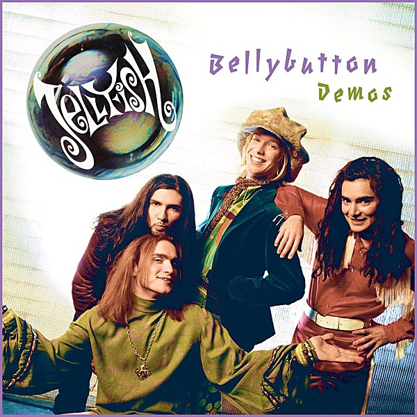

# Bellybutton Demos

By **Jellyfish**

## Album Data

- **Catalog:** Beets
- **Format:** Digital, Album
- **Album:** Bellybutton Demos
- **Artist:** Jellyfish
- **Albumartist:** Jellyfish
- **Genre:** Indie Pop
- **MusicBrainz Album Artist ID:** 
- **MusicBrainz Album ID:** 
- **MusicBrainz Release Group ID:** 
- **Year:** 2015
- **Catalog #:** 
- **Label:** 
- **Total Tracks:** 20

## Album Tracks

### Track 01 - The Man I Used To Be

- **Artist:** Jellyfish
- **Format:** ALAC
- **Genre:** Indie Rock
- **Length:** 4:33
- **MusicBrainz Track ID:** 
- **Title:** The Man I Used To Be
- **Track:** 01
- **Year:** 2015

### Track 02 - That Is Why

- **Artist:** Jellyfish
- **Format:** ALAC
- **Genre:** Psychedelic Pop
- **Length:** 4:16
- **MusicBrainz Track ID:** 
- **Title:** That Is Why
- **Track:** 02
- **Year:** 2015

### Track 03 - The King Is Half - Undressed

- **Artist:** Jellyfish
- **Format:** ALAC
- **Genre:** Indie Pop
- **Length:** 3:46
- **MusicBrainz Track ID:** 
- **Title:** The King Is Half - Undressed
- **Track:** 03
- **Year:** 2015

### Track 04 - I Wanna Stay Home

- **Artist:** Jellyfish
- **Format:** ALAC
- **Genre:** Indie Pop
- **Length:** 3:52
- **MusicBrainz Track ID:** 
- **Title:** I Wanna Stay Home
- **Track:** 04
- **Year:** 2015

### Track 05 - She Still Loves Him

- **Artist:** Jellyfish
- **Format:** ALAC
- **Genre:** Indie Pop
- **Length:** 4:31
- **MusicBrainz Track ID:** 
- **Title:** She Still Loves Him
- **Track:** 05
- **Year:** 2015

### Track 06 - All I Want Is Everything

- **Artist:** Jellyfish
- **Format:** ALAC
- **Genre:** Power Pop
- **Length:** 3:44
- **MusicBrainz Track ID:** 
- **Title:** All I Want Is Everything
- **Track:** 06
- **Year:** 2015

### Track 07 - Now She Knows She's Wrong

- **Artist:** Jellyfish
- **Format:** ALAC
- **Genre:** Power Pop
- **Length:** 2:35
- **MusicBrainz Track ID:** 
- **Title:** Now She Knows She's Wrong
- **Track:** 07
- **Year:** 2015

### Track 08 - Bedspring Kiss

- **Artist:** Jellyfish
- **Format:** ALAC
- **Genre:** Soft Rock
- **Length:** 5:03
- **MusicBrainz Track ID:** 
- **Title:** Bedspring Kiss
- **Track:** 08
- **Year:** 2015

### Track 09 - Baby's Coming Back

- **Artist:** Jellyfish
- **Format:** ALAC
- **Genre:** Power Pop
- **Length:** 2:56
- **MusicBrainz Track ID:** 
- **Title:** Baby's Coming Back
- **Track:** 09
- **Year:** 2015

### Track 10 - Calling Sarah

- **Artist:** Jellyfish
- **Format:** ALAC
- **Genre:** Power Pop
- **Length:** 4:05
- **MusicBrainz Track ID:** 
- **Title:** Calling Sarah
- **Track:** 10
- **Year:** 2015

### Track 11 - The King Is Half Undressed (Live)

- **Artist:** Jellyfish
- **Format:** ALAC
- **Genre:** Glam Rock
- **Length:** 3:51
- **MusicBrainz Track ID:** 
- **Title:** The King Is Half Undressed (Live)
- **Track:** 11
- **Year:** 2015

### Track 12 - Sugar And Spice (Live)

- **Artist:** Jellyfish
- **Format:** ALAC
- **Genre:** Indie Pop
- **Length:** 2:16
- **MusicBrainz Track ID:** 
- **Title:** Sugar And Spice (Live)
- **Track:** 12
- **Year:** 2015

### Track 13 - Mr. Late (Live)

- **Artist:** Jellyfish
- **Format:** ALAC
- **Genre:** Indie Pop
- **Length:** 3:41
- **MusicBrainz Track ID:** 
- **Title:** Mr. Late (Live)
- **Track:** 13
- **Year:** 2015

### Track 14 - All I Want Is Everything (Live)

- **Artist:** Jellyfish
- **Format:** ALAC
- **Genre:** Indie Pop
- **Length:** 4:27
- **MusicBrainz Track ID:** 
- **Title:** All I Want Is Everything (Live)
- **Track:** 14
- **Year:** 2015

### Track 15 - Jet (Live)

- **Artist:** Jellyfish
- **Format:** ALAC
- **Genre:** Power Pop
- **Length:** 3:20
- **MusicBrainz Track ID:** 
- **Title:** Jet (Live)
- **Track:** 15
- **Year:** 2015

### Track 16 - The King Is Half Un-Dressed (Live)

- **Artist:** Jellyfish
- **Format:** ALAC
- **Genre:** Indie Pop
- **Length:** 3:38
- **MusicBrainz Track ID:** 
- **Title:** The King Is Half Un-Dressed (Live)
- **Track:** 16
- **Year:** 2015

### Track 17 - Baby's Coming Back (Live)

- **Artist:** Jellyfish
- **Format:** ALAC
- **Genre:** Indie Pop
- **Length:** 3:00
- **MusicBrainz Track ID:** 
- **Title:** Baby's Coming Back (Live)
- **Track:** 17
- **Year:** 2015

### Track 18 - I Wanna Stay Home (Live)

- **Artist:** Jellyfish
- **Format:** ALAC
- **Genre:** Indie Pop
- **Length:** 4:05
- **MusicBrainz Track ID:** 
- **Title:** I Wanna Stay Home (Live)
- **Track:** 18
- **Year:** 2015

### Track 19 - She Still Loves Him (Live)

- **Artist:** Jellyfish
- **Format:** ALAC
- **Genre:** Indie Pop
- **Length:** 3:49
- **MusicBrainz Track ID:** 
- **Title:** She Still Loves Him (Live)
- **Track:** 19
- **Year:** 2015

### Track 20 - All I Want Is Everything (Live)

- **Artist:** Jellyfish
- **Format:** ALAC
- **Genre:** Indie Pop
- **Length:** 4:24
- **MusicBrainz Track ID:** 
- **Title:** All I Want Is Everything (Live)
- **Track:** 20
- **Year:** 2015

## See also

- [Bellybutton](Bellybutton.md)
- [Bellybutton Reissue](Bellybutton_Reissue.md)
- [Fan Club [Disc 1] - Bellybutton Tour](Fan_Club_[Disc_1]_-_Bellybutton_Tour.md)
- [Fan Club [Disc 1] - The Bellybutton Demos, 1988-'89](Fan_Club_[Disc_1]_-_The_Bellybutton_Demos__1988-89.md)
- [Fan Club](Fan_Club.md)
- [Fan Club_The Spilt Milk Tour [Disc 4]](Fan_Club_The_Spilt_Milk_Tour_[Disc_4].md)
- [Live At Bogart's](Live_At_Bogarts.md)
- [Radio Jellyfish](Radio_Jellyfish.md)
- [Spilt Milk](Spilt_Milk.md)
- [Stack-A-Tracks](Stack-A-Tracks.md)
- [CD: Bellybutton - Deluxe Edition (Disc 2)](../../CD/Jellyfish/Bellybutton_-_Deluxe_Edition_Disc_2.md)
- [CD: Bellybutton (Disc 1)](../../CD/Jellyfish/Bellybutton_Disc_1.md)
- [CD: ](../../CD/Jellyfish/Jellyfish.md)
- [Roon: Bellybutton Demos (Demo)](../../Roon/Jellyfish/Bellybutton_Demos_Demo.md)
- [Roon: Bellybutton](../../Roon/Jellyfish/Bellybutton.md)
- [Roon: Spilt Milk](../../Roon/Jellyfish/Spilt_Milk.md)
- [Vinyl: Bellybutton](../../Vinyl/Jellyfish/Bellybutton.md)
- [Vinyl: ](../../Vinyl/Jellyfish/Jellyfish.md)
- [Vinyl: Radio Jellyfish](../../Vinyl/Jellyfish/Radio_Jellyfish.md)
