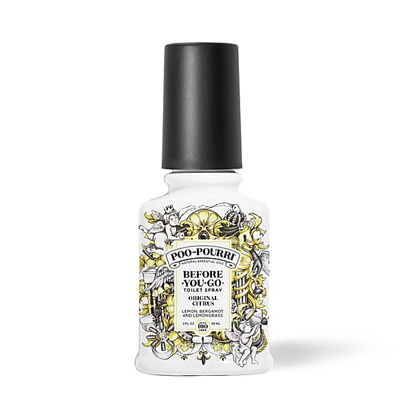

# Bellybutton Reissue

By **Jellyfish**

## Album Data

- **Catalog:** Beets
- **Format:** Digital, Album
- **Album:** Bellybutton Reissue
- **Artist:** Jellyfish
- **Albumartist:** Jellyfish
- **Genre:** Indie Pop
- **MusicBrainz Album Artist ID:** 
- **MusicBrainz Album ID:** 
- **MusicBrainz Release Group ID:** 
- **Year:** 2015
- **Catalog #:** 
- **Label:** 
- **Total Tracks:** 24

## Album Tracks

### Track 01 - MTV Top Of The Hour

- **Artist:** Jellyfish
- **Format:** ALAC
- **Genre:** Indie Pop
- **Length:** 0:22
- **MusicBrainz Track ID:** 
- **Title:** MTV Top Of The Hour
- **Track:** 01
- **Year:** 2002

### Track 02 - Untitled

- **Artist:** Jellyfish
- **Format:** ALAC
- **Genre:** Indie Pop
- **Length:** 0:32
- **MusicBrainz Track ID:** 
- **Title:** Untitled
- **Track:** 02
- **Year:** 2002

### Track 03 - The King Is Half Undressed

- **Artist:** Jellyfish
- **Format:** ALAC
- **Genre:** Glam Rock
- **Length:** 3:51
- **MusicBrainz Track ID:** 
- **Title:** The King Is Half Undressed
- **Track:** 03
- **Year:** 2002

### Track 04 - Sugar And Spice

- **Artist:** Jellyfish
- **Format:** ALAC
- **Genre:** Indie Pop
- **Length:** 2:16
- **MusicBrainz Track ID:** 
- **Title:** Sugar And Spice
- **Track:** 04
- **Year:** 2002

### Track 05 - Untitled

- **Artist:** Jellyfish
- **Format:** ALAC
- **Genre:** Indie Pop
- **Length:** 0:21
- **MusicBrainz Track ID:** 
- **Title:** Untitled
- **Track:** 05
- **Year:** 2002

### Track 06 - Two All Beef Patties

- **Artist:** Jellyfish
- **Format:** ALAC
- **Genre:** Indie Pop
- **Length:** 0:17
- **MusicBrainz Track ID:** 
- **Title:** Two All Beef Patties
- **Track:** 06
- **Year:** 2002

### Track 07 - Mr Late

- **Artist:** Jellyfish
- **Format:** ALAC
- **Genre:** Indie Pop
- **Length:** 3:40
- **MusicBrainz Track ID:** 
- **Title:** Mr Late
- **Track:** 07
- **Year:** 2002

### Track 08 - No Matter What

- **Artist:** Jellyfish
- **Format:** ALAC
- **Genre:** Indie Pop
- **Length:** 2:45
- **MusicBrainz Track ID:** 
- **Title:** No Matter What
- **Track:** 08
- **Year:** 2002

### Track 09 - All I Want Is Everything

- **Artist:** Jellyfish
- **Format:** ALAC
- **Genre:** Power Pop
- **Length:** 4:27
- **MusicBrainz Track ID:** 
- **Title:** All I Want Is Everything
- **Track:** 09
- **Year:** 2002

### Track 10 - Untitled

- **Artist:** Jellyfish
- **Format:** ALAC
- **Genre:** Indie Pop
- **Length:** 1:09
- **MusicBrainz Track ID:** 
- **Title:** Untitled
- **Track:** 10
- **Year:** 2002

### Track 11 - Hold Your Head Up / Hello

- **Artist:** Jellyfish
- **Format:** ALAC
- **Genre:** Indie Pop
- **Length:** 5:26
- **MusicBrainz Track ID:** 
- **Title:** Hold Your Head Up / Hello
- **Track:** 11
- **Year:** 2002

### Track 12 - Calling Sarah

- **Artist:** Jellyfish
- **Format:** ALAC
- **Genre:** Power Pop
- **Length:** 4:08
- **MusicBrainz Track ID:** 
- **Title:** Calling Sarah
- **Track:** 12
- **Year:** 2002

### Track 13 - She Still Loves Him

- **Artist:** Jellyfish
- **Format:** ALAC
- **Genre:** Indie Pop
- **Length:** 4:10
- **MusicBrainz Track ID:** 
- **Title:** She Still Loves Him
- **Track:** 13
- **Year:** 2002

### Track 14 - Will You Marry Me

- **Artist:** Jellyfish
- **Format:** ALAC
- **Genre:** Indie Pop
- **Length:** 6:43
- **MusicBrainz Track ID:** 
- **Title:** Will You Marry Me
- **Track:** 14
- **Year:** 2002

### Track 15 - Baby Come Back / Baby's Coming Back

- **Artist:** Jellyfish
- **Format:** ALAC
- **Genre:** Indie Pop
- **Length:** 4:27
- **MusicBrainz Track ID:** 
- **Title:** Baby Come Back / Baby's Coming Back
- **Track:** 15
- **Year:** 2002

### Track 16 - Now She Knows She's Wrong

- **Artist:** Jellyfish
- **Format:** ALAC
- **Genre:** Power Pop
- **Length:** 2:52
- **MusicBrainz Track ID:** 
- **Title:** Now She Knows She's Wrong
- **Track:** 16
- **Year:** 2002

### Track 17 - Let 'Em In / That Is Why

- **Artist:** Jellyfish
- **Format:** ALAC
- **Genre:** Indie Pop
- **Length:** 5:14
- **MusicBrainz Track ID:** 
- **Title:** Let 'Em In / That Is Why
- **Track:** 17
- **Year:** 2002

### Track 18 - Jet

- **Artist:** Jellyfish
- **Format:** ALAC
- **Genre:** Indie Pop
- **Length:** 3:20
- **MusicBrainz Track ID:** 
- **Title:** Jet
- **Track:** 18
- **Year:** 2002

### Track 19 - Untitled

- **Artist:** Jellyfish
- **Format:** ALAC
- **Genre:** Indie Pop
- **Length:** 0:39
- **MusicBrainz Track ID:** 
- **Title:** Untitled
- **Track:** 19
- **Year:** 2002

### Track 20 - The King Is Half Undressed

- **Artist:** Jellyfish
- **Format:** ALAC
- **Genre:** Glam Rock
- **Length:** 3:40
- **MusicBrainz Track ID:** 
- **Title:** The King Is Half Undressed
- **Track:** 20
- **Year:** 2002

### Track 21 - Baby's Coming Back

- **Artist:** Jellyfish
- **Format:** ALAC
- **Genre:** Power Pop
- **Length:** 2:59
- **MusicBrainz Track ID:** 
- **Title:** Baby's Coming Back
- **Track:** 21
- **Year:** 2002

### Track 22 - I Wanna Stay Home

- **Artist:** Jellyfish
- **Format:** ALAC
- **Genre:** Indie Pop
- **Length:** 4:07
- **MusicBrainz Track ID:** 
- **Title:** I Wanna Stay Home
- **Track:** 22
- **Year:** 2002

### Track 23 - She Still Loves Him

- **Artist:** Jellyfish
- **Format:** ALAC
- **Genre:** Indie Pop
- **Length:** 3:53
- **MusicBrainz Track ID:** 
- **Title:** She Still Loves Him
- **Track:** 23
- **Year:** 2002

### Track 24 - All I Want Is Everything

- **Artist:** Jellyfish
- **Format:** ALAC
- **Genre:** Power Pop
- **Length:** 4:24
- **MusicBrainz Track ID:** 
- **Title:** All I Want Is Everything
- **Track:** 24
- **Year:** 2002

## See also

- [Bellybutton Demos](Bellybutton_Demos.md)
- [Bellybutton](Bellybutton.md)
- [Fan Club [Disc 1] - Bellybutton Tour](Fan_Club_[Disc_1]_-_Bellybutton_Tour.md)
- [Fan Club [Disc 1] - The Bellybutton Demos, 1988-'89](Fan_Club_[Disc_1]_-_The_Bellybutton_Demos__1988-89.md)
- [Fan Club](Fan_Club.md)
- [Fan Club_The Spilt Milk Tour [Disc 4]](Fan_Club_The_Spilt_Milk_Tour_[Disc_4].md)
- [Live At Bogart's](Live_At_Bogarts.md)
- [Radio Jellyfish](Radio_Jellyfish.md)
- [Spilt Milk](Spilt_Milk.md)
- [Stack-A-Tracks](Stack-A-Tracks.md)
- [CD: Bellybutton - Deluxe Edition (Disc 2)](../../CD/Jellyfish/Bellybutton_-_Deluxe_Edition_Disc_2.md)
- [CD: Bellybutton (Disc 1)](../../CD/Jellyfish/Bellybutton_Disc_1.md)
- [CD: ](../../CD/Jellyfish/Jellyfish.md)
- [Roon: Bellybutton Demos (Demo)](../../Roon/Jellyfish/Bellybutton_Demos_Demo.md)
- [Roon: Bellybutton](../../Roon/Jellyfish/Bellybutton.md)
- [Roon: Spilt Milk](../../Roon/Jellyfish/Spilt_Milk.md)
- [Vinyl: Bellybutton](../../Vinyl/Jellyfish/Bellybutton.md)
- [Vinyl: ](../../Vinyl/Jellyfish/Jellyfish.md)
- [Vinyl: Radio Jellyfish](../../Vinyl/Jellyfish/Radio_Jellyfish.md)
