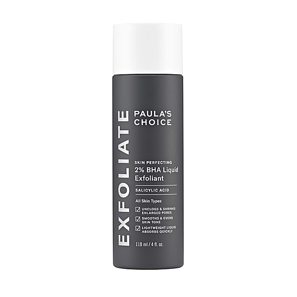

# Fan Club

By **Jellyfish**

## Album Data

- **Catalog:** Beets
- **Format:** Digital, Album
- **Album:** Fan Club
- **Artist:** Jellyfish
- **Albumartist:** Jellyfish
- **Genre:** Indie Pop
- **MusicBrainz Album Artist ID:** 
- **MusicBrainz Album ID:** 
- **MusicBrainz Release Group ID:** 
- **Year:** 1993
- **Catalog #:** 
- **Label:** 
- **Total Tracks:** 19

## Album Tracks

### Track 01 - Glutton Of Sympathy (Live Rehearsal)

- **Artist:** Jellyfish
- **Format:** ALAC
- **Genre:** Indie Pop
- **Length:** 5:00
- **MusicBrainz Track ID:** 
- **Title:** Glutton Of Sympathy (Live Rehearsal)
- **Track:** 01
- **Year:** 2002

### Track 02 - Baby's Coming Back (Live on Dutch TV)

- **Artist:** Jellyfish
- **Format:** ALAC
- **Genre:** Indie Pop
- **Length:** 3:03
- **MusicBrainz Track ID:** 
- **Title:** Baby's Coming Back (Live on Dutch TV)
- **Track:** 02
- **Year:** 2002

### Track 03 - That Is Why (Live on World Cafe)

- **Artist:** Jellyfish
- **Format:** ALAC
- **Genre:** Indie Pop
- **Length:** 3:31
- **MusicBrainz Track ID:** 
- **Title:** That Is Why (Live on World Cafe)
- **Track:** 03
- **Year:** 2002

### Track 04 - The Ghost At Number One (Live on World Cafe)

- **Artist:** Jellyfish
- **Format:** ALAC
- **Genre:** Indie Pop
- **Length:** 3:31
- **MusicBrainz Track ID:** 
- **Title:** The Ghost At Number One (Live on World Cafe)
- **Track:** 04
- **Year:** 2002

### Track 05 - Joining A Fan Club (Live on World Cafe)

- **Artist:** Jellyfish
- **Format:** ALAC
- **Genre:** Indie Pop
- **Length:** 2:53
- **MusicBrainz Track ID:** 
- **Title:** Joining A Fan Club (Live on World Cafe)
- **Track:** 05
- **Year:** 2002

### Track 06 - Interview

- **Artist:** Jellyfish
- **Format:** ALAC
- **Genre:** Indie Pop
- **Length:** 1:11
- **MusicBrainz Track ID:** 
- **Title:** Interview
- **Track:** 06
- **Year:** 2002

### Track 07 - I Can Hear The Grass Grow (Live on Australian radio)

- **Artist:** Jellyfish
- **Format:** ALAC
- **Genre:** Indie Pop
- **Length:** 3:28
- **MusicBrainz Track ID:** 
- **Title:** I Can Hear The Grass Grow (Live on Australian radio)
- **Track:** 07
- **Year:** 2002

### Track 08 - New Mistake (Live on Japanese radio)

- **Artist:** Jellyfish
- **Format:** ALAC
- **Genre:** Indie Pop
- **Length:** 4:05
- **MusicBrainz Track ID:** 
- **Title:** New Mistake (Live on Japanese radio)
- **Track:** 08
- **Year:** 2002

### Track 09 - Eleanor Rigby (Live on Japanese TV)

- **Artist:** Jellyfish
- **Format:** ALAC
- **Genre:** Indie Pop
- **Length:** 1:37
- **MusicBrainz Track ID:** 
- **Title:** Eleanor Rigby (Live on Japanese TV)
- **Track:** 09
- **Year:** 2002

### Track 10 - S.O.S. (Live on Japanese TV)

- **Artist:** Jellyfish
- **Format:** ALAC
- **Genre:** Indie Pop
- **Length:** 1:16
- **MusicBrainz Track ID:** 
- **Title:** S.O.S. (Live on Japanese TV)
- **Track:** 10
- **Year:** 2002

### Track 11 - S.O.S. (Live at Club Quatro,Japan)

- **Artist:** Jellyfish
- **Format:** ALAC
- **Genre:** Indie Pop
- **Length:** 2:10
- **MusicBrainz Track ID:** 
- **Title:** S.O.S. (Live at Club Quatro,Japan)
- **Track:** 11
- **Year:** 2002

### Track 12 - All Is Forgiven (Live at Universal Amphitheatre)

- **Artist:** Jellyfish
- **Format:** ALAC
- **Genre:** Indie Pop
- **Length:** 4:14
- **MusicBrainz Track ID:** 
- **Title:** All Is Forgiven (Live at Universal Amphitheatre)
- **Track:** 12
- **Year:** 2002

### Track 13 - Sebrina, Paste And Plato (Live at Universal Amphitheatre)

- **Artist:** Jellyfish
- **Format:** ALAC
- **Genre:** Indie Pop
- **Length:** 2:27
- **MusicBrainz Track ID:** 
- **Title:** Sebrina, Paste And Plato (Live at Universal Amphitheatre)
- **Track:** 13
- **Year:** 2002

### Track 14 - Joining A Fan Club (Live at Universal Amphitheatre)

- **Artist:** Jellyfish
- **Format:** ALAC
- **Genre:** Indie Pop
- **Length:** 4:37
- **MusicBrainz Track ID:** 
- **Title:** Joining A Fan Club (Live at Universal Amphitheatre)
- **Track:** 14
- **Year:** 2002

### Track 15 - The Ghost At Number One (Live at Universal Amphitheatre)

- **Artist:** Jellyfish
- **Format:** ALAC
- **Genre:** Indie Pop
- **Length:** 3:51
- **MusicBrainz Track ID:** 
- **Title:** The Ghost At Number One (Live at Universal Amphitheatre)
- **Track:** 15
- **Year:** 2002

### Track 16 - The Man I Used To Be (Live at Universal Amphitheatre)

- **Artist:** Jellyfish
- **Format:** ALAC
- **Genre:** Indie Pop
- **Length:** 4:50
- **MusicBrainz Track ID:** 
- **Title:** The Man I Used To Be (Live at Universal Amphitheatre)
- **Track:** 16
- **Year:** 2002

### Track 17 - Glutton Of Sympathy (Live at Universal Amphitheatre)

- **Artist:** Jellyfish
- **Format:** ALAC
- **Genre:** Indie Pop
- **Length:** 4:06
- **MusicBrainz Track ID:** 
- **Title:** Glutton Of Sympathy (Live at Universal Amphitheatre)
- **Track:** 17
- **Year:** 2002

### Track 18 - New Mistake (Live at Universal Amphitheatre)

- **Artist:** Jellyfish
- **Format:** ALAC
- **Genre:** Indie Pop
- **Length:** 4:45
- **MusicBrainz Track ID:** 
- **Title:** New Mistake (Live at Universal Amphitheatre)
- **Track:** 18
- **Year:** 2002

### Track 19 - Think About Your Troubles

- **Artist:** Jellyfish
- **Format:** ALAC
- **Genre:** Rock
- **Length:** 11:00
- **MusicBrainz Track ID:** 
- **Title:** Think About Your Troubles
- **Track:** 19
- **Year:** 1994

## See also

- [Bellybutton Demos](Bellybutton_Demos.md)
- [Bellybutton](Bellybutton.md)
- [Bellybutton Reissue](Bellybutton_Reissue.md)
- [Fan Club [Disc 1] - Bellybutton Tour](Fan_Club_[Disc_1]_-_Bellybutton_Tour.md)
- [Fan Club [Disc 1] - The Bellybutton Demos, 1988-'89](Fan_Club_[Disc_1]_-_The_Bellybutton_Demos__1988-89.md)
- [Fan Club_The Spilt Milk Tour [Disc 4]](Fan_Club_The_Spilt_Milk_Tour_[Disc_4].md)
- [Live At Bogart's](Live_At_Bogarts.md)
- [Radio Jellyfish](Radio_Jellyfish.md)
- [Spilt Milk](Spilt_Milk.md)
- [Stack-A-Tracks](Stack-A-Tracks.md)
- [CD: Bellybutton - Deluxe Edition (Disc 2)](../../CD/Jellyfish/Bellybutton_-_Deluxe_Edition_Disc_2.md)
- [CD: Bellybutton (Disc 1)](../../CD/Jellyfish/Bellybutton_Disc_1.md)
- [CD: ](../../CD/Jellyfish/Jellyfish.md)
- [Roon: Bellybutton Demos (Demo)](../../Roon/Jellyfish/Bellybutton_Demos_Demo.md)
- [Roon: Bellybutton](../../Roon/Jellyfish/Bellybutton.md)
- [Roon: Spilt Milk](../../Roon/Jellyfish/Spilt_Milk.md)
- [Vinyl: Bellybutton](../../Vinyl/Jellyfish/Bellybutton.md)
- [Vinyl: ](../../Vinyl/Jellyfish/Jellyfish.md)
- [Vinyl: Radio Jellyfish](../../Vinyl/Jellyfish/Radio_Jellyfish.md)
