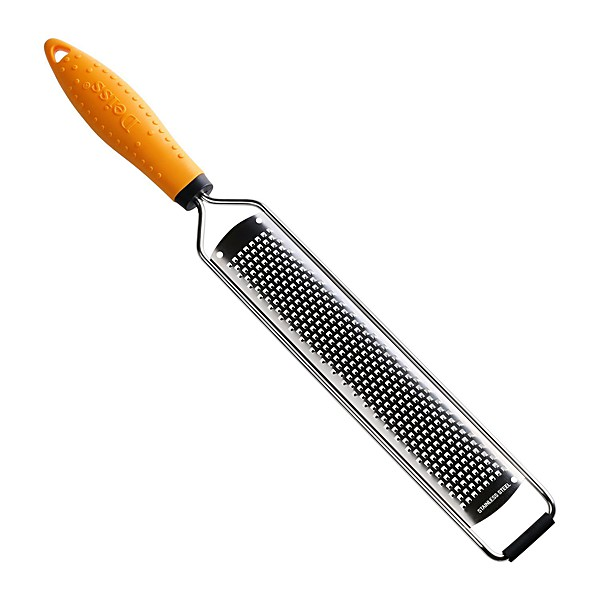

# Fan Club_The Spilt Milk Tour [Disc 4]

By **Jellyfish**

## Album Data

- **Catalog:** Beets
- **Format:** Digital, Album
- **Album:** Fan Club_The Spilt Milk Tour [Disc 4]
- **Artist:** Jellyfish
- **Albumartist:** Jellyfish
- **Genre:** Indie Pop
- **MusicBrainz Album Artist ID:** 
- **MusicBrainz Album ID:** 
- **MusicBrainz Release Group ID:** 
- **Year:** 2002
- **Catalog #:** 
- **Label:** 
- **Total Tracks:** 13

## Album Tracks

### Track 01 - Hold Your Head Up / Hello

- **Artist:** Jellyfish
- **Format:** AAC
- **Genre:** Indie Pop
- **Length:** 5:46
- **MusicBrainz Track ID:** [b02ea121-746f-4d97-810b-cffeee4f6c64](https://musicbrainz.org/recording/b02ea121-746f-4d97-810b-cffeee4f6c64)
- **Title:** Hold Your Head Up / Hello
- **Track:** 01
- **Year:** 2012

### Track 02 - Calling Sarah

- **Artist:** Jellyfish
- **Format:** AAC
- **Genre:** Power Pop
- **Length:** 4:02
- **MusicBrainz Track ID:** [5da978b2-0887-48bb-922f-73d2bc0de7ad](https://musicbrainz.org/recording/5da978b2-0887-48bb-922f-73d2bc0de7ad)
- **Title:** Calling Sarah
- **Track:** 02
- **Year:** 2012

### Track 03 - The King Is Half Undressed

- **Artist:** Jellyfish
- **Format:** AAC
- **Genre:** Glam Rock
- **Length:** 3:58
- **MusicBrainz Track ID:** [f5a16f1c-8149-4ed6-bb8d-04692577bad6](https://musicbrainz.org/recording/f5a16f1c-8149-4ed6-bb8d-04692577bad6)
- **Title:** The King Is Half Undressed
- **Track:** 03
- **Year:** 2012

### Track 04 - I Wanna Stay Home

- **Artist:** Jellyfish
- **Format:** AAC
- **Genre:** Indie Pop
- **Length:** 4:25
- **MusicBrainz Track ID:** [7a4ba22f-3197-4378-90cd-64c164f42afe](https://musicbrainz.org/recording/7a4ba22f-3197-4378-90cd-64c164f42afe)
- **Title:** I Wanna Stay Home
- **Track:** 04
- **Year:** 2012

### Track 05 - Bye Bye Bye

- **Artist:** Jellyfish
- **Format:** AAC
- **Genre:** Rock
- **Length:** 4:07
- **MusicBrainz Track ID:** [fe35cfaf-1ba1-4308-a075-6ab65c8d007d](https://musicbrainz.org/recording/fe35cfaf-1ba1-4308-a075-6ab65c8d007d)
- **Title:** Bye Bye Bye
- **Track:** 05
- **Year:** 2012

### Track 06 - She Still Loves Him

- **Artist:** Jellyfish
- **Format:** AAC
- **Genre:** Indie Pop
- **Length:** 4:11
- **MusicBrainz Track ID:** [23b43f03-0333-4845-9424-6481628fadb0](https://musicbrainz.org/recording/23b43f03-0333-4845-9424-6481628fadb0)
- **Title:** She Still Loves Him
- **Track:** 06
- **Year:** 2012

### Track 07 - Will You Marry Me

- **Artist:** Jellyfish
- **Format:** AAC
- **Genre:** Indie Pop
- **Length:** 6:32
- **MusicBrainz Track ID:** [100e3447-3a95-4ec6-85d6-ae80ff074fe2](https://musicbrainz.org/recording/100e3447-3a95-4ec6-85d6-ae80ff074fe2)
- **Title:** Will You Marry Me
- **Track:** 07
- **Year:** 2012

### Track 08 - Now She Nows She's Wrong

- **Artist:** Jellyfish
- **Format:** AAC
- **Genre:** Indie Pop
- **Length:** 3:19
- **MusicBrainz Track ID:** [89ce8970-cbd2-4296-aa50-1cec1db9f0e5](https://musicbrainz.org/recording/89ce8970-cbd2-4296-aa50-1cec1db9f0e5)
- **Title:** Now She Nows She's Wrong
- **Track:** 08
- **Year:** 2012

### Track 09 - Baby Come Back / Baby's Coming Back

- **Artist:** Jellyfish
- **Format:** AAC
- **Genre:** Indie Pop
- **Length:** 4:36
- **MusicBrainz Track ID:** [0bc5643d-18b6-450d-be44-5c1a00cb34d5](https://musicbrainz.org/recording/0bc5643d-18b6-450d-be44-5c1a00cb34d5)
- **Title:** Baby Come Back / Baby's Coming Back
- **Track:** 09
- **Year:** 2012

### Track 10 - No Matter What

- **Artist:** Jellyfish
- **Format:** AAC
- **Genre:** Indie Pop
- **Length:** 2:41
- **MusicBrainz Track ID:** [7d6c9506-c89a-46c8-837f-89f08b02fe8b](https://musicbrainz.org/recording/7d6c9506-c89a-46c8-837f-89f08b02fe8b)
- **Title:** No Matter What
- **Track:** 10
- **Year:** 2012

### Track 11 - All I Want Is Everything

- **Artist:** Jellyfish
- **Format:** AAC
- **Genre:** Power Pop
- **Length:** 4:19
- **MusicBrainz Track ID:** [47844795-86b3-49ec-82db-7e923cbb4714](https://musicbrainz.org/recording/47844795-86b3-49ec-82db-7e923cbb4714)
- **Title:** All I Want Is Everything
- **Track:** 11
- **Year:** 2012

### Track 12 - The Man I Used to Be

- **Artist:** Jellyfish
- **Format:** AAC
- **Genre:** Indie Rock
- **Length:** 5:27
- **MusicBrainz Track ID:** [4bcd33ff-9dd4-4d09-8032-3113274e7d4c](https://musicbrainz.org/recording/4bcd33ff-9dd4-4d09-8032-3113274e7d4c)
- **Title:** The Man I Used to Be
- **Track:** 12
- **Year:** 2012

### Track 13 - Let 'em In / That Is Why

- **Artist:** Jellyfish
- **Format:** AAC
- **Genre:** Indie Pop
- **Length:** 5:13
- **MusicBrainz Track ID:** [6bd77607-0b21-4bca-91fd-6e8a6289c663](https://musicbrainz.org/recording/6bd77607-0b21-4bca-91fd-6e8a6289c663)
- **Title:** Let 'em In / That Is Why
- **Track:** 13
- **Year:** 2012

## See also

- [Bellybutton Demos](Bellybutton_Demos.md)
- [Bellybutton](Bellybutton.md)
- [Bellybutton Reissue](Bellybutton_Reissue.md)
- [Fan Club [Disc 1] - Bellybutton Tour](Fan_Club_[Disc_1]_-_Bellybutton_Tour.md)
- [Fan Club [Disc 1] - The Bellybutton Demos, 1988-'89](Fan_Club_[Disc_1]_-_The_Bellybutton_Demos__1988-89.md)
- [Fan Club](Fan_Club.md)
- [Live At Bogart's](Live_At_Bogarts.md)
- [Radio Jellyfish](Radio_Jellyfish.md)
- [Spilt Milk](Spilt_Milk.md)
- [Stack-A-Tracks](Stack-A-Tracks.md)
- [CD: Bellybutton - Deluxe Edition (Disc 2)](../../CD/Jellyfish/Bellybutton_-_Deluxe_Edition_Disc_2.md)
- [CD: Bellybutton (Disc 1)](../../CD/Jellyfish/Bellybutton_Disc_1.md)
- [CD: ](../../CD/Jellyfish/Jellyfish.md)
- [Roon: Bellybutton Demos (Demo)](../../Roon/Jellyfish/Bellybutton_Demos_Demo.md)
- [Roon: Bellybutton](../../Roon/Jellyfish/Bellybutton.md)
- [Roon: Spilt Milk](../../Roon/Jellyfish/Spilt_Milk.md)
- [Vinyl: Bellybutton](../../Vinyl/Jellyfish/Bellybutton.md)
- [Vinyl: ](../../Vinyl/Jellyfish/Jellyfish.md)
- [Vinyl: Radio Jellyfish](../../Vinyl/Jellyfish/Radio_Jellyfish.md)
