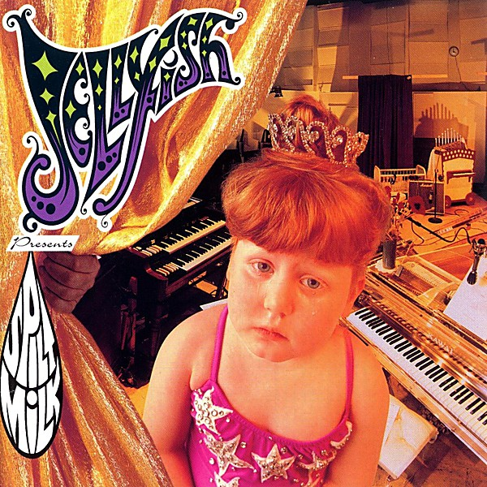

# Fan Club [Disc 1] - Bellybutton Tour

By **Jellyfish**

## Album Data

- **Catalog:** Beets
- **Format:** Digital, Album
- **Album:** Fan Club [Disc 1] - Bellybutton Tour
- **Artist:** Jellyfish
- **Albumartist:** Jellyfish
- **Genre:** Indie Pop
- **MusicBrainz Album Artist ID:** 
- **MusicBrainz Album ID:** 
- **MusicBrainz Release Group ID:** 
- **Year:** 2002
- **Catalog #:** 
- **Label:** 
- **Total Tracks:** 16

## Album Tracks

### Track 01 - The Man I Used To Be

- **Artist:** Jellyfish
- **Format:** ALAC
- **Genre:** Indie Rock
- **Length:** 4:25
- **MusicBrainz Track ID:** 
- **Title:** The Man I Used To Be
- **Track:** 01
- **Year:** 1989

### Track 02 - Bedspring Kiss

- **Artist:** Jellyfish
- **Format:** ALAC
- **Genre:** Soft Rock
- **Length:** 4:47
- **MusicBrainz Track ID:** 
- **Title:** Bedspring Kiss
- **Track:** 02
- **Year:** 1989

### Track 03 - Deliver

- **Artist:** Jellyfish
- **Format:** ALAC
- **Genre:** Rock
- **Length:** 3:09
- **MusicBrainz Track ID:** 
- **Title:** Deliver
- **Track:** 03
- **Year:** 1989

### Track 04 - Now She Knows She's Wrong

- **Artist:** Jellyfish
- **Format:** ALAC
- **Genre:** Power Pop
- **Length:** 2:17
- **MusicBrainz Track ID:** 
- **Title:** Now She Knows She's Wrong
- **Track:** 04
- **Year:** 1988

### Track 04 - Now She Knows She's Wrong

- **Artist:** Jellyfish
- **Format:** MP3
- **Genre:** Power Pop
- **Length:** 2:15
- **MusicBrainz Track ID:** 
- **Title:** Now She Knows She's Wrong
- **Track:** 04
- **Year:** 1988

### Track 05 - Queen Of The U.S.A.

- **Artist:** Jellyfish
- **Format:** ALAC
- **Genre:** Rock
- **Length:** 5:15
- **MusicBrainz Track ID:** 
- **Title:** Queen Of The U.S.A.
- **Track:** 05
- **Year:** 1988

### Track 06 - Always Be My Girl

- **Artist:** Jellyfish
- **Format:** ALAC
- **Genre:** Rock
- **Length:** 3:38
- **MusicBrainz Track ID:** 
- **Title:** Always Be My Girl
- **Track:** 06
- **Year:** 1988

### Track 07 - I Wanna Stay Home

- **Artist:** Jellyfish
- **Format:** ALAC
- **Genre:** Indie Pop
- **Length:** 4:12
- **MusicBrainz Track ID:** 
- **Title:** I Wanna Stay Home
- **Track:** 07
- **Year:** 1989

### Track 08 - Let This Dream Never End

- **Artist:** Jellyfish
- **Format:** ALAC
- **Genre:** Indie Pop
- **Length:** 4:01
- **MusicBrainz Track ID:** 
- **Title:** Let This Dream Never End
- **Track:** 08
- **Year:** 1989

### Track 09 - Season Of The Witch

- **Artist:** Jellyfish
- **Format:** ALAC
- **Genre:** Rock
- **Length:** 4:24
- **MusicBrainz Track ID:** 
- **Title:** Season Of The Witch
- **Track:** 09
- **Year:** 1989

### Track 10 - That Girl's A Man

- **Artist:** Jellyfish
- **Format:** ALAC
- **Genre:** Rock
- **Length:** 3:44
- **MusicBrainz Track ID:** 
- **Title:** That Girl's A Man
- **Track:** 10
- **Year:** 1989

### Track 11 - Calling Sarah

- **Artist:** Jellyfish
- **Format:** ALAC
- **Genre:** Power Pop
- **Length:** 4:50
- **MusicBrainz Track ID:** 
- **Title:** Calling Sarah
- **Track:** 11
- **Year:** 1989

### Track 12 - All I Want Is Everything

- **Artist:** Jellyfish
- **Format:** ALAC
- **Genre:** Power Pop
- **Length:** 3:14
- **MusicBrainz Track ID:** 
- **Title:** All I Want Is Everything
- **Track:** 12
- **Year:** 1989

### Track 13 - Bye Bye Bye

- **Artist:** Jellyfish
- **Format:** ALAC
- **Genre:** Rock
- **Length:** 3:50
- **MusicBrainz Track ID:** 
- **Title:** Bye Bye Bye
- **Track:** 13
- **Year:** 1988

### Track 14 - She Still Loves Him

- **Artist:** Jellyfish
- **Format:** ALAC
- **Genre:** Indie Pop
- **Length:** 4:29
- **MusicBrainz Track ID:** 
- **Title:** She Still Loves Him
- **Track:** 14
- **Year:** 1989

### Track 15 - Baby's Coming Back

- **Artist:** Jellyfish
- **Format:** ALAC
- **Genre:** Power Pop
- **Length:** 2:55
- **MusicBrainz Track ID:** 
- **Title:** Baby's Coming Back
- **Track:** 15
- **Year:** 1988

### Track 16 - The King Is Half-Undressed

- **Artist:** Jellyfish
- **Format:** ALAC
- **Genre:** Power Pop
- **Length:** 3:40
- **MusicBrainz Track ID:** 
- **Title:** The King Is Half-Undressed
- **Track:** 16
- **Year:** 1989

## See also

- [Bellybutton Demos](Bellybutton_Demos.md)
- [Bellybutton](Bellybutton.md)
- [Bellybutton Reissue](Bellybutton_Reissue.md)
- [Fan Club [Disc 1] - The Bellybutton Demos, 1988-'89](Fan_Club_[Disc_1]_-_The_Bellybutton_Demos__1988-89.md)
- [Fan Club](Fan_Club.md)
- [Fan Club_The Spilt Milk Tour [Disc 4]](Fan_Club_The_Spilt_Milk_Tour_[Disc_4].md)
- [Live At Bogart's](Live_At_Bogarts.md)
- [Radio Jellyfish](Radio_Jellyfish.md)
- [Spilt Milk](Spilt_Milk.md)
- [Stack-A-Tracks](Stack-A-Tracks.md)
- [CD: Bellybutton - Deluxe Edition (Disc 2)](../../CD/Jellyfish/Bellybutton_-_Deluxe_Edition_Disc_2.md)
- [CD: Bellybutton (Disc 1)](../../CD/Jellyfish/Bellybutton_Disc_1.md)
- [CD: ](../../CD/Jellyfish/Jellyfish.md)
- [Roon: Bellybutton Demos (Demo)](../../Roon/Jellyfish/Bellybutton_Demos_Demo.md)
- [Roon: Bellybutton](../../Roon/Jellyfish/Bellybutton.md)
- [Roon: Spilt Milk](../../Roon/Jellyfish/Spilt_Milk.md)
- [Vinyl: Bellybutton](../../Vinyl/Jellyfish/Bellybutton.md)
- [Vinyl: ](../../Vinyl/Jellyfish/Jellyfish.md)
- [Vinyl: Radio Jellyfish](../../Vinyl/Jellyfish/Radio_Jellyfish.md)
