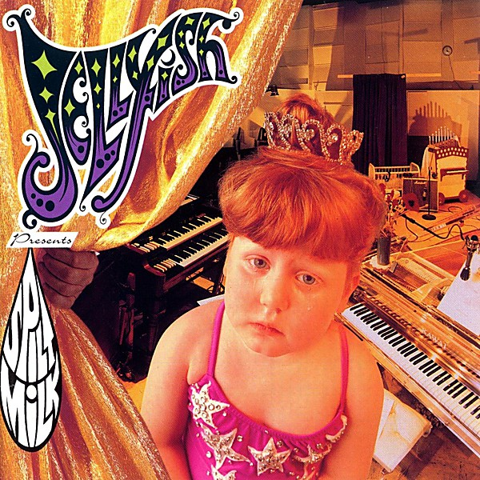

# Fan Club [Disc 1] - The Bellybutton Demos, 1988-'89

By **Jellyfish**

## Album Data

- **Catalog:** Beets
- **Format:** Digital, Album
- **Album:** Fan Club [Disc 1] - The Bellybutton Demos, 1988-'89
- **Artist:** Jellyfish
- **Albumartist:** Jellyfish
- **Genre:** Indie Pop
- **MusicBrainz Album Artist ID:** 
- **MusicBrainz Album ID:** 
- **MusicBrainz Release Group ID:** 
- **Year:** 1989
- **Catalog #:** 
- **Label:** 
- **Total Tracks:** 21

## Album Tracks

### Track 01 - (World Cafe)

- **Artist:** Jellyfish
- **Format:** ALAC
- **Genre:** Indie Pop
- **Length:** 0:42
- **MusicBrainz Track ID:** 
- **Title:** (World Cafe)
- **Track:** 01
- **Year:** 1993

### Track 02 - Spilt Milk [Intro]

- **Artist:** Jellyfish
- **Format:** ALAC
- **Genre:** Indie Pop
- **Length:** 0:46
- **MusicBrainz Track ID:** 
- **Title:** Spilt Milk [Intro]
- **Track:** 02
- **Year:** 1992

### Track 03 - Hush

- **Artist:** Jellyfish
- **Format:** ALAC
- **Genre:** Power Pop
- **Length:** 1:20
- **MusicBrainz Track ID:** 
- **Title:** Hush
- **Track:** 03
- **Year:** 1992

### Track 04 - Joining A Fan Club

- **Artist:** Jellyfish
- **Format:** ALAC
- **Genre:** Indie Rock
- **Length:** 3:47
- **MusicBrainz Track ID:** 
- **Title:** Joining A Fan Club
- **Track:** 04
- **Year:** 1992

### Track 05 - Sebrina, Paste And Plato

- **Artist:** Jellyfish
- **Format:** ALAC
- **Genre:** Sunshine Pop
- **Length:** 2:13
- **MusicBrainz Track ID:** 
- **Title:** Sebrina, Paste And Plato
- **Track:** 05
- **Year:** 1992

### Track 06 - New Mistake

- **Artist:** Jellyfish
- **Format:** ALAC
- **Genre:** Power Pop
- **Length:** 4:07
- **MusicBrainz Track ID:** 
- **Title:** New Mistake
- **Track:** 06
- **Year:** 1992

### Track 07 - Glutton Of Sympathy

- **Artist:** Jellyfish
- **Format:** ALAC
- **Genre:** Rock
- **Length:** 4:04
- **MusicBrainz Track ID:** 
- **Title:** Glutton Of Sympathy
- **Track:** 07
- **Year:** 1992

### Track 08 - The Ghost At Number One

- **Artist:** Jellyfish
- **Format:** ALAC
- **Genre:** Power Pop
- **Length:** 3:27
- **MusicBrainz Track ID:** 
- **Title:** The Ghost At Number One
- **Track:** 08
- **Year:** 1992

### Track 09 - All Is Forgiven

- **Artist:** Jellyfish
- **Format:** ALAC
- **Genre:** Indie Rock
- **Length:** 4:11
- **MusicBrainz Track ID:** 
- **Title:** All Is Forgiven
- **Track:** 09
- **Year:** 1992

### Track 10 - Russian Hill

- **Artist:** Jellyfish
- **Format:** ALAC
- **Genre:** Dream Pop
- **Length:** 4:45
- **MusicBrainz Track ID:** 
- **Title:** Russian Hill
- **Track:** 10
- **Year:** 1992

### Track 11 - He's My Best Friend

- **Artist:** Jellyfish
- **Format:** ALAC
- **Genre:** Indie Rock
- **Length:** 3:44
- **MusicBrainz Track ID:** 
- **Title:** He's My Best Friend
- **Track:** 11
- **Year:** 1992

### Track 12 - Family Tree

- **Artist:** Jellyfish
- **Format:** ALAC
- **Genre:** Power Pop
- **Length:** 4:02
- **MusicBrainz Track ID:** 
- **Title:** Family Tree
- **Track:** 12
- **Year:** 1992

### Track 13 - Spilt Milk [Outro]

- **Artist:** Jellyfish
- **Format:** ALAC
- **Genre:** Indie Pop
- **Length:** 1:16
- **MusicBrainz Track ID:** 
- **Title:** Spilt Milk [Outro]
- **Track:** 13
- **Year:** 1992

### Track 14 - Ignorance Is Bliss

- **Artist:** Jellyfish
- **Format:** ALAC
- **Genre:** Power Pop
- **Length:** 3:57
- **MusicBrainz Track ID:** 
- **Title:** Ignorance Is Bliss
- **Track:** 14
- **Year:** 1993

### Track 15 - Worthless Heart

- **Artist:** Jellyfish
- **Format:** ALAC
- **Genre:** Indie Pop
- **Length:** 3:08
- **MusicBrainz Track ID:** 
- **Title:** Worthless Heart
- **Track:** 15
- **Year:** 1992

### Track 16 - Watchin' The Rain

- **Artist:** Jellyfish
- **Format:** ALAC
- **Genre:** Indie Pop
- **Length:** 4:13
- **MusicBrainz Track ID:** 
- **Title:** Watchin' The Rain
- **Track:** 16
- **Year:** 1992

### Track 17 - I Need Love

- **Artist:** Jellyfish
- **Format:** ALAC
- **Genre:** Indie Pop
- **Length:** 3:11
- **MusicBrainz Track ID:** 
- **Title:** I Need Love
- **Track:** 17
- **Year:** 1992

### Track 18 - I Don't Believe You

- **Artist:** Jellyfish
- **Format:** ALAC
- **Genre:** Indie Pop
- **Length:** 3:23
- **MusicBrainz Track ID:** 
- **Title:** I Don't Believe You
- **Track:** 18
- **Year:** 1992

### Track 19 - Long Time Ago

- **Artist:** Jellyfish
- **Format:** ALAC
- **Genre:** Indie Pop
- **Length:** 3:49
- **MusicBrainz Track ID:** 
- **Title:** Long Time Ago
- **Track:** 19
- **Year:** 1992

### Track 20 - Runnin For Our Lives

- **Artist:** Jellyfish
- **Format:** ALAC
- **Genre:** Indie Pop
- **Length:** 3:42
- **MusicBrainz Track ID:** 
- **Title:** Runnin For Our Lives
- **Track:** 20
- **Year:** 1992

### Track 21 - Fan Club Message

- **Artist:** Jellyfish
- **Format:** ALAC
- **Genre:** Indie Pop
- **Length:** 6:02
- **MusicBrainz Track ID:** 
- **Title:** Fan Club Message
- **Track:** 21
- **Year:** 1992

## See also

- [Bellybutton Demos](Bellybutton_Demos.md)
- [Bellybutton](Bellybutton.md)
- [Bellybutton Reissue](Bellybutton_Reissue.md)
- [Fan Club [Disc 1] - Bellybutton Tour](Fan_Club_[Disc_1]_-_Bellybutton_Tour.md)
- [Fan Club](Fan_Club.md)
- [Fan Club_The Spilt Milk Tour [Disc 4]](Fan_Club_The_Spilt_Milk_Tour_[Disc_4].md)
- [Live At Bogart's](Live_At_Bogarts.md)
- [Radio Jellyfish](Radio_Jellyfish.md)
- [Spilt Milk](Spilt_Milk.md)
- [Stack-A-Tracks](Stack-A-Tracks.md)
- [CD: Bellybutton - Deluxe Edition (Disc 2)](../../CD/Jellyfish/Bellybutton_-_Deluxe_Edition_Disc_2.md)
- [CD: Bellybutton (Disc 1)](../../CD/Jellyfish/Bellybutton_Disc_1.md)
- [CD: ](../../CD/Jellyfish/Jellyfish.md)
- [Roon: Bellybutton Demos (Demo)](../../Roon/Jellyfish/Bellybutton_Demos_Demo.md)
- [Roon: Bellybutton](../../Roon/Jellyfish/Bellybutton.md)
- [Roon: Spilt Milk](../../Roon/Jellyfish/Spilt_Milk.md)
- [Vinyl: Bellybutton](../../Vinyl/Jellyfish/Bellybutton.md)
- [Vinyl: ](../../Vinyl/Jellyfish/Jellyfish.md)
- [Vinyl: Radio Jellyfish](../../Vinyl/Jellyfish/Radio_Jellyfish.md)
