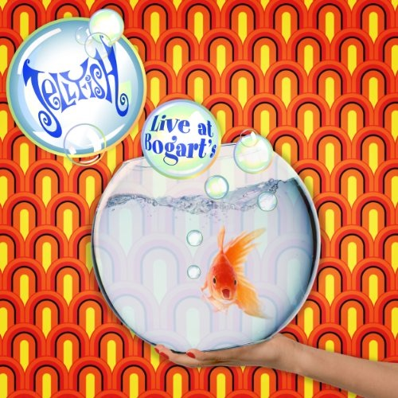

# Live At Bogart's

By **Jellyfish**

## Album Data

- **Catalog:** Beets
- **Format:** Digital, Album
- **Album:** Live At Bogart's
- **Artist:** Jellyfish
- **Albumartist:** Jellyfish
- **Genre:** Indie Pop
- **MusicBrainz Album Artist ID:** [e3087942-a74b-4623-9349-d22cde0a9ad5](https://musicbrainz.org/artist/e3087942-a74b-4623-9349-d22cde0a9ad5)
- **MusicBrainz Album ID:** [264e534e-e683-49e3-b06a-b98452ccb749](https://musicbrainz.org/release/264e534e-e683-49e3-b06a-b98452ccb749)
- **MusicBrainz Release Group ID:** [28520a65-1a33-4f24-a4c2-761897dba3ea](https://musicbrainz.org/release-group/28520a65-1a33-4f24-a4c2-761897dba3ea)
- **Year:** 2012
- **Catalog #:** 
- **Label:** Omnivore Recordings
- **Total Tracks:** 10

## Album Tracks

### Track 01 - New Mistake

- **Artist:** Jellyfish
- **Format:** MP3
- **Genre:** Power Pop
- **Length:** 4:05
- **MusicBrainz Track ID:** [f7182502-41cf-43b1-a529-3197db9759a4](https://musicbrainz.org/recording/f7182502-41cf-43b1-a529-3197db9759a4)
- **Title:** New Mistake
- **Track:** 01
- **Year:** 2013

### Track 02 - She Still Loves Him

- **Artist:** Jellyfish
- **Format:** MP3
- **Genre:** Indie Pop
- **Length:** 3:56
- **MusicBrainz Track ID:** [b79599cf-8826-4479-9cd1-81a78ed7658c](https://musicbrainz.org/recording/b79599cf-8826-4479-9cd1-81a78ed7658c)
- **Title:** She Still Loves Him
- **Track:** 02
- **Year:** 2013

### Track 03 - I Can Hear the Grass Grow

- **Artist:** Jellyfish
- **Format:** MP3
- **Genre:** Indie Pop
- **Length:** 4:03
- **MusicBrainz Track ID:** [02e9258c-2043-4d57-b138-c81a12a137d9](https://musicbrainz.org/recording/02e9258c-2043-4d57-b138-c81a12a137d9)
- **Title:** I Can Hear the Grass Grow
- **Track:** 03
- **Year:** 2013

### Track 04 - Baby's Coming Back

- **Artist:** Jellyfish
- **Format:** MP3
- **Genre:** Power Pop
- **Length:** 3:09
- **MusicBrainz Track ID:** [ebdcec4b-643b-4171-9769-921729fd4292](https://musicbrainz.org/recording/ebdcec4b-643b-4171-9769-921729fd4292)
- **Title:** Baby's Coming Back
- **Track:** 04
- **Year:** 2013

### Track 05 - The Man I Used to Be

- **Artist:** Jellyfish
- **Format:** MP3
- **Genre:** Indie Rock
- **Length:** 4:36
- **MusicBrainz Track ID:** [eac1ae40-6d08-498b-979d-e3704e7a8d55](https://musicbrainz.org/recording/eac1ae40-6d08-498b-979d-e3704e7a8d55)
- **Title:** The Man I Used to Be
- **Track:** 05
- **Year:** 2013

### Track 06 - Joining a Fan Club

- **Artist:** Jellyfish
- **Format:** MP3
- **Genre:** Indie Rock
- **Length:** 3:42
- **MusicBrainz Track ID:** [90a01a0b-83d3-4eaa-b179-38a88642739c](https://musicbrainz.org/recording/90a01a0b-83d3-4eaa-b179-38a88642739c)
- **Title:** Joining a Fan Club
- **Track:** 06
- **Year:** 2013

### Track 07 - The King Is Half-Undressed

- **Artist:** Jellyfish
- **Format:** MP3
- **Genre:** Power Pop
- **Length:** 3:48
- **MusicBrainz Track ID:** [b5d82ea2-9900-4040-8290-0487a5e7c072](https://musicbrainz.org/recording/b5d82ea2-9900-4040-8290-0487a5e7c072)
- **Title:** The King Is Half-Undressed
- **Track:** 07
- **Year:** 2013

### Track 08 - The Ghost at Number One

- **Artist:** Jellyfish
- **Format:** MP3
- **Genre:** Power Pop
- **Length:** 3:45
- **MusicBrainz Track ID:** [52ac6916-a3e0-4692-ae80-da9758fb6ec2](https://musicbrainz.org/recording/52ac6916-a3e0-4692-ae80-da9758fb6ec2)
- **Title:** The Ghost at Number One
- **Track:** 08
- **Year:** 2013

### Track 09 - That Is Why

- **Artist:** Jellyfish
- **Format:** MP3
- **Genre:** Psychedelic Pop
- **Length:** 4:11
- **MusicBrainz Track ID:** [853b2065-518a-4aef-918e-0b71b389501e](https://musicbrainz.org/recording/853b2065-518a-4aef-918e-0b71b389501e)
- **Title:** That Is Why
- **Track:** 09
- **Year:** 2013

### Track 10 - No Matter What

- **Artist:** Jellyfish
- **Format:** MP3
- **Genre:** Indie Pop
- **Length:** 2:56
- **MusicBrainz Track ID:** [d03c881f-437e-49ec-81a5-9038a32f5117](https://musicbrainz.org/recording/d03c881f-437e-49ec-81a5-9038a32f5117)
- **Title:** No Matter What
- **Track:** 10
- **Year:** 2013

## See also

- [Bellybutton Demos](Bellybutton_Demos.md)
- [Bellybutton](Bellybutton.md)
- [Bellybutton Reissue](Bellybutton_Reissue.md)
- [Fan Club [Disc 1] - Bellybutton Tour](Fan_Club_[Disc_1]_-_Bellybutton_Tour.md)
- [Fan Club [Disc 1] - The Bellybutton Demos, 1988-'89](Fan_Club_[Disc_1]_-_The_Bellybutton_Demos__1988-89.md)
- [Fan Club](Fan_Club.md)
- [Fan Club_The Spilt Milk Tour [Disc 4]](Fan_Club_The_Spilt_Milk_Tour_[Disc_4].md)
- [Radio Jellyfish](Radio_Jellyfish.md)
- [Spilt Milk](Spilt_Milk.md)
- [Stack-A-Tracks](Stack-A-Tracks.md)
- [CD: Bellybutton - Deluxe Edition (Disc 2)](../../CD/Jellyfish/Bellybutton_-_Deluxe_Edition_Disc_2.md)
- [CD: Bellybutton (Disc 1)](../../CD/Jellyfish/Bellybutton_Disc_1.md)
- [CD: ](../../CD/Jellyfish/Jellyfish.md)
- [Roon: Bellybutton Demos (Demo)](../../Roon/Jellyfish/Bellybutton_Demos_Demo.md)
- [Roon: Bellybutton](../../Roon/Jellyfish/Bellybutton.md)
- [Roon: Spilt Milk](../../Roon/Jellyfish/Spilt_Milk.md)
- [Vinyl: Bellybutton](../../Vinyl/Jellyfish/Bellybutton.md)
- [Vinyl: ](../../Vinyl/Jellyfish/Jellyfish.md)
- [Vinyl: Radio Jellyfish](../../Vinyl/Jellyfish/Radio_Jellyfish.md)
