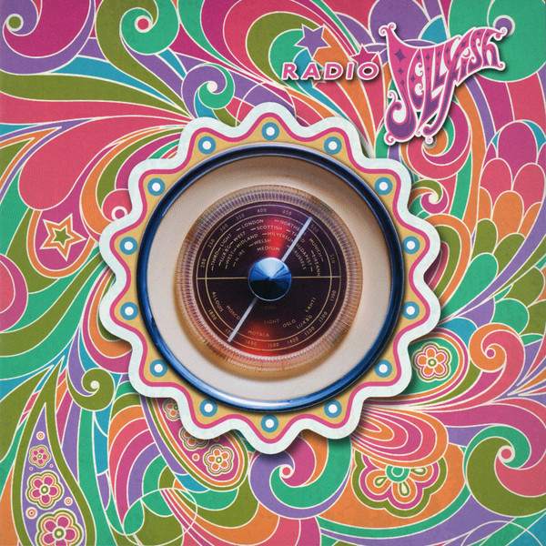

# Radio Jellyfish

By **Jellyfish**

## Album Data

- **Catalog:** Beets
- **Format:** Digital, Album
- **Album:** Radio Jellyfish
- **Artist:** Jellyfish
- **Albumartist:** Jellyfish
- **Genre:** Indie Pop
- **MusicBrainz Album Artist ID:** [e3087942-a74b-4623-9349-d22cde0a9ad5](https://musicbrainz.org/artist/e3087942-a74b-4623-9349-d22cde0a9ad5)
- **MusicBrainz Album ID:** [188ce591-a31c-4390-9f2f-36d49b289303](https://musicbrainz.org/release/188ce591-a31c-4390-9f2f-36d49b289303)
- **MusicBrainz Release Group ID:** [2b5e1d91-9e46-418d-9d30-06357a56af4b](https://musicbrainz.org/release-group/2b5e1d91-9e46-418d-9d30-06357a56af4b)
- **Year:** 2013
- **Catalog #:** V2-86459
- **Label:** Charisma
- **Total Tracks:** 12

## Album Tracks

### Track 01 - Hush

- **Artist:** Jellyfish
- **Format:** MP3
- **Genre:** Power Pop
- **Length:** 2:11
- **MusicBrainz Track ID:** [e7df38f5-e8c8-4720-b2a8-c487f50253f0](https://musicbrainz.org/recording/e7df38f5-e8c8-4720-b2a8-c487f50253f0)
- **Title:** Hush
- **Track:** 01
- **Year:** 1993

### Track 02 - Joining a Fan Club

- **Artist:** Jellyfish
- **Format:** MP3
- **Genre:** Indie Rock
- **Length:** 4:02
- **MusicBrainz Track ID:** [8110b837-abc5-4d9c-a4b1-b32829e4dc84](https://musicbrainz.org/recording/8110b837-abc5-4d9c-a4b1-b32829e4dc84)
- **Title:** Joining a Fan Club
- **Track:** 02
- **Year:** 1993

### Track 03 - Sebrina, Paste and Plato

- **Artist:** Jellyfish
- **Format:** MP3
- **Genre:** Sunshine Pop
- **Length:** 2:23
- **MusicBrainz Track ID:** [216c090a-1a72-4aa4-a9fd-c815c9908579](https://musicbrainz.org/recording/216c090a-1a72-4aa4-a9fd-c815c9908579)
- **Title:** Sebrina, Paste and Plato
- **Track:** 03
- **Year:** 1993

### Track 04 - New Mistake

- **Artist:** Jellyfish
- **Format:** MP3
- **Genre:** Power Pop
- **Length:** 4:02
- **MusicBrainz Track ID:** [fe26eee7-09e8-4e3a-8c21-715cc9eacba6](https://musicbrainz.org/recording/fe26eee7-09e8-4e3a-8c21-715cc9eacba6)
- **Title:** New Mistake
- **Track:** 04
- **Year:** 1993

### Track 05 - Glutton of Sympathy

- **Artist:** Jellyfish
- **Format:** MP3
- **Genre:** Rock
- **Length:** 3:49
- **MusicBrainz Track ID:** [f27577dd-785f-498f-af59-ca1014707d3e](https://musicbrainz.org/recording/f27577dd-785f-498f-af59-ca1014707d3e)
- **Title:** Glutton of Sympathy
- **Track:** 05
- **Year:** 1993

### Track 06 - The Ghost at Number One

- **Artist:** Jellyfish
- **Format:** MP3
- **Genre:** Power Pop
- **Length:** 3:36
- **MusicBrainz Track ID:** [8869e535-213a-415a-af9c-f93415df12e2](https://musicbrainz.org/recording/8869e535-213a-415a-af9c-f93415df12e2)
- **Title:** The Ghost at Number One
- **Track:** 06
- **Year:** 1993

### Track 07 - Bye, Bye, Bye

- **Artist:** Jellyfish
- **Format:** MP3
- **Genre:** Indie Rock
- **Length:** 4:02
- **MusicBrainz Track ID:** [5376933e-4a05-4ed5-8fba-59f78c1198ae](https://musicbrainz.org/recording/5376933e-4a05-4ed5-8fba-59f78c1198ae)
- **Title:** Bye, Bye, Bye
- **Track:** 07
- **Year:** 1993

### Track 08 - All Is Forgiven

- **Artist:** Jellyfish
- **Format:** MP3
- **Genre:** Indie Rock
- **Length:** 4:09
- **MusicBrainz Track ID:** [1104bdd2-d4ce-4ddf-896e-bfef97d2bbd2](https://musicbrainz.org/recording/1104bdd2-d4ce-4ddf-896e-bfef97d2bbd2)
- **Title:** All Is Forgiven
- **Track:** 08
- **Year:** 1993

### Track 09 - Russian Hill

- **Artist:** Jellyfish
- **Format:** MP3
- **Genre:** Dream Pop
- **Length:** 4:45
- **MusicBrainz Track ID:** [99cd47df-abfb-4214-b4a4-404829c42f52](https://musicbrainz.org/recording/99cd47df-abfb-4214-b4a4-404829c42f52)
- **Title:** Russian Hill
- **Track:** 09
- **Year:** 1993

### Track 10 - He’s My Best Friend

- **Artist:** Jellyfish
- **Format:** MP3
- **Genre:** Power Pop
- **Length:** 3:43
- **MusicBrainz Track ID:** [b0639714-4d62-495b-9997-cd65656d6f2e](https://musicbrainz.org/recording/b0639714-4d62-495b-9997-cd65656d6f2e)
- **Title:** He’s My Best Friend
- **Track:** 10
- **Year:** 1993

### Track 11 - Too Much, Too Little, Too Late

- **Artist:** Jellyfish
- **Format:** MP3
- **Genre:** Power Pop
- **Length:** 3:14
- **MusicBrainz Track ID:** [fd25abc1-1943-47a9-8e08-768ee2899873](https://musicbrainz.org/recording/fd25abc1-1943-47a9-8e08-768ee2899873)
- **Title:** Too Much, Too Little, Too Late
- **Track:** 11
- **Year:** 1993

### Track 12 - Brighter Day

- **Artist:** Jellyfish
- **Format:** MP3
- **Genre:** Indie Rock
- **Length:** 6:11
- **MusicBrainz Track ID:** [51c23536-076d-4ae4-af0c-5a186fadb9a3](https://musicbrainz.org/recording/51c23536-076d-4ae4-af0c-5a186fadb9a3)
- **Title:** Brighter Day
- **Track:** 12
- **Year:** 1993

