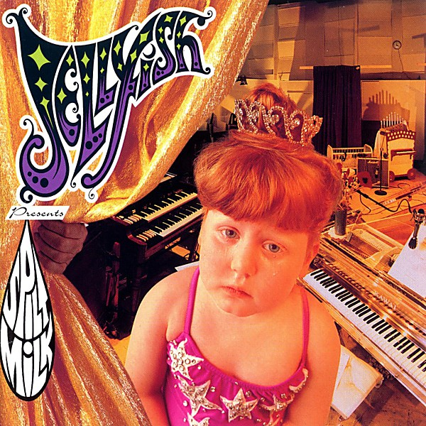

# Spilt Milk

By **Jellyfish**

## Album Data

- **Catalog:** Beets
- **Format:** Digital, Album
- **Album:** Spilt Milk
- **Artist:** Jellyfish
- **Albumartist:** Jellyfish
- **Genre:** Power Pop
- **MusicBrainz Album Artist ID:** [e3087942-a74b-4623-9349-d22cde0a9ad5](https://musicbrainz.org/artist/e3087942-a74b-4623-9349-d22cde0a9ad5)
- **MusicBrainz Album ID:** [b6a6db52-2185-4501-960e-81dbd51c59cb](https://musicbrainz.org/release/b6a6db52-2185-4501-960e-81dbd51c59cb)
- **MusicBrainz Release Group ID:** [cd04aee7-d575-3da5-b6b1-736010543475](https://musicbrainz.org/release-group/cd04aee7-d575-3da5-b6b1-736010543475)
- **Year:** 1993
- **Catalog #:** OVCD-54
- **Label:** Omnivore Recordings
- **Total Tracks:** 22

## Album Tracks

### Track 01 - The Man I Used to Be

- **Artist:** Jellyfish
- **Format:** ALAC
- **Genre:** Indie Rock
- **Length:** 4:33
- **MusicBrainz Track ID:** [59ca251b-7fd2-4569-99d9-e20b5de4550f](https://musicbrainz.org/recording/59ca251b-7fd2-4569-99d9-e20b5de4550f)
- **Title:** The Man I Used to Be
- **Track:** 01
- **Year:** 2012

### Track 02 - That Is Why

- **Artist:** Jellyfish
- **Format:** ALAC
- **Genre:** Psychedelic Pop
- **Length:** 4:16
- **MusicBrainz Track ID:** [9f560e68-b03b-409d-ac18-71b9c7f67a2d](https://musicbrainz.org/recording/9f560e68-b03b-409d-ac18-71b9c7f67a2d)
- **Title:** That Is Why
- **Track:** 02
- **Year:** 2012

### Track 03 - The King Is Half-Undressed

- **Artist:** Jellyfish
- **Format:** ALAC
- **Genre:** Power Pop
- **Length:** 3:46
- **MusicBrainz Track ID:** [d0674ddf-8875-492f-9f3e-61e0dbd7ce0c](https://musicbrainz.org/recording/d0674ddf-8875-492f-9f3e-61e0dbd7ce0c)
- **Title:** The King Is Half-Undressed
- **Track:** 03
- **Year:** 2012

### Track 04 - I Wanna Stay Home

- **Artist:** Jellyfish
- **Format:** ALAC
- **Genre:** Indie Pop
- **Length:** 4:06
- **MusicBrainz Track ID:** [6019d2f5-52df-4e8a-b61c-00524d36b701](https://musicbrainz.org/recording/6019d2f5-52df-4e8a-b61c-00524d36b701)
- **Title:** I Wanna Stay Home
- **Track:** 04
- **Year:** 2012

### Track 05 - She Still Loves Him

- **Artist:** Jellyfish
- **Format:** ALAC
- **Genre:** Indie Pop
- **Length:** 4:36
- **MusicBrainz Track ID:** [7ff2f2b9-e002-4bba-ba72-3b8165db9600](https://musicbrainz.org/recording/7ff2f2b9-e002-4bba-ba72-3b8165db9600)
- **Title:** She Still Loves Him
- **Track:** 05
- **Year:** 2012

### Track 06 - All I Want Is Everything

- **Artist:** Jellyfish
- **Format:** ALAC
- **Genre:** Power Pop
- **Length:** 3:44
- **MusicBrainz Track ID:** [20153f15-01c0-4d16-98f3-c88afdf510e8](https://musicbrainz.org/recording/20153f15-01c0-4d16-98f3-c88afdf510e8)
- **Title:** All I Want Is Everything
- **Track:** 06
- **Year:** 2012

### Track 07 - Now She Knows She's Wrong

- **Artist:** Jellyfish
- **Format:** ALAC
- **Genre:** Power Pop
- **Length:** 2:36
- **MusicBrainz Track ID:** [ceb663c0-fa87-415e-aa44-7d5841a16951](https://musicbrainz.org/recording/ceb663c0-fa87-415e-aa44-7d5841a16951)
- **Title:** Now She Knows She's Wrong
- **Track:** 07
- **Year:** 2012

### Track 08 - Bedspring Kiss

- **Artist:** Jellyfish
- **Format:** ALAC
- **Genre:** Soft Rock
- **Length:** 5:03
- **MusicBrainz Track ID:** [ffb6b76c-e5a0-4d03-a42b-54eac985419e](https://musicbrainz.org/recording/ffb6b76c-e5a0-4d03-a42b-54eac985419e)
- **Title:** Bedspring Kiss
- **Track:** 08
- **Year:** 2012

### Track 09 - Baby's Coming Back

- **Artist:** Jellyfish
- **Format:** ALAC
- **Genre:** Power Pop
- **Length:** 2:56
- **MusicBrainz Track ID:** [0ee7d8b0-f768-4e38-b462-55e294b56e0e](https://musicbrainz.org/recording/0ee7d8b0-f768-4e38-b462-55e294b56e0e)
- **Title:** Baby's Coming Back
- **Track:** 09
- **Year:** 2012

### Track 10 - Calling Sarah

- **Artist:** Jellyfish
- **Format:** ALAC
- **Genre:** Power Pop
- **Length:** 4:39
- **MusicBrainz Track ID:** [32295889-04d3-40b9-b3ac-8343b154fe30](https://musicbrainz.org/recording/32295889-04d3-40b9-b3ac-8343b154fe30)
- **Title:** Calling Sarah
- **Track:** 10
- **Year:** 2012

### Track 11 - Hush

- **Artist:** Jellyfish
- **Format:** ALAC
- **Genre:** Power Pop
- **Length:** 1:47
- **MusicBrainz Track ID:** [8dcf2522-426d-4947-8fd8-624988d33043](https://musicbrainz.org/recording/8dcf2522-426d-4947-8fd8-624988d33043)
- **Title:** Hush
- **Track:** 11
- **Year:** 2012

### Track 12 - Joining a Fan Club

- **Artist:** Jellyfish
- **Format:** ALAC
- **Genre:** Indie Rock
- **Length:** 4:02
- **MusicBrainz Track ID:** [a428fd27-9fff-40a8-b2dc-13616d2f8d8c](https://musicbrainz.org/recording/a428fd27-9fff-40a8-b2dc-13616d2f8d8c)
- **Title:** Joining a Fan Club
- **Track:** 12
- **Year:** 2012

### Track 13 - Sebrina, Paste and Plato

- **Artist:** Jellyfish
- **Format:** ALAC
- **Genre:** Sunshine Pop
- **Length:** 2:23
- **MusicBrainz Track ID:** [af29a8da-1a2b-4012-8e05-498b542c1e76](https://musicbrainz.org/recording/af29a8da-1a2b-4012-8e05-498b542c1e76)
- **Title:** Sebrina, Paste and Plato
- **Track:** 13
- **Year:** 2012

### Track 14 - New Mistake

- **Artist:** Jellyfish
- **Format:** ALAC
- **Genre:** Power Pop
- **Length:** 4:02
- **MusicBrainz Track ID:** [3f5f06de-bf12-4b16-b178-51676b2fcfd9](https://musicbrainz.org/recording/3f5f06de-bf12-4b16-b178-51676b2fcfd9)
- **Title:** New Mistake
- **Track:** 14
- **Year:** 2012

### Track 15 - Glutton of Sympathy

- **Artist:** Jellyfish
- **Format:** ALAC
- **Genre:** Rock
- **Length:** 3:49
- **MusicBrainz Track ID:** [4e89ab2f-2187-41a7-9c35-1b449bca7000](https://musicbrainz.org/recording/4e89ab2f-2187-41a7-9c35-1b449bca7000)
- **Title:** Glutton of Sympathy
- **Track:** 15
- **Year:** 2012

### Track 16 - The Ghost at Number One

- **Artist:** Jellyfish
- **Format:** ALAC
- **Genre:** Power Pop
- **Length:** 3:36
- **MusicBrainz Track ID:** [4f351a6b-3974-4dea-8cfc-914031ee3458](https://musicbrainz.org/recording/4f351a6b-3974-4dea-8cfc-914031ee3458)
- **Title:** The Ghost at Number One
- **Track:** 16
- **Year:** 2012

### Track 17 - Bye Bye Bye

- **Artist:** Jellyfish
- **Format:** ALAC
- **Genre:** Rock
- **Length:** 4:03
- **MusicBrainz Track ID:** [d9a5108f-6298-49e0-abba-0d9873582c42](https://musicbrainz.org/recording/d9a5108f-6298-49e0-abba-0d9873582c42)
- **Title:** Bye Bye Bye
- **Track:** 17
- **Year:** 2012

### Track 18 - All Is Forgiven

- **Artist:** Jellyfish
- **Format:** ALAC
- **Genre:** Indie Rock
- **Length:** 4:10
- **MusicBrainz Track ID:** [c81daf53-ff31-411f-8329-5fd725617138](https://musicbrainz.org/recording/c81daf53-ff31-411f-8329-5fd725617138)
- **Title:** All Is Forgiven
- **Track:** 18
- **Year:** 2012

### Track 19 - Russian Hill

- **Artist:** Jellyfish
- **Format:** ALAC
- **Genre:** Dream Pop
- **Length:** 4:46
- **MusicBrainz Track ID:** [3475bb68-262d-4420-b91e-4a0ec81b7475](https://musicbrainz.org/recording/3475bb68-262d-4420-b91e-4a0ec81b7475)
- **Title:** Russian Hill
- **Track:** 19
- **Year:** 2012

### Track 20 - He's My Best Friend

- **Artist:** Jellyfish
- **Format:** ALAC
- **Genre:** Indie Rock
- **Length:** 3:44
- **MusicBrainz Track ID:** [2875ad91-d7df-476b-8607-499fe2763da6](https://musicbrainz.org/recording/2875ad91-d7df-476b-8607-499fe2763da6)
- **Title:** He's My Best Friend
- **Track:** 20
- **Year:** 2012

### Track 21 - Too Much, Too Little, Too Late

- **Artist:** Jellyfish
- **Format:** ALAC
- **Genre:** Power Pop
- **Length:** 3:14
- **MusicBrainz Track ID:** [4ee7d51f-ad3a-44bc-9cef-d0a7fcd42ca4](https://musicbrainz.org/recording/4ee7d51f-ad3a-44bc-9cef-d0a7fcd42ca4)
- **Title:** Too Much, Too Little, Too Late
- **Track:** 21
- **Year:** 2012

### Track 22 - Brighter Day

- **Artist:** Jellyfish
- **Format:** ALAC
- **Genre:** Indie Rock
- **Length:** 6:13
- **MusicBrainz Track ID:** [ba5a6f7c-02e5-4db9-93c1-560637c20a50](https://musicbrainz.org/recording/ba5a6f7c-02e5-4db9-93c1-560637c20a50)
- **Title:** Brighter Day
- **Track:** 22
- **Year:** 2012

## See also

- [Bellybutton Demos](Bellybutton_Demos.md)
- [Bellybutton](Bellybutton.md)
- [Bellybutton Reissue](Bellybutton_Reissue.md)
- [Fan Club [Disc 1] - Bellybutton Tour](Fan_Club_[Disc_1]_-_Bellybutton_Tour.md)
- [Fan Club [Disc 1] - The Bellybutton Demos, 1988-'89](Fan_Club_[Disc_1]_-_The_Bellybutton_Demos__1988-89.md)
- [Fan Club](Fan_Club.md)
- [Fan Club_The Spilt Milk Tour [Disc 4]](Fan_Club_The_Spilt_Milk_Tour_[Disc_4].md)
- [Live At Bogart's](Live_At_Bogarts.md)
- [Radio Jellyfish](Radio_Jellyfish.md)
- [Stack-A-Tracks](Stack-A-Tracks.md)
- [CD: Bellybutton - Deluxe Edition (Disc 2)](../../CD/Jellyfish/Bellybutton_-_Deluxe_Edition_Disc_2.md)
- [CD: Bellybutton (Disc 1)](../../CD/Jellyfish/Bellybutton_Disc_1.md)
- [CD: ](../../CD/Jellyfish/Jellyfish.md)
- [Roon: Bellybutton Demos (Demo)](../../Roon/Jellyfish/Bellybutton_Demos_Demo.md)
- [Roon: Bellybutton](../../Roon/Jellyfish/Bellybutton.md)
- [Roon: Spilt Milk](../../Roon/Jellyfish/Spilt_Milk.md)
- [Vinyl: Bellybutton](../../Vinyl/Jellyfish/Bellybutton.md)
- [Vinyl: ](../../Vinyl/Jellyfish/Jellyfish.md)
- [Vinyl: Radio Jellyfish](../../Vinyl/Jellyfish/Radio_Jellyfish.md)
