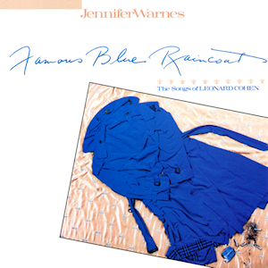

# Famous Blue Raincoat

By **Jennifer Warnes**

## Album Data

- **Catalog:** Beets
- **Format:** Digital, Album
- **Album:** Famous Blue Raincoat
- **Artist:** Jennifer Warnes
- **Albumartist:** Jennifer Warnes
- **Genre:** Pop
- **MusicBrainz Album Artist ID:** 
- **MusicBrainz Album ID:** 
- **MusicBrainz Release Group ID:** 
- **Year:** 1991
- **Catalog #:** 
- **Label:** 
- **Total Tracks:** 09

## Album Tracks

### Track 01 - First We Take Manhattan

- **Artist:** Jennifer Warnes
- **Format:** ALAC
- **Genre:** Rock
- **Length:** 3:46
- **MusicBrainz Track ID:** 
- **Title:** First We Take Manhattan
- **Track:** 01
- **Year:** 1991

### Track 02 - Bird On A Wire

- **Artist:** Jennifer Warnes
- **Format:** ALAC
- **Genre:** Rock
- **Length:** 4:42
- **MusicBrainz Track ID:** 
- **Title:** Bird On A Wire
- **Track:** 02
- **Year:** 1991

### Track 03 - Famous Blue Raincoat

- **Artist:** Jennifer Warnes
- **Format:** ALAC
- **Genre:** Rock
- **Length:** 5:33
- **MusicBrainz Track ID:** 
- **Title:** Famous Blue Raincoat
- **Track:** 03
- **Year:** 1991

### Track 04 - Joan Of Arc

- **Artist:** Jennifer Warnes
- **Format:** ALAC
- **Genre:** Rock
- **Length:** 8:01
- **MusicBrainz Track ID:** 
- **Title:** Joan Of Arc
- **Track:** 04
- **Year:** 1991

### Track 05 - Ain't No Cure For Love

- **Artist:** Jennifer Warnes
- **Format:** ALAC
- **Genre:** Soft Rock
- **Length:** 3:21
- **MusicBrainz Track ID:** 
- **Title:** Ain't No Cure For Love
- **Track:** 05
- **Year:** 1991

### Track 06 - Coming Back To You

- **Artist:** Jennifer Warnes
- **Format:** ALAC
- **Genre:** Pop
- **Length:** 3:44
- **MusicBrainz Track ID:** 
- **Title:** Coming Back To You
- **Track:** 06
- **Year:** 1991

### Track 07 - Song Of Bernardette

- **Artist:** Jennifer Warnes
- **Format:** ALAC
- **Genre:** Pop
- **Length:** 3:55
- **MusicBrainz Track ID:** 
- **Title:** Song Of Bernardette
- **Track:** 07
- **Year:** 1991

### Track 08 - A Singer Must Die

- **Artist:** Jennifer Warnes
- **Format:** ALAC
- **Genre:** Rock And Roll
- **Length:** 4:53
- **MusicBrainz Track ID:** 
- **Title:** A Singer Must Die
- **Track:** 08
- **Year:** 1991

### Track 09 - Came So Far For Beauty

- **Artist:** Jennifer Warnes
- **Format:** ALAC
- **Genre:** Rock
- **Length:** 3:37
- **MusicBrainz Track ID:** 
- **Title:** Came So Far For Beauty
- **Track:** 09
- **Year:** 1991

## See also

- [CD: Famous Blue Raincoat](../../CD/Jennifer_Warnes/Famous_Blue_Raincoat-_The_Songs_Of_Leonard_Cohen.md)
- [CD: ](../../CD/Jennifer_Warnes/Jennifer_Warnes.md)
- [Roon: Famous Blue Raincoat. Songs of Leonard Cohen](../../Roon/Jennifer_Warnes/Famous_Blue_Raincoat_Songs_of_Leonard_Cohen.md)
- [Roon: Jennifer Warnes](../../Roon/Jennifer_Warnes/Jennifer_Warnes.md)
- [Vinyl: Famous Blue Raincoat (The Songs Of Leonard Cohen)](../../Vinyl/Jennifer_Warnes/Famous_Blue_Raincoat_The_Songs_Of_Leonard_Cohen.md)
- [Vinyl: ](../../Vinyl/Jennifer_Warnes/Jennifer_Warnes.md)
