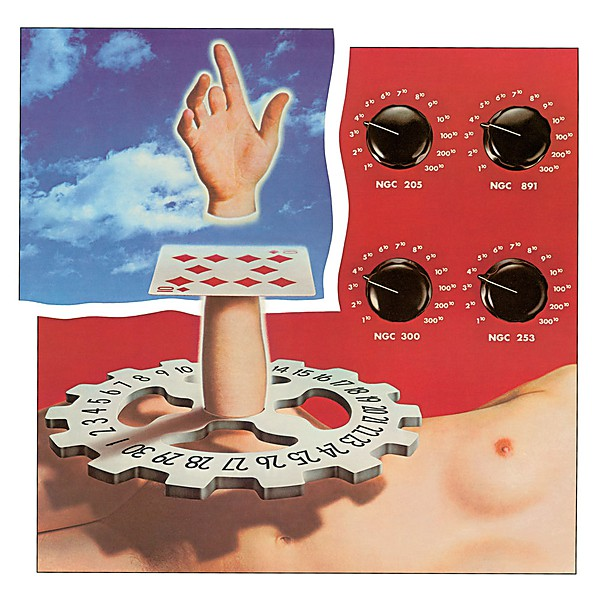

# Garcia

By **Jerry Garcia**

## Album Data

- **Catalog:** Beets
- **Format:** Digital, Album
- **Album:** Garcia
- **Artist:** Jerry Garcia
- **Albumartist:** Jerry Garcia
- **Genre:** Rock
- **MusicBrainz Album Artist ID:** [1ecff755-607d-4130-9a8a-8873f27e5de5](https://musicbrainz.org/artist/1ecff755-607d-4130-9a8a-8873f27e5de5)
- **MusicBrainz Album ID:** [e58f1f3b-41ca-4408-a671-5a7a118f9f13](https://musicbrainz.org/release/e58f1f3b-41ca-4408-a671-5a7a118f9f13)
- **MusicBrainz Release Group ID:** [da07817a-4c17-35fc-a28a-7eb636ac0a52](https://musicbrainz.org/release-group/da07817a-4c17-35fc-a28a-7eb636ac0a52)
- **Year:** 1988
- **Catalog #:** GDCD4003
- **Label:** Grateful Dead Records
- **Total Tracks:** 10

## Album Tracks

### Track 01 - Deal

- **Artist:** Jerry Garcia
- **Format:** MP3
- **Genre:** Psychedelic Rock
- **Length:** 3:15
- **MusicBrainz Track ID:** [99f43e0c-c322-4abb-9ddc-6b491b7de648](https://musicbrainz.org/recording/99f43e0c-c322-4abb-9ddc-6b491b7de648)
- **Title:** Deal
- **Track:** 01
- **Year:** 1988

### Track 02 - Bird Song

- **Artist:** Jerry Garcia
- **Format:** MP3
- **Genre:** Folk Rock
- **Length:** 4:29
- **MusicBrainz Track ID:** [568f04a7-fb5d-4649-9f08-fb2d63a76337](https://musicbrainz.org/recording/568f04a7-fb5d-4649-9f08-fb2d63a76337)
- **Title:** Bird Song
- **Track:** 02
- **Year:** 1988

### Track 03 - Sugaree

- **Artist:** Jerry Garcia
- **Format:** MP3
- **Genre:** Psychedelic Rock
- **Length:** 5:58
- **MusicBrainz Track ID:** [547988db-b022-4e1a-9bc6-ee8d423f5d0e](https://musicbrainz.org/recording/547988db-b022-4e1a-9bc6-ee8d423f5d0e)
- **Title:** Sugaree
- **Track:** 03
- **Year:** 1988

### Track 04 - Loser

- **Artist:** Jerry Garcia
- **Format:** MP3
- **Genre:** Country Rock
- **Length:** 4:12
- **MusicBrainz Track ID:** [dbd0eb52-42d1-43b0-b32c-3f486be1e486](https://musicbrainz.org/recording/dbd0eb52-42d1-43b0-b32c-3f486be1e486)
- **Title:** Loser
- **Track:** 04
- **Year:** 1988

### Track 05 - Late for Supper

- **Artist:** Jerry Garcia
- **Format:** MP3
- **Genre:** Rock
- **Length:** 1:37
- **MusicBrainz Track ID:** [35610fc6-838e-4a47-a688-73df034d699a](https://musicbrainz.org/recording/35610fc6-838e-4a47-a688-73df034d699a)
- **Title:** Late for Supper
- **Track:** 05
- **Year:** 1988

### Track 06 - Spidergawd

- **Artist:** Jerry Garcia
- **Format:** MP3
- **Genre:** Rock
- **Length:** 3:27
- **MusicBrainz Track ID:** [81cbac88-f39f-4fa9-b500-6f8717fc318d](https://musicbrainz.org/recording/81cbac88-f39f-4fa9-b500-6f8717fc318d)
- **Title:** Spidergawd
- **Track:** 06
- **Year:** 1988

### Track 07 - Eep Hour

- **Artist:** Jerry Garcia
- **Format:** MP3
- **Genre:** Rock
- **Length:** 5:10
- **MusicBrainz Track ID:** [3f5ca69f-7a1d-4ba4-b1fc-f45d4f744dc9](https://musicbrainz.org/recording/3f5ca69f-7a1d-4ba4-b1fc-f45d4f744dc9)
- **Title:** Eep Hour
- **Track:** 07
- **Year:** 1988

### Track 08 - To Lay Me Down

- **Artist:** Jerry Garcia
- **Format:** MP3
- **Genre:** Rock
- **Length:** 6:24
- **MusicBrainz Track ID:** [2e2a0910-b191-4cc6-a052-76c3e772db8a](https://musicbrainz.org/recording/2e2a0910-b191-4cc6-a052-76c3e772db8a)
- **Title:** To Lay Me Down
- **Track:** 08
- **Year:** 1988

### Track 09 - An Odd Little Place

- **Artist:** Jerry Garcia
- **Format:** MP3
- **Genre:** Rock
- **Length:** 1:38
- **MusicBrainz Track ID:** [7f44f552-afc1-4aef-bcf6-acff0730c0ad](https://musicbrainz.org/recording/7f44f552-afc1-4aef-bcf6-acff0730c0ad)
- **Title:** An Odd Little Place
- **Track:** 09
- **Year:** 1988

### Track 10 - The Wheel

- **Artist:** Jerry Garcia
- **Format:** MP3
- **Genre:** Folk Rock
- **Length:** 4:03
- **MusicBrainz Track ID:** [fdf262e0-1f67-4bff-9e12-7759d6b774ca](https://musicbrainz.org/recording/fdf262e0-1f67-4bff-9e12-7759d6b774ca)
- **Title:** The Wheel
- **Track:** 10
- **Year:** 1988

