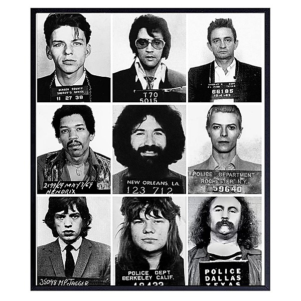

# The Pizza Tapes

By **Jerry Garcia, David Grisman, T**

## Album Data

- **Catalog:** Beets
- **Format:** Digital, Album
- **Album:** The Pizza Tapes
- **Artist:** Jerry Garcia, David Grisman, T
- **Albumartist:** Jerry Garcia, David Grisman, T
- **Genre:** Folk Rock
- **MusicBrainz Album Artist ID:** 
- **MusicBrainz Album ID:** 
- **MusicBrainz Release Group ID:** 
- **Year:** 2000
- **Catalog #:** 
- **Label:** 
- **Total Tracks:** 00

## Album Tracks

### Track 10 - Long Black Veil

- **Artist:** Jerry Garcia, David Grisman, T
- **Format:** AAC
- **Genre:** Americana
- **Length:** 4:30
- **MusicBrainz Track ID:** 
- **Title:** Long Black Veil
- **Track:** 10
- **Year:** 2000

### Track 20 - House Of The Rising Sun

- **Artist:** Jerry Garcia, David Grisman, T
- **Format:** AAC
- **Genre:** Folk Rock
- **Length:** 8:05
- **MusicBrainz Track ID:** 
- **Title:** House Of The Rising Sun
- **Track:** 20
- **Year:** 2000

