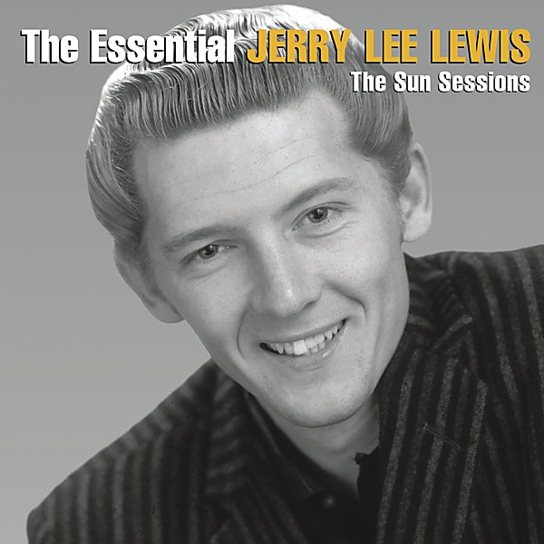

# The Session...Recorded in London with Great Artists

By **Jerry Lee Lewis**

## Album Data

- **Catalog:** Beets
- **Format:** Digital, Album
- **Album:** The Session...Recorded in London with Great Artists
- **Artist:** Jerry Lee Lewis
- **Albumartist:** Jerry Lee Lewis
- **Genre:** Rockabilly
- **MusicBrainz Album Artist ID:** 
- **MusicBrainz Album ID:** 
- **MusicBrainz Release Group ID:** 
- **Year:** 1998
- **Catalog #:** 
- **Label:** 
- **Total Tracks:** 00

## Album Tracks

### Track 00 - Whole Lotta Shakin'

- **Artist:** Jerry Lee Lewis
- **Format:** AAC
- **Genre:** Rockabilly
- **Length:** 2:53
- **MusicBrainz Track ID:** 
- **Title:** Whole Lotta Shakin'
- **Track:** 00
- **Year:** 1998

### Track 01 - Drinkin' Wine, Spo-Dee-O-Dee

- **Artist:** Jerry Lee Lewis
- **Format:** MP3
- **Genre:** Rockabilly
- **Length:** 3:43
- **MusicBrainz Track ID:** 
- **Title:** Drinkin' Wine, Spo-Dee-O-Dee
- **Track:** 01
- **Year:** 1973

### Track 02 - Music to the Man

- **Artist:** Jerry Lee Lewis
- **Format:** MP3
- **Genre:** Rockabilly
- **Length:** 4:46
- **MusicBrainz Track ID:** 
- **Title:** Music to the Man
- **Track:** 02
- **Year:** 1973

### Track 03 - Baby What You Want Me to Do

- **Artist:** Jerry Lee Lewis
- **Format:** MP3
- **Genre:** Country Blues
- **Length:** 4:08
- **MusicBrainz Track ID:** 
- **Title:** Baby What You Want Me to Do
- **Track:** 03
- **Year:** 1973

### Track 04 - Bad Moon Rising

- **Artist:** Jerry Lee Lewis
- **Format:** MP3
- **Genre:** Country
- **Length:** 2:44
- **MusicBrainz Track ID:** 
- **Title:** Bad Moon Rising
- **Track:** 04
- **Year:** 1973

### Track 05 - Sea Cruise

- **Artist:** Jerry Lee Lewis
- **Format:** MP3
- **Genre:** Rockabilly
- **Length:** 3:57
- **MusicBrainz Track ID:** 
- **Title:** Sea Cruise
- **Track:** 05
- **Year:** 1973

### Track 06 - Jukebox

- **Artist:** Jerry Lee Lewis
- **Format:** MP3
- **Genre:** Rockabilly
- **Length:** 4:46
- **MusicBrainz Track ID:** 
- **Title:** Jukebox
- **Track:** 06
- **Year:** 1973

### Track 07 - Don't Put No Headstone On My Grave

- **Artist:** Jerry Lee Lewis
- **Format:** MP3
- **Genre:** Blues
- **Length:** 5:28
- **MusicBrainz Track ID:** 
- **Title:** Don't Put No Headstone On My Grave
- **Track:** 07
- **Year:** 1973

### Track 08 - Big Boss Man

- **Artist:** Jerry Lee Lewis
- **Format:** MP3
- **Genre:** Rock And Roll
- **Length:** 3:49
- **MusicBrainz Track ID:** 
- **Title:** Big Boss Man
- **Track:** 08
- **Year:** 1973

### Track 09 - Pledging My Love

- **Artist:** Jerry Lee Lewis
- **Format:** MP3
- **Genre:** Rockabilly
- **Length:** 2:26
- **MusicBrainz Track ID:** 
- **Title:** Pledging My Love
- **Track:** 09
- **Year:** 1973

### Track 10 - Memphis Tennessee

- **Artist:** Jerry Lee Lewis
- **Format:** MP3
- **Genre:** Rockabilly
- **Length:** 4:06
- **MusicBrainz Track ID:** 
- **Title:** Memphis Tennessee
- **Track:** 10
- **Year:** 1973

### Track 11 - Trouble In Mind

- **Artist:** Jerry Lee Lewis
- **Format:** MP3
- **Genre:** Country Blues
- **Length:** 5:53
- **MusicBrainz Track ID:** 
- **Title:** Trouble In Mind
- **Track:** 11
- **Year:** 1973

### Track 12 - Johnny B. Goode

- **Artist:** Jerry Lee Lewis
- **Format:** MP3
- **Genre:** Swing
- **Length:** 3:34
- **MusicBrainz Track ID:** 
- **Title:** Johnny B. Goode
- **Track:** 12
- **Year:** 1973

### Track 13 - High School Confidential

- **Artist:** Jerry Lee Lewis
- **Format:** MP3
- **Genre:** Rockabilly
- **Length:** 3:32
- **MusicBrainz Track ID:** 
- **Title:** High School Confidential
- **Track:** 13
- **Year:** 1973

### Track 14 - Early Morning Rain

- **Artist:** Jerry Lee Lewis
- **Format:** MP3
- **Genre:** Country
- **Length:** 4:23
- **MusicBrainz Track ID:** 
- **Title:** Early Morning Rain
- **Track:** 14
- **Year:** 1973

### Track 15 - Whole Lotta Shakin' Going On

- **Artist:** Jerry Lee Lewis
- **Format:** MP3
- **Genre:** Rockabilly
- **Length:** 4:02
- **MusicBrainz Track ID:** 
- **Title:** Whole Lotta Shakin' Going On
- **Track:** 15
- **Year:** 1973

### Track 16 - Sixty Minute Man

- **Artist:** Jerry Lee Lewis
- **Format:** MP3
- **Genre:** Country
- **Length:** 3:41
- **MusicBrainz Track ID:** 
- **Title:** Sixty Minute Man
- **Track:** 16
- **Year:** 1973

### Track 17 - Move On Down The Line

- **Artist:** Jerry Lee Lewis
- **Format:** MP3
- **Genre:** Rockabilly
- **Length:** 3:32
- **MusicBrainz Track ID:** 
- **Title:** Move On Down The Line
- **Track:** 17
- **Year:** 1973

### Track 18 - What'd I Say

- **Artist:** Jerry Lee Lewis
- **Format:** MP3
- **Genre:** Rockabilly
- **Length:** 5:04
- **MusicBrainz Track ID:** 
- **Title:** What'd I Say
- **Track:** 18
- **Year:** 1973

### Track 19 - Good Golly Miss Molly - Long Tall Sally - Tutti Frutti

- **Artist:** Jerry Lee Lewis
- **Format:** MP3
- **Genre:** Rockabilly
- **Length:** 3:56
- **MusicBrainz Track ID:** 
- **Title:** Good Golly Miss Molly - Long Tall Sally - Tutti Frutti
- **Track:** 19
- **Year:** 1973

## See also

- [Vinyl: ](../../Vinyl/Jerry_Lee_Lewis/Jerry_Lee_Lewis.md)
- [Vinyl: The Session Recorded In London With Great Guest Artists](../../Vinyl/Jerry_Lee_Lewis/The_Session_Recorded_In_London_With_Great_Guest_Artists.md)
- [Vinyl: Waiting For A Train (All Around The Watertank)](../../Vinyl/Jerry_Lee_Lewis/Waiting_For_A_Train_All_Around_The_Watertank.md)
