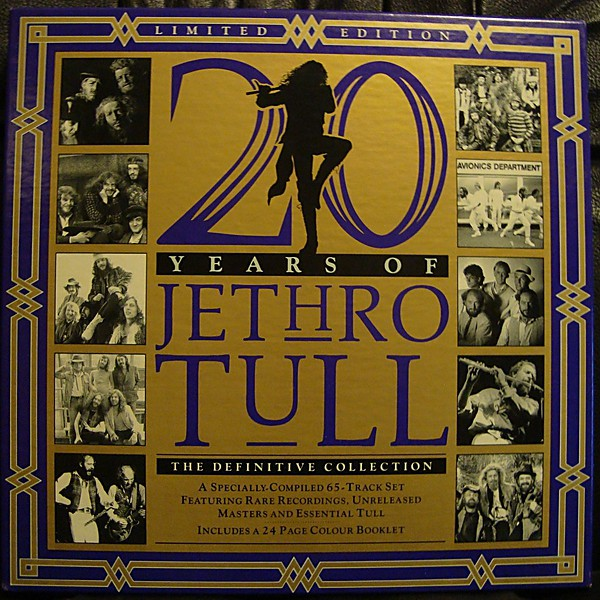

# 20 Years of Jethro Tull Disc 1

By **Jethro Tull**

## Album Data

- **Catalog:** Beets
- **Format:** Digital, Album
- **Album:** 20 Years of Jethro Tull Disc 1
- **Artist:** Jethro Tull
- **Albumartist:** Jethro Tull
- **Genre:** Progressive Rock
- **MusicBrainz Album Artist ID:** 
- **MusicBrainz Album ID:** 
- **MusicBrainz Release Group ID:** 
- **Year:** 1988
- **Catalog #:** 
- **Label:** Capitol
- **Total Tracks:** 00

## Album Tracks

### Track 01 - Lick Your Fingers Clean

- **Artist:** Jethro Tull
- **Format:** MP3
- **Genre:** Progressive Rock
- **Length:** 2:46
- **MusicBrainz Track ID:** 
- **Title:** Lick Your Fingers Clean
- **Track:** 01
- **Year:** 1988

### Track 02 - The Chateau d'Isaster Tapes

- **Artist:** Jethro Tull
- **Format:** MP3
- **Genre:** Progressive Rock
- **Length:** 11:11
- **MusicBrainz Track ID:** 
- **Title:** The Chateau d'Isaster Tapes
- **Track:** 02
- **Year:** 1988

### Track 03 - Beltane

- **Artist:** Jethro Tull
- **Format:** MP3
- **Genre:** Progressive Rock
- **Length:** 5:19
- **MusicBrainz Track ID:** 
- **Title:** Beltane
- **Track:** 03
- **Year:** 1988

### Track 04 - Crossword

- **Artist:** Jethro Tull
- **Format:** MP3
- **Genre:** Progressive Rock
- **Length:** 3:35
- **MusicBrainz Track ID:** 
- **Title:** Crossword
- **Track:** 04
- **Year:** 1988

### Track 05 - Saturation

- **Artist:** Jethro Tull
- **Format:** MP3
- **Genre:** Progressive Rock
- **Length:** 4:20
- **MusicBrainz Track ID:** 
- **Title:** Saturation
- **Track:** 05
- **Year:** 1988

### Track 06 - Jack-A-Lynn

- **Artist:** Jethro Tull
- **Format:** MP3
- **Genre:** Progressive Rock
- **Length:** 4:39
- **MusicBrainz Track ID:** 
- **Title:** Jack-A-Lynn
- **Track:** 06
- **Year:** 1988

### Track 07 - Motoreyes

- **Artist:** Jethro Tull
- **Format:** MP3
- **Genre:** Progressive Rock
- **Length:** 3:38
- **MusicBrainz Track ID:** 
- **Title:** Motoreyes
- **Track:** 07
- **Year:** 1988

### Track 08 - Blues Instrumental [Untitled]

- **Artist:** Jethro Tull
- **Format:** MP3
- **Genre:** Progressive Rock
- **Length:** 5:16
- **MusicBrainz Track ID:** 
- **Title:** Blues Instrumental [Untitled]
- **Track:** 08
- **Year:** 1988

### Track 09 - Rhythm in Gold

- **Artist:** Jethro Tull
- **Format:** MP3
- **Genre:** Progressive Rock
- **Length:** 3:07
- **MusicBrainz Track ID:** 
- **Title:** Rhythm in Gold
- **Track:** 09
- **Year:** 1988

### Track 10 - Part of the Machine

- **Artist:** Jethro Tull
- **Format:** MP3
- **Genre:** Progressive Rock
- **Length:** 6:54
- **MusicBrainz Track ID:** 
- **Title:** Part of the Machine
- **Track:** 10
- **Year:** 1988

### Track 11 - Mayhem, Maybe

- **Artist:** Jethro Tull
- **Format:** MP3
- **Genre:** Progressive Rock
- **Length:** 3:04
- **MusicBrainz Track ID:** 
- **Title:** Mayhem, Maybe
- **Track:** 11
- **Year:** 1988

### Track 12 - Overhang

- **Artist:** Jethro Tull
- **Format:** MP3
- **Genre:** Progressive Rock
- **Length:** 4:27
- **MusicBrainz Track ID:** 
- **Title:** Overhang
- **Track:** 12
- **Year:** 1988

### Track 13 - Kelpie

- **Artist:** Jethro Tull
- **Format:** MP3
- **Genre:** Progressive Rock
- **Length:** 3:30
- **MusicBrainz Track ID:** 
- **Title:** Kelpie
- **Track:** 13
- **Year:** 1988

### Track 14 - Living in These Hard Times

- **Artist:** Jethro Tull
- **Format:** MP3
- **Genre:** Progressive Rock
- **Length:** 3:09
- **MusicBrainz Track ID:** 
- **Title:** Living in These Hard Times
- **Track:** 14
- **Year:** 1988

### Track 15 - Under Wraps, No. 2

- **Artist:** Jethro Tull
- **Format:** MP3
- **Genre:** Progressive Rock
- **Length:** 2:14
- **MusicBrainz Track ID:** 
- **Title:** Under Wraps, No. 2
- **Track:** 15
- **Year:** 1988

### Track 16 - Only Solitaire

- **Artist:** Jethro Tull
- **Format:** MP3
- **Genre:** Progressive Rock
- **Length:** 1:29
- **MusicBrainz Track ID:** 
- **Title:** Only Solitaire
- **Track:** 16
- **Year:** 1988

### Track 17 - Salamander

- **Artist:** Jethro Tull
- **Format:** MP3
- **Genre:** Progressive Rock
- **Length:** 2:50
- **MusicBrainz Track ID:** 
- **Title:** Salamander
- **Track:** 17
- **Year:** 1988

### Track 18 - Moths

- **Artist:** Jethro Tull
- **Format:** MP3
- **Genre:** Progressive Rock
- **Length:** 3:25
- **MusicBrainz Track ID:** 
- **Title:** Moths
- **Track:** 18
- **Year:** 1988

### Track 19 - Nursie

- **Artist:** Jethro Tull
- **Format:** MP3
- **Genre:** Progressive Rock
- **Length:** 1:34
- **MusicBrainz Track ID:** 
- **Title:** Nursie
- **Track:** 19
- **Year:** 1988

