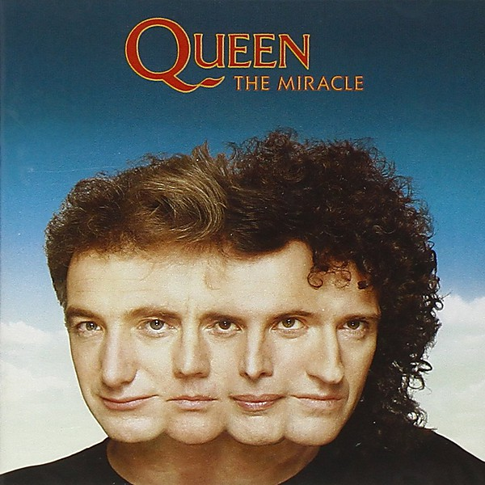

# 20 Years of Jethro Tull Disc 2

By **Jethro Tull**

## Album Data

- **Catalog:** Beets
- **Format:** Digital, Album
- **Album:** 20 Years of Jethro Tull Disc 2
- **Artist:** Jethro Tull
- **Albumartist:** Jethro Tull
- **Genre:** Progressive Rock
- **MusicBrainz Album Artist ID:** 
- **MusicBrainz Album ID:** 
- **MusicBrainz Release Group ID:** 
- **Year:** 1988
- **Catalog #:** 
- **Label:** Capitol
- **Total Tracks:** 00

## Album Tracks

### Track 01 - Witch's Promise

- **Artist:** Jethro Tull
- **Format:** MP3
- **Genre:** Progressive Rock
- **Length:** 3:49
- **MusicBrainz Track ID:** 
- **Title:** Witch's Promise
- **Track:** 01
- **Year:** 1988

### Track 02 - Bungle in the Jungle

- **Artist:** Jethro Tull
- **Format:** MP3
- **Genre:** Progressive Rock
- **Length:** 3:35
- **MusicBrainz Track ID:** 
- **Title:** Bungle in the Jungle
- **Track:** 02
- **Year:** 1988

### Track 03 - Farm on the Freeway

- **Artist:** Jethro Tull
- **Format:** MP3
- **Genre:** Progressive Rock
- **Length:** 6:47
- **MusicBrainz Track ID:** 
- **Title:** Farm on the Freeway
- **Track:** 03
- **Year:** 1988

### Track 04 - Thick as a Brick

- **Artist:** Jethro Tull
- **Format:** MP3
- **Genre:** Progressive Rock
- **Length:** 6:38
- **MusicBrainz Track ID:** 
- **Title:** Thick as a Brick
- **Track:** 04
- **Year:** 1988

### Track 05 - Sweet Dream

- **Artist:** Jethro Tull
- **Format:** MP3
- **Genre:** Progressive Rock
- **Length:** 4:34
- **MusicBrainz Track ID:** 
- **Title:** Sweet Dream
- **Track:** 05
- **Year:** 1988

### Track 06 - The Clasp

- **Artist:** Jethro Tull
- **Format:** MP3
- **Genre:** Progressive Rock
- **Length:** 3:30
- **MusicBrainz Track ID:** 
- **Title:** The Clasp
- **Track:** 06
- **Year:** 1988

### Track 07 - Pibroch (Pee-Break)/Black Satin Dancer [Instrumental]

- **Artist:** Jethro Tull
- **Format:** MP3
- **Genre:** Progressive Rock
- **Length:** 4:01
- **MusicBrainz Track ID:** 
- **Title:** Pibroch (Pee-Break)/Black Satin Dancer [Instrumental]
- **Track:** 07
- **Year:** 1988

### Track 08 - Fallen on Hard Times

- **Artist:** Jethro Tull
- **Format:** MP3
- **Genre:** Progressive Rock
- **Length:** 3:59
- **MusicBrainz Track ID:** 
- **Title:** Fallen on Hard Times
- **Track:** 08
- **Year:** 1988

### Track 09 - Cheap Day Return

- **Artist:** Jethro Tull
- **Format:** MP3
- **Genre:** Progressive Rock
- **Length:** 1:21
- **MusicBrainz Track ID:** 
- **Title:** Cheap Day Return
- **Track:** 09
- **Year:** 1988

### Track 10 - Wond'ring Aloud

- **Artist:** Jethro Tull
- **Format:** MP3
- **Genre:** Progressive Rock
- **Length:** 1:54
- **MusicBrainz Track ID:** 
- **Title:** Wond'ring Aloud
- **Track:** 10
- **Year:** 1988

### Track 11 - Dun Ringill

- **Artist:** Jethro Tull
- **Format:** MP3
- **Genre:** Progressive Rock
- **Length:** 3:04
- **MusicBrainz Track ID:** 
- **Title:** Dun Ringill
- **Track:** 11
- **Year:** 1988

### Track 12 - Life Is a Long Song

- **Artist:** Jethro Tull
- **Format:** MP3
- **Genre:** Progressive Rock
- **Length:** 3:18
- **MusicBrainz Track ID:** 
- **Title:** Life Is a Long Song
- **Track:** 12
- **Year:** 1988

### Track 13 - One White Duck/0=Nothing at All

- **Artist:** Jethro Tull
- **Format:** MP3
- **Genre:** Soft Rock
- **Length:** 4:35
- **MusicBrainz Track ID:** 
- **Title:** One White Duck/0=Nothing at All
- **Track:** 13
- **Year:** 1988

### Track 14 - Songs from the Wood

- **Artist:** Jethro Tull
- **Format:** MP3
- **Genre:** Progressive Rock
- **Length:** 4:29
- **MusicBrainz Track ID:** 
- **Title:** Songs from the Wood
- **Track:** 14
- **Year:** 1988

### Track 15 - Living in the Past

- **Artist:** Jethro Tull
- **Format:** MP3
- **Genre:** Progressive Rock
- **Length:** 4:06
- **MusicBrainz Track ID:** 
- **Title:** Living in the Past
- **Track:** 15
- **Year:** 1988

### Track 16 - Teacher

- **Artist:** Jethro Tull
- **Format:** MP3
- **Genre:** Progressive Rock
- **Length:** 4:48
- **MusicBrainz Track ID:** 
- **Title:** Teacher
- **Track:** 16
- **Year:** 1988

### Track 17 - Aqualung

- **Artist:** Jethro Tull
- **Format:** MP3
- **Genre:** Progressive Rock
- **Length:** 7:43
- **MusicBrainz Track ID:** 
- **Title:** Aqualung
- **Track:** 17
- **Year:** 1988

### Track 18 - Locomotive Breath

- **Artist:** Jethro Tull
- **Format:** MP3
- **Genre:** Progressive Rock
- **Length:** 6:00
- **MusicBrainz Track ID:** 
- **Title:** Locomotive Breath
- **Track:** 18
- **Year:** 1988

