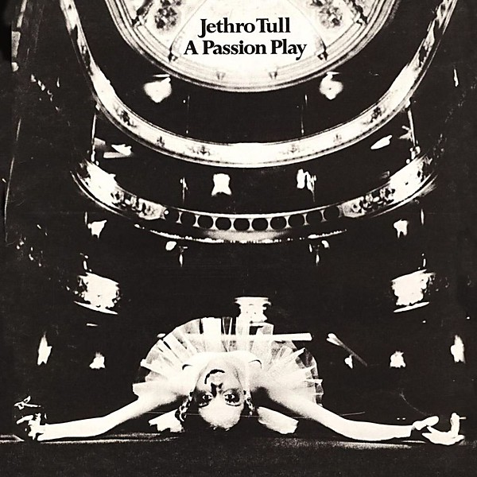

# A Passion Play

By **Jethro Tull**

## Album Data

- **Catalog:** Beets
- **Format:** Digital, Album
- **Album:** A Passion Play
- **Artist:** Jethro Tull
- **Albumartist:** Jethro Tull
- **Genre:** Progressive Rock
- **MusicBrainz Album Artist ID:** 
- **MusicBrainz Album ID:** 
- **MusicBrainz Release Group ID:** 
- **Year:** 1973
- **Catalog #:** 
- **Label:** 
- **Total Tracks:** 15

## Album Tracks

### Track 01 - Lifebeats / Prelude

- **Artist:** Jethro Tull
- **Format:** ALAC
- **Genre:** Progressive Rock
- **Length:** 3:23
- **MusicBrainz Track ID:** [99b02aa2-1454-443a-8e7f-8f1c8c01d89a](https://musicbrainz.org/recording/99b02aa2-1454-443a-8e7f-8f1c8c01d89a)
- **Title:** Lifebeats / Prelude
- **Track:** 01
- **Year:** 2014

### Track 02 - The Silver Cord

- **Artist:** Jethro Tull
- **Format:** ALAC
- **Genre:** Progressive Rock
- **Length:** 4:27
- **MusicBrainz Track ID:** [31487dfa-3bbb-4d88-a38d-46acaa7aff97](https://musicbrainz.org/recording/31487dfa-3bbb-4d88-a38d-46acaa7aff97)
- **Title:** The Silver Cord
- **Track:** 02
- **Year:** 2014

### Track 03 - Re-assuring Tune

- **Artist:** Jethro Tull
- **Format:** ALAC
- **Genre:** Progressive Rock
- **Length:** 1:10
- **MusicBrainz Track ID:** [5401864a-f821-419c-a76b-a4cacb2e4087](https://musicbrainz.org/recording/5401864a-f821-419c-a76b-a4cacb2e4087)
- **Title:** Re-assuring Tune
- **Track:** 03
- **Year:** 2014

### Track 04 - Memory Bank

- **Artist:** Jethro Tull
- **Format:** ALAC
- **Genre:** Progressive Rock
- **Length:** 4:20
- **MusicBrainz Track ID:** [89d56eb4-c3d5-4824-9317-2a2d35bdc95f](https://musicbrainz.org/recording/89d56eb4-c3d5-4824-9317-2a2d35bdc95f)
- **Title:** Memory Bank
- **Track:** 04
- **Year:** 2014

### Track 05 - Best Friends

- **Artist:** Jethro Tull
- **Format:** ALAC
- **Genre:** Progressive Rock
- **Length:** 1:55
- **MusicBrainz Track ID:** [f0194ff5-a6fc-4046-950d-87133f07eb7e](https://musicbrainz.org/recording/f0194ff5-a6fc-4046-950d-87133f07eb7e)
- **Title:** Best Friends
- **Track:** 05
- **Year:** 2014

### Track 06 - Critique Oblique

- **Artist:** Jethro Tull
- **Format:** ALAC
- **Genre:** Progressive Rock
- **Length:** 4:34
- **MusicBrainz Track ID:** [2cb26279-dc61-4724-b3e3-eb6ca8a4a4df](https://musicbrainz.org/recording/2cb26279-dc61-4724-b3e3-eb6ca8a4a4df)
- **Title:** Critique Oblique
- **Track:** 06
- **Year:** 2014

### Track 07 - Forest Dance #1

- **Artist:** Jethro Tull
- **Format:** ALAC
- **Genre:** Progressive Rock
- **Length:** 1:33
- **MusicBrainz Track ID:** [60fb3824-87dd-4676-a211-840880ae99ed](https://musicbrainz.org/recording/60fb3824-87dd-4676-a211-840880ae99ed)
- **Title:** Forest Dance #1
- **Track:** 07
- **Year:** 2014

### Track 08 - The Story of the Hare Who Lost His Spectacles

- **Artist:** Jethro Tull
- **Format:** ALAC
- **Genre:** Progressive Rock
- **Length:** 4:09
- **MusicBrainz Track ID:** [250acbd7-a980-4878-ab74-9055488110e9](https://musicbrainz.org/recording/250acbd7-a980-4878-ab74-9055488110e9)
- **Title:** The Story of the Hare Who Lost His Spectacles
- **Track:** 08
- **Year:** 2014

### Track 09 - Forest Dance #2

- **Artist:** Jethro Tull
- **Format:** ALAC
- **Genre:** Progressive Rock
- **Length:** 1:12
- **MusicBrainz Track ID:** [101cbb04-feb6-40ba-b869-ee5fb0682d1c](https://musicbrainz.org/recording/101cbb04-feb6-40ba-b869-ee5fb0682d1c)
- **Title:** Forest Dance #2
- **Track:** 09
- **Year:** 2014

### Track 10 - The Foot of Our Stairs

- **Artist:** Jethro Tull
- **Format:** ALAC
- **Genre:** Progressive Rock
- **Length:** 5:07
- **MusicBrainz Track ID:** [ffe37679-f02d-4fe1-8712-1ee5b53a7e87](https://musicbrainz.org/recording/ffe37679-f02d-4fe1-8712-1ee5b53a7e87)
- **Title:** The Foot of Our Stairs
- **Track:** 10
- **Year:** 2014

### Track 11 - Overseer Overture

- **Artist:** Jethro Tull
- **Format:** ALAC
- **Genre:** Progressive Rock
- **Length:** 3:58
- **MusicBrainz Track ID:** [76b238bf-acff-4236-9992-bbf8ad709b00](https://musicbrainz.org/recording/76b238bf-acff-4236-9992-bbf8ad709b00)
- **Title:** Overseer Overture
- **Track:** 11
- **Year:** 2014

### Track 12 - Flight From Lucifer

- **Artist:** Jethro Tull
- **Format:** ALAC
- **Genre:** Progressive Rock
- **Length:** 3:56
- **MusicBrainz Track ID:** [424722a9-696a-4410-866f-d76ebd153505](https://musicbrainz.org/recording/424722a9-696a-4410-866f-d76ebd153505)
- **Title:** Flight From Lucifer
- **Track:** 12
- **Year:** 2014

### Track 13 - 10.08 to Paddington

- **Artist:** Jethro Tull
- **Format:** ALAC
- **Genre:** Progressive Rock
- **Length:** 1:04
- **MusicBrainz Track ID:** [4b186c58-5321-44d4-8fff-7d0e728d48d4](https://musicbrainz.org/recording/4b186c58-5321-44d4-8fff-7d0e728d48d4)
- **Title:** 10.08 to Paddington
- **Track:** 13
- **Year:** 2014

### Track 14 - Magus Perdé

- **Artist:** Jethro Tull
- **Format:** ALAC
- **Genre:** Progressive Rock
- **Length:** 3:53
- **MusicBrainz Track ID:** [006ce750-2273-4676-aaf7-1c208a81fd55](https://musicbrainz.org/recording/006ce750-2273-4676-aaf7-1c208a81fd55)
- **Title:** Magus Perdé
- **Track:** 14
- **Year:** 2014

### Track 15 - Epilogue

- **Artist:** Jethro Tull
- **Format:** ALAC
- **Genre:** Progressive Rock
- **Length:** 0:44
- **MusicBrainz Track ID:** [cf696c29-ad2b-4401-86ca-fdcfdb03f8fe](https://musicbrainz.org/recording/cf696c29-ad2b-4401-86ca-fdcfdb03f8fe)
- **Title:** Epilogue
- **Track:** 15
- **Year:** 2014

## See also

- [20 Years of Jethro Tull Disc 1](20_Years_of_Jethro_Tull_Disc_1.md)
- [20 Years of Jethro Tull Disc 2](20_Years_of_Jethro_Tull_Disc_2.md)
- [20 Years of Jethro Tull Disc 3](20_Years_of_Jethro_Tull_Disc_3.md)
- [A Passion Play (Steven Wilson mix) DVD rip](A_Passion_Play_Steven_Wilson_mix_DVD_rip.md)
- [A Passion Play (Steven Wilson mix)](A_Passion_Play_Steven_Wilson_mix.md)
- [Aqualung 40th Anniversary Adapted Edition](Aqualung_40th_Anniversary_Adapted_Edition.md)
- [Aqualung](Aqualung.md)
- [J-Tull Dot Com](J-Tull_Dot_Com.md)
- [Live in Concert at Landover 1977](Live_in_Concert_at_Landover_1977.md)
- [Minstrel in the Gallery](Minstrel_in_the_Gallery.md)
- [Songs From The Wood (40th Anniversary Edition)](Songs_From_The_Wood_40th_Anniversary_Edition.md)
- [Songs From the Wood](Songs_From_the_Wood.md)
- [Stand Up – The Elevated Edition (Live At The Stockholm Konserthuset, 9-1-1969)](Stand_Up_–_The_Elevated_Edition_Live_At_The_Stockholm_Konserthuset__9-1-1969.md)
- [Stand Up – The Elevated Edition (Steve Wilson Stereo Remix)](Stand_Up_–_The_Elevated_Edition_Steve_Wilson_Stereo_Remix.md)
- [The Château d’Hérouville Sessions](The_Château_d’Hérouville_Sessions.md)
- [The Jethro Tull Christmas Album](The_Jethro_Tull_Christmas_Album.md)
- [Too Old To Rock 'n' Roll](Too_Old_To_Rock_n_Roll.md)
- [WarChild (A New Steven Wilson Stereo Remix)](WarChild_A_New_Steven_Wilson_Stereo_Remix.md)
- [WarChild D2 - The Second Act](WarChild_D2_-_The_Second_Act.md)
- [CD: 20 Years Of Jethro Tull - The Definitive Collection (Disc 1)](../../CD/Jethro_Tull/20_Years_Of_Jethro_Tull_-_The_Definitive_Collection_Disc_1.md)
- [CD: 20 Years Of Jethro Tull - The Definitive Collection (Disc 2)](../../CD/Jethro_Tull/20_Years_Of_Jethro_Tull_-_The_Definitive_Collection_Disc_2.md)
- [CD: 20 Years Of Jethro Tull - The Definitive Collection (Disc 3)](../../CD/Jethro_Tull/20_Years_Of_Jethro_Tull_-_The_Definitive_Collection_Disc_3.md)
- [CD: ](../../CD/Jethro_Tull/Jethro_Tull.md)
- [Roon: A Passion Play (Steven Wilson Mix)](../../Roon/Jethro_Tull/A_Passion_Play_Steven_Wilson_Mix.md)
- [Roon: Aqualung (Steven Wilson Mix and Master)](../../Roon/Jethro_Tull/Aqualung_Steven_Wilson_Mix_and_Master.md)
- [Roon: Benefit (Steven Wilson Mix)](../../Roon/Jethro_Tull/Benefit_Steven_Wilson_Mix.md)
- [Roon: Crest of a Knave (2005 Remaster)](../../Roon/Jethro_Tull/Crest_of_a_Knave_2005_Remaster.md)
- [Roon: Heavy Horses (Steven Wilson Remix)](../../Roon/Jethro_Tull/Heavy_Horses_Steven_Wilson_Remix.md)
- [Roon: Jethro Tull - The String Quartets](../../Roon/Jethro_Tull/Jethro_Tull_-_The_String_Quartets.md)
- [Roon: Living in the Past](../../Roon/Jethro_Tull/Living_in_the_Past.md)
- [Roon: Man of God (Steven Wilson Stereo Remix)](../../Roon/Jethro_Tull/Man_of_God_Steven_Wilson_Stereo_Remix.md)
- [Roon: Minstrel in the Gallery (40th Anniversary Edition)](../../Roon/Jethro_Tull/Minstrel_in_the_Gallery_40th_Anniversary_Edition.md)
- [Roon: Songs from the Wood (40th Anniversary Edition; The Steven Wilson Remix)](../../Roon/Jethro_Tull/Songs_from_the_Wood_40th_Anniversary_Edition;_The_Steven_Wilson_Remix.md)
- [Roon: Stand Up (Steven Wilson Remix)](../../Roon/Jethro_Tull/Stand_Up_Steven_Wilson_Remix.md)
- [Roon: Thick as a Brick (Steven Wilson Mix and Master)](../../Roon/Jethro_Tull/Thick_as_a_Brick_Steven_Wilson_Mix_and_Master.md)
- [Roon: This Was (50th Anniversary Edition)](../../Roon/Jethro_Tull/This_Was_50th_Anniversary_Edition.md)
- [Roon: Too Old to Rock 'n' Roll](../../Roon/Jethro_Tull/Too_Old_to_Rock_n_Roll-_Too_Young_to_Die!_The_TV_Special_Edition.md)
- [Vinyl: Aqualung (The 2011 Steven Wilson Stereo Remix)](../../Vinyl/Jethro_Tull/Aqualung_The_2011_Steven_Wilson_Stereo_Remix.md)
- [Vinyl: ](../../Vinyl/Jethro_Tull/Jethro_Tull.md)
- [Vinyl: Minstrel In The Gallery (40th Anniversary LP Édition)](../../Vinyl/Jethro_Tull/Minstrel_In_The_Gallery_40th_Anniversary_LP_Édition.md)
- [Vinyl: Songs From The Wood](../../Vinyl/Jethro_Tull/Songs_From_The_Wood.md)
- [Vinyl: Thick As A Brick](../../Vinyl/Jethro_Tull/Thick_As_A_Brick.md)
