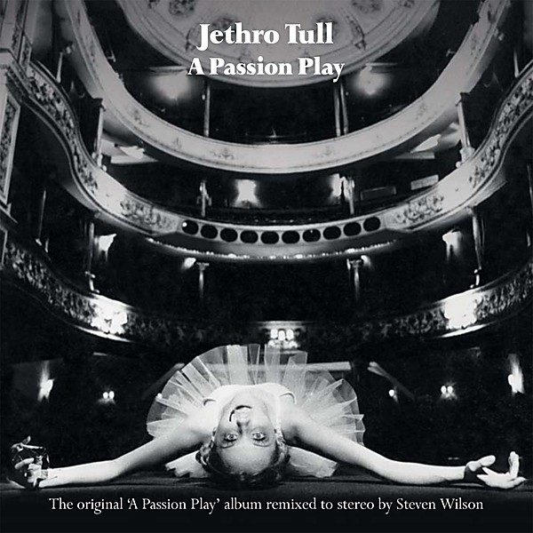

# A Passion Play (Steven Wilson mix)

By **Jethro Tull**

## Album Data

- **Catalog:** Beets
- **Format:** Digital, Album
- **Album:** A Passion Play (Steven Wilson mix)
- **Artist:** Jethro Tull
- **Albumartist:** Jethro Tull
- **Genre:** Progressive Rock
- **MusicBrainz Album Artist ID:** 
- **MusicBrainz Album ID:** 
- **MusicBrainz Release Group ID:** 
- **Year:** 2014
- **Catalog #:** 
- **Label:** 
- **Total Tracks:** 00

## Album Tracks

### Track 00 - 2014 Remix Acts_I-IV

- **Artist:** Jethro Tull
- **Format:** AAC
- **Genre:** Progressive Rock
- **Length:** 45:31
- **MusicBrainz Track ID:** 
- **Title:** 2014 Remix Acts_I-IV
- **Track:** 00
- **Year:** 1973

### Track 00 - Intro_Outro_Films

- **Artist:** Jethro Tull
- **Format:** AAC
- **Genre:** Progressive Rock
- **Length:** 0:00
- **MusicBrainz Track ID:** 
- **Title:** Intro_Outro_Films
- **Track:** 00
- **Year:** 1973

### Track 00 - Original_1973_Mix_Side_1

- **Artist:** Jethro Tull
- **Format:** AAC
- **Genre:** Progressive Rock
- **Length:** 23:10
- **MusicBrainz Track ID:** 
- **Title:** Original_1973_Mix_Side_1
- **Track:** 00
- **Year:** 1973

### Track 00 - Original_1973_Mix_Side_2

- **Artist:** Jethro Tull
- **Format:** AAC
- **Genre:** Progressive Rock
- **Length:** 22:02
- **MusicBrainz Track ID:** 
- **Title:** Original_1973_Mix_Side_2
- **Track:** 00
- **Year:** 1973

### Track 00 - The_Story_Of_The_Hare_Who_Lost_His_Spectacles

- **Artist:** Jethro Tull
- **Format:** AAC
- **Genre:** Progressive Rock
- **Length:** 7:20
- **MusicBrainz Track ID:** 
- **Title:** The_Story_Of_The_Hare_Who_Lost_His_Spectacles
- **Track:** 00
- **Year:** 1973

