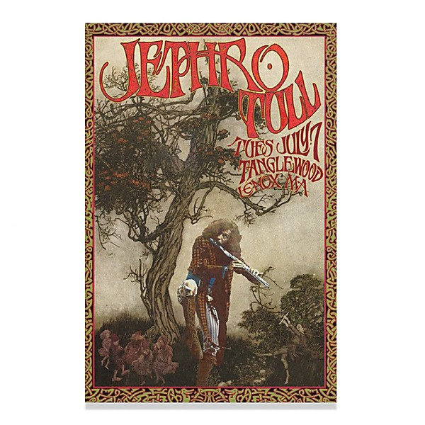

# Live in Concert at Landover 1977

By **Jethro Tull**

## Album Data

- **Catalog:** Beets
- **Format:** Digital, Album
- **Album:** Live in Concert at Landover 1977
- **Artist:** Jethro Tull
- **Albumartist:** Jethro Tull
- **Genre:** Progressive Rock
- **MusicBrainz Album Artist ID:** 
- **MusicBrainz Album ID:** 
- **MusicBrainz Release Group ID:** 
- **Year:** 1977
- **Catalog #:** DIDX 2079
- **Label:** Chrysalis
- **Total Tracks:** 07

## Album Tracks

### Track 01 - Minstrel in the Gallery

- **Artist:** Jethro Tull
- **Format:** ALAC
- **Genre:** Progressive Rock
- **Length:** 8:13
- **MusicBrainz Track ID:** [cecce698-905c-42b3-8cb8-a394f063c35c](https://musicbrainz.org/recording/cecce698-905c-42b3-8cb8-a394f063c35c)
- **Title:** Minstrel in the Gallery
- **Track:** 01
- **Year:** 1986

### Track 02 - Cold Wind to Valhalla

- **Artist:** Jethro Tull
- **Format:** ALAC
- **Genre:** Progressive Rock
- **Length:** 4:20
- **MusicBrainz Track ID:** [e9134143-bc75-4a66-8f30-455398e60f42](https://musicbrainz.org/recording/e9134143-bc75-4a66-8f30-455398e60f42)
- **Title:** Cold Wind to Valhalla
- **Track:** 02
- **Year:** 1986

### Track 03 - Black Satin Dancer

- **Artist:** Jethro Tull
- **Format:** ALAC
- **Genre:** Progressive Rock
- **Length:** 6:53
- **MusicBrainz Track ID:** [ba3a5eac-2807-4e8e-bbdd-a29039b659e4](https://musicbrainz.org/recording/ba3a5eac-2807-4e8e-bbdd-a29039b659e4)
- **Title:** Black Satin Dancer
- **Track:** 03
- **Year:** 1986

### Track 04 - Requiem

- **Artist:** Jethro Tull
- **Format:** ALAC
- **Genre:** Soft Rock
- **Length:** 3:45
- **MusicBrainz Track ID:** [4ac61a59-ac56-4d9c-9df4-202b40a2d591](https://musicbrainz.org/recording/4ac61a59-ac56-4d9c-9df4-202b40a2d591)
- **Title:** Requiem
- **Track:** 04
- **Year:** 1986

### Track 05 - One White Duck / 0¹⁰ = Nothing at All

- **Artist:** Jethro Tull
- **Format:** ALAC
- **Genre:** Progressive Rock
- **Length:** 4:38
- **MusicBrainz Track ID:** [051c6923-7f94-413a-819a-b86ecae481b6](https://musicbrainz.org/recording/051c6923-7f94-413a-819a-b86ecae481b6)
- **Title:** One White Duck / 0¹⁰ = Nothing at All
- **Track:** 05
- **Year:** 1986

### Track 06 - Baker St. Muse

- **Artist:** Jethro Tull
- **Format:** ALAC
- **Genre:** Progressive Rock
- **Length:** 16:42
- **MusicBrainz Track ID:** [55d149e2-002c-49a8-a52f-dd5927b63608](https://musicbrainz.org/recording/55d149e2-002c-49a8-a52f-dd5927b63608)
- **Title:** Baker St. Muse
- **Track:** 06
- **Year:** 1986

### Track 07 - Grace

- **Artist:** Jethro Tull
- **Format:** ALAC
- **Genre:** Progressive Rock
- **Length:** 0:36
- **MusicBrainz Track ID:** [fb7b7f48-65dc-4a2d-adc6-14f693b26251](https://musicbrainz.org/recording/fb7b7f48-65dc-4a2d-adc6-14f693b26251)
- **Title:** Grace
- **Track:** 07
- **Year:** 1986

## See also

- [20 Years of Jethro Tull Disc 1](20_Years_of_Jethro_Tull_Disc_1.md)
- [20 Years of Jethro Tull Disc 2](20_Years_of_Jethro_Tull_Disc_2.md)
- [20 Years of Jethro Tull Disc 3](20_Years_of_Jethro_Tull_Disc_3.md)
- [A Passion Play](A_Passion_Play.md)
- [A Passion Play (Steven Wilson mix) DVD rip](A_Passion_Play_Steven_Wilson_mix_DVD_rip.md)
- [A Passion Play (Steven Wilson mix)](A_Passion_Play_Steven_Wilson_mix.md)
- [Aqualung 40th Anniversary Adapted Edition](Aqualung_40th_Anniversary_Adapted_Edition.md)
- [Aqualung](Aqualung.md)
- [J-Tull Dot Com](J-Tull_Dot_Com.md)
- [Minstrel in the Gallery](Minstrel_in_the_Gallery.md)
- [Songs From The Wood (40th Anniversary Edition)](Songs_From_The_Wood_40th_Anniversary_Edition.md)
- [Songs From the Wood](Songs_From_the_Wood.md)
- [Stand Up – The Elevated Edition (Live At The Stockholm Konserthuset, 9-1-1969)](Stand_Up_–_The_Elevated_Edition_Live_At_The_Stockholm_Konserthuset__9-1-1969.md)
- [Stand Up – The Elevated Edition (Steve Wilson Stereo Remix)](Stand_Up_–_The_Elevated_Edition_Steve_Wilson_Stereo_Remix.md)
- [The Château d’Hérouville Sessions](The_Château_d’Hérouville_Sessions.md)
- [The Jethro Tull Christmas Album](The_Jethro_Tull_Christmas_Album.md)
- [Too Old To Rock 'n' Roll](Too_Old_To_Rock_n_Roll.md)
- [WarChild (A New Steven Wilson Stereo Remix)](WarChild_A_New_Steven_Wilson_Stereo_Remix.md)
- [WarChild D2 - The Second Act](WarChild_D2_-_The_Second_Act.md)
- [CD: 20 Years Of Jethro Tull - The Definitive Collection (Disc 1)](../../CD/Jethro_Tull/20_Years_Of_Jethro_Tull_-_The_Definitive_Collection_Disc_1.md)
- [CD: 20 Years Of Jethro Tull - The Definitive Collection (Disc 2)](../../CD/Jethro_Tull/20_Years_Of_Jethro_Tull_-_The_Definitive_Collection_Disc_2.md)
- [CD: 20 Years Of Jethro Tull - The Definitive Collection (Disc 3)](../../CD/Jethro_Tull/20_Years_Of_Jethro_Tull_-_The_Definitive_Collection_Disc_3.md)
- [CD: ](../../CD/Jethro_Tull/Jethro_Tull.md)
- [Roon: A Passion Play (Steven Wilson Mix)](../../Roon/Jethro_Tull/A_Passion_Play_Steven_Wilson_Mix.md)
- [Roon: Aqualung (Steven Wilson Mix and Master)](../../Roon/Jethro_Tull/Aqualung_Steven_Wilson_Mix_and_Master.md)
- [Roon: Benefit (Steven Wilson Mix)](../../Roon/Jethro_Tull/Benefit_Steven_Wilson_Mix.md)
- [Roon: Crest of a Knave (2005 Remaster)](../../Roon/Jethro_Tull/Crest_of_a_Knave_2005_Remaster.md)
- [Roon: Heavy Horses (Steven Wilson Remix)](../../Roon/Jethro_Tull/Heavy_Horses_Steven_Wilson_Remix.md)
- [Roon: Jethro Tull - The String Quartets](../../Roon/Jethro_Tull/Jethro_Tull_-_The_String_Quartets.md)
- [Roon: Living in the Past](../../Roon/Jethro_Tull/Living_in_the_Past.md)
- [Roon: Man of God (Steven Wilson Stereo Remix)](../../Roon/Jethro_Tull/Man_of_God_Steven_Wilson_Stereo_Remix.md)
- [Roon: Minstrel in the Gallery (40th Anniversary Edition)](../../Roon/Jethro_Tull/Minstrel_in_the_Gallery_40th_Anniversary_Edition.md)
- [Roon: Songs from the Wood (40th Anniversary Edition; The Steven Wilson Remix)](../../Roon/Jethro_Tull/Songs_from_the_Wood_40th_Anniversary_Edition;_The_Steven_Wilson_Remix.md)
- [Roon: Stand Up (Steven Wilson Remix)](../../Roon/Jethro_Tull/Stand_Up_Steven_Wilson_Remix.md)
- [Roon: Thick as a Brick (Steven Wilson Mix and Master)](../../Roon/Jethro_Tull/Thick_as_a_Brick_Steven_Wilson_Mix_and_Master.md)
- [Roon: This Was (50th Anniversary Edition)](../../Roon/Jethro_Tull/This_Was_50th_Anniversary_Edition.md)
- [Roon: Too Old to Rock 'n' Roll](../../Roon/Jethro_Tull/Too_Old_to_Rock_n_Roll-_Too_Young_to_Die!_The_TV_Special_Edition.md)
- [Vinyl: Aqualung (The 2011 Steven Wilson Stereo Remix)](../../Vinyl/Jethro_Tull/Aqualung_The_2011_Steven_Wilson_Stereo_Remix.md)
- [Vinyl: ](../../Vinyl/Jethro_Tull/Jethro_Tull.md)
- [Vinyl: Minstrel In The Gallery (40th Anniversary LP Édition)](../../Vinyl/Jethro_Tull/Minstrel_In_The_Gallery_40th_Anniversary_LP_Édition.md)
- [Vinyl: Songs From The Wood](../../Vinyl/Jethro_Tull/Songs_From_The_Wood.md)
- [Vinyl: Thick As A Brick](../../Vinyl/Jethro_Tull/Thick_As_A_Brick.md)
