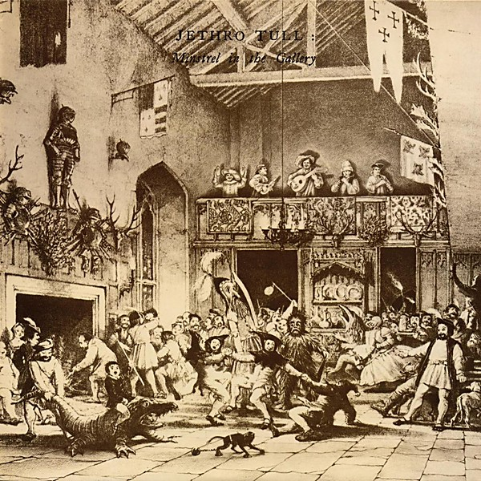

# Minstrel in the Gallery

By **Jethro Tull**

## Album Data

- **Catalog:** Beets
- **Format:** Digital, Album
- **Album:** Minstrel in the Gallery
- **Artist:** Jethro Tull
- **Albumartist:** Jethro Tull
- **Genre:** Progressive Rock
- **MusicBrainz Album Artist ID:** [ece57992-dc2e-4f67-a269-fa43626c1a3d](https://musicbrainz.org/artist/ece57992-dc2e-4f67-a269-fa43626c1a3d)
- **MusicBrainz Album ID:** [eb364366-c64b-4665-a9c4-f14446e7cec7](https://musicbrainz.org/release/eb364366-c64b-4665-a9c4-f14446e7cec7)
- **MusicBrainz Release Group ID:** [ff0907ed-aee7-39ad-966a-bf9eed868db1](https://musicbrainz.org/release-group/ff0907ed-aee7-39ad-966a-bf9eed868db1)
- **Year:** 1986
- **Catalog #:** UDCD 734
- **Label:** Mobile Fidelity Sound Lab
- **Total Tracks:** 09

## Album Tracks

### Track 01 - Songs From the Wood

- **Artist:** Jethro Tull
- **Format:** ALAC
- **Genre:** Progressive Rock
- **Length:** 4:55
- **MusicBrainz Track ID:** [e6844fa8-7443-479b-800f-6732507303b7](https://musicbrainz.org/recording/e6844fa8-7443-479b-800f-6732507303b7)
- **Title:** Songs From the Wood
- **Track:** 01
- **Year:** 1998

### Track 02 - Jack‐in‐the‐Green

- **Artist:** Jethro Tull
- **Format:** ALAC
- **Genre:** Progressive Rock
- **Length:** 2:31
- **MusicBrainz Track ID:** [fdf33ad1-f75a-47cb-8363-b11fa0cee759](https://musicbrainz.org/recording/fdf33ad1-f75a-47cb-8363-b11fa0cee759)
- **Title:** Jack‐in‐the‐Green
- **Track:** 02
- **Year:** 1998

### Track 03 - Cup of Wonder

- **Artist:** Jethro Tull
- **Format:** ALAC
- **Genre:** Progressive Rock
- **Length:** 4:34
- **MusicBrainz Track ID:** [5191b1bb-6a82-4832-b8f7-c8c5c01b63aa](https://musicbrainz.org/recording/5191b1bb-6a82-4832-b8f7-c8c5c01b63aa)
- **Title:** Cup of Wonder
- **Track:** 03
- **Year:** 1998

### Track 04 - Hunting Girl

- **Artist:** Jethro Tull
- **Format:** ALAC
- **Genre:** Progressive Rock
- **Length:** 5:13
- **MusicBrainz Track ID:** [5c0767f7-66be-483c-a6f0-8faac09c74ab](https://musicbrainz.org/recording/5c0767f7-66be-483c-a6f0-8faac09c74ab)
- **Title:** Hunting Girl
- **Track:** 04
- **Year:** 1998

### Track 05 - Ring Out, Solstice Bells

- **Artist:** Jethro Tull
- **Format:** ALAC
- **Genre:** Progressive Rock
- **Length:** 3:46
- **MusicBrainz Track ID:** [f75b9e5c-cec8-475c-95fa-3f83d057537a](https://musicbrainz.org/recording/f75b9e5c-cec8-475c-95fa-3f83d057537a)
- **Title:** Ring Out, Solstice Bells
- **Track:** 05
- **Year:** 1998

### Track 06 - Velvet Green

- **Artist:** Jethro Tull
- **Format:** ALAC
- **Genre:** Progressive Rock
- **Length:** 6:04
- **MusicBrainz Track ID:** [ab29d765-f521-4289-b8f9-3f38e41db18d](https://musicbrainz.org/recording/ab29d765-f521-4289-b8f9-3f38e41db18d)
- **Title:** Velvet Green
- **Track:** 06
- **Year:** 1998

### Track 07 - The Whistler

- **Artist:** Jethro Tull
- **Format:** ALAC
- **Genre:** Progressive Rock
- **Length:** 3:31
- **MusicBrainz Track ID:** [a601e500-d78c-43b5-91a3-738179cfdcab](https://musicbrainz.org/recording/a601e500-d78c-43b5-91a3-738179cfdcab)
- **Title:** The Whistler
- **Track:** 07
- **Year:** 1998

### Track 08 - Pibroch (Cap in Hand)

- **Artist:** Jethro Tull
- **Format:** ALAC
- **Genre:** Progressive Rock
- **Length:** 8:37
- **MusicBrainz Track ID:** [68217d9d-895a-4c95-946a-5a83e5918bda](https://musicbrainz.org/recording/68217d9d-895a-4c95-946a-5a83e5918bda)
- **Title:** Pibroch (Cap in Hand)
- **Track:** 08
- **Year:** 1998

### Track 09 - Fire at Midnight

- **Artist:** Jethro Tull
- **Format:** ALAC
- **Genre:** Progressive Rock
- **Length:** 2:27
- **MusicBrainz Track ID:** [998f4165-5cfb-47e9-abe4-c879d4c65609](https://musicbrainz.org/recording/998f4165-5cfb-47e9-abe4-c879d4c65609)
- **Title:** Fire at Midnight
- **Track:** 09
- **Year:** 1998

## See also

- [20 Years of Jethro Tull Disc 1](20_Years_of_Jethro_Tull_Disc_1.md)
- [20 Years of Jethro Tull Disc 2](20_Years_of_Jethro_Tull_Disc_2.md)
- [20 Years of Jethro Tull Disc 3](20_Years_of_Jethro_Tull_Disc_3.md)
- [A Passion Play](A_Passion_Play.md)
- [A Passion Play (Steven Wilson mix) DVD rip](A_Passion_Play_Steven_Wilson_mix_DVD_rip.md)
- [A Passion Play (Steven Wilson mix)](A_Passion_Play_Steven_Wilson_mix.md)
- [Aqualung 40th Anniversary Adapted Edition](Aqualung_40th_Anniversary_Adapted_Edition.md)
- [Aqualung](Aqualung.md)
- [J-Tull Dot Com](J-Tull_Dot_Com.md)
- [Live in Concert at Landover 1977](Live_in_Concert_at_Landover_1977.md)
- [Songs From The Wood (40th Anniversary Edition)](Songs_From_The_Wood_40th_Anniversary_Edition.md)
- [Songs From the Wood](Songs_From_the_Wood.md)
- [Stand Up – The Elevated Edition (Live At The Stockholm Konserthuset, 9-1-1969)](Stand_Up_–_The_Elevated_Edition_Live_At_The_Stockholm_Konserthuset__9-1-1969.md)
- [Stand Up – The Elevated Edition (Steve Wilson Stereo Remix)](Stand_Up_–_The_Elevated_Edition_Steve_Wilson_Stereo_Remix.md)
- [The Château d’Hérouville Sessions](The_Château_d’Hérouville_Sessions.md)
- [The Jethro Tull Christmas Album](The_Jethro_Tull_Christmas_Album.md)
- [Too Old To Rock 'n' Roll](Too_Old_To_Rock_n_Roll.md)
- [WarChild (A New Steven Wilson Stereo Remix)](WarChild_A_New_Steven_Wilson_Stereo_Remix.md)
- [WarChild D2 - The Second Act](WarChild_D2_-_The_Second_Act.md)
- [CD: 20 Years Of Jethro Tull - The Definitive Collection (Disc 1)](../../CD/Jethro_Tull/20_Years_Of_Jethro_Tull_-_The_Definitive_Collection_Disc_1.md)
- [CD: 20 Years Of Jethro Tull - The Definitive Collection (Disc 2)](../../CD/Jethro_Tull/20_Years_Of_Jethro_Tull_-_The_Definitive_Collection_Disc_2.md)
- [CD: 20 Years Of Jethro Tull - The Definitive Collection (Disc 3)](../../CD/Jethro_Tull/20_Years_Of_Jethro_Tull_-_The_Definitive_Collection_Disc_3.md)
- [CD: ](../../CD/Jethro_Tull/Jethro_Tull.md)
- [Roon: A Passion Play (Steven Wilson Mix)](../../Roon/Jethro_Tull/A_Passion_Play_Steven_Wilson_Mix.md)
- [Roon: Aqualung (Steven Wilson Mix and Master)](../../Roon/Jethro_Tull/Aqualung_Steven_Wilson_Mix_and_Master.md)
- [Roon: Benefit (Steven Wilson Mix)](../../Roon/Jethro_Tull/Benefit_Steven_Wilson_Mix.md)
- [Roon: Crest of a Knave (2005 Remaster)](../../Roon/Jethro_Tull/Crest_of_a_Knave_2005_Remaster.md)
- [Roon: Heavy Horses (Steven Wilson Remix)](../../Roon/Jethro_Tull/Heavy_Horses_Steven_Wilson_Remix.md)
- [Roon: Jethro Tull - The String Quartets](../../Roon/Jethro_Tull/Jethro_Tull_-_The_String_Quartets.md)
- [Roon: Living in the Past](../../Roon/Jethro_Tull/Living_in_the_Past.md)
- [Roon: Man of God (Steven Wilson Stereo Remix)](../../Roon/Jethro_Tull/Man_of_God_Steven_Wilson_Stereo_Remix.md)
- [Roon: Minstrel in the Gallery (40th Anniversary Edition)](../../Roon/Jethro_Tull/Minstrel_in_the_Gallery_40th_Anniversary_Edition.md)
- [Roon: Songs from the Wood (40th Anniversary Edition; The Steven Wilson Remix)](../../Roon/Jethro_Tull/Songs_from_the_Wood_40th_Anniversary_Edition;_The_Steven_Wilson_Remix.md)
- [Roon: Stand Up (Steven Wilson Remix)](../../Roon/Jethro_Tull/Stand_Up_Steven_Wilson_Remix.md)
- [Roon: Thick as a Brick (Steven Wilson Mix and Master)](../../Roon/Jethro_Tull/Thick_as_a_Brick_Steven_Wilson_Mix_and_Master.md)
- [Roon: This Was (50th Anniversary Edition)](../../Roon/Jethro_Tull/This_Was_50th_Anniversary_Edition.md)
- [Roon: Too Old to Rock 'n' Roll](../../Roon/Jethro_Tull/Too_Old_to_Rock_n_Roll-_Too_Young_to_Die!_The_TV_Special_Edition.md)
- [Vinyl: Aqualung (The 2011 Steven Wilson Stereo Remix)](../../Vinyl/Jethro_Tull/Aqualung_The_2011_Steven_Wilson_Stereo_Remix.md)
- [Vinyl: ](../../Vinyl/Jethro_Tull/Jethro_Tull.md)
- [Vinyl: Minstrel In The Gallery (40th Anniversary LP Édition)](../../Vinyl/Jethro_Tull/Minstrel_In_The_Gallery_40th_Anniversary_LP_Édition.md)
- [Vinyl: Songs From The Wood](../../Vinyl/Jethro_Tull/Songs_From_The_Wood.md)
- [Vinyl: Thick As A Brick](../../Vinyl/Jethro_Tull/Thick_As_A_Brick.md)
