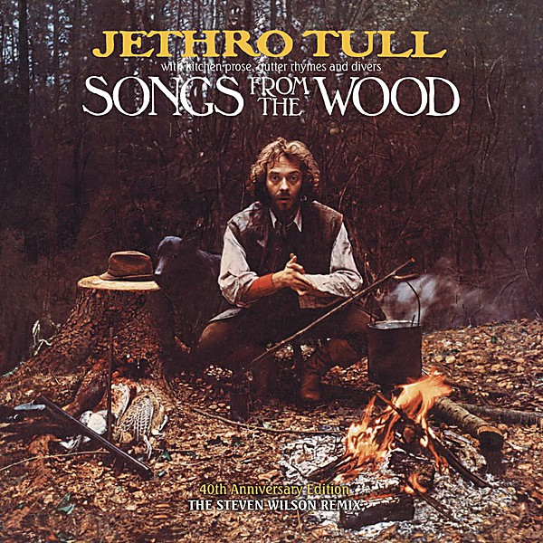

# Songs From The Wood (40th Anniversary Edition)

By **Jethro Tull**

## Album Data

- **Catalog:** Beets
- **Format:** Digital, Album
- **Album:** Songs From The Wood (40th Anniversary Edition)
- **Artist:** Jethro Tull
- **Albumartist:** Jethro Tull
- **Genre:** Progressive Rock
- **MusicBrainz Album Artist ID:** 
- **MusicBrainz Album ID:** 
- **MusicBrainz Release Group ID:** 
- **Year:** 1977
- **Catalog #:** 
- **Label:** 
- **Total Tracks:** 13

## Album Tracks

### Track 01 - Introduction [Second Show]

- **Artist:** Jethro Tull
- **Format:** ALAC
- **Genre:** Progressive Rock
- **Length:** 0:21
- **MusicBrainz Track ID:** 
- **Title:** Introduction [Second Show]
- **Track:** 01
- **Year:** 2016

### Track 02 - My Sunday Feeling [Second Show]

- **Artist:** Jethro Tull
- **Format:** ALAC
- **Genre:** Progressive Rock
- **Length:** 4:45
- **MusicBrainz Track ID:** 
- **Title:** My Sunday Feeling [Second Show]
- **Track:** 02
- **Year:** 2016

### Track 03 - Martin's Tune [Second Show]

- **Artist:** Jethro Tull
- **Format:** ALAC
- **Genre:** Progressive Rock
- **Length:** 12:07
- **MusicBrainz Track ID:** 
- **Title:** Martin's Tune [Second Show]
- **Track:** 03
- **Year:** 2016

### Track 04 - To Be Sad Is A Mad Way To Be [Second Show]

- **Artist:** Jethro Tull
- **Format:** ALAC
- **Genre:** Progressive Rock
- **Length:** 4:00
- **MusicBrainz Track ID:** 
- **Title:** To Be Sad Is A Mad Way To Be [Second Show]
- **Track:** 04
- **Year:** 2016

### Track 05 - Back To The Family [Second Show]

- **Artist:** Jethro Tull
- **Format:** ALAC
- **Genre:** Progressive Rock
- **Length:** 4:07
- **MusicBrainz Track ID:** 
- **Title:** Back To The Family [Second Show]
- **Track:** 05
- **Year:** 2016

### Track 06 - Dharma For One [Second Show]

- **Artist:** Jethro Tull
- **Format:** ALAC
- **Genre:** Progressive Rock
- **Length:** 14:14
- **MusicBrainz Track ID:** 
- **Title:** Dharma For One [Second Show]
- **Track:** 06
- **Year:** 2016

### Track 07 - Nothing Is Easy [Second Show]

- **Artist:** Jethro Tull
- **Format:** ALAC
- **Genre:** Progressive Rock
- **Length:** 15:28
- **MusicBrainz Track ID:** 
- **Title:** Nothing Is Easy [Second Show]
- **Track:** 07
- **Year:** 2016

### Track 08 - A Song For Jeffrey [Second Show]

- **Artist:** Jethro Tull
- **Format:** ALAC
- **Genre:** Progressive Rock
- **Length:** 3:56
- **MusicBrainz Track ID:** 
- **Title:** A Song For Jeffrey [Second Show]
- **Track:** 08
- **Year:** 2016

### Track 09 - To Be Sad Is A Mad Way To Be [First Show Version, different lyrics]

- **Artist:** Jethro Tull
- **Format:** ALAC
- **Genre:** Progressive Rock
- **Length:** 4:05
- **MusicBrainz Track ID:** 
- **Title:** To Be Sad Is A Mad Way To Be [First Show Version, different lyrics]
- **Track:** 09
- **Year:** 2016

### Track 10 - Living In The Past (Mono)

- **Artist:** Jethro Tull
- **Format:** ALAC
- **Genre:** Progressive Rock
- **Length:** 3:26
- **MusicBrainz Track ID:** 
- **Title:** Living In The Past (Mono)
- **Track:** 10
- **Year:** 2016

### Track 11 - Driving Song (Mono)

- **Artist:** Jethro Tull
- **Format:** ALAC
- **Genre:** Progressive Rock
- **Length:** 2:51
- **MusicBrainz Track ID:** 
- **Title:** Driving Song (Mono)
- **Track:** 11
- **Year:** 2016

### Track 12 - Stand Up (US Radio Spot #) [2010 Remastered Version]

- **Artist:** Jethro Tull
- **Format:** ALAC
- **Genre:** Progressive Rock
- **Length:** 1:05
- **MusicBrainz Track ID:** 
- **Title:** Stand Up (US Radio Spot #) [2010 Remastered Version]
- **Track:** 12
- **Year:** 2016

### Track 13 - Stand Up (US Radio Spot #2) [2010 Remastered Version]

- **Artist:** Jethro Tull
- **Format:** ALAC
- **Genre:** Progressive Rock
- **Length:** 0:51
- **MusicBrainz Track ID:** 
- **Title:** Stand Up (US Radio Spot #2) [2010 Remastered Version]
- **Track:** 13
- **Year:** 2016

## See also

- [20 Years of Jethro Tull Disc 1](20_Years_of_Jethro_Tull_Disc_1.md)
- [20 Years of Jethro Tull Disc 2](20_Years_of_Jethro_Tull_Disc_2.md)
- [20 Years of Jethro Tull Disc 3](20_Years_of_Jethro_Tull_Disc_3.md)
- [A Passion Play](A_Passion_Play.md)
- [A Passion Play (Steven Wilson mix) DVD rip](A_Passion_Play_Steven_Wilson_mix_DVD_rip.md)
- [A Passion Play (Steven Wilson mix)](A_Passion_Play_Steven_Wilson_mix.md)
- [Aqualung 40th Anniversary Adapted Edition](Aqualung_40th_Anniversary_Adapted_Edition.md)
- [Aqualung](Aqualung.md)
- [J-Tull Dot Com](J-Tull_Dot_Com.md)
- [Live in Concert at Landover 1977](Live_in_Concert_at_Landover_1977.md)
- [Minstrel in the Gallery](Minstrel_in_the_Gallery.md)
- [Songs From the Wood](Songs_From_the_Wood.md)
- [Stand Up – The Elevated Edition (Live At The Stockholm Konserthuset, 9-1-1969)](Stand_Up_–_The_Elevated_Edition_Live_At_The_Stockholm_Konserthuset__9-1-1969.md)
- [Stand Up – The Elevated Edition (Steve Wilson Stereo Remix)](Stand_Up_–_The_Elevated_Edition_Steve_Wilson_Stereo_Remix.md)
- [The Château d’Hérouville Sessions](The_Château_d’Hérouville_Sessions.md)
- [The Jethro Tull Christmas Album](The_Jethro_Tull_Christmas_Album.md)
- [Too Old To Rock 'n' Roll](Too_Old_To_Rock_n_Roll.md)
- [WarChild (A New Steven Wilson Stereo Remix)](WarChild_A_New_Steven_Wilson_Stereo_Remix.md)
- [WarChild D2 - The Second Act](WarChild_D2_-_The_Second_Act.md)
- [CD: 20 Years Of Jethro Tull - The Definitive Collection (Disc 1)](../../CD/Jethro_Tull/20_Years_Of_Jethro_Tull_-_The_Definitive_Collection_Disc_1.md)
- [CD: 20 Years Of Jethro Tull - The Definitive Collection (Disc 2)](../../CD/Jethro_Tull/20_Years_Of_Jethro_Tull_-_The_Definitive_Collection_Disc_2.md)
- [CD: 20 Years Of Jethro Tull - The Definitive Collection (Disc 3)](../../CD/Jethro_Tull/20_Years_Of_Jethro_Tull_-_The_Definitive_Collection_Disc_3.md)
- [CD: ](../../CD/Jethro_Tull/Jethro_Tull.md)
- [Roon: A Passion Play (Steven Wilson Mix)](../../Roon/Jethro_Tull/A_Passion_Play_Steven_Wilson_Mix.md)
- [Roon: Aqualung (Steven Wilson Mix and Master)](../../Roon/Jethro_Tull/Aqualung_Steven_Wilson_Mix_and_Master.md)
- [Roon: Benefit (Steven Wilson Mix)](../../Roon/Jethro_Tull/Benefit_Steven_Wilson_Mix.md)
- [Roon: Crest of a Knave (2005 Remaster)](../../Roon/Jethro_Tull/Crest_of_a_Knave_2005_Remaster.md)
- [Roon: Heavy Horses (Steven Wilson Remix)](../../Roon/Jethro_Tull/Heavy_Horses_Steven_Wilson_Remix.md)
- [Roon: Jethro Tull - The String Quartets](../../Roon/Jethro_Tull/Jethro_Tull_-_The_String_Quartets.md)
- [Roon: Living in the Past](../../Roon/Jethro_Tull/Living_in_the_Past.md)
- [Roon: Man of God (Steven Wilson Stereo Remix)](../../Roon/Jethro_Tull/Man_of_God_Steven_Wilson_Stereo_Remix.md)
- [Roon: Minstrel in the Gallery (40th Anniversary Edition)](../../Roon/Jethro_Tull/Minstrel_in_the_Gallery_40th_Anniversary_Edition.md)
- [Roon: Songs from the Wood (40th Anniversary Edition; The Steven Wilson Remix)](../../Roon/Jethro_Tull/Songs_from_the_Wood_40th_Anniversary_Edition;_The_Steven_Wilson_Remix.md)
- [Roon: Stand Up (Steven Wilson Remix)](../../Roon/Jethro_Tull/Stand_Up_Steven_Wilson_Remix.md)
- [Roon: Thick as a Brick (Steven Wilson Mix and Master)](../../Roon/Jethro_Tull/Thick_as_a_Brick_Steven_Wilson_Mix_and_Master.md)
- [Roon: This Was (50th Anniversary Edition)](../../Roon/Jethro_Tull/This_Was_50th_Anniversary_Edition.md)
- [Roon: Too Old to Rock 'n' Roll](../../Roon/Jethro_Tull/Too_Old_to_Rock_n_Roll-_Too_Young_to_Die!_The_TV_Special_Edition.md)
- [Vinyl: Aqualung (The 2011 Steven Wilson Stereo Remix)](../../Vinyl/Jethro_Tull/Aqualung_The_2011_Steven_Wilson_Stereo_Remix.md)
- [Vinyl: ](../../Vinyl/Jethro_Tull/Jethro_Tull.md)
- [Vinyl: Minstrel In The Gallery (40th Anniversary LP Édition)](../../Vinyl/Jethro_Tull/Minstrel_In_The_Gallery_40th_Anniversary_LP_Édition.md)
- [Vinyl: Songs From The Wood](../../Vinyl/Jethro_Tull/Songs_From_The_Wood.md)
- [Vinyl: Thick As A Brick](../../Vinyl/Jethro_Tull/Thick_As_A_Brick.md)
