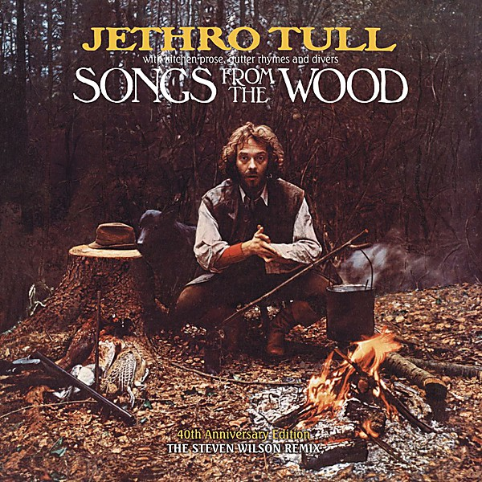

# Songs From the Wood

By **Jethro Tull**

## Album Data

- **Catalog:** Beets
- **Format:** Digital, Album
- **Album:** Songs From the Wood
- **Artist:** Jethro Tull
- **Albumartist:** Jethro Tull
- **Genre:** Progressive Rock
- **MusicBrainz Album Artist ID:** [ece57992-dc2e-4f67-a269-fa43626c1a3d](https://musicbrainz.org/artist/ece57992-dc2e-4f67-a269-fa43626c1a3d)
- **MusicBrainz Album ID:** [1c237a89-45e9-3ab7-8c09-15553d9b7194](https://musicbrainz.org/release/1c237a89-45e9-3ab7-8c09-15553d9b7194)
- **MusicBrainz Release Group ID:** [58986b39-0bf0-38b6-820a-c26fae194540](https://musicbrainz.org/release-group/58986b39-0bf0-38b6-820a-c26fae194540)
- **Year:** 1998
- **Catalog #:** 
- **Label:** 
- **Total Tracks:** 17

## Album Tracks

### Track 02 - Jack in the Green

- **Artist:** Jethro Tull
- **Format:** ALAC
- **Genre:** Stoner Rock
- **Length:** 2:31
- **MusicBrainz Track ID:** [6373fdf5-fc7f-4a9f-8f41-7333fece1296](https://musicbrainz.org/recording/6373fdf5-fc7f-4a9f-8f41-7333fece1296)
- **Title:** Jack in the Green
- **Track:** 02
- **Year:** 1977

### Track 10 - Old Aces Die Hard

- **Artist:** Jethro Tull
- **Format:** ALAC
- **Genre:** Progressive Rock
- **Length:** 8:41
- **MusicBrainz Track ID:** [d5ba9692-4827-4ded-abd1-da94a92101a2](https://musicbrainz.org/recording/d5ba9692-4827-4ded-abd1-da94a92101a2)
- **Title:** Old Aces Die Hard
- **Track:** 10
- **Year:** 1977

### Track 11 - Working John, Working Joe

- **Artist:** Jethro Tull
- **Format:** ALAC
- **Genre:** Progressive Rock
- **Length:** 5:11
- **MusicBrainz Track ID:** [5fe30b21-1fcc-4a63-beb6-fc50cbea1878](https://musicbrainz.org/recording/5fe30b21-1fcc-4a63-beb6-fc50cbea1878)
- **Title:** Working John, Working Joe
- **Track:** 11
- **Year:** 1977

### Track 12 - Magic Bells (Ring Out, Solstice Bells)

- **Artist:** Jethro Tull
- **Format:** ALAC
- **Genre:** Progressive Rock
- **Length:** 3:25
- **MusicBrainz Track ID:** [39720f84-8cbf-4680-a9b1-51393d24f7c1](https://musicbrainz.org/recording/39720f84-8cbf-4680-a9b1-51393d24f7c1)
- **Title:** Magic Bells (Ring Out, Solstice Bells)
- **Track:** 12
- **Year:** 1977

### Track 15 - One Brown Mouse

- **Artist:** Jethro Tull
- **Format:** ALAC
- **Genre:** Progressive Rock
- **Length:** 3:35
- **MusicBrainz Track ID:** [9975ad69-56fd-4918-a0c2-fc571bd95c01](https://musicbrainz.org/recording/9975ad69-56fd-4918-a0c2-fc571bd95c01)
- **Title:** One Brown Mouse
- **Track:** 15
- **Year:** 1977

## See also

- [20 Years of Jethro Tull Disc 1](20_Years_of_Jethro_Tull_Disc_1.md)
- [20 Years of Jethro Tull Disc 2](20_Years_of_Jethro_Tull_Disc_2.md)
- [20 Years of Jethro Tull Disc 3](20_Years_of_Jethro_Tull_Disc_3.md)
- [A Passion Play](A_Passion_Play.md)
- [A Passion Play (Steven Wilson mix) DVD rip](A_Passion_Play_Steven_Wilson_mix_DVD_rip.md)
- [A Passion Play (Steven Wilson mix)](A_Passion_Play_Steven_Wilson_mix.md)
- [Aqualung 40th Anniversary Adapted Edition](Aqualung_40th_Anniversary_Adapted_Edition.md)
- [Aqualung](Aqualung.md)
- [J-Tull Dot Com](J-Tull_Dot_Com.md)
- [Live in Concert at Landover 1977](Live_in_Concert_at_Landover_1977.md)
- [Minstrel in the Gallery](Minstrel_in_the_Gallery.md)
- [Songs From The Wood (40th Anniversary Edition)](Songs_From_The_Wood_40th_Anniversary_Edition.md)
- [Stand Up – The Elevated Edition (Live At The Stockholm Konserthuset, 9-1-1969)](Stand_Up_–_The_Elevated_Edition_Live_At_The_Stockholm_Konserthuset__9-1-1969.md)
- [Stand Up – The Elevated Edition (Steve Wilson Stereo Remix)](Stand_Up_–_The_Elevated_Edition_Steve_Wilson_Stereo_Remix.md)
- [The Château d’Hérouville Sessions](The_Château_d’Hérouville_Sessions.md)
- [The Jethro Tull Christmas Album](The_Jethro_Tull_Christmas_Album.md)
- [Too Old To Rock 'n' Roll](Too_Old_To_Rock_n_Roll.md)
- [WarChild (A New Steven Wilson Stereo Remix)](WarChild_A_New_Steven_Wilson_Stereo_Remix.md)
- [WarChild D2 - The Second Act](WarChild_D2_-_The_Second_Act.md)
- [CD: 20 Years Of Jethro Tull - The Definitive Collection (Disc 1)](../../CD/Jethro_Tull/20_Years_Of_Jethro_Tull_-_The_Definitive_Collection_Disc_1.md)
- [CD: 20 Years Of Jethro Tull - The Definitive Collection (Disc 2)](../../CD/Jethro_Tull/20_Years_Of_Jethro_Tull_-_The_Definitive_Collection_Disc_2.md)
- [CD: 20 Years Of Jethro Tull - The Definitive Collection (Disc 3)](../../CD/Jethro_Tull/20_Years_Of_Jethro_Tull_-_The_Definitive_Collection_Disc_3.md)
- [CD: ](../../CD/Jethro_Tull/Jethro_Tull.md)
- [Roon: A Passion Play (Steven Wilson Mix)](../../Roon/Jethro_Tull/A_Passion_Play_Steven_Wilson_Mix.md)
- [Roon: Aqualung (Steven Wilson Mix and Master)](../../Roon/Jethro_Tull/Aqualung_Steven_Wilson_Mix_and_Master.md)
- [Roon: Benefit (Steven Wilson Mix)](../../Roon/Jethro_Tull/Benefit_Steven_Wilson_Mix.md)
- [Roon: Crest of a Knave (2005 Remaster)](../../Roon/Jethro_Tull/Crest_of_a_Knave_2005_Remaster.md)
- [Roon: Heavy Horses (Steven Wilson Remix)](../../Roon/Jethro_Tull/Heavy_Horses_Steven_Wilson_Remix.md)
- [Roon: Jethro Tull - The String Quartets](../../Roon/Jethro_Tull/Jethro_Tull_-_The_String_Quartets.md)
- [Roon: Living in the Past](../../Roon/Jethro_Tull/Living_in_the_Past.md)
- [Roon: Man of God (Steven Wilson Stereo Remix)](../../Roon/Jethro_Tull/Man_of_God_Steven_Wilson_Stereo_Remix.md)
- [Roon: Minstrel in the Gallery (40th Anniversary Edition)](../../Roon/Jethro_Tull/Minstrel_in_the_Gallery_40th_Anniversary_Edition.md)
- [Roon: Songs from the Wood (40th Anniversary Edition; The Steven Wilson Remix)](../../Roon/Jethro_Tull/Songs_from_the_Wood_40th_Anniversary_Edition;_The_Steven_Wilson_Remix.md)
- [Roon: Stand Up (Steven Wilson Remix)](../../Roon/Jethro_Tull/Stand_Up_Steven_Wilson_Remix.md)
- [Roon: Thick as a Brick (Steven Wilson Mix and Master)](../../Roon/Jethro_Tull/Thick_as_a_Brick_Steven_Wilson_Mix_and_Master.md)
- [Roon: This Was (50th Anniversary Edition)](../../Roon/Jethro_Tull/This_Was_50th_Anniversary_Edition.md)
- [Roon: Too Old to Rock 'n' Roll](../../Roon/Jethro_Tull/Too_Old_to_Rock_n_Roll-_Too_Young_to_Die!_The_TV_Special_Edition.md)
- [Vinyl: Aqualung (The 2011 Steven Wilson Stereo Remix)](../../Vinyl/Jethro_Tull/Aqualung_The_2011_Steven_Wilson_Stereo_Remix.md)
- [Vinyl: ](../../Vinyl/Jethro_Tull/Jethro_Tull.md)
- [Vinyl: Minstrel In The Gallery (40th Anniversary LP Édition)](../../Vinyl/Jethro_Tull/Minstrel_In_The_Gallery_40th_Anniversary_LP_Édition.md)
- [Vinyl: Songs From The Wood](../../Vinyl/Jethro_Tull/Songs_From_The_Wood.md)
- [Vinyl: Thick As A Brick](../../Vinyl/Jethro_Tull/Thick_As_A_Brick.md)
