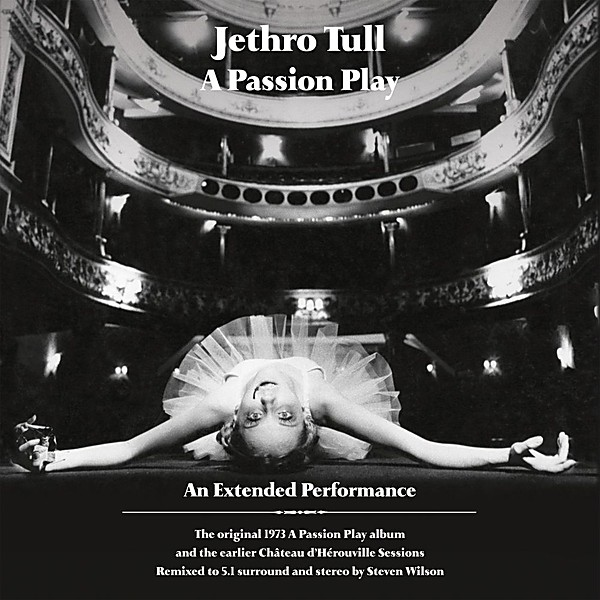

# The Château d’Hérouville Sessions

By **Jethro Tull**

## Album Data

- **Catalog:** Beets
- **Format:** Digital, Album
- **Album:** The Château d’Hérouville Sessions
- **Artist:** Jethro Tull
- **Albumartist:** Jethro Tull
- **Genre:** Progressive Rock
- **MusicBrainz Album Artist ID:** 
- **MusicBrainz Album ID:** 
- **MusicBrainz Release Group ID:** 
- **Year:** 1973
- **Catalog #:** 
- **Label:** 
- **Total Tracks:** 16

## Album Tracks

### Track 01 - Birthday Card at Christmas

- **Artist:** Jethro Tull
- **Format:** MP3
- **Genre:** Progressive Rock
- **Length:** 3:38
- **MusicBrainz Track ID:** [9ba1404b-afa7-44c1-a6a3-c05d0c2f963a](https://musicbrainz.org/recording/9ba1404b-afa7-44c1-a6a3-c05d0c2f963a)
- **Title:** Birthday Card at Christmas
- **Track:** 01
- **Year:** 2009

### Track 02 - Holly Herald

- **Artist:** Jethro Tull
- **Format:** MP3
- **Genre:** Progressive Rock
- **Length:** 4:18
- **MusicBrainz Track ID:** [93165376-8159-4bc5-b4a6-13c10097cf0d](https://musicbrainz.org/recording/93165376-8159-4bc5-b4a6-13c10097cf0d)
- **Title:** Holly Herald
- **Track:** 02
- **Year:** 2009

### Track 03 - A Christmas Song

- **Artist:** Jethro Tull
- **Format:** MP3
- **Genre:** Progressive Rock
- **Length:** 2:47
- **MusicBrainz Track ID:** [08c65b3f-8622-4636-81aa-98753a73a0f2](https://musicbrainz.org/recording/08c65b3f-8622-4636-81aa-98753a73a0f2)
- **Title:** A Christmas Song
- **Track:** 03
- **Year:** 2009

### Track 04 - Another Christmas Song

- **Artist:** Jethro Tull
- **Format:** MP3
- **Genre:** Progressive Rock
- **Length:** 3:31
- **MusicBrainz Track ID:** [bd7d3092-7af8-4d7d-95d7-7d27cf20d83c](https://musicbrainz.org/recording/bd7d3092-7af8-4d7d-95d7-7d27cf20d83c)
- **Title:** Another Christmas Song
- **Track:** 04
- **Year:** 2009

### Track 05 - God Rest Ye Merry Gentleman

- **Artist:** Jethro Tull
- **Format:** MP3
- **Genre:** Progressive Rock
- **Length:** 4:35
- **MusicBrainz Track ID:** [19c27aff-5c3e-4368-83a9-2ba0482bcd5e](https://musicbrainz.org/recording/19c27aff-5c3e-4368-83a9-2ba0482bcd5e)
- **Title:** God Rest Ye Merry Gentleman
- **Track:** 05
- **Year:** 2009

### Track 06 - Jack Frost and the Hooded Crow

- **Artist:** Jethro Tull
- **Format:** MP3
- **Genre:** Progressive Rock
- **Length:** 3:37
- **MusicBrainz Track ID:** [52b3cc17-f96b-4970-99cc-f2f36cf2f754](https://musicbrainz.org/recording/52b3cc17-f96b-4970-99cc-f2f36cf2f754)
- **Title:** Jack Frost and the Hooded Crow
- **Track:** 06
- **Year:** 2009

### Track 07 - Last Man at the Party

- **Artist:** Jethro Tull
- **Format:** MP3
- **Genre:** Progressive Rock
- **Length:** 4:48
- **MusicBrainz Track ID:** [61b63649-08e8-483a-949d-696843fb5b6a](https://musicbrainz.org/recording/61b63649-08e8-483a-949d-696843fb5b6a)
- **Title:** Last Man at the Party
- **Track:** 07
- **Year:** 2009

### Track 08 - Weathercock

- **Artist:** Jethro Tull
- **Format:** MP3
- **Genre:** Progressive Rock
- **Length:** 4:18
- **MusicBrainz Track ID:** [b77836d0-e9b3-48c4-a1d8-dce6dc20e33a](https://musicbrainz.org/recording/b77836d0-e9b3-48c4-a1d8-dce6dc20e33a)
- **Title:** Weathercock
- **Track:** 08
- **Year:** 2009

### Track 09 - Pavane

- **Artist:** Jethro Tull
- **Format:** MP3
- **Genre:** Progressive Rock
- **Length:** 4:18
- **MusicBrainz Track ID:** [b74f64cf-9931-4a2f-921e-807866c9ab49](https://musicbrainz.org/recording/b74f64cf-9931-4a2f-921e-807866c9ab49)
- **Title:** Pavane
- **Track:** 09
- **Year:** 2009

### Track 10 - First Snow on Brooklyn

- **Artist:** Jethro Tull
- **Format:** MP3
- **Genre:** Progressive Rock
- **Length:** 4:57
- **MusicBrainz Track ID:** [87d4afa5-9c2b-4219-899c-0d88113b9891](https://musicbrainz.org/recording/87d4afa5-9c2b-4219-899c-0d88113b9891)
- **Title:** First Snow on Brooklyn
- **Track:** 10
- **Year:** 2009

### Track 11 - Greensleeved

- **Artist:** Jethro Tull
- **Format:** MP3
- **Genre:** Progressive Rock
- **Length:** 2:39
- **MusicBrainz Track ID:** [0160c477-00a5-4de7-9c2a-7d5e8d2acb80](https://musicbrainz.org/recording/0160c477-00a5-4de7-9c2a-7d5e8d2acb80)
- **Title:** Greensleeved
- **Track:** 11
- **Year:** 2009

### Track 12 - Fire at Midnight

- **Artist:** Jethro Tull
- **Format:** MP3
- **Genre:** Progressive Rock
- **Length:** 2:26
- **MusicBrainz Track ID:** [22240061-2f2f-435c-b7e6-af8f9524fcf9](https://musicbrainz.org/recording/22240061-2f2f-435c-b7e6-af8f9524fcf9)
- **Title:** Fire at Midnight
- **Track:** 12
- **Year:** 2009

### Track 13 - We Five Kings

- **Artist:** Jethro Tull
- **Format:** MP3
- **Genre:** Progressive Rock
- **Length:** 3:16
- **MusicBrainz Track ID:** [5acaf5af-261d-4e6c-bd22-23f8ff34b57a](https://musicbrainz.org/recording/5acaf5af-261d-4e6c-bd22-23f8ff34b57a)
- **Title:** We Five Kings
- **Track:** 13
- **Year:** 2009

### Track 14 - Ring Out Solstice Bells

- **Artist:** Jethro Tull
- **Format:** MP3
- **Genre:** Progressive Rock
- **Length:** 4:05
- **MusicBrainz Track ID:** [22cc60fd-4a5e-4d16-a96c-21b2cc47cba3](https://musicbrainz.org/recording/22cc60fd-4a5e-4d16-a96c-21b2cc47cba3)
- **Title:** Ring Out Solstice Bells
- **Track:** 14
- **Year:** 2009

### Track 15 - Bourée

- **Artist:** Jethro Tull
- **Format:** MP3
- **Genre:** Progressive Rock
- **Length:** 4:25
- **MusicBrainz Track ID:** [4c6170f4-3484-436f-b02c-8fba6765f5a6](https://musicbrainz.org/recording/4c6170f4-3484-436f-b02c-8fba6765f5a6)
- **Title:** Bourée
- **Track:** 15
- **Year:** 2009

### Track 16 - A Winter Snowscape

- **Artist:** Jethro Tull
- **Format:** MP3
- **Genre:** Progressive Rock
- **Length:** 4:50
- **MusicBrainz Track ID:** [9cfd622f-b234-492d-a6fe-410c973480b4](https://musicbrainz.org/recording/9cfd622f-b234-492d-a6fe-410c973480b4)
- **Title:** A Winter Snowscape
- **Track:** 16
- **Year:** 2009

## See also

- [20 Years of Jethro Tull Disc 1](20_Years_of_Jethro_Tull_Disc_1.md)
- [20 Years of Jethro Tull Disc 2](20_Years_of_Jethro_Tull_Disc_2.md)
- [20 Years of Jethro Tull Disc 3](20_Years_of_Jethro_Tull_Disc_3.md)
- [A Passion Play](A_Passion_Play.md)
- [A Passion Play (Steven Wilson mix) DVD rip](A_Passion_Play_Steven_Wilson_mix_DVD_rip.md)
- [A Passion Play (Steven Wilson mix)](A_Passion_Play_Steven_Wilson_mix.md)
- [Aqualung 40th Anniversary Adapted Edition](Aqualung_40th_Anniversary_Adapted_Edition.md)
- [Aqualung](Aqualung.md)
- [J-Tull Dot Com](J-Tull_Dot_Com.md)
- [Live in Concert at Landover 1977](Live_in_Concert_at_Landover_1977.md)
- [Minstrel in the Gallery](Minstrel_in_the_Gallery.md)
- [Songs From The Wood (40th Anniversary Edition)](Songs_From_The_Wood_40th_Anniversary_Edition.md)
- [Songs From the Wood](Songs_From_the_Wood.md)
- [Stand Up – The Elevated Edition (Live At The Stockholm Konserthuset, 9-1-1969)](Stand_Up_–_The_Elevated_Edition_Live_At_The_Stockholm_Konserthuset__9-1-1969.md)
- [Stand Up – The Elevated Edition (Steve Wilson Stereo Remix)](Stand_Up_–_The_Elevated_Edition_Steve_Wilson_Stereo_Remix.md)
- [The Jethro Tull Christmas Album](The_Jethro_Tull_Christmas_Album.md)
- [Too Old To Rock 'n' Roll](Too_Old_To_Rock_n_Roll.md)
- [WarChild (A New Steven Wilson Stereo Remix)](WarChild_A_New_Steven_Wilson_Stereo_Remix.md)
- [WarChild D2 - The Second Act](WarChild_D2_-_The_Second_Act.md)
- [CD: 20 Years Of Jethro Tull - The Definitive Collection (Disc 1)](../../CD/Jethro_Tull/20_Years_Of_Jethro_Tull_-_The_Definitive_Collection_Disc_1.md)
- [CD: 20 Years Of Jethro Tull - The Definitive Collection (Disc 2)](../../CD/Jethro_Tull/20_Years_Of_Jethro_Tull_-_The_Definitive_Collection_Disc_2.md)
- [CD: 20 Years Of Jethro Tull - The Definitive Collection (Disc 3)](../../CD/Jethro_Tull/20_Years_Of_Jethro_Tull_-_The_Definitive_Collection_Disc_3.md)
- [CD: ](../../CD/Jethro_Tull/Jethro_Tull.md)
- [Roon: A Passion Play (Steven Wilson Mix)](../../Roon/Jethro_Tull/A_Passion_Play_Steven_Wilson_Mix.md)
- [Roon: Aqualung (Steven Wilson Mix and Master)](../../Roon/Jethro_Tull/Aqualung_Steven_Wilson_Mix_and_Master.md)
- [Roon: Benefit (Steven Wilson Mix)](../../Roon/Jethro_Tull/Benefit_Steven_Wilson_Mix.md)
- [Roon: Crest of a Knave (2005 Remaster)](../../Roon/Jethro_Tull/Crest_of_a_Knave_2005_Remaster.md)
- [Roon: Heavy Horses (Steven Wilson Remix)](../../Roon/Jethro_Tull/Heavy_Horses_Steven_Wilson_Remix.md)
- [Roon: Jethro Tull - The String Quartets](../../Roon/Jethro_Tull/Jethro_Tull_-_The_String_Quartets.md)
- [Roon: Living in the Past](../../Roon/Jethro_Tull/Living_in_the_Past.md)
- [Roon: Man of God (Steven Wilson Stereo Remix)](../../Roon/Jethro_Tull/Man_of_God_Steven_Wilson_Stereo_Remix.md)
- [Roon: Minstrel in the Gallery (40th Anniversary Edition)](../../Roon/Jethro_Tull/Minstrel_in_the_Gallery_40th_Anniversary_Edition.md)
- [Roon: Songs from the Wood (40th Anniversary Edition; The Steven Wilson Remix)](../../Roon/Jethro_Tull/Songs_from_the_Wood_40th_Anniversary_Edition;_The_Steven_Wilson_Remix.md)
- [Roon: Stand Up (Steven Wilson Remix)](../../Roon/Jethro_Tull/Stand_Up_Steven_Wilson_Remix.md)
- [Roon: Thick as a Brick (Steven Wilson Mix and Master)](../../Roon/Jethro_Tull/Thick_as_a_Brick_Steven_Wilson_Mix_and_Master.md)
- [Roon: This Was (50th Anniversary Edition)](../../Roon/Jethro_Tull/This_Was_50th_Anniversary_Edition.md)
- [Roon: Too Old to Rock 'n' Roll](../../Roon/Jethro_Tull/Too_Old_to_Rock_n_Roll-_Too_Young_to_Die!_The_TV_Special_Edition.md)
- [Vinyl: Aqualung (The 2011 Steven Wilson Stereo Remix)](../../Vinyl/Jethro_Tull/Aqualung_The_2011_Steven_Wilson_Stereo_Remix.md)
- [Vinyl: ](../../Vinyl/Jethro_Tull/Jethro_Tull.md)
- [Vinyl: Minstrel In The Gallery (40th Anniversary LP Édition)](../../Vinyl/Jethro_Tull/Minstrel_In_The_Gallery_40th_Anniversary_LP_Édition.md)
- [Vinyl: Songs From The Wood](../../Vinyl/Jethro_Tull/Songs_From_The_Wood.md)
- [Vinyl: Thick As A Brick](../../Vinyl/Jethro_Tull/Thick_As_A_Brick.md)
