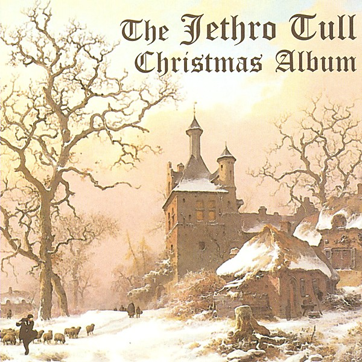

# The Jethro Tull Christmas Album

By **Jethro Tull**

## Album Data

- **Catalog:** Beets
- **Format:** Digital, Album
- **Album:** The Jethro Tull Christmas Album
- **Artist:** Jethro Tull
- **Albumartist:** Jethro Tull
- **Genre:** Progressive Rock
- **MusicBrainz Album Artist ID:** [ece57992-dc2e-4f67-a269-fa43626c1a3d](https://musicbrainz.org/artist/ece57992-dc2e-4f67-a269-fa43626c1a3d)
- **MusicBrainz Album ID:** [05db966e-eac7-43b1-bcab-89972c4607af](https://musicbrainz.org/release/05db966e-eac7-43b1-bcab-89972c4607af)
- **MusicBrainz Release Group ID:** [b4e27584-e69c-38c6-b29c-b4509ea642be](https://musicbrainz.org/release-group/b4e27584-e69c-38c6-b29c-b4509ea642be)
- **Year:** 2009
- **Catalog #:** 
- **Label:** 
- **Total Tracks:** 17

## Album Tracks

### Track 01 - Prelude (Steven Wilson Stereo Mix)

- **Artist:** Jethro Tull
- **Format:** ALAC
- **Genre:** Progressive Rock
- **Length:** 0:53
- **MusicBrainz Track ID:** 
- **Title:** Prelude (Steven Wilson Stereo Mix)
- **Track:** 01
- **Year:** 2015

### Track 02 - Quiz Kid (Steven Wilson Stereo Mix)

- **Artist:** Jethro Tull
- **Format:** ALAC
- **Genre:** Progressive Rock
- **Length:** 4:03
- **MusicBrainz Track ID:** 
- **Title:** Quiz Kid (Steven Wilson Stereo Mix)
- **Track:** 02
- **Year:** 2015

### Track 03 - Crazed Institution (Steven Wilson Stereo Mix)

- **Artist:** Jethro Tull
- **Format:** ALAC
- **Genre:** Progressive Rock
- **Length:** 4:35
- **MusicBrainz Track ID:** 
- **Title:** Crazed Institution (Steven Wilson Stereo Mix)
- **Track:** 03
- **Year:** 2015

### Track 04 - Salamander (Steven Wilson Stereo Mix)

- **Artist:** Jethro Tull
- **Format:** ALAC
- **Genre:** Progressive Rock
- **Length:** 2:52
- **MusicBrainz Track ID:** 
- **Title:** Salamander (Steven Wilson Stereo Mix)
- **Track:** 04
- **Year:** 2015

### Track 05 - Taxi Grab (Steven Wilson Stereo Mix)

- **Artist:** Jethro Tull
- **Format:** ALAC
- **Genre:** Progressive Rock
- **Length:** 3:50
- **MusicBrainz Track ID:** 
- **Title:** Taxi Grab (Steven Wilson Stereo Mix)
- **Track:** 05
- **Year:** 2015

### Track 06 - From A Dead Beat To An Old Greaser (Steven Wilson Stereo Mix)

- **Artist:** Jethro Tull
- **Format:** ALAC
- **Genre:** Progressive Rock
- **Length:** 4:11
- **MusicBrainz Track ID:** 
- **Title:** From A Dead Beat To An Old Greaser (Steven Wilson Stereo Mix)
- **Track:** 06
- **Year:** 2015

### Track 07 - Bad-Eyed And Loveless (Steven Wilson Stereo Mix)

- **Artist:** Jethro Tull
- **Format:** ALAC
- **Genre:** Progressive Rock
- **Length:** 2:10
- **MusicBrainz Track ID:** 
- **Title:** Bad-Eyed And Loveless (Steven Wilson Stereo Mix)
- **Track:** 07
- **Year:** 2015

### Track 08 - Big Dipper (Steven Wilson Stereo Mix)

- **Artist:** Jethro Tull
- **Format:** ALAC
- **Genre:** Progressive Rock
- **Length:** 3:33
- **MusicBrainz Track ID:** 
- **Title:** Big Dipper (Steven Wilson Stereo Mix)
- **Track:** 08
- **Year:** 2015

### Track 09 - Too Old To Rock 'n' Roll

- **Artist:** Jethro Tull
- **Format:** ALAC
- **Genre:** Progressive Rock
- **Length:** 5:34
- **MusicBrainz Track ID:** 
- **Title:** Too Old To Rock 'n' Roll
- **Track:** 09
- **Year:** 2015

### Track 10 - Pied Piper (Steven Wilson Stereo Mix)

- **Artist:** Jethro Tull
- **Format:** ALAC
- **Genre:** Progressive Rock
- **Length:** 4:36
- **MusicBrainz Track ID:** 
- **Title:** Pied Piper (Steven Wilson Stereo Mix)
- **Track:** 10
- **Year:** 2015

### Track 11 - The Chequered Flag (Dead Or Alive) [Steven Wilson Stereo Mix]

- **Artist:** Jethro Tull
- **Format:** ALAC
- **Genre:** Progressive Rock
- **Length:** 5:23
- **MusicBrainz Track ID:** 
- **Title:** The Chequered Flag (Dead Or Alive) [Steven Wilson Stereo Mix]
- **Track:** 11
- **Year:** 2015

### Track 12 - From A Dead Beat To An Old Greaser (Steven Wilson Stereo Remix) [Monte Carlo January 1976]

- **Artist:** Jethro Tull
- **Format:** ALAC
- **Genre:** Progressive Rock
- **Length:** 4:09
- **MusicBrainz Track ID:** 
- **Title:** From A Dead Beat To An Old Greaser (Steven Wilson Stereo Remix) [Monte Carlo January 1976]
- **Track:** 12
- **Year:** 2015

### Track 13 - Bad-Eyed And Loveless (Steven Wilson Stereo Remix) [Monte Carlo January 1976]

- **Artist:** Jethro Tull
- **Format:** ALAC
- **Genre:** Progressive Rock
- **Length:** 2:12
- **MusicBrainz Track ID:** 
- **Title:** Bad-Eyed And Loveless (Steven Wilson Stereo Remix) [Monte Carlo January 1976]
- **Track:** 13
- **Year:** 2015

### Track 14 - Big Dipper (Steven Wilson Stereo Remix) [Monte Carlo January 1976]

- **Artist:** Jethro Tull
- **Format:** ALAC
- **Genre:** Progressive Rock
- **Length:** 3:36
- **MusicBrainz Track ID:** 
- **Title:** Big Dipper (Steven Wilson Stereo Remix) [Monte Carlo January 1976]
- **Track:** 14
- **Year:** 2015

### Track 15 - Too Old To Rock 'n' Roll

- **Artist:** Jethro Tull
- **Format:** ALAC
- **Genre:** Progressive Rock
- **Length:** 5:43
- **MusicBrainz Track ID:** 
- **Title:** Too Old To Rock 'n' Roll
- **Track:** 15
- **Year:** 2015

### Track 16 - The Chequered Flag (Dead Or Alive) [Steven Wilson Stereo Remix] [Brussels November 1975]

- **Artist:** Jethro Tull
- **Format:** ALAC
- **Genre:** Progressive Rock
- **Length:** 5:23
- **MusicBrainz Track ID:** 
- **Title:** The Chequered Flag (Dead Or Alive) [Steven Wilson Stereo Remix] [Brussels November 1975]
- **Track:** 16
- **Year:** 2015

### Track 17 - Quiz Kid (Version 1) [Steven Wilson Stereo Mix]

- **Artist:** Jethro Tull
- **Format:** ALAC
- **Genre:** Progressive Rock
- **Length:** 4:39
- **MusicBrainz Track ID:** 
- **Title:** Quiz Kid (Version 1) [Steven Wilson Stereo Mix]
- **Track:** 17
- **Year:** 2015

### Track 01 - Salamander's Rag Time (Steven Wilson Mix)

- **Artist:** Jethro Tull
- **Format:** ALAC
- **Genre:** Progressive Rock
- **Length:** 3:22
- **MusicBrainz Track ID:** 
- **Title:** Salamander's Rag Time (Steven Wilson Mix)
- **Track:** 01
- **Year:** 2015

### Track 02 - Commercial Traveller (Steven Wilson Mix)

- **Artist:** Jethro Tull
- **Format:** ALAC
- **Genre:** Progressive Rock
- **Length:** 3:30
- **MusicBrainz Track ID:** 
- **Title:** Commercial Traveller (Steven Wilson Mix)
- **Track:** 02
- **Year:** 2015

### Track 03 - Salamander (Steven Wilson Mix) [Instrumental]

- **Artist:** Jethro Tull
- **Format:** ALAC
- **Genre:** Progressive Rock
- **Length:** 3:21
- **MusicBrainz Track ID:** 
- **Title:** Salamander (Steven Wilson Mix) [Instrumental]
- **Track:** 03
- **Year:** 2015

### Track 04 - A Small Cigar (Steven Wilson Mix) [Acoustic Version]

- **Artist:** Jethro Tull
- **Format:** ALAC
- **Genre:** Progressive Rock
- **Length:** 3:38
- **MusicBrainz Track ID:** 
- **Title:** A Small Cigar (Steven Wilson Mix) [Acoustic Version]
- **Track:** 04
- **Year:** 2015

### Track 05 - Strip Cartoon (Steven Wilson Mix)

- **Artist:** Jethro Tull
- **Format:** ALAC
- **Genre:** Progressive Rock
- **Length:** 3:17
- **MusicBrainz Track ID:** 
- **Title:** Strip Cartoon (Steven Wilson Mix)
- **Track:** 05
- **Year:** 2015

### Track 06 - One Brown Mouse (Early Version) [Original Master Mix]

- **Artist:** Jethro Tull
- **Format:** ALAC
- **Genre:** Progressive Rock
- **Length:** 3:32
- **MusicBrainz Track ID:** 
- **Title:** One Brown Mouse (Early Version) [Original Master Mix]
- **Track:** 06
- **Year:** 2015

### Track 07 - A Small Cigar (Orchestrated Version) [Original Rough Mix]

- **Artist:** Jethro Tull
- **Format:** ALAC
- **Genre:** Progressive Rock
- **Length:** 4:32
- **MusicBrainz Track ID:** 
- **Title:** A Small Cigar (Orchestrated Version) [Original Rough Mix]
- **Track:** 07
- **Year:** 2015

### Track 08 - Too Old To Rock 'n' Roll

- **Artist:** Jethro Tull
- **Format:** ALAC
- **Genre:** Progressive Rock
- **Length:** 6:04
- **MusicBrainz Track ID:** 
- **Title:** Too Old To Rock 'n' Roll
- **Track:** 08
- **Year:** 2015

### Track 09 - Prelude

- **Artist:** Jethro Tull
- **Format:** ALAC
- **Genre:** Progressive Rock
- **Length:** 0:55
- **MusicBrainz Track ID:** 
- **Title:** Prelude
- **Track:** 09
- **Year:** 2015

### Track 10 - Quiz Kid

- **Artist:** Jethro Tull
- **Format:** ALAC
- **Genre:** Progressive Rock
- **Length:** 4:14
- **MusicBrainz Track ID:** 
- **Title:** Quiz Kid
- **Track:** 10
- **Year:** 2015

### Track 11 - Crazed Institution

- **Artist:** Jethro Tull
- **Format:** ALAC
- **Genre:** Stoner Rock
- **Length:** 4:48
- **MusicBrainz Track ID:** 
- **Title:** Crazed Institution
- **Track:** 11
- **Year:** 2015

### Track 12 - Salamander

- **Artist:** Jethro Tull
- **Format:** ALAC
- **Genre:** Progressive Rock
- **Length:** 2:51
- **MusicBrainz Track ID:** 
- **Title:** Salamander
- **Track:** 12
- **Year:** 2015

### Track 13 - Taxi Grab

- **Artist:** Jethro Tull
- **Format:** ALAC
- **Genre:** Progressive Rock
- **Length:** 3:54
- **MusicBrainz Track ID:** 
- **Title:** Taxi Grab
- **Track:** 13
- **Year:** 2015

### Track 14 - From A Dead Beat To An Old Greaser

- **Artist:** Jethro Tull
- **Format:** ALAC
- **Genre:** Progressive Rock
- **Length:** 4:09
- **MusicBrainz Track ID:** 
- **Title:** From A Dead Beat To An Old Greaser
- **Track:** 14
- **Year:** 2015

### Track 15 - Bad-Eyed And Loveless

- **Artist:** Jethro Tull
- **Format:** ALAC
- **Genre:** Progressive Rock
- **Length:** 2:12
- **MusicBrainz Track ID:** 
- **Title:** Bad-Eyed And Loveless
- **Track:** 15
- **Year:** 2015

### Track 16 - Big Dipper

- **Artist:** Jethro Tull
- **Format:** ALAC
- **Genre:** Progressive Rock
- **Length:** 3:36
- **MusicBrainz Track ID:** 
- **Title:** Big Dipper
- **Track:** 16
- **Year:** 2015

### Track 17 - Too Old To Rock 'n' Roll

- **Artist:** Jethro Tull
- **Format:** ALAC
- **Genre:** Progressive Rock
- **Length:** 5:44
- **MusicBrainz Track ID:** 
- **Title:** Too Old To Rock 'n' Roll
- **Track:** 17
- **Year:** 2015

### Track 18 - Pied Piper

- **Artist:** Jethro Tull
- **Format:** ALAC
- **Genre:** Progressive Rock
- **Length:** 4:33
- **MusicBrainz Track ID:** 
- **Title:** Pied Piper
- **Track:** 18
- **Year:** 2015

### Track 19 - The Chequered Flag (Dead Or Alive)

- **Artist:** Jethro Tull
- **Format:** ALAC
- **Genre:** Progressive Rock
- **Length:** 5:27
- **MusicBrainz Track ID:** 
- **Title:** The Chequered Flag (Dead Or Alive)
- **Track:** 19
- **Year:** 2015

### Track 00 - 00 - JT_TOTRNR_D1 1

- **Artist:** Jethro Tull
- **Format:** AAC
- **Genre:** Progressive Rock
- **Length:** 43:24
- **MusicBrainz Track ID:** 
- **Title:** 00 - JT_TOTRNR_D1 1
- **Track:** 00
- **Year:** 2015

### Track 00 - 00 - JT_TOTRNR_D1 2

- **Artist:** Jethro Tull
- **Format:** AAC
- **Genre:** Progressive Rock
- **Length:** 41:47
- **MusicBrainz Track ID:** 
- **Title:** 00 - JT_TOTRNR_D1 2
- **Track:** 00
- **Year:** 2015

### Track 00 - 00 - JT_TOTRNR_D1 3

- **Artist:** Jethro Tull
- **Format:** AAC
- **Genre:** Progressive Rock
- **Length:** 21:06
- **MusicBrainz Track ID:** 
- **Title:** 00 - JT_TOTRNR_D1 3
- **Track:** 00
- **Year:** 2015

### Track 00 - 00 - JT_TOTRNR_D2 1

- **Artist:** Jethro Tull
- **Format:** AAC
- **Genre:** Progressive Rock
- **Length:** 42:28
- **MusicBrainz Track ID:** 
- **Title:** 00 - JT_TOTRNR_D2 1
- **Track:** 00
- **Year:** 2015

### Track 00 - 00 - JT_TOTRNR_D2 2

- **Artist:** Jethro Tull
- **Format:** AAC
- **Genre:** Progressive Rock
- **Length:** 42:26
- **MusicBrainz Track ID:** 
- **Title:** 00 - JT_TOTRNR_D2 2
- **Track:** 00
- **Year:** 2015

### Track 00 - 00 - JT_TOTRNR_D2 3

- **Artist:** Jethro Tull
- **Format:** AAC
- **Genre:** Progressive Rock
- **Length:** 13:51
- **MusicBrainz Track ID:** 
- **Title:** 00 - JT_TOTRNR_D2 3
- **Track:** 00
- **Year:** 2015

### Track 00 - 00 - JT_TOTRNR_D2 4

- **Artist:** Jethro Tull
- **Format:** AAC
- **Genre:** Progressive Rock
- **Length:** 25:37
- **MusicBrainz Track ID:** 
- **Title:** 00 - JT_TOTRNR_D2 4
- **Track:** 00
- **Year:** 2015

## See also

- [20 Years of Jethro Tull Disc 1](20_Years_of_Jethro_Tull_Disc_1.md)
- [20 Years of Jethro Tull Disc 2](20_Years_of_Jethro_Tull_Disc_2.md)
- [20 Years of Jethro Tull Disc 3](20_Years_of_Jethro_Tull_Disc_3.md)
- [A Passion Play](A_Passion_Play.md)
- [A Passion Play (Steven Wilson mix) DVD rip](A_Passion_Play_Steven_Wilson_mix_DVD_rip.md)
- [A Passion Play (Steven Wilson mix)](A_Passion_Play_Steven_Wilson_mix.md)
- [Aqualung 40th Anniversary Adapted Edition](Aqualung_40th_Anniversary_Adapted_Edition.md)
- [Aqualung](Aqualung.md)
- [J-Tull Dot Com](J-Tull_Dot_Com.md)
- [Live in Concert at Landover 1977](Live_in_Concert_at_Landover_1977.md)
- [Minstrel in the Gallery](Minstrel_in_the_Gallery.md)
- [Songs From The Wood (40th Anniversary Edition)](Songs_From_The_Wood_40th_Anniversary_Edition.md)
- [Songs From the Wood](Songs_From_the_Wood.md)
- [Stand Up – The Elevated Edition (Live At The Stockholm Konserthuset, 9-1-1969)](Stand_Up_–_The_Elevated_Edition_Live_At_The_Stockholm_Konserthuset__9-1-1969.md)
- [Stand Up – The Elevated Edition (Steve Wilson Stereo Remix)](Stand_Up_–_The_Elevated_Edition_Steve_Wilson_Stereo_Remix.md)
- [The Château d’Hérouville Sessions](The_Château_d’Hérouville_Sessions.md)
- [Too Old To Rock 'n' Roll](Too_Old_To_Rock_n_Roll.md)
- [WarChild (A New Steven Wilson Stereo Remix)](WarChild_A_New_Steven_Wilson_Stereo_Remix.md)
- [WarChild D2 - The Second Act](WarChild_D2_-_The_Second_Act.md)
- [CD: 20 Years Of Jethro Tull - The Definitive Collection (Disc 1)](../../CD/Jethro_Tull/20_Years_Of_Jethro_Tull_-_The_Definitive_Collection_Disc_1.md)
- [CD: 20 Years Of Jethro Tull - The Definitive Collection (Disc 2)](../../CD/Jethro_Tull/20_Years_Of_Jethro_Tull_-_The_Definitive_Collection_Disc_2.md)
- [CD: 20 Years Of Jethro Tull - The Definitive Collection (Disc 3)](../../CD/Jethro_Tull/20_Years_Of_Jethro_Tull_-_The_Definitive_Collection_Disc_3.md)
- [CD: ](../../CD/Jethro_Tull/Jethro_Tull.md)
- [Roon: A Passion Play (Steven Wilson Mix)](../../Roon/Jethro_Tull/A_Passion_Play_Steven_Wilson_Mix.md)
- [Roon: Aqualung (Steven Wilson Mix and Master)](../../Roon/Jethro_Tull/Aqualung_Steven_Wilson_Mix_and_Master.md)
- [Roon: Benefit (Steven Wilson Mix)](../../Roon/Jethro_Tull/Benefit_Steven_Wilson_Mix.md)
- [Roon: Crest of a Knave (2005 Remaster)](../../Roon/Jethro_Tull/Crest_of_a_Knave_2005_Remaster.md)
- [Roon: Heavy Horses (Steven Wilson Remix)](../../Roon/Jethro_Tull/Heavy_Horses_Steven_Wilson_Remix.md)
- [Roon: Jethro Tull - The String Quartets](../../Roon/Jethro_Tull/Jethro_Tull_-_The_String_Quartets.md)
- [Roon: Living in the Past](../../Roon/Jethro_Tull/Living_in_the_Past.md)
- [Roon: Man of God (Steven Wilson Stereo Remix)](../../Roon/Jethro_Tull/Man_of_God_Steven_Wilson_Stereo_Remix.md)
- [Roon: Minstrel in the Gallery (40th Anniversary Edition)](../../Roon/Jethro_Tull/Minstrel_in_the_Gallery_40th_Anniversary_Edition.md)
- [Roon: Songs from the Wood (40th Anniversary Edition; The Steven Wilson Remix)](../../Roon/Jethro_Tull/Songs_from_the_Wood_40th_Anniversary_Edition;_The_Steven_Wilson_Remix.md)
- [Roon: Stand Up (Steven Wilson Remix)](../../Roon/Jethro_Tull/Stand_Up_Steven_Wilson_Remix.md)
- [Roon: Thick as a Brick (Steven Wilson Mix and Master)](../../Roon/Jethro_Tull/Thick_as_a_Brick_Steven_Wilson_Mix_and_Master.md)
- [Roon: This Was (50th Anniversary Edition)](../../Roon/Jethro_Tull/This_Was_50th_Anniversary_Edition.md)
- [Roon: Too Old to Rock 'n' Roll](../../Roon/Jethro_Tull/Too_Old_to_Rock_n_Roll-_Too_Young_to_Die!_The_TV_Special_Edition.md)
- [Vinyl: Aqualung (The 2011 Steven Wilson Stereo Remix)](../../Vinyl/Jethro_Tull/Aqualung_The_2011_Steven_Wilson_Stereo_Remix.md)
- [Vinyl: ](../../Vinyl/Jethro_Tull/Jethro_Tull.md)
- [Vinyl: Minstrel In The Gallery (40th Anniversary LP Édition)](../../Vinyl/Jethro_Tull/Minstrel_In_The_Gallery_40th_Anniversary_LP_Édition.md)
- [Vinyl: Songs From The Wood](../../Vinyl/Jethro_Tull/Songs_From_The_Wood.md)
- [Vinyl: Thick As A Brick](../../Vinyl/Jethro_Tull/Thick_As_A_Brick.md)
