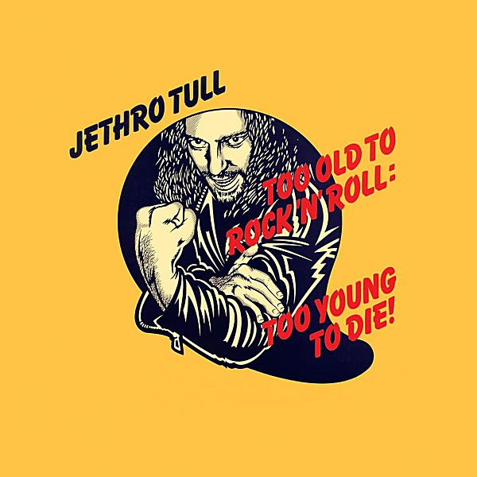

# Too Old To Rock 'n' Roll

By **Jethro Tull**

## Album Data

- **Catalog:** Beets
- **Format:** Digital, Album
- **Album:** Too Old To Rock 'n' Roll
- **Artist:** Jethro Tull
- **Albumartist:** Jethro Tull
- **Genre:** Progressive Rock
- **MusicBrainz Album Artist ID:** 
- **MusicBrainz Album ID:** 
- **MusicBrainz Release Group ID:** 
- **Year:** 2015
- **Catalog #:** 
- **Label:** 
- **Total Tracks:** 00

## Album Tracks

### Track 00 - 2014 Remix 24 Bit

- **Artist:** Jethro Tull
- **Format:** AAC
- **Genre:** Progressive Rock
- **Length:** 39:31
- **MusicBrainz Track ID:** 
- **Title:** 2014 Remix 24 Bit
- **Track:** 00
- **Year:** 1974

### Track 00 - Additional_Orchestral_Recordings_24_Bit

- **Artist:** Jethro Tull
- **Format:** AAC
- **Genre:** Progressive Rock
- **Length:** 16:31
- **MusicBrainz Track ID:** 
- **Title:** Additional_Orchestral_Recordings_24_Bit
- **Track:** 00
- **Year:** 1974

### Track 00 - Additional_Recordings_24_Bit

- **Artist:** Jethro Tull
- **Format:** AAC
- **Genre:** Progressive Rock
- **Length:** 61:48
- **MusicBrainz Track ID:** 
- **Title:** Additional_Recordings_24_Bit
- **Track:** 00
- **Year:** 1974

### Track 00 - Montreaux_1974_Photo_Session_Press_Conference

- **Artist:** Jethro Tull
- **Format:** AAC
- **Genre:** Progressive Rock
- **Length:** 14:27
- **MusicBrainz Track ID:** 
- **Title:** Montreaux_1974_Photo_Session_Press_Conference
- **Track:** 00
- **Year:** 1974

### Track 00 - Original_1974_Mix

- **Artist:** Jethro Tull
- **Format:** AAC
- **Genre:** Progressive Rock
- **Length:** 39:31
- **MusicBrainz Track ID:** 
- **Title:** Original_1974_Mix
- **Track:** 00
- **Year:** 1974

### Track 00 - Original_1974_Quad_Mix

- **Artist:** Jethro Tull
- **Format:** AAC
- **Genre:** Progressive Rock
- **Length:** 44:54
- **MusicBrainz Track ID:** 
- **Title:** Original_1974_Quad_Mix
- **Track:** 00
- **Year:** 1974

### Track 00 - The_Third_Hoorah_Promo_Footage

- **Artist:** Jethro Tull
- **Format:** AAC
- **Genre:** Progressive Rock
- **Length:** 4:53
- **MusicBrainz Track ID:** 
- **Title:** The_Third_Hoorah_Promo_Footage
- **Track:** 00
- **Year:** 1974

### Track 01 - WarChild

- **Artist:** Jethro Tull
- **Format:** ALAC
- **Genre:** Progressive Rock
- **Length:** 4:38
- **MusicBrainz Track ID:** 
- **Title:** WarChild
- **Track:** 01
- **Year:** 1974

### Track 02 - Queen And Country

- **Artist:** Jethro Tull
- **Format:** ALAC
- **Genre:** Progressive Rock
- **Length:** 3:00
- **MusicBrainz Track ID:** 
- **Title:** Queen And Country
- **Track:** 02
- **Year:** 1974

### Track 03 - Ladies

- **Artist:** Jethro Tull
- **Format:** ALAC
- **Genre:** Progressive Rock
- **Length:** 3:19
- **MusicBrainz Track ID:** 
- **Title:** Ladies
- **Track:** 03
- **Year:** 1974

### Track 04 - Back-Door Angels

- **Artist:** Jethro Tull
- **Format:** ALAC
- **Genre:** Progressive Rock
- **Length:** 5:27
- **MusicBrainz Track ID:** 
- **Title:** Back-Door Angels
- **Track:** 04
- **Year:** 1974

### Track 05 - Sealion

- **Artist:** Jethro Tull
- **Format:** ALAC
- **Genre:** Progressive Rock
- **Length:** 3:41
- **MusicBrainz Track ID:** 
- **Title:** Sealion
- **Track:** 05
- **Year:** 1974

### Track 06 - Skating Away On The Thin Ice Of A New Day

- **Artist:** Jethro Tull
- **Format:** ALAC
- **Genre:** Progressive Rock
- **Length:** 4:11
- **MusicBrainz Track ID:** 
- **Title:** Skating Away On The Thin Ice Of A New Day
- **Track:** 06
- **Year:** 1974

### Track 07 - Bungle In The Jungle

- **Artist:** Jethro Tull
- **Format:** ALAC
- **Genre:** Progressive Rock
- **Length:** 3:41
- **MusicBrainz Track ID:** 
- **Title:** Bungle In The Jungle
- **Track:** 07
- **Year:** 1974

### Track 08 - Only Solitaire

- **Artist:** Jethro Tull
- **Format:** ALAC
- **Genre:** Progressive Rock
- **Length:** 1:30
- **MusicBrainz Track ID:** 
- **Title:** Only Solitaire
- **Track:** 08
- **Year:** 1974

### Track 09 - The Third Hoorah

- **Artist:** Jethro Tull
- **Format:** ALAC
- **Genre:** Indie Rock
- **Length:** 4:52
- **MusicBrainz Track ID:** 
- **Title:** The Third Hoorah
- **Track:** 09
- **Year:** 1974

### Track 10 - Two Fingers

- **Artist:** Jethro Tull
- **Format:** ALAC
- **Genre:** Progressive Rock
- **Length:** 5:08
- **MusicBrainz Track ID:** 
- **Title:** Two Fingers
- **Track:** 10
- **Year:** 1974

## See also

- [20 Years of Jethro Tull Disc 1](20_Years_of_Jethro_Tull_Disc_1.md)
- [20 Years of Jethro Tull Disc 2](20_Years_of_Jethro_Tull_Disc_2.md)
- [20 Years of Jethro Tull Disc 3](20_Years_of_Jethro_Tull_Disc_3.md)
- [A Passion Play](A_Passion_Play.md)
- [A Passion Play (Steven Wilson mix) DVD rip](A_Passion_Play_Steven_Wilson_mix_DVD_rip.md)
- [A Passion Play (Steven Wilson mix)](A_Passion_Play_Steven_Wilson_mix.md)
- [Aqualung 40th Anniversary Adapted Edition](Aqualung_40th_Anniversary_Adapted_Edition.md)
- [Aqualung](Aqualung.md)
- [J-Tull Dot Com](J-Tull_Dot_Com.md)
- [Live in Concert at Landover 1977](Live_in_Concert_at_Landover_1977.md)
- [Minstrel in the Gallery](Minstrel_in_the_Gallery.md)
- [Songs From The Wood (40th Anniversary Edition)](Songs_From_The_Wood_40th_Anniversary_Edition.md)
- [Songs From the Wood](Songs_From_the_Wood.md)
- [Stand Up – The Elevated Edition (Live At The Stockholm Konserthuset, 9-1-1969)](Stand_Up_–_The_Elevated_Edition_Live_At_The_Stockholm_Konserthuset__9-1-1969.md)
- [Stand Up – The Elevated Edition (Steve Wilson Stereo Remix)](Stand_Up_–_The_Elevated_Edition_Steve_Wilson_Stereo_Remix.md)
- [The Château d’Hérouville Sessions](The_Château_d’Hérouville_Sessions.md)
- [The Jethro Tull Christmas Album](The_Jethro_Tull_Christmas_Album.md)
- [WarChild (A New Steven Wilson Stereo Remix)](WarChild_A_New_Steven_Wilson_Stereo_Remix.md)
- [WarChild D2 - The Second Act](WarChild_D2_-_The_Second_Act.md)
- [CD: 20 Years Of Jethro Tull - The Definitive Collection (Disc 1)](../../CD/Jethro_Tull/20_Years_Of_Jethro_Tull_-_The_Definitive_Collection_Disc_1.md)
- [CD: 20 Years Of Jethro Tull - The Definitive Collection (Disc 2)](../../CD/Jethro_Tull/20_Years_Of_Jethro_Tull_-_The_Definitive_Collection_Disc_2.md)
- [CD: 20 Years Of Jethro Tull - The Definitive Collection (Disc 3)](../../CD/Jethro_Tull/20_Years_Of_Jethro_Tull_-_The_Definitive_Collection_Disc_3.md)
- [CD: ](../../CD/Jethro_Tull/Jethro_Tull.md)
- [Roon: A Passion Play (Steven Wilson Mix)](../../Roon/Jethro_Tull/A_Passion_Play_Steven_Wilson_Mix.md)
- [Roon: Aqualung (Steven Wilson Mix and Master)](../../Roon/Jethro_Tull/Aqualung_Steven_Wilson_Mix_and_Master.md)
- [Roon: Benefit (Steven Wilson Mix)](../../Roon/Jethro_Tull/Benefit_Steven_Wilson_Mix.md)
- [Roon: Crest of a Knave (2005 Remaster)](../../Roon/Jethro_Tull/Crest_of_a_Knave_2005_Remaster.md)
- [Roon: Heavy Horses (Steven Wilson Remix)](../../Roon/Jethro_Tull/Heavy_Horses_Steven_Wilson_Remix.md)
- [Roon: Jethro Tull - The String Quartets](../../Roon/Jethro_Tull/Jethro_Tull_-_The_String_Quartets.md)
- [Roon: Living in the Past](../../Roon/Jethro_Tull/Living_in_the_Past.md)
- [Roon: Man of God (Steven Wilson Stereo Remix)](../../Roon/Jethro_Tull/Man_of_God_Steven_Wilson_Stereo_Remix.md)
- [Roon: Minstrel in the Gallery (40th Anniversary Edition)](../../Roon/Jethro_Tull/Minstrel_in_the_Gallery_40th_Anniversary_Edition.md)
- [Roon: Songs from the Wood (40th Anniversary Edition; The Steven Wilson Remix)](../../Roon/Jethro_Tull/Songs_from_the_Wood_40th_Anniversary_Edition;_The_Steven_Wilson_Remix.md)
- [Roon: Stand Up (Steven Wilson Remix)](../../Roon/Jethro_Tull/Stand_Up_Steven_Wilson_Remix.md)
- [Roon: Thick as a Brick (Steven Wilson Mix and Master)](../../Roon/Jethro_Tull/Thick_as_a_Brick_Steven_Wilson_Mix_and_Master.md)
- [Roon: This Was (50th Anniversary Edition)](../../Roon/Jethro_Tull/This_Was_50th_Anniversary_Edition.md)
- [Roon: Too Old to Rock 'n' Roll](../../Roon/Jethro_Tull/Too_Old_to_Rock_n_Roll-_Too_Young_to_Die!_The_TV_Special_Edition.md)
- [Vinyl: Aqualung (The 2011 Steven Wilson Stereo Remix)](../../Vinyl/Jethro_Tull/Aqualung_The_2011_Steven_Wilson_Stereo_Remix.md)
- [Vinyl: ](../../Vinyl/Jethro_Tull/Jethro_Tull.md)
- [Vinyl: Minstrel In The Gallery (40th Anniversary LP Édition)](../../Vinyl/Jethro_Tull/Minstrel_In_The_Gallery_40th_Anniversary_LP_Édition.md)
- [Vinyl: Songs From The Wood](../../Vinyl/Jethro_Tull/Songs_From_The_Wood.md)
- [Vinyl: Thick As A Brick](../../Vinyl/Jethro_Tull/Thick_As_A_Brick.md)
