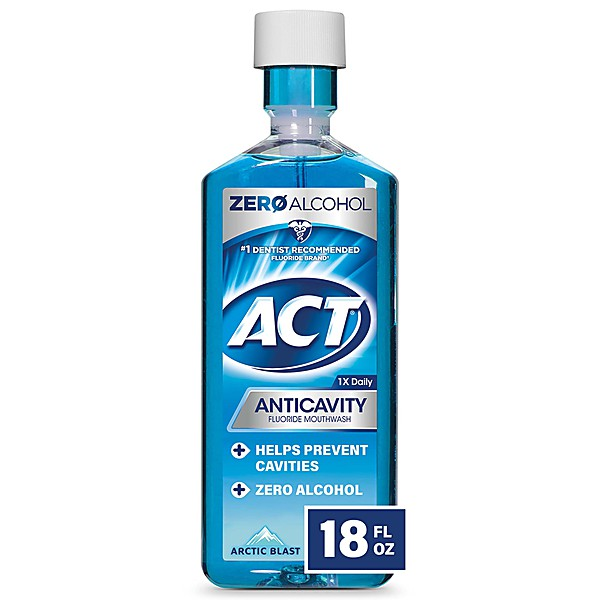

# WarChild D2 - The Second Act

By **Jethro Tull**

## Album Data

- **Catalog:** Beets
- **Format:** Digital, Album
- **Album:** WarChild D2 - The Second Act
- **Artist:** Jethro Tull
- **Albumartist:** Jethro Tull
- **Genre:** Progressive Rock
- **MusicBrainz Album Artist ID:** 
- **MusicBrainz Album ID:** 
- **MusicBrainz Release Group ID:** 
- **Year:** 1974
- **Catalog #:** 
- **Label:** 
- **Total Tracks:** 21

## Album Tracks

### Track 01 - Paradise Steakhouse

- **Artist:** Jethro Tull
- **Format:** ALAC
- **Genre:** Indie Rock
- **Length:** 4:01
- **MusicBrainz Track ID:** 
- **Title:** Paradise Steakhouse
- **Track:** 01
- **Year:** 1974

### Track 02 - Saturation

- **Artist:** Jethro Tull
- **Format:** ALAC
- **Genre:** Progressive Rock
- **Length:** 4:20
- **MusicBrainz Track ID:** 
- **Title:** Saturation
- **Track:** 02
- **Year:** 1974

### Track 03 - Good Godmother

- **Artist:** Jethro Tull
- **Format:** ALAC
- **Genre:** Progressive Rock
- **Length:** 4:26
- **MusicBrainz Track ID:** 
- **Title:** Good Godmother
- **Track:** 03
- **Year:** 1974

### Track 04 - SeaLion II

- **Artist:** Jethro Tull
- **Format:** ALAC
- **Genre:** Progressive Rock
- **Length:** 3:19
- **MusicBrainz Track ID:** 
- **Title:** SeaLion II
- **Track:** 04
- **Year:** 1974

### Track 05 - Quartet

- **Artist:** Jethro Tull
- **Format:** ALAC
- **Genre:** Psychedelic Rock
- **Length:** 2:43
- **MusicBrainz Track ID:** 
- **Title:** Quartet
- **Track:** 05
- **Year:** 1974

### Track 06 - WarChild II

- **Artist:** Jethro Tull
- **Format:** ALAC
- **Genre:** Progressive Rock
- **Length:** 3:14
- **MusicBrainz Track ID:** 
- **Title:** WarChild II
- **Track:** 06
- **Year:** 1974

### Track 07 - Tomorrow Was Today

- **Artist:** Jethro Tull
- **Format:** ALAC
- **Genre:** Rock
- **Length:** 3:53
- **MusicBrainz Track ID:** 
- **Title:** Tomorrow Was Today
- **Track:** 07
- **Year:** 1974

### Track 08 - Glory Row

- **Artist:** Jethro Tull
- **Format:** ALAC
- **Genre:** Progressive Rock
- **Length:** 3:34
- **MusicBrainz Track ID:** 
- **Title:** Glory Row
- **Track:** 08
- **Year:** 1974

### Track 09 - March, The Mad Scientist

- **Artist:** Jethro Tull
- **Format:** ALAC
- **Genre:** Progressive Rock
- **Length:** 1:48
- **MusicBrainz Track ID:** 
- **Title:** March, The Mad Scientist
- **Track:** 09
- **Year:** 1974

### Track 10 - Rainbow Blues

- **Artist:** Jethro Tull
- **Format:** ALAC
- **Genre:** Psychedelic Rock
- **Length:** 3:37
- **MusicBrainz Track ID:** 
- **Title:** Rainbow Blues
- **Track:** 10
- **Year:** 1974

### Track 11 - Pan Dance

- **Artist:** Jethro Tull
- **Format:** ALAC
- **Genre:** Soft Rock
- **Length:** 3:37
- **MusicBrainz Track ID:** 
- **Title:** Pan Dance
- **Track:** 11
- **Year:** 1974

### Track 12 - The Orchestral WarChild Theme

- **Artist:** Jethro Tull
- **Format:** ALAC
- **Genre:** Progressive Rock
- **Length:** 9:34
- **MusicBrainz Track ID:** 
- **Title:** The Orchestral WarChild Theme
- **Track:** 12
- **Year:** 1974

### Track 13 - The Third Hoorah

- **Artist:** Jethro Tull
- **Format:** ALAC
- **Genre:** Indie Rock
- **Length:** 4:46
- **MusicBrainz Track ID:** 
- **Title:** The Third Hoorah
- **Track:** 13
- **Year:** 1974

### Track 14 - Mime Sequence

- **Artist:** Jethro Tull
- **Format:** ALAC
- **Genre:** Progressive Rock
- **Length:** 7:08
- **MusicBrainz Track ID:** 
- **Title:** Mime Sequence
- **Track:** 14
- **Year:** 1974

### Track 15 - Field Dance (Conway Hall Version)

- **Artist:** Jethro Tull
- **Format:** ALAC
- **Genre:** Progressive Rock
- **Length:** 1:41
- **MusicBrainz Track ID:** 
- **Title:** Field Dance (Conway Hall Version)
- **Track:** 15
- **Year:** 1974

### Track 16 - Waltz Of The Angels (Conway Hall Version)

- **Artist:** Jethro Tull
- **Format:** ALAC
- **Genre:** Progressive Rock
- **Length:** 4:22
- **MusicBrainz Track ID:** 
- **Title:** Waltz Of The Angels (Conway Hall Version)
- **Track:** 16
- **Year:** 1974

### Track 17 - The Beach (Pt. I; Morgan Master Recording)

- **Artist:** Jethro Tull
- **Format:** ALAC
- **Genre:** Progressive Rock
- **Length:** 3:20
- **MusicBrainz Track ID:** 
- **Title:** The Beach (Pt. I; Morgan Master Recording)
- **Track:** 17
- **Year:** 1974

### Track 18 - The Beach (Pt. II; Morgan Master Recording)

- **Artist:** Jethro Tull
- **Format:** ALAC
- **Genre:** Progressive Rock
- **Length:** 1:00
- **MusicBrainz Track ID:** 
- **Title:** The Beach (Pt. II; Morgan Master Recording)
- **Track:** 18
- **Year:** 1974

### Track 19 - Waltz Of The Angels (Morgan Demo Recording)

- **Artist:** Jethro Tull
- **Format:** ALAC
- **Genre:** Progressive Rock
- **Length:** 4:01
- **MusicBrainz Track ID:** 
- **Title:** Waltz Of The Angels (Morgan Demo Recording)
- **Track:** 19
- **Year:** 1974

### Track 20 - The Beach (Morgan Demo Recording)

- **Artist:** Jethro Tull
- **Format:** ALAC
- **Genre:** Progressive Rock
- **Length:** 2:41
- **MusicBrainz Track ID:** 
- **Title:** The Beach (Morgan Demo Recording)
- **Track:** 20
- **Year:** 1974

### Track 21 - Field Dance (Morgan Demo Recording)

- **Artist:** Jethro Tull
- **Format:** ALAC
- **Genre:** Progressive Rock
- **Length:** 1:05
- **MusicBrainz Track ID:** 
- **Title:** Field Dance (Morgan Demo Recording)
- **Track:** 21
- **Year:** 1974

