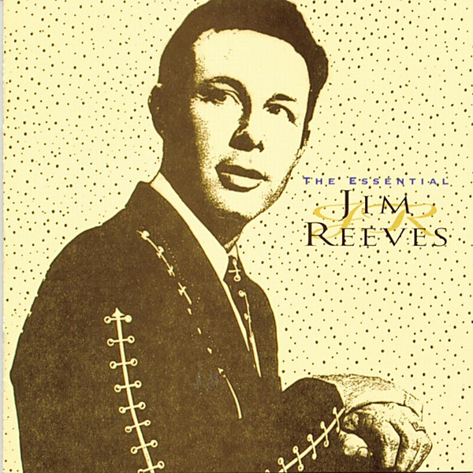

# The Essential Jim Reeves [RCA]

By **Jim Reeves**

## Album Data

- **Catalog:** Beets
- **Format:** Digital, Album
- **Album:** The Essential Jim Reeves [RCA]
- **Artist:** Jim Reeves
- **Albumartist:** Jim Reeves
- **Genre:** Classic Country
- **MusicBrainz Album Artist ID:** 
- **MusicBrainz Album ID:** 
- **MusicBrainz Release Group ID:** 
- **Year:** 1995
- **Catalog #:** 
- **Label:** 
- **Total Tracks:** 00

## Album Tracks

### Track 03 - He'll Have to Go

- **Artist:** Jim Reeves
- **Format:** AAC
- **Genre:** Classic Country
- **Length:** 2:19
- **MusicBrainz Track ID:** 
- **Title:** He'll Have to Go
- **Track:** 03
- **Year:** 1995

## See also

- [Vinyl: He'll Have To Go / In A Mansion Stands My Love](../../Vinyl/Jim_Reeves/Hell_Have_To_Go_-_In_A_Mansion_Stands_My_Love.md)
- [Vinyl: ](../../Vinyl/Jim_Reeves/Jim_Reeves.md)
