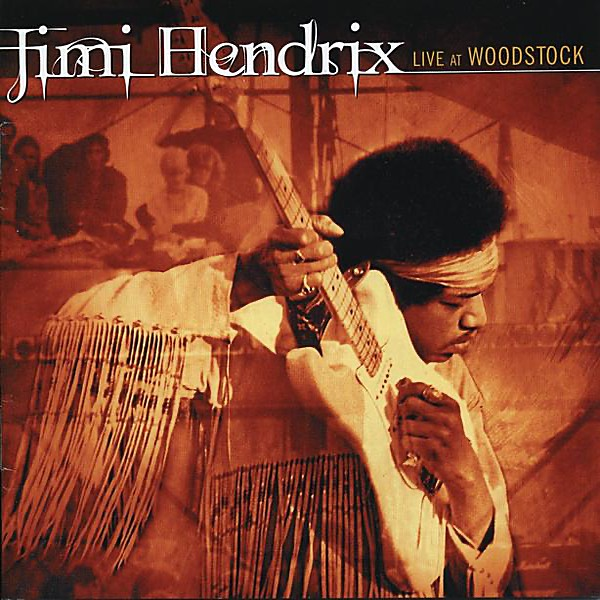

# Jimi Hendrix

By **Jimi Hendrix**

## Album Data

- **Catalog:** Beets
- **Format:** Digital, Album
- **Album:** Jimi Hendrix
- **Artist:** Jimi Hendrix
- **Albumartist:** Jimi Hendrix
- **Genre:** Psychedelic Rock
- **MusicBrainz Album Artist ID:** 
- **MusicBrainz Album ID:** 
- **MusicBrainz Release Group ID:** 
- **Year:** 1994
- **Catalog #:** 
- **Label:** 
- **Total Tracks:** 12

## Album Tracks

### Track 01 - Introduction

- **Artist:** Jimi Hendrix
- **Format:** ALAC
- **Genre:** Acid Rock
- **Length:** 1:57
- **MusicBrainz Track ID:** 
- **Title:** Introduction
- **Track:** 01
- **Year:** 1994

### Track 02 - Fire

- **Artist:** Jimi Hendrix
- **Format:** ALAC
- **Genre:** Psychedelic Rock
- **Length:** 3:53
- **MusicBrainz Track ID:** 
- **Title:** Fire
- **Track:** 02
- **Year:** 1994

### Track 03 - Izabella

- **Artist:** Jimi Hendrix
- **Format:** ALAC
- **Genre:** Psychedelic Rock
- **Length:** 5:10
- **MusicBrainz Track ID:** 
- **Title:** Izabella
- **Track:** 03
- **Year:** 1994

### Track 04 - Hear My Train A Comin' (Get My Heart Back Together)

- **Artist:** Jimi Hendrix
- **Format:** ALAC
- **Genre:** Psychedelic Rock
- **Length:** 9:15
- **MusicBrainz Track ID:** 
- **Title:** Hear My Train A Comin' (Get My Heart Back Together)
- **Track:** 04
- **Year:** 1994

### Track 05 - Red House

- **Artist:** Jimi Hendrix
- **Format:** ALAC
- **Genre:** Psychedelic Rock
- **Length:** 5:40
- **MusicBrainz Track ID:** 
- **Title:** Red House
- **Track:** 05
- **Year:** 1994

### Track 06 - Jam Back At The House (Beginnings)

- **Artist:** Jimi Hendrix
- **Format:** ALAC
- **Genre:** Psychedelic Rock
- **Length:** 8:24
- **MusicBrainz Track ID:** 
- **Title:** Jam Back At The House (Beginnings)
- **Track:** 06
- **Year:** 1994

### Track 07 - Voodoo Chile (Slight Return)/Stepping Stone

- **Artist:** Jimi Hendrix
- **Format:** ALAC
- **Genre:** Psychedelic Rock
- **Length:** 12:19
- **MusicBrainz Track ID:** 
- **Title:** Voodoo Chile (Slight Return)/Stepping Stone
- **Track:** 07
- **Year:** 1994

### Track 08 - The Star Spangled Banner

- **Artist:** Jimi Hendrix
- **Format:** ALAC
- **Genre:** Psychedelic Rock
- **Length:** 3:41
- **MusicBrainz Track ID:** 
- **Title:** The Star Spangled Banner
- **Track:** 08
- **Year:** 1994

### Track 09 - Purple Haze

- **Artist:** Jimi Hendrix
- **Format:** ALAC
- **Genre:** Psychedelic Rock
- **Length:** 3:25
- **MusicBrainz Track ID:** 
- **Title:** Purple Haze
- **Track:** 09
- **Year:** 1994

### Track 10 - Woodstock Improvisation

- **Artist:** Jimi Hendrix
- **Format:** ALAC
- **Genre:** Psychedelic Rock
- **Length:** 4:58
- **MusicBrainz Track ID:** 
- **Title:** Woodstock Improvisation
- **Track:** 10
- **Year:** 1994

### Track 11 - Villanova Junction

- **Artist:** Jimi Hendrix
- **Format:** ALAC
- **Genre:** Psychedelic Rock
- **Length:** 3:04
- **MusicBrainz Track ID:** 
- **Title:** Villanova Junction
- **Track:** 11
- **Year:** 1994

### Track 12 - Farewell

- **Artist:** Jimi Hendrix
- **Format:** ALAC
- **Genre:** Psychedelic Rock
- **Length:** 1:55
- **MusicBrainz Track ID:** 
- **Title:** Farewell
- **Track:** 12
- **Year:** 1994

## See also

- [Jimi Hendrix](Jimi_Hendrix.md)
- [Valleys of Neptune](Valleys_of_Neptune.md)
- [Roon: Are You Experienced](../../Roon/Jimi_Hendrix/Are_You_Experienced.md)
- [Roon: Axis](../../Roon/Jimi_Hendrix/Axis-_Bold_As_Love.md)
- [Vinyl: Band Of Gypsys](../../Vinyl/Jimi_Hendrix/Band_Of_Gypsys.md)
- [Vinyl: ](../../Vinyl/Jimi_Hendrix/Jimi_Hendrix.md)
