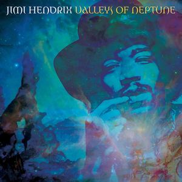

# Valleys of Neptune

By **Jimi Hendrix**

## Album Data

- **Catalog:** Beets
- **Format:** Digital, Album
- **Album:** Valleys of Neptune
- **Artist:** Jimi Hendrix
- **Albumartist:** Jimi Hendrix
- **Genre:** Psychedelic Rock
- **MusicBrainz Album Artist ID:** [06fb1c8b-566e-4cb2-985b-b467c90781d4](https://musicbrainz.org/artist/06fb1c8b-566e-4cb2-985b-b467c90781d4)
- **MusicBrainz Album ID:** [2a5b7aa9-ef93-4fae-8e0c-6d896b39834a](https://musicbrainz.org/release/2a5b7aa9-ef93-4fae-8e0c-6d896b39834a)
- **MusicBrainz Release Group ID:** [e86114ba-95e4-4758-8ce6-8db34111d0f8](https://musicbrainz.org/release-group/e86114ba-95e4-4758-8ce6-8db34111d0f8)
- **Year:** 2010
- **Catalog #:** 
- **Label:** 
- **Total Tracks:** 12

## Album Tracks

### Track 02 - Voodoo Child

- **Artist:** Jimi Hendrix
- **Format:** AAC
- **Genre:** Psychedelic Rock
- **Length:** 7:16
- **MusicBrainz Track ID:** 
- **Title:** Voodoo Child
- **Track:** 02
- **Year:** 2006

## See also

- [Jimi Hendrix](Jimi_Hendrix_2.md)
- [Jimi Hendrix](Jimi_Hendrix.md)
- [Roon: Are You Experienced](../../Roon/Jimi_Hendrix/Are_You_Experienced.md)
- [Roon: Axis](../../Roon/Jimi_Hendrix/Axis-_Bold_As_Love.md)
- [Vinyl: Band Of Gypsys](../../Vinyl/Jimi_Hendrix/Band_Of_Gypsys.md)
- [Vinyl: ](../../Vinyl/Jimi_Hendrix/Jimi_Hendrix.md)
