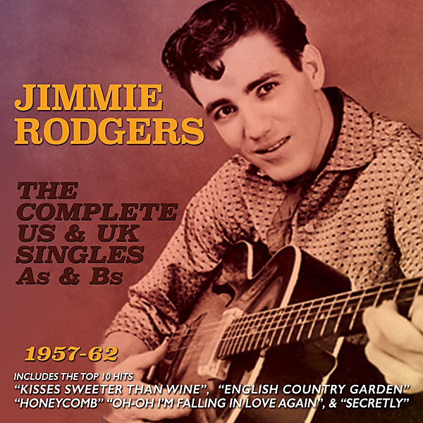

# Just For You

By **Jimmie Rodgers**

## Album Data

- **Catalog:** Beets
- **Format:** Digital, Album
- **Album:** Just For You
- **Artist:** Jimmie Rodgers
- **Albumartist:** Jimmie Rodgers
- **Genre:** Classic Country
- **MusicBrainz Album Artist ID:** 
- **MusicBrainz Album ID:** 
- **MusicBrainz Release Group ID:** 
- **Year:** 0000
- **Catalog #:** LPM-2112
- **Label:** RCA
- **Total Tracks:** 16

## Album Tracks

### Track 01 - Jimmie Rodgers' Last Blue Yodel (The Women Make a Fool Out of Me)

- **Artist:** Jimmie Rodgers
- **Format:** AAC
- **Genre:** Classic Country
- **Length:** 3:25
- **MusicBrainz Track ID:** [70db532d-0e6c-4379-bcca-bbbfc37a9fdb](https://musicbrainz.org/recording/70db532d-0e6c-4379-bcca-bbbfc37a9fdb)
- **Title:** Jimmie Rodgers' Last Blue Yodel (The Women Make a Fool Out of Me)
- **Track:** 01
- **Year:** 1960

### Track 02 - Mississippi Moon

- **Artist:** Jimmie Rodgers
- **Format:** AAC
- **Genre:** Classic Country
- **Length:** 3:28
- **MusicBrainz Track ID:** [eabe6a6f-f7ac-4ad0-9161-b5eda2805ee2](https://musicbrainz.org/recording/eabe6a6f-f7ac-4ad0-9161-b5eda2805ee2)
- **Title:** Mississippi Moon
- **Track:** 02
- **Year:** 1960

### Track 03 - My Rough and Rowdy Ways

- **Artist:** Jimmie Rodgers
- **Format:** AAC
- **Genre:** Country
- **Length:** 2:39
- **MusicBrainz Track ID:** [37b546a1-e97b-44d6-a831-078c000e9552](https://musicbrainz.org/recording/37b546a1-e97b-44d6-a831-078c000e9552)
- **Title:** My Rough and Rowdy Ways
- **Track:** 03
- **Year:** 1960

### Track 05 - My Blue Eyed Jane

- **Artist:** Jimmie Rodgers
- **Format:** AAC
- **Genre:** Rock
- **Length:** 2:53
- **MusicBrainz Track ID:** [d845cfb9-796e-499c-a4a0-79047a37c67c](https://musicbrainz.org/recording/d845cfb9-796e-499c-a4a0-79047a37c67c)
- **Title:** My Blue Eyed Jane
- **Track:** 05
- **Year:** 1960

### Track 06 - The One Rose (That's Left in My Heart)

- **Artist:** Jimmie Rodgers
- **Format:** AAC
- **Genre:** Classic Country
- **Length:** 2:40
- **MusicBrainz Track ID:** [982c1fa7-023f-4830-8f42-dae96bebfd39](https://musicbrainz.org/recording/982c1fa7-023f-4830-8f42-dae96bebfd39)
- **Title:** The One Rose (That's Left in My Heart)
- **Track:** 06
- **Year:** 1960

### Track 07 - Southern Cannonball

- **Artist:** Jimmie Rodgers
- **Format:** AAC
- **Genre:** Classic Country
- **Length:** 2:41
- **MusicBrainz Track ID:** [1e3f4417-e7be-48bf-9173-c4226cc19c65](https://musicbrainz.org/recording/1e3f4417-e7be-48bf-9173-c4226cc19c65)
- **Title:** Southern Cannonball
- **Track:** 07
- **Year:** 1960

### Track 08 - Long Tall Mama Blues

- **Artist:** Jimmie Rodgers
- **Format:** AAC
- **Genre:** Classic Country
- **Length:** 3:31
- **MusicBrainz Track ID:** [90d45fc2-e859-487a-95fb-410dae6cd313](https://musicbrainz.org/recording/90d45fc2-e859-487a-95fb-410dae6cd313)
- **Title:** Long Tall Mama Blues
- **Track:** 08
- **Year:** 1960

### Track 09 - In the Jail House Now No. 2

- **Artist:** Jimmie Rodgers
- **Format:** AAC
- **Genre:** Classic Country
- **Length:** 4:44
- **MusicBrainz Track ID:** [88fa38cc-8fc6-4096-9e4c-12379b8c86b2](https://musicbrainz.org/recording/88fa38cc-8fc6-4096-9e4c-12379b8c86b2)
- **Title:** In the Jail House Now No. 2
- **Track:** 09
- **Year:** 1960

### Track 10 - Peach Picking Time Down in Georgia

- **Artist:** Jimmie Rodgers
- **Format:** AAC
- **Genre:** Country
- **Length:** 2:56
- **MusicBrainz Track ID:** [823feb2a-7f81-4ef4-8ae6-9795fbb52919](https://musicbrainz.org/recording/823feb2a-7f81-4ef4-8ae6-9795fbb52919)
- **Title:** Peach Picking Time Down in Georgia
- **Track:** 10
- **Year:** 1960

### Track 11 - Blue Yodel No. 1 (T for Texas)

- **Artist:** Jimmie Rodgers
- **Format:** AAC
- **Genre:** Classic Country
- **Length:** 3:25
- **MusicBrainz Track ID:** [a1456a82-b0d1-42d4-9a99-25c2b97d0b8b](https://musicbrainz.org/recording/a1456a82-b0d1-42d4-9a99-25c2b97d0b8b)
- **Title:** Blue Yodel No. 1 (T for Texas)
- **Track:** 11
- **Year:** 1960

### Track 12 - Travellin' Blues

- **Artist:** Jimmie Rodgers
- **Format:** AAC
- **Genre:** Classic Country
- **Length:** 2:50
- **MusicBrainz Track ID:** [1c96293a-892b-42a4-8c3f-b237aa731659](https://musicbrainz.org/recording/1c96293a-892b-42a4-8c3f-b237aa731659)
- **Title:** Travellin' Blues
- **Track:** 12
- **Year:** 1960

### Track 13 - Mule Skinner Blues (Blue Yodel No. 8)

- **Artist:** Jimmie Rodgers
- **Format:** AAC
- **Genre:** Country
- **Length:** 3:03
- **MusicBrainz Track ID:** [ab6fbed6-72d0-43de-bf8f-412993daa6ea](https://musicbrainz.org/recording/ab6fbed6-72d0-43de-bf8f-412993daa6ea)
- **Title:** Mule Skinner Blues (Blue Yodel No. 8)
- **Track:** 13
- **Year:** 1960

### Track 14 - My Carolina Sunshine Girl

- **Artist:** Jimmie Rodgers
- **Format:** AAC
- **Genre:** Classic Country
- **Length:** 3:05
- **MusicBrainz Track ID:** [62a96988-c1b0-4127-971d-06c83fa7a2e0](https://musicbrainz.org/recording/62a96988-c1b0-4127-971d-06c83fa7a2e0)
- **Title:** My Carolina Sunshine Girl
- **Track:** 14
- **Year:** 1960

### Track 15 - The Brakeman's Blues (Yodeling the Blues Away)

- **Artist:** Jimmie Rodgers
- **Format:** AAC
- **Genre:** Country
- **Length:** 3:15
- **MusicBrainz Track ID:** [adac3101-1f38-4cf6-a462-4cdf369f061a](https://musicbrainz.org/recording/adac3101-1f38-4cf6-a462-4cdf369f061a)
- **Title:** The Brakeman's Blues (Yodeling the Blues Away)
- **Track:** 15
- **Year:** 1960

### Track 16 - Away Out on the Mountain

- **Artist:** Jimmie Rodgers
- **Format:** AAC
- **Genre:** Country
- **Length:** 1:35
- **MusicBrainz Track ID:** [5ea344f6-adc2-4939-a393-6d27ddcd0ec0](https://musicbrainz.org/recording/5ea344f6-adc2-4939-a393-6d27ddcd0ec0)
- **Title:** Away Out on the Mountain
- **Track:** 16
- **Year:** 1960

## See also

- [His Golden Year](His_Golden_Year.md)
- [My Rough And Rowdy Ways](My_Rough_And_Rowdy_Ways.md)
- [Roon: Honeycomb (Live On The Ed Sullivan Show, November 3, 1957)](../../Roon/Jimmie_Rodgers/Honeycomb_Live_On_The_Ed_Sullivan_Show__November_3__1957.md)
- [Roon: Kisses Sweeter Than Wine](../../Roon/Jimmie_Rodgers/Kisses_Sweeter_Than_Wine.md)
