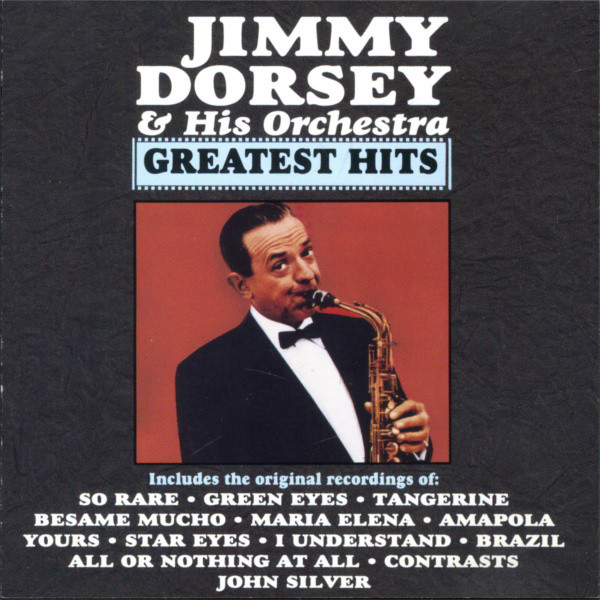

# Greatest Hits

By **Jimmy Dorsey**

## Album Data

- **Catalog:** Beets
- **Format:** Digital, Album
- **Album:** Greatest Hits
- **Artist:** Jimmy Dorsey
- **Albumartist:** Jimmy Dorsey
- **Genre:** Jazz
- **MusicBrainz Album Artist ID:** 
- **MusicBrainz Album ID:** 
- **MusicBrainz Release Group ID:** 
- **Year:** 2001
- **Catalog #:** 
- **Label:** 
- **Total Tracks:** 00

## Album Tracks

### Track 00 - So Rare

- **Artist:** Jimmy Dorsey
- **Format:** MP3
- **Genre:** Swing
- **Length:** 2:33
- **MusicBrainz Track ID:** 
- **Title:** So Rare
- **Track:** 00
- **Year:** 2001

## See also

- [Vinyl: ](../../Vinyl/Jimmy_Dorsey/Jimmy_Dorsey.md)
- [Vinyl: June Night](../../Vinyl/Jimmy_Dorsey/June_Night.md)
