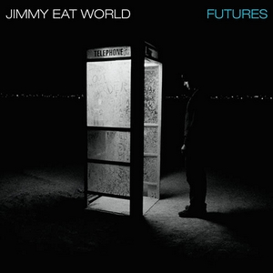

# Futures

By **Jimmy Eat World**

## Album Data

- **Catalog:** Beets
- **Format:** Digital, Album
- **Album:** Futures
- **Artist:** Jimmy Eat World
- **Albumartist:** Jimmy Eat World
- **Genre:** Emo
- **MusicBrainz Album Artist ID:** [bbc5b66b-d037-4f26-aecf-0b129e7f876a](https://musicbrainz.org/artist/bbc5b66b-d037-4f26-aecf-0b129e7f876a)
- **MusicBrainz Album ID:** [e67133ea-9b44-4e2b-b612-50b2a7f9ca1f](https://musicbrainz.org/release/e67133ea-9b44-4e2b-b612-50b2a7f9ca1f)
- **MusicBrainz Release Group ID:** [2aad83d4-eee8-3616-84d0-d2afa569cc9e](https://musicbrainz.org/release-group/2aad83d4-eee8-3616-84d0-d2afa569cc9e)
- **Year:** 2004
- **Catalog #:** 
- **Label:** 
- **Total Tracks:** 00

## Album Tracks

### Track 09 - Shame

- **Artist:** Jimmy Eat World
- **Format:** AAC
- **Genre:** Emo
- **Length:** 5:44
- **MusicBrainz Track ID:** 
- **Title:** Shame
- **Track:** 09
- **Year:** 0000

## See also

- [Pain](Pain.md)
- [Roon: Bleed American](../../Roon/Jimmy_Eat_World/Bleed_American.md)
