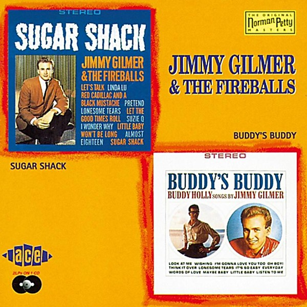

# Sugar Shack

By **Jimmy Gilmer and the Fireballs**

## Album Data

- **Catalog:** Beets
- **Format:** Digital, Album
- **Album:** Sugar Shack
- **Artist:** Jimmy Gilmer And The Fireballs
- **Albumartist:** Jimmy Gilmer and the Fireballs
- **Genre:** Bubblegum Pop
- **MusicBrainz Album Artist ID:** 
- **MusicBrainz Album ID:** 
- **MusicBrainz Release Group ID:** 
- **Year:** 1963
- **Catalog #:** 
- **Label:** 
- **Total Tracks:** 00

## Album Tracks

### Track 00 - Sugar Shack

- **Artist:** Jimmy Gilmer and the Fireballs
- **Format:** AAC
- **Genre:** Bubblegum Pop
- **Length:** 2:02
- **MusicBrainz Track ID:** 
- **Title:** Sugar Shack
- **Track:** 00
- **Year:** 1963

