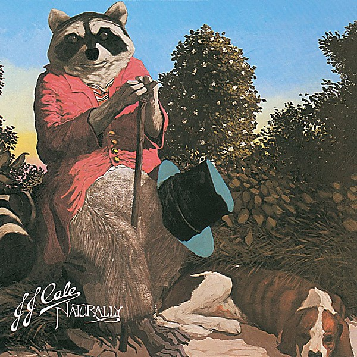

# Naturally

By **J.J. Cale**

## Album Data

- **Catalog:** Beets
- **Format:** Digital, Album
- **Album:** Naturally
- **Artist:** J.j. Cale
- **Albumartist:** J.J. Cale
- **Genre:** Americana
- **MusicBrainz Album Artist ID:** [4b0be624-6b87-47e8-bbf0-588a2c6c0439](https://musicbrainz.org/artist/4b0be624-6b87-47e8-bbf0-588a2c6c0439)
- **MusicBrainz Album ID:** [1b335bbf-03cd-4d9c-84d5-9b4972385989](https://musicbrainz.org/release/1b335bbf-03cd-4d9c-84d5-9b4972385989)
- **MusicBrainz Release Group ID:** [a5e655a1-acd0-3d4d-982a-4ab5281db04c](https://musicbrainz.org/release-group/a5e655a1-acd0-3d4d-982a-4ab5281db04c)
- **Year:** 1971
- **Catalog #:** 842 102-2
- **Label:** Mercury Records
- **Total Tracks:** 12

## Album Tracks

### Track 01 - Crying

- **Artist:** J.J. Cale
- **Format:** ALAC
- **Genre:** Rock
- **Length:** 2:35
- **MusicBrainz Track ID:** [262952ea-e05f-42a7-a274-fee01bb22fbf](https://musicbrainz.org/recording/262952ea-e05f-42a7-a274-fee01bb22fbf)
- **Title:** Crying
- **Track:** 01
- **Year:** 1990

### Track 02 - I’ll Be There (If You Ever Want Me)

- **Artist:** J.J. Cale
- **Format:** ALAC
- **Genre:** Southern Rock
- **Length:** 2:24
- **MusicBrainz Track ID:** [e0cb87b4-be3a-4e82-a43b-480afc19af3b](https://musicbrainz.org/recording/e0cb87b4-be3a-4e82-a43b-480afc19af3b)
- **Title:** I’ll Be There (If You Ever Want Me)
- **Track:** 02
- **Year:** 1990

### Track 03 - Starbound

- **Artist:** J.J. Cale
- **Format:** ALAC
- **Genre:** Southern Rock
- **Length:** 2:00
- **MusicBrainz Track ID:** [2a05f88e-ac85-4a31-b35c-a8841d616350](https://musicbrainz.org/recording/2a05f88e-ac85-4a31-b35c-a8841d616350)
- **Title:** Starbound
- **Track:** 03
- **Year:** 1990

### Track 04 - Rock & Roll Records

- **Artist:** J.J. Cale
- **Format:** ALAC
- **Genre:** Rock
- **Length:** 2:10
- **MusicBrainz Track ID:** [6414e5cf-6962-4e91-ac36-e02f81e8c69c](https://musicbrainz.org/recording/6414e5cf-6962-4e91-ac36-e02f81e8c69c)
- **Title:** Rock & Roll Records
- **Track:** 04
- **Year:** 1990

### Track 05 - The Old Man & Me

- **Artist:** J.J. Cale
- **Format:** ALAC
- **Genre:** Southern Rock
- **Length:** 2:06
- **MusicBrainz Track ID:** [58f0e986-0b5e-400c-a421-efc30fbdd2ed](https://musicbrainz.org/recording/58f0e986-0b5e-400c-a421-efc30fbdd2ed)
- **Title:** The Old Man & Me
- **Track:** 05
- **Year:** 1990

### Track 06 - Everlovin’ Woman

- **Artist:** J.J. Cale
- **Format:** ALAC
- **Genre:** Southern Rock
- **Length:** 2:12
- **MusicBrainz Track ID:** [4bb7b147-ccf5-4753-891e-2683bc3eba66](https://musicbrainz.org/recording/4bb7b147-ccf5-4753-891e-2683bc3eba66)
- **Title:** Everlovin’ Woman
- **Track:** 06
- **Year:** 1990

### Track 07 - Cajun Moon

- **Artist:** J.J. Cale
- **Format:** ALAC
- **Genre:** Rock
- **Length:** 2:14
- **MusicBrainz Track ID:** [a2909c45-63b6-4228-8903-058b399c9192](https://musicbrainz.org/recording/a2909c45-63b6-4228-8903-058b399c9192)
- **Title:** Cajun Moon
- **Track:** 07
- **Year:** 1990

### Track 08 - I’d Like to Love You Baby

- **Artist:** J.J. Cale
- **Format:** ALAC
- **Genre:** Southern Rock
- **Length:** 2:52
- **MusicBrainz Track ID:** [0a87f3c4-9c76-41dc-a74b-bd19089ea16f](https://musicbrainz.org/recording/0a87f3c4-9c76-41dc-a74b-bd19089ea16f)
- **Title:** I’d Like to Love You Baby
- **Track:** 08
- **Year:** 1990

### Track 09 - Anyway the Wind Blows

- **Artist:** J.J. Cale
- **Format:** ALAC
- **Genre:** Rock
- **Length:** 3:24
- **MusicBrainz Track ID:** [e568e2aa-c795-4653-996b-9c4225a7f71f](https://musicbrainz.org/recording/e568e2aa-c795-4653-996b-9c4225a7f71f)
- **Title:** Anyway the Wind Blows
- **Track:** 09
- **Year:** 1990

### Track 10 - Precious Memories

- **Artist:** J.J. Cale
- **Format:** ALAC
- **Genre:** Lo-Fi
- **Length:** 2:11
- **MusicBrainz Track ID:** [0e983538-5de5-4696-92ec-937d2fa19c10](https://musicbrainz.org/recording/0e983538-5de5-4696-92ec-937d2fa19c10)
- **Title:** Precious Memories
- **Track:** 10
- **Year:** 1990

### Track 11 - Okie

- **Artist:** J.J. Cale
- **Format:** ALAC
- **Genre:** Country Rock
- **Length:** 1:59
- **MusicBrainz Track ID:** [9660590e-d251-4780-a231-687130c73bea](https://musicbrainz.org/recording/9660590e-d251-4780-a231-687130c73bea)
- **Title:** Okie
- **Track:** 11
- **Year:** 1990

### Track 12 - I Got the Same Old Blues

- **Artist:** J.J. Cale
- **Format:** ALAC
- **Genre:** Rock
- **Length:** 2:59
- **MusicBrainz Track ID:** [b91eba46-5c46-4526-8060-dcd4435cdf07](https://musicbrainz.org/recording/b91eba46-5c46-4526-8060-dcd4435cdf07)
- **Title:** I Got the Same Old Blues
- **Track:** 12
- **Year:** 1990

## See also

- [Okie](Okie.md)
- [Really](Really.md)
- [Troubadour](Troubadour.md)
