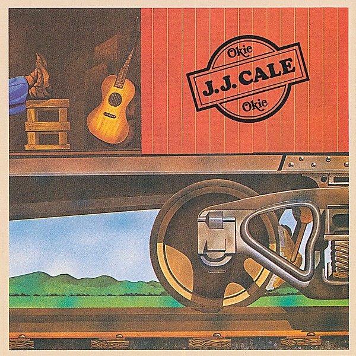

# Okie

By **J.J. Cale**

## Album Data

- **Catalog:** Beets
- **Format:** Digital, Album
- **Album:** Okie
- **Artist:** J.j. Cale
- **Albumartist:** J.J. Cale
- **Genre:** Southern Rock
- **MusicBrainz Album Artist ID:** [4b0be624-6b87-47e8-bbf0-588a2c6c0439](https://musicbrainz.org/artist/4b0be624-6b87-47e8-bbf0-588a2c6c0439)
- **MusicBrainz Album ID:** [9dd60477-17f1-4914-9b36-10e717d720bc](https://musicbrainz.org/release/9dd60477-17f1-4914-9b36-10e717d720bc)
- **MusicBrainz Release Group ID:** [49b02836-e6d4-31a7-8c29-5c310da804bb](https://musicbrainz.org/release-group/49b02836-e6d4-31a7-8c29-5c310da804bb)
- **Year:** 1990
- **Catalog #:** 810 314 2
- **Label:** Mercury Records
- **Total Tracks:** 12

## Album Tracks

### Track 01 - Lies

- **Artist:** J.J. Cale
- **Format:** ALAC
- **Genre:** Rock
- **Length:** 2:56
- **MusicBrainz Track ID:** [e216a5f5-cdd4-47b5-a457-19b9474875bc](https://musicbrainz.org/recording/e216a5f5-cdd4-47b5-a457-19b9474875bc)
- **Title:** Lies
- **Track:** 01
- **Year:** 1990

### Track 02 - Everything Will Be Alright

- **Artist:** J.J. Cale
- **Format:** ALAC
- **Genre:** Blues
- **Length:** 3:15
- **MusicBrainz Track ID:** [9fde21c7-d37d-4c43-91d7-ffa309b843e8](https://musicbrainz.org/recording/9fde21c7-d37d-4c43-91d7-ffa309b843e8)
- **Title:** Everything Will Be Alright
- **Track:** 02
- **Year:** 1990

### Track 03 - I’ll Kiss the World Goodbye

- **Artist:** J.J. Cale
- **Format:** ALAC
- **Genre:** Blues
- **Length:** 1:47
- **MusicBrainz Track ID:** [3bfb8bf6-7e94-41dc-b7b7-276dcea8623c](https://musicbrainz.org/recording/3bfb8bf6-7e94-41dc-b7b7-276dcea8623c)
- **Title:** I’ll Kiss the World Goodbye
- **Track:** 03
- **Year:** 1990

### Track 04 - Changes

- **Artist:** J.J. Cale
- **Format:** ALAC
- **Genre:** Rock
- **Length:** 2:25
- **MusicBrainz Track ID:** [67d9ca17-f1f6-414a-8edb-24d9f8112eab](https://musicbrainz.org/recording/67d9ca17-f1f6-414a-8edb-24d9f8112eab)
- **Title:** Changes
- **Track:** 04
- **Year:** 1990

### Track 05 - Right Down Here

- **Artist:** J.J. Cale
- **Format:** ALAC
- **Genre:** Soft Rock
- **Length:** 3:14
- **MusicBrainz Track ID:** [a23c067a-939b-4b1d-9679-af7ade20a52c](https://musicbrainz.org/recording/a23c067a-939b-4b1d-9679-af7ade20a52c)
- **Title:** Right Down Here
- **Track:** 05
- **Year:** 1990

### Track 06 - If You’re Ever in Oklahoma

- **Artist:** J.J. Cale
- **Format:** ALAC
- **Genre:** Blues
- **Length:** 2:06
- **MusicBrainz Track ID:** [f7d8147c-bce2-4662-94b7-ebea3fe58202](https://musicbrainz.org/recording/f7d8147c-bce2-4662-94b7-ebea3fe58202)
- **Title:** If You’re Ever in Oklahoma
- **Track:** 06
- **Year:** 1990

### Track 07 - Ridin’ Home

- **Artist:** J.J. Cale
- **Format:** ALAC
- **Genre:** Blues
- **Length:** 2:39
- **MusicBrainz Track ID:** [bf35faf4-812a-4e62-a512-00dec2b95e94](https://musicbrainz.org/recording/bf35faf4-812a-4e62-a512-00dec2b95e94)
- **Title:** Ridin’ Home
- **Track:** 07
- **Year:** 1990

### Track 08 - Going Down

- **Artist:** J.J. Cale
- **Format:** ALAC
- **Genre:** Blues
- **Length:** 3:00
- **MusicBrainz Track ID:** [84f941e3-c015-4e25-8713-be194c5c60bf](https://musicbrainz.org/recording/84f941e3-c015-4e25-8713-be194c5c60bf)
- **Title:** Going Down
- **Track:** 08
- **Year:** 1990

### Track 09 - Soulin’

- **Artist:** J.J. Cale
- **Format:** ALAC
- **Genre:** Blues
- **Length:** 2:19
- **MusicBrainz Track ID:** [e68ba8db-7281-4442-bde2-3b10ee5eef97](https://musicbrainz.org/recording/e68ba8db-7281-4442-bde2-3b10ee5eef97)
- **Title:** Soulin’
- **Track:** 09
- **Year:** 1990

### Track 10 - Playing in the Street

- **Artist:** J.J. Cale
- **Format:** ALAC
- **Genre:** Blues
- **Length:** 1:51
- **MusicBrainz Track ID:** [23aa16cb-9ae1-4184-884d-5b552dd2f75a](https://musicbrainz.org/recording/23aa16cb-9ae1-4184-884d-5b552dd2f75a)
- **Title:** Playing in the Street
- **Track:** 10
- **Year:** 1990

### Track 11 - Mo Jo

- **Artist:** J.J. Cale
- **Format:** ALAC
- **Genre:** Blues
- **Length:** 2:29
- **MusicBrainz Track ID:** [1573cdf1-8e41-44bb-8b84-f5401b01b692](https://musicbrainz.org/recording/1573cdf1-8e41-44bb-8b84-f5401b01b692)
- **Title:** Mo Jo
- **Track:** 11
- **Year:** 1990

### Track 12 - Louisiana Women

- **Artist:** J.J. Cale
- **Format:** ALAC
- **Genre:** Blues
- **Length:** 2:56
- **MusicBrainz Track ID:** [22033fa8-38ff-4cc5-8854-23254e3f8bce](https://musicbrainz.org/recording/22033fa8-38ff-4cc5-8854-23254e3f8bce)
- **Title:** Louisiana Women
- **Track:** 12
- **Year:** 1990

## See also

- [Naturally](Naturally.md)
- [Really](Really.md)
- [Troubadour](Troubadour.md)
