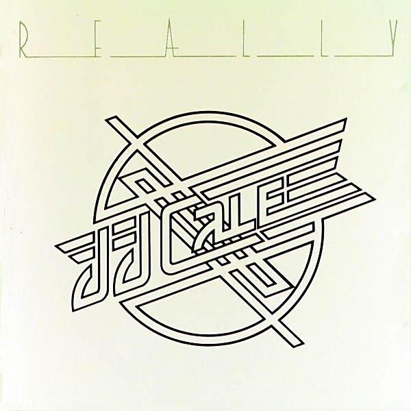

# Really

By **J.J. Cale**

## Album Data

- **Catalog:** Beets
- **Format:** Digital, Album
- **Album:** Really
- **Artist:** J.j. Cale
- **Albumartist:** J.J. Cale
- **Genre:** Blues
- **MusicBrainz Album Artist ID:** [4b0be624-6b87-47e8-bbf0-588a2c6c0439](https://musicbrainz.org/artist/4b0be624-6b87-47e8-bbf0-588a2c6c0439)
- **MusicBrainz Album ID:** [8b903798-53f7-409d-bcad-9ce4db46c921](https://musicbrainz.org/release/8b903798-53f7-409d-bcad-9ce4db46c921)
- **MusicBrainz Release Group ID:** [5f046fd6-b28a-3b3e-85a4-ff5d3ad40fa7](https://musicbrainz.org/release-group/5f046fd6-b28a-3b3e-85a4-ff5d3ad40fa7)
- **Year:** 1990
- **Catalog #:** 810 001-2
- **Label:** Mercury Records
- **Total Tracks:** 12

## Album Tracks

### Track 01 - Hey Baby

- **Artist:** J.J. Cale
- **Format:** ALAC
- **Genre:** Funk
- **Length:** 3:12
- **MusicBrainz Track ID:** [393c23d0-1919-444a-be87-255a94319b8f](https://musicbrainz.org/recording/393c23d0-1919-444a-be87-255a94319b8f)
- **Title:** Hey Baby
- **Track:** 01
- **Year:** 2005

### Track 02 - Travelin’ Light

- **Artist:** J.J. Cale
- **Format:** ALAC
- **Genre:** Rock
- **Length:** 2:51
- **MusicBrainz Track ID:** [fd04acc4-a80f-4afa-af68-cd7f423bcc48](https://musicbrainz.org/recording/fd04acc4-a80f-4afa-af68-cd7f423bcc48)
- **Title:** Travelin’ Light
- **Track:** 02
- **Year:** 2005

### Track 03 - You Got Something

- **Artist:** J.J. Cale
- **Format:** ALAC
- **Genre:** Uk Garage
- **Length:** 4:00
- **MusicBrainz Track ID:** [238298b9-0240-41a2-a0b0-4d2d73e2c8f7](https://musicbrainz.org/recording/238298b9-0240-41a2-a0b0-4d2d73e2c8f7)
- **Title:** You Got Something
- **Track:** 03
- **Year:** 2005

### Track 04 - Ride Me High

- **Artist:** J.J. Cale
- **Format:** ALAC
- **Genre:** Uk Garage
- **Length:** 3:35
- **MusicBrainz Track ID:** [3c55c25a-7a9e-43b3-8546-25f582425455](https://musicbrainz.org/recording/3c55c25a-7a9e-43b3-8546-25f582425455)
- **Title:** Ride Me High
- **Track:** 04
- **Year:** 2005

### Track 05 - Hold On

- **Artist:** J.J. Cale
- **Format:** ALAC
- **Genre:** Soul
- **Length:** 1:59
- **MusicBrainz Track ID:** [2ad5bf31-0f0a-475f-bdbc-01d3e3ea5ad5](https://musicbrainz.org/recording/2ad5bf31-0f0a-475f-bdbc-01d3e3ea5ad5)
- **Title:** Hold On
- **Track:** 05
- **Year:** 2005

### Track 06 - Cocaine

- **Artist:** J.J. Cale
- **Format:** ALAC
- **Genre:** Rock
- **Length:** 2:49
- **MusicBrainz Track ID:** [aa659ab4-c01a-4b68-b3b5-8dc44785f9c5](https://musicbrainz.org/recording/aa659ab4-c01a-4b68-b3b5-8dc44785f9c5)
- **Title:** Cocaine
- **Track:** 06
- **Year:** 2005

### Track 07 - I’m a Gypsy Man

- **Artist:** J.J. Cale
- **Format:** ALAC
- **Genre:** Rock
- **Length:** 2:43
- **MusicBrainz Track ID:** [c1a5cc69-0300-4e39-aa7f-3d0845135ee2](https://musicbrainz.org/recording/c1a5cc69-0300-4e39-aa7f-3d0845135ee2)
- **Title:** I’m a Gypsy Man
- **Track:** 07
- **Year:** 2005

### Track 08 - The Woman That Got Away

- **Artist:** J.J. Cale
- **Format:** ALAC
- **Genre:** Uk Garage
- **Length:** 2:53
- **MusicBrainz Track ID:** [8083e902-ce27-4d29-8af8-120e7b7ec7a8](https://musicbrainz.org/recording/8083e902-ce27-4d29-8af8-120e7b7ec7a8)
- **Title:** The Woman That Got Away
- **Track:** 08
- **Year:** 2005

### Track 09 - Super Blue

- **Artist:** J.J. Cale
- **Format:** ALAC
- **Genre:** Uk Garage
- **Length:** 2:42
- **MusicBrainz Track ID:** [a76c355f-2315-4a49-bceb-f339794ebf7e](https://musicbrainz.org/recording/a76c355f-2315-4a49-bceb-f339794ebf7e)
- **Title:** Super Blue
- **Track:** 09
- **Year:** 2005

### Track 10 - Let Me Do It to You

- **Artist:** J.J. Cale
- **Format:** ALAC
- **Genre:** Rock
- **Length:** 3:00
- **MusicBrainz Track ID:** [d68a4f12-6d6a-40df-b7ef-c3c871fc3520](https://musicbrainz.org/recording/d68a4f12-6d6a-40df-b7ef-c3c871fc3520)
- **Title:** Let Me Do It to You
- **Track:** 10
- **Year:** 2005

### Track 11 - Cherry

- **Artist:** J.J. Cale
- **Format:** ALAC
- **Genre:** Uk Garage
- **Length:** 3:22
- **MusicBrainz Track ID:** [a17fb828-6778-4c6b-af4a-01f0dd4f62ad](https://musicbrainz.org/recording/a17fb828-6778-4c6b-af4a-01f0dd4f62ad)
- **Title:** Cherry
- **Track:** 11
- **Year:** 2005

### Track 12 - You Got Me On So Bad

- **Artist:** J.J. Cale
- **Format:** ALAC
- **Genre:** Blues
- **Length:** 3:17
- **MusicBrainz Track ID:** [7405f63a-03cb-48cb-b203-cd05b526bb4b](https://musicbrainz.org/recording/7405f63a-03cb-48cb-b203-cd05b526bb4b)
- **Title:** You Got Me On So Bad
- **Track:** 12
- **Year:** 2005

## See also

- [Naturally](Naturally.md)
- [Okie](Okie.md)
- [Troubadour](Troubadour.md)
