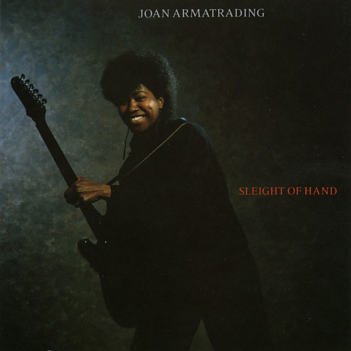

# Sleight of Hand

By **Joan Armatrading**

## Album Data

- **Catalog:** Beets
- **Format:** Digital, Album
- **Album:** Sleight of Hand
- **Artist:** Joan Armatrading
- **Albumartist:** Joan Armatrading
- **Genre:** Rock
- **MusicBrainz Album Artist ID:** [fa598e78-5cc5-4a8b-a3b5-63934d4712c7](https://musicbrainz.org/artist/fa598e78-5cc5-4a8b-a3b5-63934d4712c7)
- **MusicBrainz Album ID:** [8ec11211-4122-39ec-bf41-045719fa845c](https://musicbrainz.org/release/8ec11211-4122-39ec-bf41-045719fa845c)
- **MusicBrainz Release Group ID:** [9975eab7-b782-3268-9cea-b09e3e0416ea](https://musicbrainz.org/release-group/9975eab7-b782-3268-9cea-b09e3e0416ea)
- **Year:** 1991
- **Catalog #:** CD-4912
- **Label:** A&M Records
- **Total Tracks:** 11

## Album Tracks

### Track 01 - (I Love It When You) Call Me Names

- **Artist:** Joan Armatrading
- **Format:** ALAC
- **Genre:** Soft Rock
- **Length:** 4:22
- **MusicBrainz Track ID:** [80c131e1-0bac-4c9d-b2f9-bcc294f4e97f](https://musicbrainz.org/recording/80c131e1-0bac-4c9d-b2f9-bcc294f4e97f)
- **Title:** (I Love It When You) Call Me Names
- **Track:** 01
- **Year:** 1983

### Track 02 - Foolish Pride

- **Artist:** Joan Armatrading
- **Format:** ALAC
- **Genre:** Rock
- **Length:** 3:16
- **MusicBrainz Track ID:** [6766e1ec-35a8-48b6-85b1-fc0db8d427f5](https://musicbrainz.org/recording/6766e1ec-35a8-48b6-85b1-fc0db8d427f5)
- **Title:** Foolish Pride
- **Track:** 02
- **Year:** 1983

### Track 03 - Drop the Pilot

- **Artist:** Joan Armatrading
- **Format:** ALAC
- **Genre:** Pop Rock
- **Length:** 3:42
- **MusicBrainz Track ID:** [fa2392a9-f7b3-41f3-bc72-718c29d671ea](https://musicbrainz.org/recording/fa2392a9-f7b3-41f3-bc72-718c29d671ea)
- **Title:** Drop the Pilot
- **Track:** 03
- **Year:** 1983

### Track 04 - The Key

- **Artist:** Joan Armatrading
- **Format:** ALAC
- **Genre:** Rock
- **Length:** 4:02
- **MusicBrainz Track ID:** [0f9479e3-49b8-4ec9-aa8a-1582b1b666c4](https://musicbrainz.org/recording/0f9479e3-49b8-4ec9-aa8a-1582b1b666c4)
- **Title:** The Key
- **Track:** 04
- **Year:** 1983

### Track 05 - Everybody Gotta Know

- **Artist:** Joan Armatrading
- **Format:** ALAC
- **Genre:** Rock
- **Length:** 3:43
- **MusicBrainz Track ID:** [9da587b9-4eac-4446-a39e-5f3940970a0a](https://musicbrainz.org/recording/9da587b9-4eac-4446-a39e-5f3940970a0a)
- **Title:** Everybody Gotta Know
- **Track:** 05
- **Year:** 1983

### Track 06 - Tell Tale

- **Artist:** Joan Armatrading
- **Format:** ALAC
- **Genre:** Rock
- **Length:** 2:31
- **MusicBrainz Track ID:** [c7fc7edd-ff8f-438e-a589-8c6e8defe674](https://musicbrainz.org/recording/c7fc7edd-ff8f-438e-a589-8c6e8defe674)
- **Title:** Tell Tale
- **Track:** 06
- **Year:** 1983

### Track 07 - What Do Boys Dream

- **Artist:** Joan Armatrading
- **Format:** ALAC
- **Genre:** Rock
- **Length:** 2:56
- **MusicBrainz Track ID:** [be18ab3a-0c2c-4531-8758-59d572d16ae8](https://musicbrainz.org/recording/be18ab3a-0c2c-4531-8758-59d572d16ae8)
- **Title:** What Do Boys Dream
- **Track:** 07
- **Year:** 1983

### Track 08 - The Game of Love

- **Artist:** Joan Armatrading
- **Format:** ALAC
- **Genre:** Rock
- **Length:** 3:35
- **MusicBrainz Track ID:** [a1eb0886-4a53-4384-b22e-6ecfcc5f4ecb](https://musicbrainz.org/recording/a1eb0886-4a53-4384-b22e-6ecfcc5f4ecb)
- **Title:** The Game of Love
- **Track:** 08
- **Year:** 1983

### Track 09 - The Dealer

- **Artist:** Joan Armatrading
- **Format:** ALAC
- **Genre:** Rock
- **Length:** 3:17
- **MusicBrainz Track ID:** [d6c4d8d9-77fa-4a1c-8c58-f790bfa96c7f](https://musicbrainz.org/recording/d6c4d8d9-77fa-4a1c-8c58-f790bfa96c7f)
- **Title:** The Dealer
- **Track:** 09
- **Year:** 1983

### Track 10 - Bad Habits

- **Artist:** Joan Armatrading
- **Format:** ALAC
- **Genre:** Rock
- **Length:** 3:45
- **MusicBrainz Track ID:** [443a0c1c-0391-487a-b506-fa48d9e32adc](https://musicbrainz.org/recording/443a0c1c-0391-487a-b506-fa48d9e32adc)
- **Title:** Bad Habits
- **Track:** 10
- **Year:** 1983

### Track 11 - I Love My Baby

- **Artist:** Joan Armatrading
- **Format:** ALAC
- **Genre:** Rock
- **Length:** 3:22
- **MusicBrainz Track ID:** [5efeb1f8-0623-411b-9e6b-3cc7ca9b7160](https://musicbrainz.org/recording/5efeb1f8-0623-411b-9e6b-3cc7ca9b7160)
- **Title:** I Love My Baby
- **Track:** 11
- **Year:** 1983

## See also

- [The Key](The_Key.md)
- [The Shouting Stage](The_Shouting_Stage.md)
- [To The Limit](To_The_Limit.md)
- [Vinyl: ](../../Vinyl/Joan_Armatrading/Joan_Armatrading_index.md)
- [Vinyl: Joan Armatrading](../../Vinyl/Joan_Armatrading/Joan_Armatrading.md)
- [Vinyl: Me Myself I](../../Vinyl/Joan_Armatrading/Me_Myself_I.md)
- [Vinyl: Track Record](../../Vinyl/Joan_Armatrading/Track_Record.md)
