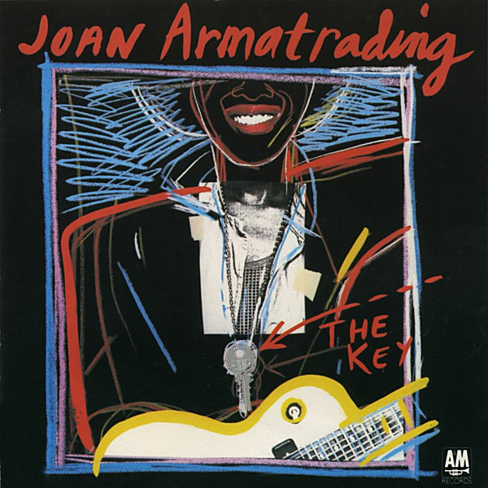

# The Key

By **Joan Armatrading**

## Album Data

- **Catalog:** Beets
- **Format:** Digital, Album
- **Album:** The Key
- **Artist:** Joan Armatrading
- **Albumartist:** Joan Armatrading
- **Genre:** Rock
- **MusicBrainz Album Artist ID:** [fa598e78-5cc5-4a8b-a3b5-63934d4712c7](https://musicbrainz.org/artist/fa598e78-5cc5-4a8b-a3b5-63934d4712c7)
- **MusicBrainz Album ID:** [5729c294-76e0-3ba5-b71c-b4f4e9d6bbd0](https://musicbrainz.org/release/5729c294-76e0-3ba5-b71c-b4f4e9d6bbd0)
- **MusicBrainz Release Group ID:** [1dbb1e3f-df3c-3d57-91d3-f6dc928fcb0b](https://musicbrainz.org/release-group/1dbb1e3f-df3c-3d57-91d3-f6dc928fcb0b)
- **Year:** 1983
- **Catalog #:** CD 5211 DX 003416
- **Label:** A&M Records
- **Total Tracks:** 10

## Album Tracks

### Track 01 - The Devil I Know

- **Artist:** Joan Armatrading
- **Format:** MP3
- **Genre:** Soul
- **Length:** 4:13
- **MusicBrainz Track ID:** [46ce7ac8-2071-445f-aca7-64e410c6f343](https://musicbrainz.org/recording/46ce7ac8-2071-445f-aca7-64e410c6f343)
- **Title:** The Devil I Know
- **Track:** 01
- **Year:** 1988

### Track 02 - Living for You

- **Artist:** Joan Armatrading
- **Format:** MP3
- **Genre:** Soul
- **Length:** 4:14
- **MusicBrainz Track ID:** [fe8b7107-7098-47d5-b64b-75c6466a4053](https://musicbrainz.org/recording/fe8b7107-7098-47d5-b64b-75c6466a4053)
- **Title:** Living for You
- **Track:** 02
- **Year:** 1988

### Track 03 - Did I Make You Up

- **Artist:** Joan Armatrading
- **Format:** MP3
- **Genre:** Soul
- **Length:** 3:46
- **MusicBrainz Track ID:** [b9c3cc26-0159-4f02-9568-6298280ab3cd](https://musicbrainz.org/recording/b9c3cc26-0159-4f02-9568-6298280ab3cd)
- **Title:** Did I Make You Up
- **Track:** 03
- **Year:** 1988

### Track 04 - Stronger Love

- **Artist:** Joan Armatrading
- **Format:** MP3
- **Genre:** Rock
- **Length:** 5:09
- **MusicBrainz Track ID:** [5435c7d4-b404-4a8f-ae57-4f14343fcf1f](https://musicbrainz.org/recording/5435c7d4-b404-4a8f-ae57-4f14343fcf1f)
- **Title:** Stronger Love
- **Track:** 04
- **Year:** 1988

### Track 05 - The Shouting Stage

- **Artist:** Joan Armatrading
- **Format:** MP3
- **Genre:** Nu Jazz
- **Length:** 5:29
- **MusicBrainz Track ID:** [ac8ac1ab-2222-4479-ae68-3651bc42e0d2](https://musicbrainz.org/recording/ac8ac1ab-2222-4479-ae68-3651bc42e0d2)
- **Title:** The Shouting Stage
- **Track:** 05
- **Year:** 1988

### Track 06 - Words

- **Artist:** Joan Armatrading
- **Format:** MP3
- **Genre:** Rock
- **Length:** 3:47
- **MusicBrainz Track ID:** [fb0e90f1-5c6c-4b97-9190-a3a7fd6612c8](https://musicbrainz.org/recording/fb0e90f1-5c6c-4b97-9190-a3a7fd6612c8)
- **Title:** Words
- **Track:** 06
- **Year:** 1988

### Track 07 - Straight Talk

- **Artist:** Joan Armatrading
- **Format:** MP3
- **Genre:** Rock
- **Length:** 4:03
- **MusicBrainz Track ID:** [d2f428c2-41b8-4fae-8e5d-be72c8050cc7](https://musicbrainz.org/recording/d2f428c2-41b8-4fae-8e5d-be72c8050cc7)
- **Title:** Straight Talk
- **Track:** 07
- **Year:** 1988

### Track 08 - Watch Your Step

- **Artist:** Joan Armatrading
- **Format:** MP3
- **Genre:** Soul
- **Length:** 3:59
- **MusicBrainz Track ID:** [47f49272-7805-4051-9925-91b45185f9bc](https://musicbrainz.org/recording/47f49272-7805-4051-9925-91b45185f9bc)
- **Title:** Watch Your Step
- **Track:** 08
- **Year:** 1988

### Track 09 - All a Woman Needs

- **Artist:** Joan Armatrading
- **Format:** MP3
- **Genre:** Soul
- **Length:** 5:03
- **MusicBrainz Track ID:** [7921e0ab-a03b-4dd0-8d73-54cf8aa5972f](https://musicbrainz.org/recording/7921e0ab-a03b-4dd0-8d73-54cf8aa5972f)
- **Title:** All a Woman Needs
- **Track:** 09
- **Year:** 1988

### Track 10 - Dark Truths

- **Artist:** Joan Armatrading
- **Format:** MP3
- **Genre:** Rock
- **Length:** 2:09
- **MusicBrainz Track ID:** [cba125f1-9844-41ca-ac33-263c62bea232](https://musicbrainz.org/recording/cba125f1-9844-41ca-ac33-263c62bea232)
- **Title:** Dark Truths
- **Track:** 10
- **Year:** 1988

## See also

- [Sleight of Hand](Sleight_of_Hand.md)
- [The Shouting Stage](The_Shouting_Stage.md)
- [To The Limit](To_The_Limit.md)
- [Vinyl: ](../../Vinyl/Joan_Armatrading/Joan_Armatrading_index.md)
- [Vinyl: Joan Armatrading](../../Vinyl/Joan_Armatrading/Joan_Armatrading.md)
- [Vinyl: Me Myself I](../../Vinyl/Joan_Armatrading/Me_Myself_I.md)
- [Vinyl: Track Record](../../Vinyl/Joan_Armatrading/Track_Record.md)
